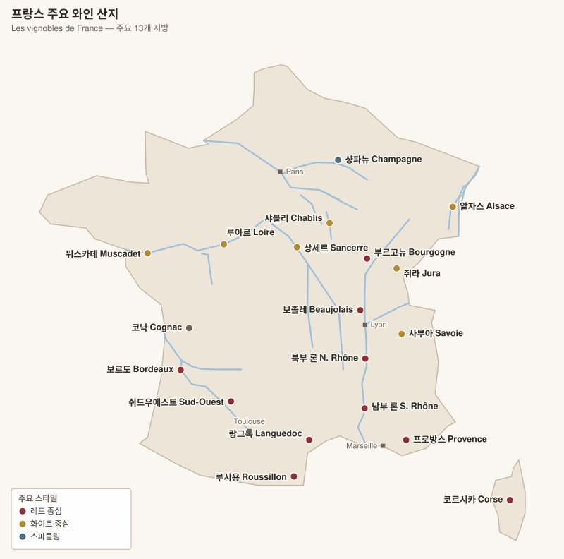
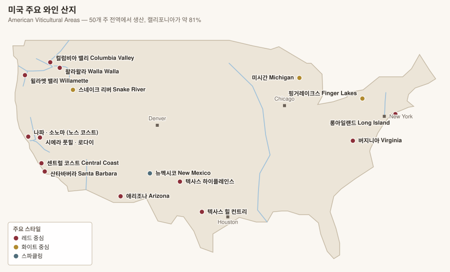
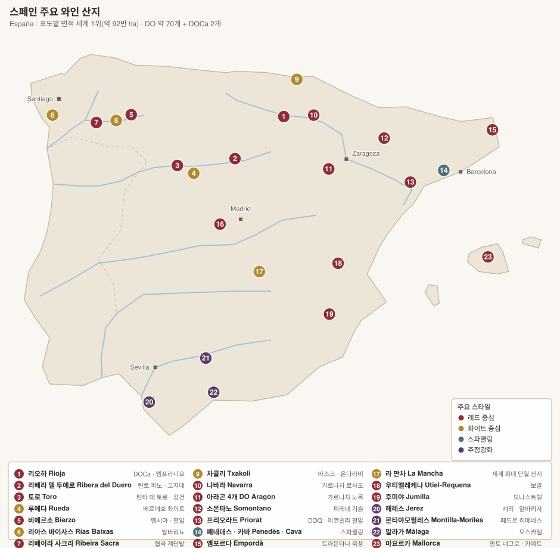

# 와인 정리 노트

지역 → 마을 → 등급 → 밭(클리마/리외디) → 주요 생산자 순으로 정리한 와인 자료.

---

## 🇫🇷 프랑스 France



> 프랑스 문서의 산지·밭·생산자 이름은 **프랑스어 뒤에 한글 발음을 병기**했다 (예: `Côte-Rôtie 코트로티`, `Château Ducru-Beaucaillou 샤토 뒤크뤼 보카유`).
> 읽기 규칙은 [프랑스 개요 §6](france/00-overview.md#6-프랑스어-라벨-읽기-규칙) 참고.

| # | 문서 | 내용 |
|---|---|---|
| 00 | **[프랑스 개요](france/00-overview.md)** | 등급 체계(AOC/IGP), 지역별 등급 단위 차이, **프랑스어 라벨 읽기 규칙**, 빈티지 |
| 01 | **[보르도 Bordeaux](france/01-bordeaux.md)** | **좌안/우안** 구분, 1855 그랑크뤼 클라세 1~5등급, 그라브·소테른, 생테밀리옹·포므롤 |
| 02 | **[부르고뉴 개요 Bourgogne](france/02-bourgogne.md)** | 등급 피라미드, 하위 산지 6곳, 도멘 vs 네고시앙 |
| 02-1 | **[코트드뉘 Côte de Nuits](france/02-1-cote-de-nuits.md)** | **마을별** — 주브레샹베르탱 ~ 뉘생조르주, 그랑크뤼 24개 |
| 02-2 | **[코트드본 Côte de Beaune](france/02-2-cote-de-beaune.md)** | **마을별** — 코르통 ~ 마랑주, 화이트 그랑크뤼 |
| 02-3 | **[샤블리·샬로네즈·마코네 Chablis · Chalonnaise · Mâconnais](france/02-3-chablis-chalonnaise-maconnais.md)** | 샤블리 그랑크뤼 7개, 메르퀴레·지브리, 푸이퓌세 |
| 02-4 | **[보졸레 Beaujolais](france/02-4-beaujolais.md)** | 크뤼 10개, 갱 오브 포 |
| 03 | **[샹파뉴 Champagne](france/03-champagne.md)** | 그랑크뤼 17개 마을, 5개 지구, 하우스 vs 그로워 |
| 04 | **[론 Vallée du Rhône](france/04-rhone.md)** | **품종별 특징**(시라·GSM·비오니에), **18개 크뤼** — 북부 8개(에르미타주·코트로티·코르나스) / 남부 10개(샤토뇌프뒤파프·지공다스·로덩) |
| 05 | **[루아르 Loire](france/05-loire.md)** | 뮈스카데 → 사브니에르 → 부브레·시농 → 상세르 |
| 06 | **[알자스 Alsace](france/06-alsace.md)** | 그랑크뤼 51개 밭, 고귀품종 4종 |
| 07 | **[남부 및 기타 Sud et autres](france/07-sud-et-autres.md)** | 랑그독루시용·프로방스·쉬드우에스트·쥐라·사부아·코르시카 |

---

## 🇮🇹 이탈리아 Italia


> 산지·밭·생산자 이름은 **이탈리아어 뒤에 한글 발음을 병기**했다 (예: `Cannubi 칸누비`, `Giacomo Conterno 자코모 콘테르노`).
> 읽기 규칙은 [이탈리아 개요 §5](italy/00-overview.md) 참고 — `Chianti`는 "치안티"가 아니라 **키안티**다.

| # | 문서 | 내용 |
|---|---|---|
| 00 | **[이탈리아 개요](italy/00-overview.md)** | DOCG/DOC/IGT 체계, 등급≠품질, 핵심 토착품종, **이탈리아어 읽기 규칙**, 3대 밭 표기 제도 |
| 01 | **[피에몬테](italy/01-piemonte.md)** | **바롤로·바르바레스코 코무네별 MGA(크뤼)**, 알토 피에몬테, 가비 |
| 02 | **[토스카나](italy/02-toscana.md)** | 키안티 클라시코 **11개 UGA**, 브루넬로, 볼게리·수퍼 투스칸 |
| 03 | **[베네토](italy/03-veneto.md)** | 아마로네·리파소·레치오토, 소아베 크뤼, 프로세코 등급 |
| 04 | **[트렌티노알토아디제·프리울리](italy/04-nordest.md)** | 알토아디제 하위 구역, 콜리오, 오렌지 와인 |
| 05 | **[롬바르디아·에밀리아로마냐·리구리아·발레다오스타](italy/05-nord-altri.md)** | 프란차코르타, 발텔리나, 람브루스코 |
| 06 | **[중부](italy/06-centro.md)** | 베르디키오, 몬테풀차노 다브루초, 사그란티노 |
| 07 | **[남부 및 도서](italy/07-sud-isole.md)** | 타우라시, 프리미티보, **에트나 콘트라다**, 사르데냐 |

---

## 🇺🇸 미국 USA



| # | 문서 | 내용 |
|---|---|---|
| 00 | **[미국 개요](usa/00-overview.md)** | **AVA vs AOC의 근본적 차이**, 라벨 규정, 금주법·파리의 심판, 안개 기후 |
| 01 | **[나파 밸리](usa/01-napa.md)** | **16개 하위 AVA**, To Kalon 등 명품 밭, 컬트 와인, 벡스토퍼 모델 |
| 02 | **[소노마](usa/02-sonoma.md)** | **19개 AVA**, 러시안 리버·드라이 크리크·소노마 코스트 |
| 03 | **[캘리포니아 기타](usa/03-california-other.md)** | 센트럴 코스트, 산타바버라, 시에라 풋힐, 로다이, 멘도시노 |
| 04 | **[오리건](usa/04-oregon.md)** | 윌라멧 밸리 **11개 하위 AVA**, 토양 3종, The Rocks District |
| 05 | **[워싱턴](usa/05-washington.md)** | 컬럼비아 밸리 중첩 구조, 레드 마운틴, 자근 포도나무 |
| 06 | **[그 외 주](usa/06-other-states.md)** | 핑거레이크스, 롱아일랜드, 버지니아, 텍사스 등 |

---

## 🇪🇸 스페인 España



> 산지·밭·보데가 이름은 **스페인어(카탈루냐어·갈리시아어) 뒤에 한글 발음을 병기**했다 (예: `Jerez 헤레스`, `Viñedo Singular 비녜도 싱굴라르`).

| # | 문서 | 내용 |
|---|---|---|
| 00 | **[스페인 개요](spain/00-overview.md)** | DOCa/DO/VP 체계, **숙성 등급(크리안사·레세르바·그란 레세르바)**, 품종, 스페인어 읽기 규칙 |
| 01 | **[리오하](spain/01-rioja.md)** | 3개 하위 지구, **비녜도 싱굴라르** 신등급, 전통 vs 현대 vs 밭 중심 |
| 02 | **[카스티야 이 레온](spain/02-castilla-leon.md)** | 리베라 델 두에로(베가 시실리아·핑구스), 토로, 루에다, **비에르소 밭 등급** |
| 03 | **[카탈루냐](spain/03-cataluna.md)** | **프리오라트 DOQ**와 12개 비 데 빌라, **카바 2022 개편**, 코르피냐트 |
| 04 | **[갈리시아](spain/04-galicia.md)** | 리아스 바이사스 5개 하위지구, 리베이라 사크라 협곡, 고데요 부활, 차콜리 |
| 05 | **[헤레스 (셰리)](spain/05-jerez.md)** | **플로르와 솔레라**, 알바리사 파고, 스타일 전 계보, 2022 규정 개편 |
| 06 | **[중부·레반테](spain/06-centro-levante.md)** | 라만차, 모나스트렐 삼각지대, 보발, **그레도스 고지대 가르나차** |
| 07 | **[북부·도서](spain/07-norte-islas.md)** | 나바라, 아라곤 가르나차 노목, **카나리아 화산·자근 노목**, 발레아레스 |

---

## 지도

저장소에 포함된 SVG 지도. 경위도 좌표에서 직접 생성하며 외부 이미지에 의존하지 않는다.

| 프랑스 | 이탈리아 | 미국 | 스페인 |
|---|---|---|---|
| [프랑스 전도](assets/france-overview.svg) | [이탈리아 전도](assets/italy-overview.svg) | [미국 전도](assets/usa-overview.svg) | [스페인 전도](assets/spain-overview.svg) |
| [보르도 좌안/우안](assets/bordeaux.svg) | [랑게 (바롤로·바르바레스코)](assets/langhe.svg) | [나파·소노마 하위 AVA](assets/napa-sonoma.svg) | [리오하 3개 지구](assets/rioja.svg) |
| [코트도르 마을별 그랑크뤼](assets/cote-dor.svg) | [코무네별 MGA 크뤼 배열](assets/barolo-mga.svg) | [나파 16개 AVA 배열](assets/napa-ava-strip.svg) | [두에로 (카스티야 이 레온)](assets/duero.svg) |
| [부르고뉴 하위 산지](assets/bourgogne.svg) | [토스카나](assets/toscana.svg) | [캘리포니아](assets/california.svg) | [카탈루냐](assets/catalunya.svg) |
| [론 밸리](assets/rhone.svg) | [북동부](assets/nordest.svg) | [태평양 북서부](assets/pacific-northwest.svg) | [갈리시아](assets/galicia.svg) |
| [루아르](assets/loire.svg) | [남부 및 도서](assets/sud-isole.svg) | | [헤레스 삼각지대](assets/jerez.svg) |
| [샹파뉴](assets/champagne.svg) | [에트나 콘트라다](assets/etna.svg) | | |
| [알자스](assets/alsace.svg) | | | |

```bash
python3 scripts/make_maps.py         # 프랑스 지도 재생성
python3 scripts/make_maps_italy.py   # 이탈리아 지도 재생성
python3 scripts/make_maps_usa.py     # 미국 지도 재생성
python3 scripts/make_maps_spain.py   # 스페인 지도 재생성
```

---

## 빠른 참조

### 모든 지역 문서에 「품종」 절이 있다

각 산지 문서에는 **그 지역 품종의 향·구조·재배 조건·토양 대응·AOC(DOC/DO) 규정**을 정리한 「품종」 절이 있다. 개요 문서에는 어느 품종을 어느 문서에서 다루는지 찾는 **품종 색인**이 있다.

| 개요 | 품종 색인 |
|---|---|
| [프랑스 개요 §4](france/00-overview.md) · [이탈리아 개요 §4](italy/00-overview.md) · [스페인 개요 §3](spain/00-overview.md) · [미국 개요 §2](usa/00-overview.md) | 품종 → 산지 → 문서 |

---

### 등급의 대상이 지역마다 다르다

| 지역 | 등급 대상 | 예 |
|---|---|---|
| 보르도 | **생산자(샤토)** | Château Latour = 1등급 |
| 부르고뉴 | **밭(클리마)** | Chambertin = 그랑크뤼 |
| 샹파뉴 | **마을** | Ambonnay = 그랑크뤼 마을 |
| 알자스 | **밭(리외디)** | Rangen = 그랑크뤼 |
| 이탈리아 | **산지(DOC/DOCG)** | Barolo DOCG. 밭 표기(MGA·UGA·콘트라다)는 서열이 아님 |
| 스페인 | **숙성 기간** | Crianza < Reserva < Gran Reserva. 밭 등급은 2017년 이후 도입 중 |
| 미국 | **없음 (AVA는 경계만)** | Napa Valley AVA. 품종·수확량·양조법 규정이 전혀 없다 |

### 프랑스 vs 이탈리아 vs 미국 vs 스페인

| | 프랑스 | 이탈리아 | 미국 | 스페인 |
|---|---|---|---|---|
| 제도가 규정하는 것 | 경계 + 품종 + 수확량 + 양조법 | 동일 | **경계뿐** | 경계 + 품종 + **숙성 기간** |
| 등급과 품질 | 대체로 일치 | **일치하지 않는다** (수퍼 투스칸) | **등급 자체가 없다** | 숙성 등급 ≠ 품질 (베가 시실리아·핑구스는 등급 표기 안 함) |
| 밭 단위 표기 | 수백 년 전부터 제도화 | 2010년대 도입 (MGA·콘트라다·UGA) | 제도 없음, 관행으로 정착 (To Kalon 등) | **2017년 이후 도입 중** (비녜도 싱굴라르·비 데 빌라) |
| 품종 | 국제품종 중심 | **토착품종 500종 이상** | 국제품종 + 진판델 | 토착품종 중심 (템프라니요·가르나차) |
| 브랜드의 축 | 밭(부르고뉴) 또는 샤토(보르도) | 산지 + 생산자 | **생산자 + 재배자(밭 소유주)** | **보데가(브랜드) + 숙성 등급** |

### 보르도 좌안 1등급 5개

Lafite Rothschild · Latour · Mouton Rothschild (이상 포이약) · Margaux (마고) · Haut-Brion (페삭레오냥)

### 부르고뉴 라벨 규칙

라벨에 **마을명 없이 밭 이름만** 있으면 그랑크뤼.
`Chambertin` = 그랑크뤼 / `Gevrey-Chambertin` = 마을 등급

---

### 이탈리아 3대 밭 표기 제도

| 지역 | 명칭 | 도입 | 개수 |
|---|---|---|---|
| 바롤로·바르바레스코 | **MGA** | 2010 | 181 · 66 |
| 키안티 클라시코 | **UGA** | 2021 | 11 |
| 에트나 | **Contrada** | 2011 | 133 |

---

## 앞으로 정리할 산지

- [x] 프랑스
- [x] 이탈리아
- [x] 미국 (나파, 소노마, 오리건, 워싱턴)
- [x] 스페인 (리오하, 리베라 델 두에로, 프리오라트, 헤레스, 갈리시아)
- [ ] 독일 (모젤, 라인가우 — VDP 등급)
- [ ] 호주 · 뉴질랜드 (바로사, 야라, 말버러, 센트럴 오타고)
- [ ] 남미 (칠레, 아르헨티나)
