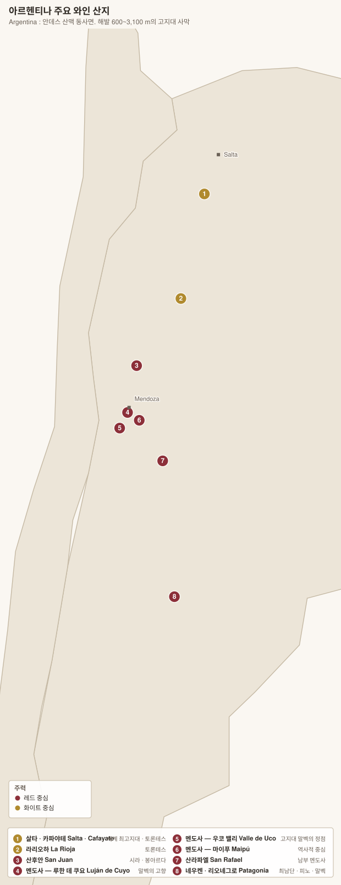

# 아르헨티나 와인 개요

> **세계 5위의 생산국이자, 세계에서 가장 높은 곳에서 포도를 기르는 나라.** 안데스 산맥 동사면의 해발 600~3,100m 사막에서, 눈 녹은 물만으로 재배한다. 아르헨티나 와인을 이해하는 열쇠는 위도가 아니라 **고도**다.

## 1. 산지 제도

| 항목 | 내용 |
|---|---|
| 기본 제도 | **IG (Indicación Geográfica 인디카시온 헤오그라피카)** — 경계만 정하는 지리적 표시 |
| 상위 등급 | **DOC (Denominación de Origen Controlada 데노미나시온 데 오리헨 콘트롤라다)** — **단 두 곳**뿐이다 |
| DOC 두 곳 | **Luján de Cuyo 루한 데 쿠요**(1993, 말벡) · **San Rafael 산 라파엘** |
| 광역 표기 | **IP (Indicación de Procedencia)** — 테이블 와인용 하위 표기 |
| 라벨 규정 | 품종·빈티지 **80% 이상**(수출 시장 요건에 따라 85%) |
| 관할 | **INV (Instituto Nacional de Vitivinicultura 국립 포도주 연구소)** |

> **DOC이 두 개뿐인 이유** — 프랑스식 규제보다 **밭 이름(IG) 세분화**가 실질적 등급 역할을 한다. 2010년대 이후 우코 밸리의 **파라헤 알타미라 · 구알타야리 · 로스 차카예스 · 산 파블로**가 차례로 IG로 승인되면서, 아르헨티나는 사실상 **크뤼 체계를 IG로 만들고 있다.**

## 2. 고도가 모든 것을 정한다

| 요소 | 작용 |
|---|---|
| **일교차** | 낮 33℃ / 밤 12℃ — **20℃ 안팎.** 당도는 올라가되 **산도가 유지된다** |
| **자외선** | 고도가 100m 오를 때마다 UV 증가 → 포도가 방어적으로 **껍질을 두껍게, 폴리페놀을 진하게** 만든다 |
| **강수** | 연 200~250mm(멘도사). **사막이다** — 눈 녹은 물의 관개 없이는 불가능 |
| **습도** | 극히 낮다 → **곰팡이병이 거의 없다.** 유기농 전환이 쉽다 |
| **필록세라** | 존재하지만 건조한 모래 토양 탓에 피해가 미미하다. **자근 노목이 많다** |

### 고도대별 성격 (멘도사 기준)

| 고도 | 지역 | 성격 |
|---|---|---|
| 600~800m | 마이푸 · 동부 멘도사 | 따뜻하다. 풍만하고 부드러운 스타일 |
| **800~1,100m** | **루한 데 쿠요** | **말벡의 고전.** 균형과 벨벳 탄닌 |
| **1,100~1,500m** | **우코 밸리** | **산도·긴장·꽃향.** 현재의 정점 |
| 1,500m 이상 | 구알타야리 상단 · 살타 | 극단적. 강한 산도, 좁고 날카롭다 |
| **1,700~3,111m** | **살타 카파야테 · 몰리노스** | **세계 최고지대 포도밭** |

> **Zonda 손다** — 안데스를 넘어오는 뜨겁고 건조한 푄 바람. 봄에 불면 개화를 망치고, 여름에 불면 하루 만에 기온을 15℃ 올린다. **우박**과 함께 아르헨티나의 두 재해다. 그래서 밭마다 **우박 방지망(malla antigranizo 마야 안티그라니소)**이 걸려 있다.

## 3. 품종

| 품종 | 재배 비중 | 성격 |
|---|---|---|
| **Malbec 말벡** | **약 23%** | **국가의 상징.** 카오르 출신, 1853년 도입 |
| **Bonarda 보나르다** | 약 8% | 실제 정체는 사부아의 **Douce Noire 두스 누아(=Corbeau)**. 짙은 색, 부드러운 탄닌 |
| **Cabernet Sauvignon 카베르네 소비뇽** | 약 6% | 우코 밸리에서 급성장 |
| **Syrah 시라** | 약 4% | 산 후안 · 남부 멘도사 |
| **Torrontés 토론테스** | 약 4% | **아르헨티나 고유 화이트.** 살타·라 리오하 |
| **Criolla Grande · Cereza 크리오야 그란데 · 세레사** | 합계 약 15% | 분홍빛 재래종. 대부분 벌크·농축과즙용 |
| **Pedro Giménez 페드로 히메네스** | 약 4% | 아르헨티나 최다 재배 화이트(스페인 PX와 다른 품종) |
| **Chardonnay 샤르도네** | 약 3% | 우코 밸리 고지대 |
| **Cabernet Franc 카베르네 프랑** | 상승 중 | **2010년대 최대의 발견** |
| **Semillón · Pinot Noir · Tempranillo · Petit Verdot** | 소량 | 세미용은 파타고니아 노목 |

> **토론테스의 정체** — DNA 분석 결과 **Criolla Chica(=País 파이스/Mission) × Muscat of Alexandria 무스카트 알렉산드리아**의 교배종이다. 즉 **아메리카 대륙에서 태어난 품종**이다. 세 종류가 있고(Riojano · Sanjuanino · Mendocino), 품질용은 사실상 **Torrontés Riojano 토론테스 리오하노**다.

## 4. 말벡 — 두 번 살아난 품종

| 시기 | 사건 |
|---|---|
| 프랑스 | **Cahors 카오르**의 주품종(현지명 **Côt 코트 · Auxerrois 옥세루아**). 보르도에서도 재배 |
| **1853** | 사르미엔토 대통령의 초빙으로 프랑스 농학자 **Michel Aimé Pouget 미셸 에메 푸제**가 멘도사에 도입 |
| 1956 | 프랑스 대서리로 카오르의 말벡 대부분 동사. **본거지가 사라졌다** |
| 1980~90년대 | 아르헨티나에서도 **"수확량 많고 싸구려"** 취급. 대량 뽑아냄 |
| **1990년대 말** | **Nicolás Catena 니콜라스 카테나**가 고도 실험을 시작 — 서늘한 곳에서 말벡이 완전히 달라진다는 것을 증명 |
| **2000년대~** | 수출 폭발. 말벡 = 아르헨티나 |
| **2010년대~** | **"말벡 아르헨티노"에서 "우코의 말벡"으로.** 단일 밭·석회질 토양·저알코올로 이동 |

> **4월 17일은 세계 말벡의 날(Malbec World Day)** — 1853년 푸제의 농업학교 설립안이 승인된 날이다.

## 5. 스페인어 읽기

| 지명 | 발음 | 비고 |
|---|---|---|
| **Mendoza** | 멘도사 | `z`=ㅅ |
| **Luján de Cuyo** | 루한 데 쿠요 | `j`=ㅎ, `y`=ㅇ |
| **Maipú** | 마이푸 | |
| **Valle de Uco** | 바예 데 우코 | `ll`=이 |
| **Gualtallary** | 구알타야리 | |
| **Paraje Altamira** | 파라헤 알타미라 | `j`=ㅎ |
| **Tupungato** | 투풍가토 | |
| **Cafayate** | 카파야테 | |
| **Salta** | 살타 | |
| **San Juan** | 산 후안 | |
| **Neuquén** | 네우켄 | |
| **Río Negro** | 리오 네그로 | "검은 강" |
| **Chubut** | 추부트 | |

> 규칙 전반은 **[스페인 개요 §4](../spain/00-overview.md)** 참조.

## 6. 산지 한눈에

| 산지 | 고도 | 주력 | 문서 |
|---|---|---|---|
| **Maipú 마이푸** | 700~900m | 말벡 · 카베르네(노목) | [→](01-mendoza.md) |
| **Luján de Cuyo 루한 데 쿠요** | 800~1,100m | **말벡 DOC** | [→](01-mendoza.md) |
| **Valle de Uco 우코 밸리** | 900~1,700m | **말벡 · 카베르네 프랑 · 샤르도네** | [→](01-mendoza.md) |
| **San Rafael 산 라파엘** | 450~800m | 말벡 · 샤르도네 | [→](01-mendoza.md) |
| **Salta (Cafayate) 살타** | 1,700~3,111m | **토론테스 · 말벡** | [→](02-north-patagonia.md) |
| **San Juan 산 후안** | 600~1,400m | **시라 · 보나르다** | [→](02-north-patagonia.md) |
| **La Rioja 라 리오하** | 900~1,400m | 토론테스 | [→](02-north-patagonia.md) |
| **Patagonia (Neuquén · Río Negro)** | 200~400m | **피노 누아 · 말벡 · 세미용** | [→](02-north-patagonia.md) |

## 7. 빈티지

> 연도별 상세 차트는 **[칠레·아르헨티나 빈티지 차트](../vintages/07-chile-argentina.md)** 참조.

---

[목차로](../README.md) · [다음: 멘도사 →](01-mendoza.md)
