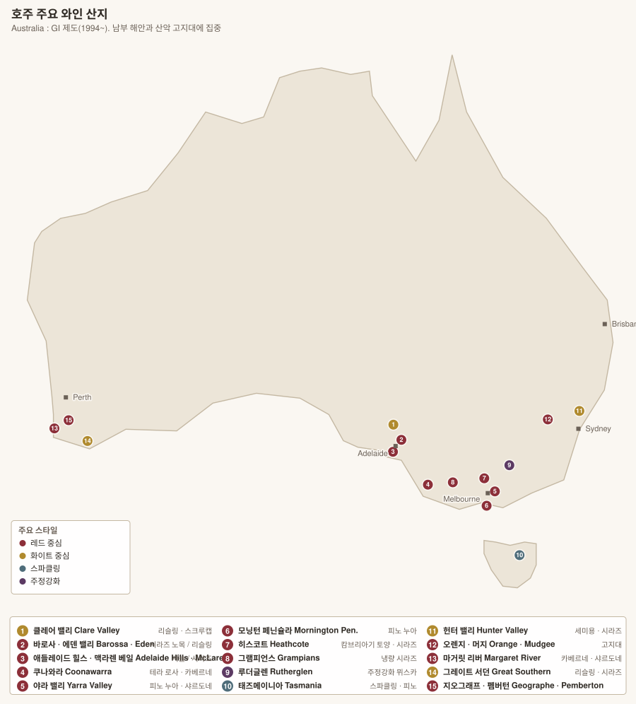

# 호주 와인 개요



> **필록세라를 대부분 겪지 않았다.** 남호주는 검역으로 완전히 막아냈고, 그 결과 **세계에서 가장 오래된 포도나무**들이 여기 살아 있다 — 1843년 식재 시라즈가 아직 열매를 맺는다.

<!-- toc -->
## 목차

- [1. GI 제도 — 경계만 정한다](#1-gi-제도--경계만-정한다)
- [2. Langton's Classification — 민간 등급](#2-langtons-classification--민간-등급)
- [3. 품종](#3-품종)
- [4. 세계에서 가장 오래된 포도나무](#4-세계에서-가장-오래된-포도나무)
- [5. 역사 — 세 번의 전환](#5-역사--세-번의-전환)
- [6. 지역별 문서](#6-지역별-문서)
- [7. 빈티지](#7-빈티지)

<!-- /toc -->

## 1. GI 제도 — 경계만 정한다

호주의 산지 제도는 **GI(Geographical Indication 지리적 표시)**로, 1994년 EU와의 무역 협정에 맞춰 도입되었다.

| | 프랑스 AOC | **호주 GI** |
|---|---|---|
| 규정하는 것 | 경계 + 품종 + 수확량 + 양조법 | **경계뿐** |
| 등급 서열 | 있음 | **없음** |
| 성격 | 품질 보증 | **지리 표시** — 미국 AVA와 같은 구조 |

### 3단계 위계

```
State (주)  →  Zone (존)  →  Region (리전)  →  Sub-region (서브리전)
South Australia → Mount Lofty Ranges → Adelaide Hills → Lenswood
```

| 항목 | 최소 비율 |
|---|---|
| **품종 표기** | **85%** |
| **GI 표기** | **85%** |
| **빈티지 표기** | **85%** |

> **블렌딩 표기 순서** — `Shiraz Cabernet`처럼 두 품종을 쓰면 **비율이 높은 순서**로 적는다. `Cabernet Shiraz`는 카베르네가 더 많다는 뜻이다.

> **South Eastern Australia 사우스이스턴 오스트레일리아** — GI로 등록되어 있지만 **호주 포도밭의 약 95%를 포함하는 거대 구역**이다. 라벨에 이것만 적혀 있으면 사실상 "호주산"이라는 뜻이며, 대량 블렌딩 와인이다.

## 2. Langton's Classification — 민간 등급

GI에 서열이 없으니, 경매회사 **Langton's 랭턴스**가 **경매 실적과 시장 평가**를 근거로 만든 등급이 사실상의 서열 역할을 한다. 1990년 시작, 약 5년마다 개정.

| 등급 | 내용 |
|---|---|
| **Exceptional 엑셉셔널** | 최상위 (약 20종) — Penfolds Grange, Henschke Hill of Grace, Wendouree, Cullen Diana Madeline 등 |
| **Outstanding 아웃스탠딩** | |
| **Excellent 엑셀런트** | |

> 프랑스의 1855 등급이 **당시 거래가격**을 근거로 했던 것과 구조가 같다. 밭이 아니라 **와인 브랜드**에 매기는 등급이다.

## 3. 품종

| 품종 | 재배 비중 | 성격 |
|---|---|---|
| **Shiraz 시라즈** | **약 25%** | = **Syrah 시라**. 호주의 얼굴. 따뜻한 곳에서 잼·초콜릿, 서늘한 곳에서 후추·꽃 |
| **Chardonnay 샤르도네** | 약 15% | 1990년대 오크·버터 → 2000년대 이후 **절제·미네랄**로 전환 |
| **Cabernet Sauvignon 카베르네 소비뇽** | 약 15% | 쿠나와라·마거릿 리버 |
| **Merlot 메를로** | 약 7% | 블렌딩 |
| **Sauvignon Blanc 소비뇽 블랑** | 약 6% | 애들레이드 힐스 |
| **Semillon 세미용** | 약 3% | **Hunter Valley 헌터 밸리**의 것은 세계 유일의 스타일 |
| **Riesling 리슬링** | 약 3% | **Clare 클레어 · Eden 에덴**. 드라이·라임·석유향 |
| **Grenache 그르나슈** | 약 2% | 바로사·맥라렌 베일의 **자근 노목**. 급부상 중 |
| **Mataro 마타로** | 소량 | = **Mourvèdre 무르베드르**. GSM 블렌드 |
| **Pinot Noir 피노 누아** | 약 4% | 야라·모닝턴·태즈메이니아 |
| **Muscat à Petits Grains Rouge · Muscadelle(Topaque)** | 소량 | **Rutherglen 루더글렌** 주정강화 |
| **Tempranillo · Nebbiolo · Fiano · Vermentino · Sangiovese** | 소량 | **대체 품종(alternative varieties)** — 온난화 대응으로 급증 |

## 4. 세계에서 가장 오래된 포도나무

필록세라를 막아낸 결과다. **남호주는 지금도 다른 주에서 포도나무 반입을 금지**한다.

| 밭 | 식재 | 품종 | 소유 |
|---|---|---|---|
| **Turkey Flat 터키 플랫** (바로사) | **1847** | 시라즈 | Turkey Flat |
| **Langmeil "The Freedom" 랑마일 프리덤** (바로사) | **1843** | 시라즈 | Langmeil |
| **Hill of Grace 힐 오브 그레이스** (에덴) | **1860년대** | 시라즈 | **Henschke 헨슈케** |
| **Kalimna Block 42 칼림나 블록 42** (바로사) | **1888년 이전** | 카베르네 소비뇽 | **Penfolds 펜폴즈** |
| **Cirillo 1850 Grenache** (바로사) | **1848** | 그르나슈 | Cirillo |

> **Barossa Old Vine Charter 바로사 올드 바인 헌장**(2009) — 수령을 네 단계로 정의한 지역 규약이다. **Old Vine 35년+ / Survivor Vine 70년+ / Centenarian Vine 100년+ / Ancestor Vine 125년+**.

## 5. 역사 — 세 번의 전환

| 시기 | 사건 |
|---|---|
| 1788~ | 첫 식민지와 함께 포도 도입 |
| **1830~40년대** | James Busby 제임스 버스비가 유럽에서 묘목을 들여와 배포. **호주 포도나무의 원조** |
| 1877~ | 빅토리아에 필록세라 상륙. **남호주는 검역으로 막아냈다** |
| 1950~70년대 | 주정강화 와인(포트 스타일) 중심. **Penfolds Grange 1951**이 첫 빈티지 |
| **1980~90년대** | 스틸 와인 전환 + 수출 폭발. **"Sunshine in a bottle"** — 잘 익은 시라즈·오크 샤르도네 |
| 2000년대 중반 | **Yellow Tail 옐로 테일** 등 대량 저가 브랜드가 성공하며 **"싸고 달다"는 이미지**가 굳어졌다 |
| **2010년대~** | **서늘한 산지·자근 노목·대체 품종·저개입**으로 방향 전환. 알코올을 낮추고 오크를 줄인다 |

> **파커 점수와의 관계** — 2000년대 초 로버트 파커가 진하고 알코올 높은 바로사 시라즈에 고점을 주면서 그 스타일이 과열되었다. 지금은 반작용으로 **신선함·투명함**을 지향하는 생산자가 주류가 되었다.

## 6. 지역별 문서

| # | 문서 | 핵심 |
|---|---|---|
| 01 | [남호주](01-south-australia.md) | **바로사·에덴·클레어·애들레이드 힐스·맥라렌 베일·쿠나와라** — 호주 생산의 약 50% |
| 02 | [빅토리아·태즈메이니아](02-victoria-tasmania.md) | 야라·모닝턴·히스코트·그램피언스·루더글렌·태즈메이니아 |
| 03 | [뉴사우스웨일스·서호주](03-nsw-wa.md) | 헌터 밸리 세미용 · 마거릿 리버 · 그레이트 서던 |

## 7. 빈티지

> 연도별 상세 차트는 **[호주 빈티지 차트](../vintages/06-australia-nz.md)** 참조.

---

[목차로](../README.md) · [다음: 남호주 →](01-south-australia.md)
