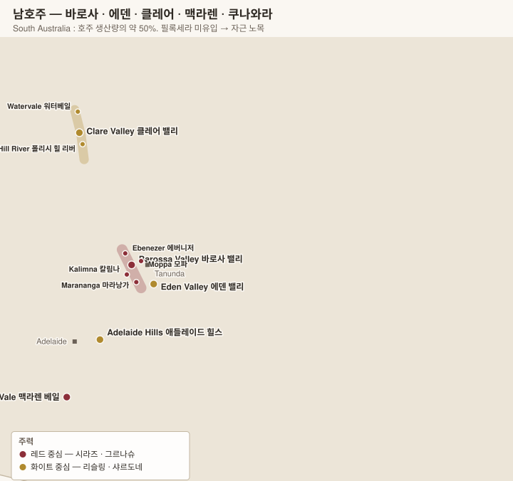

# 남호주 South Australia

> 호주 와인 생산의 **약 50%**. 그리고 **필록세라가 한 번도 들어오지 않은** 땅 — 세계에서 가장 오래된 포도나무가 여기 있다.

| 산지 | 주력 | 한 줄 |
|---|---|---|
| **Barossa Valley 바로사 밸리** | 시라즈 | 자근 노목, 호주 시라즈의 심장 |
| **Eden Valley 에덴 밸리** | 리슬링 · 시라즈 | 바로사 위 고지대, 서늘 |
| **Clare Valley 클레어 밸리** | 리슬링 | 라임·석유향, **스크루캡 혁명의 진원지** |
| **Adelaide Hills 애들레이드 힐스** | 샤르도네 · 소비뇽 블랑 | 고도 400~600 m, 서늘 |
| **McLaren Vale 맥라렌 베일** | 시라즈 · 그르나슈 | 해양성, 지질 다양 |
| **Coonawarra 쿠나와라** | 카베르네 소비뇽 | **테라 로사** 붉은 흙 띠 |

<!-- toc -->
## 목차

- [1. 바로사 밸리 Barossa Valley](#1-바로사-밸리-barossa-valley)
  - [하위 구역](#하위-구역)
- [2. 에덴 밸리 Eden Valley](#2-에덴-밸리-eden-valley)
- [3. 클레어 밸리 Clare Valley](#3-클레어-밸리-clare-valley)
  - [두 개의 세부 구역](#두-개의-세부-구역)
- [4. 애들레이드 힐스 Adelaide Hills](#4-애들레이드-힐스-adelaide-hills)
- [5. 맥라렌 베일 McLaren Vale](#5-맥라렌-베일-mclaren-vale)
- [6. 쿠나와라 Coonawarra](#6-쿠나와라-coonawarra)
- [7. 품종 — 남호주에서의 성격](#7-품종--남호주에서의-성격)

<!-- /toc -->

---

# 1. 바로사 밸리 Barossa Valley

| 항목 | 내용 |
|---|---|
| 위치 | 애들레이드 북동 60 km. 계곡 바닥 해발 250~350 m |
| 기후 | **따뜻하고 건조.** 대륙성. 밤에도 크게 식지 않는다 |
| 역사 | **1842년 실레지아(현 폴란드) 루터교 이민자**가 개척. 지금도 독일계 지명이 많다 |
| 품종 | **Shiraz 시라즈**(약 60%) · Grenache 그르나슈 · Mataro 마타로 · Cabernet · Semillon |
| 특징 | **자근(own-rooted) 노목** 다수. 1843~1888년 식재가 지금도 생산 중 |

## 하위 구역

| 구역 | 성격 |
|---|---|
| **Ebenezer 에버니저** (북) | 가장 덥다. 진하고 잼 같은 시라즈 |
| **Kalimna 칼림나** | 붉은 모래 위 점토. Penfolds Grange의 주 공급원 |
| **Moppa · Greenock 모파 · 그리녹** (북서) | 철분 점토 |
| **Marananga 마라낭가** | 서쪽 사면, 응축도 최고 |
| **Tanunda · Bethany 타눈다 · 베서니** (중부) | 균형 |
| **Lyndoch 린도크** (남) | 조금 서늘, 더 우아 |

**핵심 생산자**: **Penfolds 펜폴즈**(Grange · Bin 707) · **Torbreck 토브렉**(RunRig) · **Rockford 록포드**(Basket Press) · **Charles Melton** · **Standish** · **Sami-Odi** · **Hentley Farm** · Turkey Flat · Langmeil · Yalumba(에덴) · Seppeltsfield(주정강화)

> **Penfolds Grange 펜폴즈 그랜지** — 1951년 맥스 슈베르트가 에르미타주를 모델로 만든 시라즈다. **단일 밭이 아니라 여러 산지를 블렌딩**하며, 소량의 카베르네가 들어간다. 초기에는 사내에서 혹평받아 생산 중단 명령을 받았으나 몰래 계속 만들었다는 일화가 유명하다. 호주 유일의 **국가 문화유산 등재 와인**.

> **Bin 번호 체계** — 펜폴즈는 밭이 아니라 **저장 창고(bin) 번호**로 와인을 구분한다. Bin 389(시라즈·카베르네, "가난한 자의 그랜지"), Bin 707(카베르네), Bin 28(시라즈), Bin 407 등.

---

# 2. 에덴 밸리 Eden Valley

바로사 동쪽 **고지대(380~550 m)**. 같은 존(Barossa Zone)에 속하지만 성격이 전혀 다르다.

| 항목 | 내용 |
|---|---|
| 기후 | 바로사보다 **3~4℃ 낮다.** 밤이 서늘하다 |
| 토양 | 화강암·편암·석영 |
| 품종 | **Riesling 리슬링**(호주 최고 수준) · **Shiraz 시라즈**(더 향기롭고 후추) |
| 대표 | **Henschke Hill of Grace 헨슈케 힐 오브 그레이스** — 1860년대 자근 시라즈 노목 단일 밭. 호주에서 그랜지와 함께 최고가 |

**핵심 생산자**: **Henschke 헨슈케**(Hill of Grace · Mount Edelstone) · **Pewsey Vale 퓨지 베일**(리슬링, The Contours) · **Yalumba 얄룸바** · Torzi Matthews

---

# 3. 클레어 밸리 Clare Valley

| 항목 | 내용 |
|---|---|
| 위치 | 애들레이드 북쪽 130 km, 해발 400~500 m |
| 기후 | 낮은 덥고 **밤은 서늘하다.** 일교차가 크다 |
| 품종 | **Riesling 리슬링**(약 30%) · Shiraz · Cabernet · Malbec |
| 리슬링 | **완전 드라이.** 라임·자몽·백악 미네랄. 5~10년 뒤 **석유향(petrol)** |

## 두 개의 세부 구역

| 구역 | 토양 | 리슬링의 성격 |
|---|---|---|
| **Watervale 워터베일** | **석회질 붉은 흙 위 얕은 표토** | 향기롭고 화사, 라임·꽃 |
| **Polish Hill River 폴리시 힐 리버** | **점판암·이암** | 더 단단하고 광물적, 늦게 열린다 |

> **스크루캡 혁명(2000)** — 코르크 오염(TCA)에 지친 클레어 밸리 리슬링 생산자 **14곳이 공동으로 스크루캡 전환**을 선언했다. 이것이 전 세계 스크루캡 확산의 출발점이 되었고, 지금 호주·뉴질랜드 와인의 대부분이 스크루캡을 쓴다.

**핵심 생산자**: **Grosset 그로셋**(Polish Hill · Springvale) · **Jim Barry 짐 배리**(The Armagh) · **Kilikanoon** · **Mount Horrocks** · **Wendouree 웬두리**(Langton's Exceptional, 극소량 컬트) · Pikes · Taylors

---

# 4. 애들레이드 힐스 Adelaide Hills

| 항목 | 내용 |
|---|---|
| 고도 | **400~600 m** — 남호주에서 가장 서늘 |
| 품종 | **Sauvignon Blanc · Chardonnay · Pinot Noir** · 서늘한 시라즈 |
| 서브리전 | **Lenswood 렌스우드**(가장 서늘) · **Piccadilly Valley 피카딜리 밸리** |
| 성격 | 산도가 높고 향이 정밀. **호주 냉량 산지 스타일의 상징** |

**핵심 생산자**: **Shaw + Smith 쇼 앤드 스미스** · **Petaluma 페탈루마**(Tiers Chardonnay) · **Ashton Hills**(피노 누아) · **The Lane** · Tapanappa · Ochota Barrels(자연파)

---

# 5. 맥라렌 베일 McLaren Vale

| 항목 | 내용 |
|---|---|
| 위치 | 애들레이드 남쪽, **바다에 접한다** |
| 기후 | 지중해성. **오후 해풍(Gulf St Vincent)**이 열을 식힌다 |
| 토양 | **극단적으로 다양** — 5억 년에 걸친 19개 지질층이 좁은 구역에 노출되어 있다. 지질 지도가 관광 상품일 정도 |
| 품종 | **Shiraz 시라즈** · **Grenache 그르나슈**(자근 노목) · Mataro · Cabernet · Fiano · Vermentino |
| 방향 | 자연파·유기농 비중이 호주 최고 수준 |

> **그르나슈의 재평가** — 오랫동안 주정강화용 벌크 품종이었던 맥라렌 베일·바로사의 자근 그르나슈 노목이 2010년대에 재발견되었다. **색이 옅고 향기로운** 스타일로, 프리오라트나 그레도스와 같은 방향이다.

**핵심 생산자**: **d'Arenberg 다렌버그**(The Dead Arm) · **Yangarra 얀가라**(비오디나미, 그르나슈) · **Wirra Wirra** · **Clarendon Hills** · **Chapel Hill** · S.C. Pannell · Samuel's Gorge

---

# 6. 쿠나와라 Coonawarra

> **폭 2 km, 길이 20 km의 붉은 흙 띠**가 전부인 산지. 그 밖으로 한 발만 나가면 품질이 급락한다.

| 항목 | 내용 |
|---|---|
| 토양 | **Terra Rossa 테라 로사** — 석회암 기반 위에 얹힌 **붉은 철분 점토**(두께 20~100 cm). 배수와 보수를 동시에 |
| 기후 | 남극 해류의 영향으로 **호주 본토에서 가장 서늘한 축**. 성숙이 느리다 |
| 품종 | **Cabernet Sauvignon 카베르네 소비뇽**(약 60%) · Shiraz · Merlot |
| 성격 | **민트·유칼립투스**, 카시스, 견고한 탄닌과 산도. 보르도와 비교된다 |

> **테라 로사 경계 소송** — 1990년대 GI 경계를 정할 때 **어디까지가 쿠나와라인가**를 두고 생산자들이 법정 다툼을 벌였다. 붉은 흙 띠 밖의 밭도 포함시키려는 쪽과 막으려는 쪽이 대립했고, 결국 확대된 경계로 결정되었다. **GI가 품질을 보증하지 않는다**는 것을 보여주는 사례.

**핵심 생산자**: **Wynns Coonawarra Estate 윈스**(John Riddoch · Michael) · **Katnook** · **Balnaves** · **Majella** · Parker Coonawarra Estate

---

# 7. 품종 — 남호주에서의 성격

| 품종 | 어디서 | 성격 |
|---|---|---|
| **Shiraz 시라즈** | 바로사(덥다) | 잼·초콜릿·감초, 알코올 14.5~15.5%, 탄닌 부드럽고 풍만 |
| | 에덴·애들레이드 힐스(서늘) | **후추·제비꽃·올리브**, 산도 높고 색이 더 옅다. 북부 론에 가깝다 |
| | 맥라렌 베일 | 그 중간. 해풍으로 신선함이 있다 |
| **Grenache 그르나슈** | 바로사·맥라렌 자근 노목 | 딸기·허브·향신료. **알코올은 높으나 색과 탄닌은 옅다** |
| **Riesling 리슬링** | **클레어 · 에덴** | **완전 드라이.** 라임·자몽, 산도 높고 알코올 12% 내외. 10~20년 숙성하면 석유향·토스트 |
| **Cabernet Sauvignon** | **쿠나와라** | 민트·유칼립투스·카시스. 견고한 구조 |
| **Chardonnay · Sauvignon Blanc** | 애들레이드 힐스 | 절제된 오크, 산도 중심 |
| **Mataro 마타로**(무르베드르) | 바로사 | GSM 블렌드의 골격 |
| **Semillon 세미용** | 바로사(소량) | 오크 숙성 스타일 |

> **GSM** — Grenache · Shiraz · Mataro의 블렌드. 남부 론의 GSM과 같은 구성이지만, 호주는 **시라즈 비중이 더 높고 알코올이 더 높다.**

---

[← 호주 개요](00-overview.md) · [목차로](../README.md) · [다음: 빅토리아·태즈메이니아 →](02-victoria-tasmania.md)
