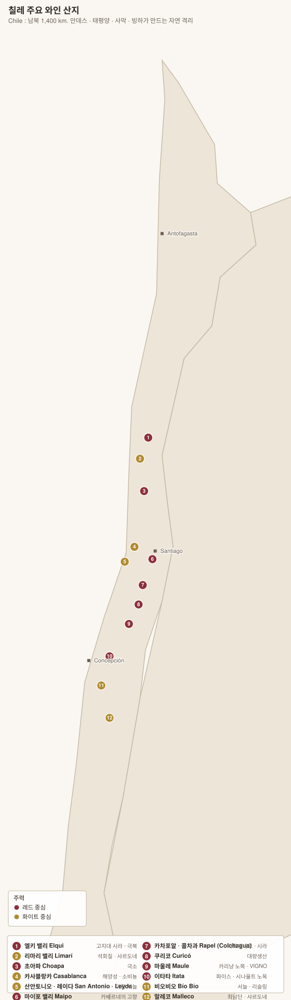

# 중앙 계곡 Valle Central — 마이포 · 라펠 · 쿠리코 · 마울레

> 칠레 생산량의 대부분이 여기서 나온다. **안데스 쪽으로 갈수록 고도와 일교차가 오르고, 바다 쪽으로 갈수록 서늘해진다** — 남북보다 동서가 중요하다.

| 산지 | 주력 | 한 줄 |
|---|---|---|
| **Maipo 마이포** | 카베르네 소비뇽 | **"칠레의 보르도"** — 카베르네의 고향 |
| **Cachapoal 카차포알** | 카르메네르 · 카베르네 | 라펠 북쪽. 페우모 |
| **Colchagua 콜차과** | 카베르네 · 카르메네르 · 시라 | 라펠 남쪽. 아팔타 |
| **Curicó 쿠리코** | 다양 | 대량생산 중심 |
| **Maule 마울레** | **카리냥 노목** · 파이스 | 칠레 최대 면적, 재발견 진행 중 |

---

# 1. 마이포 Maipo

> 산티아고 바로 남쪽. 칠레에서 **가장 오래되고 가장 유명한** 카베르네 산지다.

| 항목 | 내용 |
|---|---|
| 기후 | 지중해성. 여름 건조, 겨울 강우 |
| 특징 | **안데스에서 내려오는 밤바람**이 기온을 떨어뜨려 일교차를 만든다 |
| 품종 | **Cabernet Sauvignon 카베르네 소비뇽** 압도적 + 카르메네르 · 메를로 · 시라 |
| 성격 | **카시스·민트·유칼립투스·흑연.** 칠레 카베르네의 전형 |

## 세 구역

| 구역 | 고도 | 성격 | 대표 |
|---|---|---|---|
| **Alto Maipo 알토 마이포** | **400~1,000 m**, 안데스 기슭 | **최상급.** 자갈·충적토, 큰 일교차. 구조적·장수 | **Puente Alto 푸엔테 알토**, **Pirque 피르케**, Buin |
| **Maipo Central 마이포 센트랄** | 중간 | 온난, 풍만 | Isla de Maipo |
| **Maipo Costa 마이포 코스타** | 서쪽 | 해양 영향 | |

> **Puente Alto 푸엔테 알토** — 마이포 최상단의 자갈 구역으로, 칠레 최고가 와인 세 종이 모두 여기서 나온다. **Viñedo Chadwick 비녜도 차드윅**, **Don Melchor 돈 멜초르**(Concha y Toro), **Almaviva 알마비바**(Concha y Toro + Baron Philippe de Rothschild 합작).

> **2004년 베를린 테이스팅** — 에두아르도 차드윅이 유럽 평론가들을 모아 블라인드 시음을 열었고, **Viñedo Chadwick 2000과 Seña 2001이 라피트·마고보다 높은 점수**를 받았다. "칠레는 싸구려"라는 인식을 흔든 사건으로 자주 인용된다.

**핵심 생산자**: **Concha y Toro 콘차 이 토로**(Don Melchor) · **Almaviva 알마비바** · **Viña Errázuriz / Viñedo Chadwick 비녜도 차드윅** · **Santa Rita 산타 리타**(Casa Real) · **Cousiño Macul 코우시뇨 마쿨**(1856년 설립, 자근 노목) · Antiyal(비오디나미)

---

# 2. 라펠 Rapel — 카차포알 · 콜차과

## Cachapoal 카차포알 (북쪽)

| 구역 | 성격 | 생산자 |
|---|---|---|
| **Peumo 페우모** | 온난·점토. **칠레 최고의 카르메네르 구역**으로 꼽힌다 | **Concha y Toro Carmín de Peumo** |
| **Alto Cachapoal 알토 카차포알** | 안데스 기슭, 서늘 | Altaïr, Anakena |

## Colchagua 콜차과 (남쪽)

| 항목 | 내용 |
|---|---|
| 성격 | 라펠에서 가장 유명. 따뜻하고 풍만한 레드 |
| 구역 | **Apalta 아팔타**(원형 분지, 화강암 사면) · Los Lingues · Marchigüe(해안 쪽, 서늘) |
| 품종 | 카베르네 · **카르메네르** · 시라 · 말벡 |

> **Apalta 아팔타** — 콜차과 안의 말굽 모양 분지로, 남향 화강암 사면이 열을 조절한다. **Clos Apalta 클로 아팔타**(Lapostolle), **Montes Alpha M**, **Neyen**이 여기서 나온다. 사실상 칠레의 그랑크뤼 밭 취급을 받는다.

**핵심 생산자**: **Lapostolle 라포스톨**(Clos Apalta, 비오디나미) · **Montes 몬테스**(Alpha M · Folly 시라) · **Casa Silva** · **Viu Manent** · **Neyen** · Los Vascos(라피트 로칠드)

---

# 3. 쿠리코 Curicó

| 항목 | 내용 |
|---|---|
| 성격 | 대량생산 중심. 품종이 매우 다양하다 |
| 역사 | **1979년 스페인의 Miguel Torres 미겔 토레스**가 여기 진출하며 칠레에 스테인리스 탱크와 온도 조절 발효를 들여왔다 — 칠레 현대화의 출발점 |
| 품종 | 카베르네 · 소비뇽 블랑 · 샤르도네 · 메를로 |

**생산자**: **Miguel Torres Chile**, San Pedro, Echeverría

---

# 4. 마울레 Maule — 노목의 재발견

> **칠레 최대 면적 산지**이면서 오랫동안 벌크 와인의 공급처였다. 그런데 이곳에 **100년 넘은 자근 카리냥과 파이스**가 남아 있었다.

| 항목 | 내용 |
|---|---|
| 기후 | 중앙 계곡에서 가장 서늘하고 강우가 많다 |
| 토양 | 화강암·점토 |
| 품종 | **Carignan 카리냥**(노목) · **País 파이스** · 카베르네 · 메를로 |

## VIGNO — 칠레 최초의 민간 원산지 협회

**VIGNO(Vignadores de Carignan 비냐도레스 데 카리냥)**는 2010년 결성된 생산자 협약이다. 칠레에 밭 등급 제도가 없으니 **스스로 규약을 만들었다.**

| 규약 | 내용 |
|---|---|
| 품종 | **카리냥 65% 이상** |
| 수령 | **30년 이상** |
| 재배 | **관개 없이(secano 세카노)**, 자근, **부시 바인(cabeza 카베사)** |
| 숙성 | **최소 24개월** |
| 산지 | **마울레 건조 지대(secano interior)** 한정 |

> 1939년 대지진 이후 정부가 **파이스 와인의 산도를 보강하라**며 카리냥 식재를 장려했다. 그때 심은 나무들이 방치되었다가 70년 뒤 자산이 되었다.

**핵심 생산자**: **Gillmore**, **Garage Wine Co. 개러지 와인**, **De Martino 데 마르티노**, **Undurraga TH**, Meli, Bouchon(파이스)

---

# 5. 품종 — 중앙 계곡에서의 성격

| 품종 | 어디서 | 성격 |
|---|---|---|
| **Cabernet Sauvignon 카베르네 소비뇽** | **Alto Maipo 알토 마이포** | **카시스·민트·유칼립투스·흑연.** 견고한 탄닌, 20~30년 |
| | 콜차과 | 더 따뜻해 풍만하고 잼 쪽 |
| **Carménère 카르메네르** | **Peumo 페우모** · 콜차과 | **자두·피망·후추·간장.** 늦게 익어(카베르네보다 2~3주) **완숙 관리가 전부** — 덜 익으면 피라진(풀·피망)이 지배한다 |
| **Syrah 시라** | 콜차과 마르치궤 · 알토 카차포알 | 서늘한 구획에서 후추·올리브 |
| **Merlot 메를로** | 전역 | 1994년 이전에는 상당수가 사실 카르메네르였다 |
| **Carignan 카리냥** | **Maule 마울레 노목** | 산도·탄닌 높고 색 진함. 관개 없는 노목이라야 |
| **País 파이스** | 마울레 · 이타타 | 색이 옅고 가볍다. 자연파가 재발견 |
| **Sauvignon Blanc · Chardonnay** | 서쪽 구획 | 해안 산지 쪽이 낫다 → [해안·남부 문서](02-coastal-south.md) |

> **카르메네르를 어떻게 볼 것인가** — 칠레의 상징이지만 **양날의 검**이다. 완숙하면 자두·초콜릿·향신료의 독특한 스타일이 나오지만, 덜 익으면 피망·풀 냄새가 압도한다. 그래서 페우모처럼 **따뜻하고 늦게까지 익힐 수 있는 구역**이 아니면 어렵다.

---

[← 칠레 개요](00-overview.md) · [목차로](../README.md) · [다음: 해안·남부 →](02-coastal-south.md)
