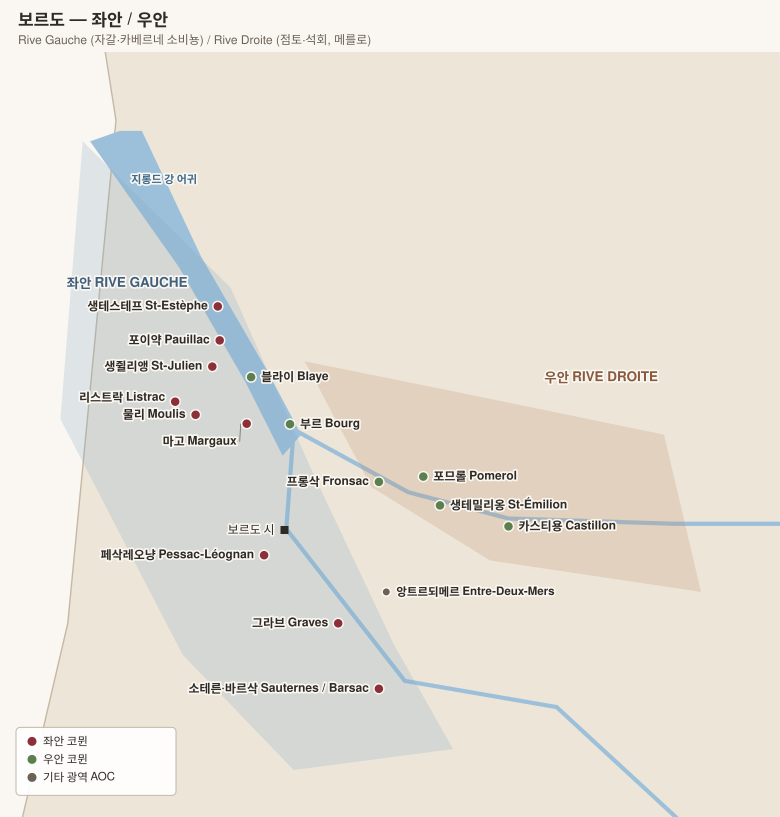

# 보르도 Bordeaux

> 좌안(Rive Gauche 리브 고슈)과 우안(Rive Droite 리브 드루아트)으로 나누어 등급별로 정리. 등급 체계가 강 양쪽에서 완전히 다르다.

## 0. 핵심 구조

| 구분 | 좌안 Rive Gauche 리브 고슈 | 우안 Rive Droite 리브 드루아트 |
|---|---|---|
| 위치 | 지롱드·가론 강 서쪽 (메독, 그라브) | 도르도뉴 강 북·동쪽 (생테밀리옹, 포므롤) |
| 토양 | 자갈(gravel) — 배수·축열 우수 | 점토(clay)·석회암(limestone) |
| 주품종 | **카베르네 소비뇽** + 메를로, 카베르네 프랑, 프티 베르도 | **메를로** + 카베르네 프랑 |
| 스타일 | 탄닌 견고, 구조적, 장기 숙성 | 부드럽고 풍만, 상대적으로 조기 접근 |
| 등급 체계 | **1855 그랑크뤼 클라세 (1~5등급)** — 사실상 불변 | 생테밀리옹은 약 10년마다 재심사 / 포므롤은 **등급 없음** |
| 밭 단위 | 샤토(생산자) 단위로 등급 부여 — 밭 이름 ≒ 샤토 이름 | 동일 (부르고뉴처럼 밭에 등급을 주지 않음) |

> **중요**: 보르도는 부르고뉴와 달리 **밭(테루아)이 아니라 샤토(생산자)에 등급을 매긴다.** 따라서 아래 표의 "샤토명"이 곧 밭 이름 역할을 한다.

---

# 품종 Cépages 세파주

> 보르도는 **블렌딩의 산지**다. 단일 품종으로 완성하지 않고, 익는 시기와 성질이 다른 품종을 섞어 **해마다 다른 날씨를 흡수**한다. 좌안과 우안의 차이도 결국 "어느 품종이 어느 토양에 맞는가"의 문제다.

## 품종 한눈에

| 품종 | 색 | 주 위치 | 블렌드에서의 역할 |
|---|---|---|---|
| **Cabernet Sauvignon 카베르네 소비뇽** | 레드 | 좌안 자갈 | 구조·탄닌·수명 |
| **Merlot 메를로** | 레드 | 우안 점토 (보르도 최다 재배) | 살집·풍만함·조기 접근 |
| **Cabernet Franc 카베르네 프랑** | 레드 | 우안 석회암 | 향·신선함 |
| **Petit Verdot 프티 베르도** | 레드 | 좌안 소량 | 색·향신료·산도 |
| **Malbec 말벡 / Côt 코** | 레드 | 블라이·부르 | 색·과실 (지금은 소수) |
| **Sémillon 세미용** | 화이트 | 소테른·그라브 | 질감·귀부·숙성력 |
| **Sauvignon Blanc 소비뇽 블랑** | 화이트 | 그라브·앙트르되메르 | 산도·향 |
| **Muscadelle 뮈스카델** | 화이트 | 소량 | 꽃향 |

---

## 레드 품종

### Cabernet Sauvignon 카베르네 소비뇽 — 좌안의 뼈대

1996년 DNA 분석으로 **Cabernet Franc 카베르네 프랑 × Sauvignon Blanc 소비뇽 블랑**의 자연 교배임이 밝혀졌다. 17세기경 보르도에서 우연히 생긴 비교적 젊은 품종이다.

| 항목 | 내용 |
|---|---|
| 향 | **카시스(블랙커런트)**, **연필심·흑연**, 삼나무, 민트, 담뱃잎 |
| 구조 | 색 진함 · **탄닌 강함** · 산도 높음 · 알갱이가 작아 껍질 비율이 높다 |
| 숙성 | **20~50년.** 어릴 때 탄닌이 닫혀 있어 접근하기 어렵다 |
| 요구 조건 | **늦게 익는다** — 배수 좋고 열을 저장하는 **자갈 토양**이라야 완숙한다 |
| 미숙 시 | 피망·풀 냄새(피라진). 좌안에서 카베르네가 안 익은 해가 나쁜 빈티지인 이유 |

> **왜 좌안인가** — 지롱드 강이 실어 온 자갈층은 물을 흘려보내고 낮의 열을 저장했다 밤에 방출한다. 이 두 가지가 늦게 익는 카베르네를 완숙시킨다. 우안의 점토는 차고 물을 머금어 카베르네를 익히지 못한다.

### Merlot 메를로 — 보르도에서 가장 많이 심는 품종

이름은 "작은 검은새(merle 메를)"에서 왔다. 보르도 전체 재배 면적의 **약 60%**로, 좌안 샤토들도 대개 20~40%를 섞는다.

| 항목 | 내용 |
|---|---|
| 향 | 자두·블랙체리, 초콜릿, 무화과. 숙성하면 트러플·가죽 |
| 구조 | **탄닌 부드럽고 알코올 높음**, 산도 중간. 질감이 둥글다 |
| 숙성 | 카베르네보다 일찍 열리고 일찍 정점에 이른다 |
| 요구 조건 | **일찍 익는다** — 서늘하고 물을 머금는 **점토**에서 최상. 포므롤의 순수 점토가 극단적 예 |
| 약점 | **꽃떨이(coulure 쿨뤼르)와 봄 서리에 취약**. 2017·2021년 서리 피해가 우안에 집중된 이유 |

### Cabernet Franc 카베르네 프랑 — 카베르네 소비뇽의 부모

| 항목 | 내용 |
|---|---|
| 향 | **제비꽃·라즈베리**, 연필심, 마른 허브 |
| 구조 | 색과 탄닌이 카베르네 소비뇽보다 옅고 가볍다. 산도는 높다 |
| 요구 조건 | **더 일찍 익어** 서늘한 해에도 완숙한다. 석회암에서 최상 |
| 대표 | **Château Cheval Blanc 샤토 슈발 블랑**(약 50%가 카베르네 프랑) · **Château Ausone 샤토 오존** |
| 추세 | 온난화로 메를로가 너무 빨리 익자 **카베르네 프랑 비율을 늘리는** 샤토가 늘고 있다 |

### Petit Verdot 프티 베르도 — 소량의 조미료

| 항목 | 내용 |
|---|---|
| 향 | 제비꽃, 검은 후추, 잉크 |
| 구조 | **색이 극도로 진하고 탄닌·산도가 높다** |
| 비율 | 블렌드의 **1~5%**. 소량으로 색과 향신료를 보탠다 |
| 역사 | 카베르네보다도 늦게 익어 20세기에는 익지 않는 해가 많아 뽑혀 나갔다. **온난화로 다시 늘고 있다** |

### 사라진 품종과 새 품종

| 품종 | 내용 |
|---|---|
| **Malbec 말벡 / Côt 코** | 1956년 대서리로 대부분 죽고 이후 복원되지 않았다. **Cahors 카오르와 아르헨티나**에서 주역이 되었다 |
| **Carménère 카르메네르** | 필록세라 이후 보르도에서 사실상 소멸. **칠레에 남아** 오랫동안 메를로로 오인되다 1994년 정체가 밝혀졌다 |
| **2021년 승인 6종** | 온난화 대응으로 보르도 AOC가 새로 허용했다 — 레드 **Touriga Nacional 투리가 나시오날 · Marselan 마르슬랑 · Castets 카스테 · Arinarnoa 아리나르노아**, 화이트 **Alvarinho 알바리뉴 · Liliorila 릴리오릴라 · Petit Manseng 프티 망상**. 블렌드의 **5% 이내, 재배 면적의 10% 이내**로 제한되고 **라벨 표기는 금지** |

---

## 화이트 품종

### Sémillon 세미용 — 소테른의 몸통

| 항목 | 내용 |
|---|---|
| 향 | 밀랍·라놀린·무화과. 숙성하면 **꿀·구운 견과·토스트** |
| 구조 | **산도 낮고 질감이 두툼하다** |
| 핵심 | **껍질이 얇아 귀부균(Botrytis cinerea 보트리티스 시네레아)이 잘 침투한다** — 소테른이 세미용 중심인 이유 |
| 드라이 | 그라브 화이트에서 소비뇽 블랑과 섞이며 **10~30년 숙성력**을 준다 |

### Sauvignon Blanc 소비뇽 블랑

| 항목 | 내용 |
|---|---|
| 향 | 자몽·라임, **회양목(buis 뷔이)**, 풀, 부싯돌 |
| 구조 | **산도 높음.** 세미용의 낮은 산도를 보완한다 |
| 소테른에서 | 15~25%를 섞어 귀부의 단맛에 **긴장감**을 준다 |
| **Sauvignon Gris 소비뇽 그리** | 소비뇽 블랑의 색 변이. 향이 더 무겁고 질감이 있어 최근 재평가 |

### Muscadelle 뮈스카델

이름과 달리 뮈스카와 무관하다. 꽃·머스크 향을 소량(5% 이하) 보탠다. 뮈스카데(루아르)와도 다른 품종이다.

---

## 블렌딩의 논리

| 품종 | 넣는 이유 | 없으면 |
|---|---|---|
| **Cabernet Sauvignon** | 탄닌·산도·구조 = **골격과 수명** | 일찍 무너지고 형태가 없다 |
| **Merlot** | 알코올·살집·둥근 질감 = **몸통** | 마르고 각지고 마시기 어렵다 |
| **Cabernet Franc** | 향·신선함 = **윤곽** | 향이 단조로워진다 |
| **Petit Verdot** | 색·향신료·산도 = **악센트** | 색이 옅고 밋밋해진다 |

> **블렌딩은 취향이 아니라 보험이다.** 익는 시기가 다른 품종을 섞어 두면, 서늘한 해에는 일찍 익은 메를로가, 더운 해에는 늦게 익은 카베르네가 그해를 지탱한다. 매년 블렌드 비율이 달라지는 이유이자, 보르도가 단일 품종으로 가지 않는 근본 이유다.

### 좌안 vs 우안 — 토양이 품종을 정한다

| | 좌안 Rive Gauche 리브 고슈 | 우안 Rive Droite 리브 드루아트 |
|---|---|---|
| 토양 | **자갈** (따뜻·배수) | **점토·석회암** (차갑고 보수) |
| 주품종 | **카베르네 소비뇽 60~85%** | **메를로 60~90%** |
| 보조 | 메를로 · 카베르네 프랑 · 프티 베르도 | 카베르네 프랑 · (소량 카베르네 소비뇽) |
| 이유 | 자갈이 늦게 익는 카베르네를 완숙시킨다 | 차가운 점토가 일찍 익는 메를로에 맞다 |
| 결과 | 탄닌 견고, 20~50년 | 부드럽고 풍만, 10~30년 |

### AOC별 품종 규정 요약

| AOC | 규정 |
|---|---|
| **Médoc 메독 · Haut-Médoc 오메독 · 4개 마을 AOC** | 카베르네 소비뇽·메를로·카베르네 프랑·프티 베르도·말벡·카르메네르 (+2021년 6종) |
| **Pessac-Léognan 페삭레오냥** | 레드 동일 / **화이트** 소비뇽 블랑·세미용·뮈스카델 |
| **Saint-Émilion 생테밀리옹 · Pomerol 포므롤** | 메를로·카베르네 프랑 중심 |
| **Sauternes 소테른 · Barsac 바르삭** | **세미용·소비뇽 블랑·뮈스카델만**, 귀부 포도를 여러 차례 나눠 손 수확(tries 트리) |
| **Entre-Deux-Mers 앙트르되메르** | **드라이 화이트만** — 소비뇽 블랑 중심 |

---

# 좌안 Rive Gauche 리브 고슈

## 1. 1855년 메독 그랑크뤼 클라세 (Grand Cru Classé en 1855 그랑 크뤼 클라세 앙 1855)

1855년 파리 만국박람회를 위해 당시 거래가격 기준으로 60개 샤토를 5등급으로 분류. 이후 변경은 단 두 번 — 1856년 캉트메를 추가, **1973년 무통 로칠드의 2등급 → 1등급 승격**.

### 1등급 Premiers Crus 프리미에 크뤼 (5)

| 샤토 | 마을 | 비고 |
|---|---|---|
| Château Lafite Rothschild 샤토 라피트 로칠드 | 포이약 Pauillac | 우아·섬세, 보르도의 기준점 |
| Château Latour 샤토 라투르 | 포이약 Pauillac | 강건·장수, 2012년부터 라 플라스 이탈 |
| Château Mouton Rothschild 샤토 무통 로칠드 | 포이약 Pauillac | 1973년 승격, 아티스트 라벨 |
| Château Margaux 샤토 마고 | 마고 Margaux | 향기롭고 실크 같은 질감 |
| Château Haut-Brion 샤토 오브리옹 | 페삭레오냥 Pessac-Léognan | 유일하게 메독 밖(그라브)에서 선정 |

### 2등급 Deuxièmes Crus 되지엠 크뤼 (14)

| 샤토 | 마을 | 비고 |
|---|---|---|
| Château Rauzan-Ségla 샤토 로장 세글라 | 마고 | 샤넬 가문 소유 |
| Château Rauzan-Gassies 샤토 로장 가시 | 마고 | |
| Château Léoville-Las Cases 샤토 레오빌 라스 카스 | 생쥘리앵 | "슈퍼 세컨드"의 대표 |
| Château Léoville-Poyferré 샤토 레오빌 푸아페레 | 생쥘리앵 | |
| Château Léoville-Barton 샤토 레오빌 바르통 | 생쥘리앵 | 바튼 가문, 가격 대비 가치 높음 |
| Château Durfort-Vivens 샤토 뒤르포르 비방 | 마고 | 비오디나미 |
| Château Gruaud-Larose 샤토 그뤼오 라로즈 | 생쥘리앵 | |
| Château Lascombes 샤토 라스콩브 | 마고 | |
| Château Brane-Cantenac 샤토 브란 캉트낙 | 마고 | |
| Château Pichon-Longueville Baron 샤토 피숑 롱그빌 바롱 | 포이약 | 통칭 "피숑 바롱" |
| Château Pichon Longueville Comtesse de Lalande 샤토 피숑 롱그빌 콩테스 드 랄랑드 | 포이약 | 통칭 "피숑 라랑드" |
| Château Ducru-Beaucaillou 샤토 뒤크뤼 보카유 | 생쥘리앵 | |
| Château Cos d'Estournel 샤토 코스 데스투르넬 | 생테스테프 | 동양풍 건축, 슈퍼 세컨드 |
| Château Montrose 샤토 몽로즈 | 생테스테프 | 강건한 구조 |

### 3등급 Troisièmes Crus 트루아지엠 크뤼 (14)

| 샤토 | 마을 |
|---|---|
| Château Kirwan 샤토 키르완 | 마고 |
| Château d'Issan 샤토 디상 | 마고 |
| Château Lagrange 샤토 라그랑주 | 생쥘리앵 |
| Château Langoa-Barton 샤토 랑고아 바르통 | 생쥘리앵 |
| Château Giscours 샤토 지스쿠르 | 마고 |
| Château Malescot St-Exupéry 샤토 말레스코 생텍쥐페리 | 마고 |
| Château Boyd-Cantenac 샤토 부아드 캉트낙 | 마고 |
| Château Cantenac-Brown 샤토 캉트낙 브라운 | 마고 |
| **Château Palmer 샤토 팔머** | 마고 (실질적으로 2등급 이상 평가) |
| Château La Lagune 샤토 라 라귄 | 오메독 Haut-Médoc |
| Château Desmirail 샤토 데미라유 | 마고 |
| **Château Calon-Ségur 샤토 칼롱 세귀르** | 생테스테프 (하트 라벨) |
| Château Ferrière 샤토 페리에르 | 마고 |
| Château Marquis d'Alesme Becker 샤토 마르키 달렘 베케르 | 마고 |

### 4등급 Quatrièmes Crus 카트리엠 크뤼 (10)

| 샤토 | 마을 |
|---|---|
| Château St-Pierre 샤토 생피에르 | 생쥘리앵 |
| Château Talbot 샤토 탈보 | 생쥘리앵 |
| Château Branaire-Ducru 샤토 브라네르 뒤크뤼 | 생쥘리앵 |
| **Château Beychevelle 샤토 베슈벨** | 생쥘리앵 (용머리 배 라벨, 한국 인기) |
| Château Duhart-Milon 샤토 뒤아르 밀롱 | 포이약 (라피트 소유) |
| Château Pouget 샤토 푸제 | 마고 |
| Château La Tour Carnet 샤토 라 투르 카르네 | 오메독 |
| Château Lafon-Rochet 샤토 라퐁 로셰 | 생테스테프 |
| Château Marquis de Terme 샤토 마르키 드 테름 | 마고 |
| Château Prieuré-Lichine 샤토 프리외레 리신 | 마고 |

### 5등급 Cinquièmes Crus 생키엠 크뤼 (18)

| 샤토 | 마을 | 비고 |
|---|---|---|
| **Château Pontet-Canet 샤토 퐁테 카네** | 포이약 | 비오디나미, 현재 2등급급 평가 |
| Château Batailley 샤토 바타이에 | 포이약 | |
| Château Haut-Batailley 샤토 오 바타이에 | 포이약 | |
| **Château Grand-Puy-Lacoste 샤토 그랑 퓌 라코스트** | 포이약 | 전통적 포이약의 교과서 |
| Château Grand-Puy-Ducasse 샤토 그랑 퓌 뒤카스 | 포이약 | |
| **Château Lynch-Bages 샤토 랭슈 바주** | 포이약 | 5등급 최고 인기, "가난한 자의 무통" |
| Château Lynch-Moussas 샤토 랭슈 무사 | 포이약 | |
| Château d'Armailhac 샤토 다르마이악 | 포이약 | 무통 소유 |
| Château Clerc-Milon 샤토 클레르 밀롱 | 포이약 | 무통 소유 |
| Château Croizet-Bages 샤토 크루아제 바주 | 포이약 | |
| Château Haut-Bages-Libéral 샤토 오 바주 리베랄 | 포이약 | |
| Château Pédesclaux 샤토 페데스클로 | 포이약 | |
| Château Dauzac 샤토 도자크 | 마고 | |
| Château du Tertre 샤토 뒤 테르트르 | 마고 | |
| Château Cos Labory 샤토 코스 라보리 | 생테스테프 | |
| Château Belgrave 샤토 벨그라브 | 오메독 | |
| Château de Camensac 샤토 드 카망삭 | 오메독 | |
| **Château Cantemerle 샤토 캉트메를** | 오메독 | 1856년 추가 |

### 마을별 등급 분포 요약

| 마을 (코뮌) | 1등급 | 2등급 | 3등급 | 4등급 | 5등급 | 스타일 |
|---|---|---|---|---|---|---|
| **포이약 Pauillac** | 3 | 2 | – | 1 | 12 | 카시스·연필심, 가장 구조적 |
| **마고 Margaux** | 1 | 5 | 10 | 3 | 2 | 향기롭고 우아, 실키 |
| **생쥘리앵 St-Julien** | – | 5 | 2 | 4 | – | 포이약과 마고의 중간, 균형 |
| **생테스테프 St-Estèphe** | – | 2 | 1 | 1 | 1 | 점토 많음, 견고·묵직 |
| **오메독 Haut-Médoc** | – | – | 1 | 1 | 3 | 위 4개 마을 외 광역 |

> 그 외 좌안 마을: **리스트락 Listrac**, **물리 Moulis** — 1855 등급 샤토는 없으나 Château Chasse-Spleen 샤토 샤스 스플린, Château Poujeaux 샤토 푸조(물리) 등 우수 생산자 존재.

## 2. 그라브 / 페삭레오냥 (1959년 등급)

등급이 하나뿐(Cru Classé de Graves 크뤼 클라세 드 그라브)이며 레드·화이트를 따로 지정.

| 샤토 | 레드 | 화이트 | 비고 |
|---|---|---|---|
| Château Haut-Brion 샤토 오브리옹 | ● | ● | 1855 1등급 겸함 |
| Château La Mission Haut-Brion 샤토 라 미시옹 오브리옹 | ● | – | 오브리옹의 라이벌이자 형제 |
| Château Pape Clément 샤토 파프 클레망 | ● | ● | |
| Château Haut-Bailly 샤토 오 바이 | ● | – | 순수한 레드 전문 |
| Domaine de Chevalier 도멘 드 슈발리에 | ● | ● | 화이트가 특히 명성 |
| Château Smith Haut Lafitte 샤토 스미스 오 라피트 | ● | ● | |
| Château Malartic-Lagravière 샤토 말라르틱 라그라비에르 | ● | ● | |
| Château Olivier 샤토 올리비에 | ● | ● | |
| Château Bouscaut 샤토 부스코 | ● | ● | |
| Château Carbonnieux 샤토 카르보니외 | ● | ● | 화이트 생산량 최대급 |
| Château de Fieuzal 샤토 드 피외잘 | ● | – | 화이트도 우수하나 등급은 레드만 |
| Château La Tour-Martillac 샤토 라 투르 마르티약 | ● | ● | |
| Château Couhins / Couhins-Lurton 샤토 쿠앵 / 쿠앵 뤼르통 | – | ● | 화이트 전용 |
| Château Latour-Haut-Brion 샤토 라투르 오브리옹 | ● | – | 현재 라미시옹에 통합 |
| Château Laville Haut-Brion 샤토 라빌 오브리옹 | – | ● | 현재 라미시옹 블랑으로 통합 |

## 3. 소테른 & 바르삭 (1855년 스위트 와인 등급)

귀부균(보트리티스 시네레아)이 만드는 세계 최고 스위트 와인. **세미용 + 소비뇽 블랑 + 뮈스카델**.

| 등급 | 샤토 |
|---|---|
| **특1등급 Premier Cru Supérieur 프리미에 크뤼 쉬페리외르** | **Château d'Yquem 샤토 디켐** |
| **1등급 Premiers Crus 프리미에 크뤼 (11)** | La Tour Blanche 라 투르 블랑슈 · Lafaurie-Peyraguey 라포리 페라게 · Clos Haut-Peyraguey 클로 오 페라게 · de Rayne Vigneau 드 렌 비뇨 · **Suduiraut 쉬뒤로** · **Coutet 쿠테**(바르삭) · **Climens 클리망**(바르삭) · **Guiraud 기로** · **Rieussec 리외섹** · Rabaud-Promis 라보 프로미 · Sigalas-Rabaud 시갈라 라보 |
| **2등급 Deuxièmes Crus 되지엠 크뤼 (15)** | de Myrat 드 미라 · **Doisy-Daëne 두아지 다엔** · Doisy-Dubroca 두아지 뒤브로카 · **Doisy-Védrines 두아지 베드린** · d'Arche 다르슈 · **Filhot 필로** · Broustet 브루스테 · **Nairac 네락** · Caillou 카유 · Suau 쉬오 · de Malle 드 말 · Romer 로메르 · Romer du Hayot 로메르 뒤 아요 · Lamothe 라모트 · Lamothe-Guignard 라모트 기냐르 |

## 4. 크뤼 부르주아 Cru Bourgeois

1855 등급에 들지 못한 메독 샤토들의 별도 체계. 2020년 빈티지부터 5년마다 재심사하는 3단계로 재편.

| 등급 | 대표 샤토 |
|---|---|
| Cru Bourgeois Exceptionnel 크뤼 부르주아 엑셉시오넬 | Château Charmail 샤토 샤르마이, Château Le Crock 샤토 르 크로크, Château Lilian Ladouys 샤토 릴리앙 라두이, Château Malescasse 샤토 말레스카스 |
| Cru Bourgeois Supérieur 크뤼 부르주아 쉬페리외르 | Château d'Agassac 샤토 다가삭, Château Belle-Vue 샤토 벨뷔, Château Sénéjac 샤토 세네자크 |
| Cru Bourgeois | 약 180여 샤토 |

> 별도로 **Château Sociando-Mallet 샤토 소시앙도 말레**(오메독), **Château Gloria 샤토 글로리아**(생쥘리앵)는 등급 체계에 참여하지 않지만 품질이 높기로 유명하다.

---

# 우안 Rive Droite 리브 드루아트

## 5. 생테밀리옹 Saint-Émilion (2022년 등급)

약 10년마다 재심사하는 유일한 보르도 등급. **2022년 심사에서 Château Ausone 샤토 오존 · Cheval Blanc 슈발 블랑 · Angélus 앙젤뤼스가 참여를 철회**해 A등급이 2개만 남았다.

### Premier Grand Cru Classé A 프리미에 그랑 크뤼 클라세 A (2)

| 샤토 | 비고 |
|---|---|
| **Château Figeac 샤토 피자크** | 2022년 A 승격. 카베르네 소비뇽·프랑 비율이 이례적으로 높음 |
| **Château Pavie 샤토 파비** | 페뤼스 페로 소유, 파워풀한 스타일 |

### Premier Grand Cru Classé B 프리미에 그랑 크뤼 클라세 B (12)

| 샤토 | 비고 |
|---|---|
| Château Beau-Séjour Bécot 샤토 보세주르 베코 | |
| Château Beauséjour 샤토 보세주르 (Duffau-Lagarrosse) | |
| Château Bélair-Monange 샤토 벨레르 모낭주 | 무엑스 소유 |
| **Château Canon 샤토 카농** | 석회암 고원, 샤넬 소유 |
| Château Canon-la-Gaffelière 샤토 카농 라 가플리에르 | 노이펠트 소유 |
| Château La Gaffelière 샤토 라 가플리에르 | |
| Château Larcis Ducasse 샤토 라르시 뒤카스 | |
| Château Pavie Macquin 샤토 파비 마캥 | |
| Château Troplong Mondot 샤토 트로플롱 몽도 | |
| Château Trottevieille 샤토 트로트비에유 | |
| Château Valandraud 샤토 발랑드로 | 가라지 와인 출신 |
| **Clos Fourtet 클로 푸르테** | 석회암 지하 채석장 |

### 등급 밖 최상위 (2022년 심사 철회)

| 샤토 | 비고 |
|---|---|
| **Château Cheval Blanc 샤토 슈발 블랑** | 카베르네 프랑 비중 높은 전설적 와인, 자갈 토양 |
| **Château Ausone 샤토 오존** | 극소량, 생테밀리옹 마을 바로 아래 석회암 사면 |
| **Château Angélus 샤토 앙젤뤼스** | 2022년 철회. 종(鐘) 라벨 |

> 아래 등급으로 **Grand Cru Classé**(약 71개 샤토)가 있으며, Château Balestard La Tonnelle 샤토 발레스타르 라 토넬, Clos des Jacobins 클로 데 자코뱅, Château Dassault 샤토 다소, Château Fonroque 등이 포함된다.

### 생테밀리옹 토양별 구분

| 구역 | 토양 | 대표 샤토 |
|---|---|---|
| **Côtes (석회암 사면)** | 석회암 + 점토 | Ausone, Canon, Pavie, Troplong Mondot, Clos Fourtet 클로 푸르테 |
| **Graves (자갈 고원, 포므롤 접경)** | 자갈 + 모래 | Cheval Blanc, Figeac |
| **Pieds de côtes / 평지** | 모래·충적토 | 일반 Grand Cru 등급 |

## 6. 포므롤 Pomerol — 등급 없음

전체 약 800ha로 매우 작지만 보르도 최고가 와인들이 나온다. **등급 체계가 존재하지 않으므로 시장 평가가 곧 서열**이다. 핵심은 고원 정상부의 **철분 함유 점토(crasse de fer 크라스 드 페르)**.

| 티어 | 샤토 | 비고 |
|---|---|---|
| **최상위** | **Pétrus 페트뤼스** | 순수 점토 고원, 메를로 100% |
| | **Le Pin 르 팽** | 극소량 가라지 와인, 페트뤼스급 가격 |
| | **Château Lafleur 샤토 라플뢰르** | 자갈·자철광, 카베르네 프랑 비율 높음 |
| **상위** | Vieux Château Certan 비외 샤토 세르탕 (VCC) | 티엔퐁 가문 |
| | Château L'Évangile 샤토 레방질 | 라피트(DBR) 소유 |
| | Château La Conseillante 샤토 라 콩세양트 | 우아한 스타일 |
| | Château Trotanoy 샤토 트로타누아 | 무엑스 소유 |
| | Château La Fleur-Pétrus 샤토 라 플뢰르 페트뤼스 | 무엑스 소유 |
| | Château Hosanna 샤토 오자나 | 무엑스 소유 |
| | Château Clinet 샤토 클리네 | |
| | Château Certan de May 샤토 세르탕 드 메 | |
| **중상위** | Château Gazin 샤토 가쟁 · Château Nenin 샤토 느냉 · Château Petit-Village 샤토 프티 빌라주 · Château Beauregard 샤토 보르가르 · Château Le Gay 샤토 르 게 · Château Latour à Pomerol 샤토 라투르 아 포므롤 · Château La Violette 샤토 라 비올레트 | |

> 인접 **Lalande-de-Pomerol 라랑드 드 포므롤**은 가격 대비 만족도가 높다 — Château Les Cruzelles 샤토 레 크뤼젤, Château La Fleur de Boüard 샤토 라 플뢰르 드 부아르.

## 7. 우안 기타 위성 산지

| AOC | 특징 | 대표 생산자 |
|---|---|---|
| **프롱삭 Fronsac / 카농프롱삭** | 점토석회, 구조감 좋고 저평가 | Château Dalem 샤토 달렘, Château de la Dauphine 샤토 드 라 도핀, Château Moulin Haut-Laroque 샤토 물랭 오 라로크 |
| **카스티용 Castillon Côtes de Bordeaux** | 생테밀리옹 동쪽 연장, 가성비 최고 | Domaine de l'A 도멘 드 라, Château d'Aiguilhe 샤토 데귀유, Clos Puy Arnaud 클로 퓌 아르노 |
| **프랑 Francs Côtes de Bordeaux** | 소규모 | Château Puygueraud 샤토 퓌게로 |
| **블라이 Blaye / 부르 Bourg** | 지롱드 우안 북쪽, 메를로 중심 | Château Roc de Cambes 샤토 로크 드 캉브, Château Tour de Guiet 샤토 투르 드 기에 |

---

## 8. 앙트르되메르 & 광역 AOC

| AOC | 내용 |
|---|---|
| **Entre-Deux-Mers 앙트르되메르** | 가론·도르도뉴 사이. **드라이 화이트만** AOC로 인정(레드는 Bordeaux AOC로) |
| **Bordeaux / Bordeaux Supérieur 보르도 쉬페리외르** | 광역 등급. Supérieur는 수확량 제한·알코올 기준이 더 엄격 |
| **Côtes de Bordeaux** | Blaye, Cadillac, Castillon, Francs, Sainte-Foy 5개 하위 명칭의 통합 브랜드 |

## 9. 실전 요약

- **좌안 = 카베르네 + 자갈 + 1855 등급 + 샤토 규모 큼**, 우안 = 메를로 + 점토석회 + 소규모.
- 1855 등급은 **170년 전 가격표**다. 실제 품질은 Palmer(3등급), Pontet-Canet·Lynch-Bages(5등급)처럼 등급을 크게 상회하는 경우가 많다.
- 가성비 진입점: **크뤼 부르주아**, **카스티용**, **프롱삭**, **라랑드드포므롤**, **물리·리스트락**.
- 세컨드 와인(Les Forts de Latour 레 포르 드 라투르, Carruades de Lafite 카뤼아드 드 라피트, Pavillon Rouge 파비용 루주 등)은 1등급의 스타일을 절반 이하 가격에 맛보는 통로.

---

[← 목차로](../README.md) · [다음: 부르고뉴 →](02-bourgogne.md)
