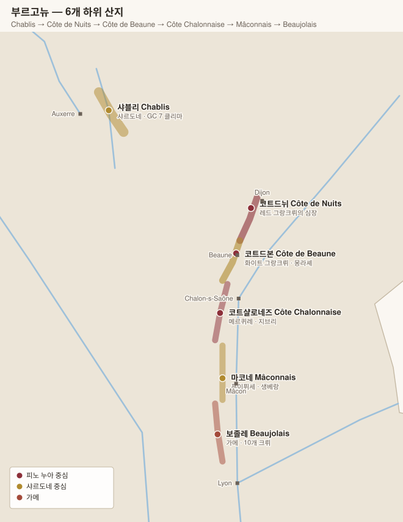
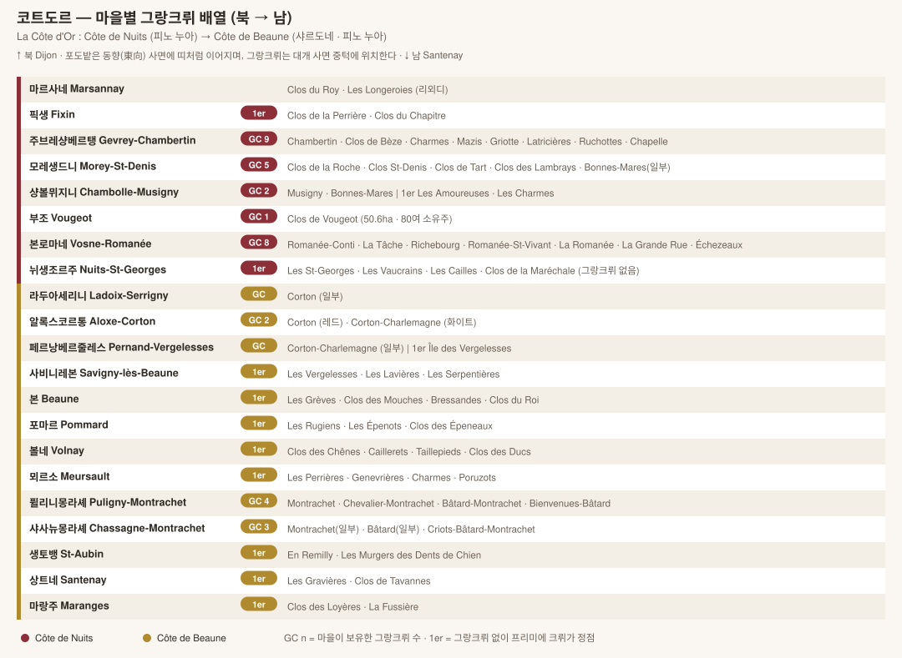

# 부르고뉴 Bourgogne

> 보르도가 "샤토(생산자)"에 등급을 주는 반면, 부르고뉴는 **밭(클리마 climat)에 등급을 준다.** 그래서 같은 밭을 여러 생산자가 나눠 갖는다.

## 1. 등급 피라미드

| 등급 | 비율 | 표기 방식 | 예시 |
|---|---|---|---|
| **그랑 크뤼 Grand Cru** | 약 1% | **밭 이름만** 표기 (마을명 없음) | `Chambertin`, `Montrachet`, `Corton` |
| **프리미에 크뤼 Premier Cru (1er)** | 약 10% | 마을명 + 밭 이름 | `Gevrey-Chambertin 1er Cru Clos St-Jacques` |
| **빌라주 Village** | 약 37% | 마을명만 | `Volnay`, `Meursault` |
| **레지오날 Régionale** | 약 52% | 광역명 | `Bourgogne Rouge`, `Bourgogne Aligoté` |

**핵심 규칙**: 라벨에 마을명이 없고 밭 이름만 있으면 그랑 크뤼다. `Chambertin`은 그랑 크뤼, `Gevrey-Chambertin`은 마을 등급.

> 마을들이 19세기에 유명한 그랑크뤼 이름을 자기 마을명에 붙였다(Gevrey → Gevrey-**Chambertin**, Puligny → Puligny-**Montrachet**). 이 때문에 헷갈리기 쉽다.

## 2. 품종과 지리

| 구분 | 내용 |
|---|---|
| 레드 | **피노 누아** (보졸레만 가메) |
| 화이트 | **샤르도네** (일부 알리고테) |
| 지형 | 남북으로 길게 이어지는 동향(東向)·남동향 석회암 사면 |
| 최적 위치 | 사면 **중턱** — 배수 좋고 표토 얇음 → 그랑 크뤼가 집중 |
| 사면 상부 | 토양 척박·서늘 → 프리미에 크뤼 또는 오트코트 |
| 사면 하부/평지 | 충적토 깊음 → 빌라주·레지오날 |

## 3. 하위 산지 6곳

| 산지 | 위치 | 주력 | 특징 |
|---|---|---|---|
| **샤블리 Chablis** | 최북단, 별도 위치 | 샤르도네 100% | 키메리지안 석회암, 날카로운 미네랄 |
| **코트드뉘 Côte de Nuits** | 디종 남쪽 | 피노 누아 | 레드 그랑크뤼 24개 중 대부분 |
| **코트드본 Côte de Beaune** | 본 주변 | 샤르도네 + 피노 누아 | 세계 최고 화이트(몽라셰·코르통샤를마뉴) |
| **코트샬로네즈 Côte Chalonnaise** | 코트드본 남쪽 | 양쪽 다 | 그랑크뤼 없음, 가성비 |
| **마코네 Mâconnais** | 더 남쪽 | 샤르도네 | 푸이퓌세, 풍만한 화이트 |
| **보졸레 Beaujolais** | 최남단 | 가메 | 행정상 부르고뉴, 스타일은 별개 |

## 4. 코트도르 전도 (Côte d'Or)

코트드뉘 + 코트드본을 합쳐 **코트도르(황금 언덕)**라 부른다. 북에서 남으로 약 50km.

## 5. 상세 문서

| 문서 | 내용 |
|---|---|
| [코트드뉘 (마을별)](02-1-cote-de-nuits.md) | 주브레샹베르탱 ~ 뉘생조르주, 그랑크뤼 24개 |
| [코트드본 (마을별)](02-2-cote-de-beaune.md) | 알록스코르통 ~ 마랑주, 그랑크뤼 8개 |
| [샤블리·샬로네즈·마코네](02-3-chablis-chalonnaise-maconnais.md) | 샤블리 그랑크뤼 7개 포함 |
| [보졸레](02-4-beaujolais.md) | 크뤼 10개 |

## 6. 도멘 vs 네고시앙

| 구분 | 의미 | 대표 |
|---|---|---|
| **Domaine** | 자기 밭에서 재배·양조 | DRC, Leroy, Armand Rousseau, Coche-Dury |
| **Maison / Négociant** | 포도·와인을 사서 양조·숙성 | Louis Jadot, Joseph Drouhin, Bouchard Père & Fils, Faiveley |
| **Micro-négoce** | 소규모 신흥 네고시앙 | Lucien Le Moine, Benjamin Leroux, Maison Chanzy |

> 최근에는 네고시앙도 자기 밭을 많이 보유하고, 유명 도멘도 네고시앙 부문을 운영해(예: Domaine Leflaive → Leflaive & Associés) 경계가 흐려졌다.

## 7. 전 부르고뉴 최상위 생산자 (교차 참조)

| 생산자 | 근거지 | 대표 와인 |
|---|---|---|
| **Domaine de la Romanée-Conti (DRC)** | 본로마네 | Romanée-Conti, La Tâche, Montrachet |
| **Domaine Leroy / Maison Leroy** | 본로마네 | Musigny, Richebourg, Chambertin |
| **Domaine Armand Rousseau** | 주브레샹베르탱 | Chambertin, Clos de Bèze, Clos St-Jacques |
| **Domaine Georges Roumier** | 샹볼뮈지니 | Musigny, Bonnes-Mares, Les Amoureuses |
| **Domaine Comte Georges de Vogüé** | 샹볼뮈지니 | Musigny Vieilles Vignes (마을 최대 소유) |
| **Domaine Dujac** | 모레생드니 | Clos de la Roche, Clos St-Denis |
| **Domaine Méo-Camuzet** | 본로마네 | Richebourg, Cros Parantoux |
| **Domaine Coche-Dury** | 뫼르소 | Meursault Perrières, Corton-Charlemagne |
| **Domaine des Comtes Lafon** | 뫼르소 | Meursault Perrières, Montrachet |
| **Domaine Leflaive** | 퓔리니몽라셰 | Chevalier-Montrachet, Les Pucelles |
| **Domaine Ramonet** | 샤사뉴몽라셰 | Montrachet, Ruchottes |
| **Domaine Raveneau / Dauvissat** | 샤블리 | Les Clos, Blanchot, Les Preuses |

---

[← 보르도](01-bordeaux.md) · [목차로](../README.md) · [다음: 코트드뉘 →](02-1-cote-de-nuits.md)
