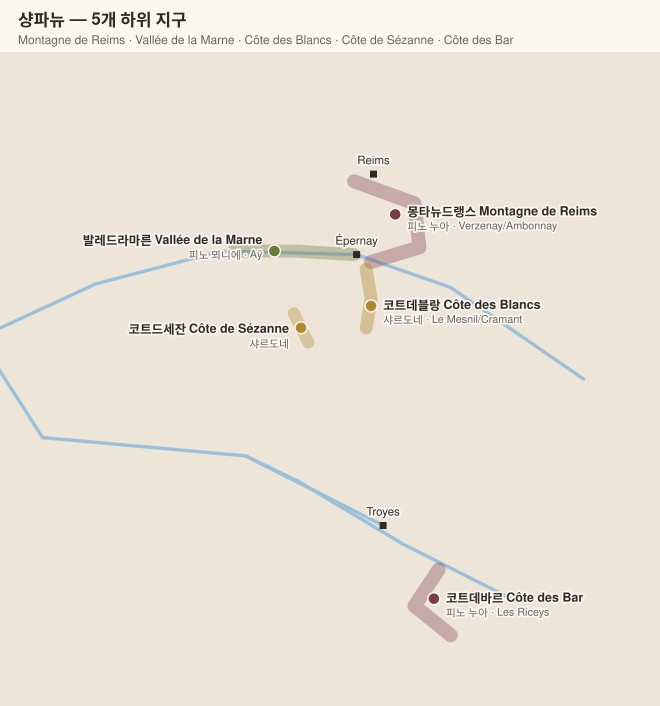

# 샹파뉴 Champagne

> 프랑스 최북단 산지. **밭이 아니라 "마을(크뤼)"에 등급을 매기는** 독특한 체계.

## 1. 기본 구조

| 항목 | 내용 |
|---|---|
| 주품종 | **샤르도네** · **피노 누아** · **피노 뫼니에** (+ 아르반, 프티 메슬리에 등 4종 소량) |
| 양조 | **전통방식(Méthode traditionnelle 메토드 트라디시오넬)** — 병내 2차 발효 |
| 최소 숙성 | 논빈티지 15개월(효모접촉 12개월) / **빈티지 36개월** |
| 등급 단위 | **마을 단위** — 에셸 데 크뤼(Échelle des Crus) 100점 척도의 잔재 |

## 2. 마을 등급 (Échelle des Crus 에셸 데 크뤼)

| 등급 | 마을 수 | 기준 |
|---|---|---|
| **그랑 크뤼 Grand Cru** | **17** | 100% |
| **프리미에 크뤼 Premier Cru** | **42** | 90~99% |
| 그 외 | 약 260 | 80~89% |

### 그랑 크뤼 17개 마을

| 지구 | 마을 | 주품종 |
|---|---|---|
| **몽타뉴드랭스 Montagne de Reims** | **Verzenay 베르즈네**, **Verzy 베르지**, **Mailly-Champagne 마이 샹파뉴**, **Bouzy 부지**, **Ambonnay 앙보네**, Louvois 루부아, Beaumont-sur-Vesle 보몽 쉬르 벨, Puisieulx 퓌지외, Sillery 실르리 | 피노 누아 |
| **발레드라마른 Vallée de la Marne** | **Aÿ 아이**, Tours-sur-Marne 투르 쉬르 마른 | 피노 누아 |
| **코트데블랑 Côte des Blancs** | **Le Mesnil-sur-Oger 르 메닐 쉬르 오제**, **Avize 아비즈**, **Cramant 크라망**, **Oger 오제**, Chouilly 슈이, Oiry 우아리 | 샤르도네 |

> 표기 규칙: 그랑크뤼 표기는 **사용한 포도가 100% 그랑크뤼 마을 것일 때만** 가능하다.

## 3. 5개 하위 지구

| 지구 | 주품종 | 성격 | 핵심 마을 |
|---|---|---|---|
| **Montagne de Reims 몽타뉴 드 랭스** | 피노 누아 | 구조·힘·붉은 과실 | Verzenay 베르즈네, Ambonnay 앙보네, Bouzy 부지, Mailly 마이 |
| **Vallée de la Marne 발레 드 라 마른** | 피노 뫼니에 | 과실 풍부, 조기 접근성 | Aÿ 아이(피노 누아), Hautvillers 오트빌레, Cumières 퀴미에르 |
| **Côte des Blancs 코트 데 블랑** | 샤르도네 | 미네랄·긴장감·장기 숙성 | Le Mesnil-sur-Oger 르 메닐 쉬르 오제, Avize 아비즈, Cramant 크라망, Vertus 베르튀(1er) |
| **Côte de Sézanne 코트 드 세잔** | 샤르도네 | 더 따뜻하고 풍만 | Sézanne 세잔, Vindey 뱅데 |
| **Côte des Bar 코트 데 바르 (오브 Aube)** | 피노 누아 | 남쪽 100km, 샤블리와 같은 키메리지안 토양 | Les Riceys 레 리세, Celles-sur-Ource 셀 쉬르 우르스 |

## 4. 스타일 분류

| 표기 | 의미 |
|---|---|
| **Blanc de Blancs 블랑 드 블랑** | 화이트 품종(샤르도네)만 |
| **Blanc de Noirs 블랑 드 누아** | 흑포도(피노 누아/뫼니에)만 |
| **Rosé d'assemblage 로제 다상블라주** | 레드 와인을 소량 블렌딩 (샹파뉴만 허용) |
| **Rosé de saignée 로제 드 세녜** | 침용 후 색을 뽑아냄. 더 진하고 구조적 |
| **NV / MV** | 논빈티지 — 하우스 스타일의 기준 |
| **Millésime 밀레짐** | 단일 빈티지 |
| **Prestige Cuvée 프레스티주 퀴베** | 최상위 라인 (Dom Pérignon 동 페리뇽, Cristal 크리스탈, Comtes de Champagne 콩트 드 샹파뉴 등) |

### 도자주(당도) 등급

| 표기 | 잔당 (g/L) |
|---|---|
| Brut Nature / Zéro Dosage 브뤼 나튀르 / 제로 도자주 | 0~3 (첨가 없음) |
| Extra Brut 엑스트라 브뤼 | 0~6 |
| **Brut 브뤼** | 0~12 (가장 일반적) |
| Extra Dry 엑스트라 드라이 | 12~17 |
| Sec 섹 | 17~32 |
| Demi-Sec 드미섹 | 32~50 |
| Doux 두 | 50 이상 |

## 5. 생산자 유형 (라벨 하단 약자)

| 약자 | 의미 | 특징 |
|---|---|---|
| **NM** Négociant-Manipulant 네고시앙 마니퓔랑 | 포도를 사서 양조 | 대형 하우스 대부분 |
| **RM** Récoltant-Manipulant 레콜탕 마니퓔랑 | 자기 밭 포도만 사용 | **그로워 샴페인**, 테루아 표현 |
| **CM** Coopérative de Manipulation 코오페라티브 드 마니퓔라시옹 | 협동조합 | |
| **RC** Récoltant-Coopérateur 레콜탕 코오페라퇴르 | 조합에 위탁, 자기 라벨 | |
| **MA** Marque d'Acheteur 마르크 다슈퇴르 | 유통사 PB | |

## 6. 주요 생산자

### 그랑드 마르크 (대형 하우스)

| 하우스 | 프레스티지 퀴베 | 스타일 |
|---|---|---|
| **Krug 크뤼그** | Grande Cuvée 그랑드 퀴베, **Clos du Mesnil 클로 뒤 메닐**, **Clos d'Ambonnay 클로 당보네** | 전 퀴베 오크 발효, 최고 복합성 |
| **Bollinger 볼랭제** | La Grande Année 라 그랑드 아네, **Vieilles Vignes Françaises 비에유 비뉴 프랑세즈** | 피노 누아·오크, 강건 |
| **Louis Roederer 루이 로드레** | **Cristal 크리스탈** | 정밀·순수, 비오디나미 전환 |
| **Moët & Chandon 모에 에 샹동** | **Dom Pérignon 동 페리뇽** | 세계 최대 하우스 |
| **Pol Roger 폴 로제** | Sir Winston Churchill 서 윈스턴 처칠 | 우아·균형 |
| **Taittinger 테탱제** | Comtes de Champagne 콩트 드 샹파뉴 (BdB) | 샤르도네 중심, 섬세 |
| **Salon 살롱** | Salon 살롱 (Le Mesnil 르 메닐 BdB 단일) | 빈티지만 생산, 극소량 |
| **Philipponnat 필리포나** | **Clos des Goisses 클로 데 구아스** | 급경사 단일밭, 샹파뉴 최초의 클로 |
| **Billecart-Salmon 비유카르 살몽** | Clos Saint-Hilaire 클로 생틸레르, Cuvée Nicolas François 퀴베 니콜라 프랑수아 | 저온 발효, 순수 |
| **Charles Heidsieck 샤를 에드시크** | Blanc des Millénaires 블랑 데 밀레네르 | 리저브 비율 높음, 풍만 |
| 그 외 | Ruinart 뤼나르(최고(最古) 하우스) · Veuve Clicquot 뵈브 클리코 · Perrier-Jouët 페리에 주에(Belle Époque 벨 에포크) · Laurent-Perrier 로랑 페리에 · Deutz 되츠 · Jacquesson 자크송 | |

### 그로워 샴페인 (RM)

| 생산자 | 마을 | 특징 |
|---|---|---|
| **Jacques Selosse 자크 셀로스** | Avize 아비즈 (GC) | 그로워 운동의 시조, 산화적·부르고뉴식 |
| **Egly-Ouriet 에글리 우리에** | Ambonnay 앙보네 (GC) | 피노 누아 밀도의 정점 |
| **Pierre Péters 피에르 페테르** | Le Mesnil 르 메닐 (GC) | Les Chétillons 레 셰티용 단일밭 BdB |
| **Agrapart & Fils 아그라파르 에 피스** | Avize 아비즈 (GC) | 테루아별 퀴베 |
| **Larmandier-Bernier 라르망디에 베르니에** | Vertus 베르튀 (1er) | 비오디나미, 저도자주 |
| **Vilmart & Cie 빌마르 에 시** | Rilly-la-Montagne 리이 라 몽타뉴 (1er) | 오크 사용, 장기 숙성형 |
| **Cédric Bouchard (Roses de Jeanne) 세드리크 부샤르 (로즈 드 잔)** | 코트데바르 | 단일 품종·단일 밭·단일 빈티지 원칙 |
| **Jérôme Prévost (La Closerie) 제롬 프레보 (라 클로즈리)** | Gueux 괴 | 피노 뫼니에 단일 |
| **Bérêche et Fils · Chartogne-Taillet · Ulysse Collin 베레슈 에 피스 · 샤르토뉴 타이예 · 윌리스 콜랭** | | 현대 그로워의 중심 |

## 7. 단일 밭(Clos) 샴페인

샹파뉴에서 밭 단위 표기는 예외적이다. 대표 사례:

| 이름 | 생산자 | 면적 |
|---|---|---|
| **Clos du Mesnil 클로 뒤 메닐** | Krug 크뤼그 | 1.85 ha (샤르도네) |
| **Clos d'Ambonnay 클로 당보네** | Krug 크뤼그 | 0.68 ha (피노 누아) |
| **Clos des Goisses 클로 데 구아스** | Philipponnat 필리포나 | 5.5 ha, 경사 45도 |
| **Clos Saint-Hilaire 클로 생틸레르** | Billecart-Salmon 비유카르 살몽 | 1 ha |
| **Clos Lanson 클로 랑송** | Lanson 랑송 | 1 ha (랭스 시내) |

## 8. 스틸 와인

| AOC | 내용 |
|---|---|
| **Coteaux Champenois 코토 샹프누아** | 샹파뉴 지역의 비발포 와인 (레드/화이트). Bouzy Rouge 부지 루주가 대표 |
| **Rosé des Riceys 로제 데 리세** | 코트데바르 Les Riceys 레 리세의 피노 누아 로제. 좋은 해에만 생산 |

---

[← 보졸레](02-4-beaujolais.md) · [목차로](../README.md) · [다음: 론 →](04-rhone.md)
