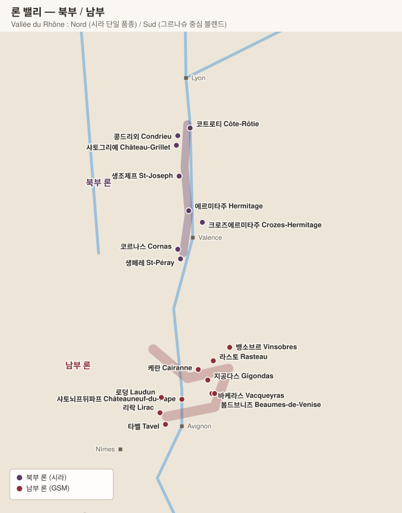

# 론 밸리 Vallée du Rhône

> 북부와 남부는 사실상 다른 산지다. 북부는 **시라 단일 품종**의 급경사 사면, 남부는 **그르나슈 중심 블렌드**의 넓은 자갈 평원.

| 구분 | 북부 Rhône Septentrional | 남부 Rhône Méridional |
|---|---|---|
| 면적 | 전체의 약 5% | 약 95% |
| 기후 | 대륙성 (한랭) | 지중해성 (건조·고온) |
| 레드 품종 | **시라 100%** (비오니에 소량 혼합 허용) | **그르나슈** + 무르베드르 + 시라 (GSM) |
| 화이트 품종 | 비오니에 / 마르산 · 루산 | 그르나슈 블랑, 클레레트, 부르불랑, 루산 |
| 지형 | 화강암 급경사 계단식 사면 | 갈레 룰레(둥근 자갈) 평원 |
| 바람 | 미스트랄 | 미스트랄 |

---

# 북부 론 — 8개 AOC

## 1. 코트로티 Côte-Rôtie

"구운 언덕". 경사 최대 60도의 계단식 사면. **시라 + 비오니에 최대 20% 공동 발효 허용**(실제로는 보통 5% 이하).

| 구역 | 토양 | 성격 |
|---|---|---|
| **Côte Brune** | 편암 + 산화철 (짙은 색) | 구조적·장수 |
| **Côte Blonde** | 편마암 + 석회질 (밝은 색) | 향기롭고 우아 |

| 주요 리외디 | 생산자 |
|---|---|
| **La Mouline** (Blonde) · **La Landonne** (Brune) · **La Turque** | **E. Guigal** — "라라(La La)" 3부작 |
| **Côte Brune** | **Jamet**, René Rostaing |
| **La Landonne** | Rostaing, Delas |
| Les Grandes Places, Côte Rozier, Chavaroche | Clusel-Roch, Jean-Michel Gérin, Bernard Levet |

**핵심 생산자**: **E. Guigal** · **Domaine Jamet** · **René Rostaing** · Clusel-Roch · Stéphane Ogier · Bernard Levet · Jean-Michel Gérin

## 2. 콩드리외 Condrieu & 샤토그리예 Château-Grillet

| AOC | 내용 |
|---|---|
| **Condrieu** | **비오니에 100%**. 살구·인동꽃·낮은 산도. 대개 어릴 때 마심 |
| **Château-Grillet** | **3.5 ha 단일 도멘 AOC**(모노폴). 아르테미스(피노 그룹) 소유 |

| 주요 리외디 | 생산자 |
|---|---|
| **Coteau de Vernon** | **Georges Vernay** (콩드리외를 구해낸 도멘) |
| Chéry, Côte Chatillon | **André Perret**, **Yves Cuilleron** |
| La Doriane | E. Guigal |

## 3. 생조제프 Saint-Joseph

론 서안을 따라 남북 50km로 길게 이어져 품질 편차가 크다. 북쪽(Tournon 인근) 화강암 구간이 최상.

| 주요 리외디 | 생산자 |
|---|---|
| **Les Granits** | **M. Chapoutier** |
| Sainte-Épine | **Domaine Gonon**, Jean-Louis Chave |
| Le Clos, Les Oliviers | Coursodon, André Perret |

**핵심 생산자**: **Pierre Gonon** · **Jean-Louis Chave** · Chapoutier · Coursodon · Guigal(Vignes de l'Hospice)

## 4. 에르미타주 Hermitage

**북부 론의 정점**. 남향 화강암 언덕 단 136 ha. 레드(시라) + 화이트(마르산·루산).

| 클리마 (리외디) | 토양 | 역할 |
|---|---|---|
| **Les Bessards** | 화강암 | 뼈대·탄닌. 최상급 블렌드의 중심 |
| **Le Méal** | 자갈·석회 | 살집·풍만함 |
| **L'Hermite** | 뢰스·화강암 | 정상부, 섬세함 |
| **Les Greffieux** | 점토 | 향기·부드러움 |
| **Les Rocoules** | 점토석회 | **화이트 최상급** |
| Péléat, Beaume, Diognières, Maison Blanche | | |

| 와인 | 생산자 |
|---|---|
| **Hermitage Rouge / Blanc** | **Jean-Louis Chave** (여러 리외디 블렌드의 교과서) |
| **La Chapelle** | **Paul Jaboulet Aîné** |
| **Le Pavillon · L'Ermite · Le Méal · De l'Orée** | **M. Chapoutier** (단일 리외디 시리즈) |
| **Les Bessards** | Delas Frères |
| | Domaine Marc Sorrel, Ferraton Père et Fils |

> **뱅드파유(Vin de Paille)**: 에르미타주의 희귀 짚 건조 스위트 화이트. Chave, Chapoutier가 좋은 해에만 생산.

## 5. 크로즈에르미타주 Crozes-Hermitage

북부 론 최대 AOC(약 1,700 ha). 에르미타주 언덕을 둘러싼 평지·사면. 가성비 진입점.

**핵심 생산자**: **Alain Graillot**(La Guiraude) · Domaine Combier · Paul Jaboulet Aîné(Domaine de Thalabert) · Yann Chave · Domaine Belle

## 6. 코르나스 Cornas

"불에 탄 땅". 남향 화강암 원형 계곡. **시라 100%만 허용**(화이트 없음). 젊을 때 거칠고 야성적이나 장수한다.

| 주요 리외디 | 생산자 |
|---|---|
| **Reynard** | **Thierry Allemand**, Auguste Clape |
| **Chaillot** | Thierry Allemand |
| **Les Ruchets** | Jean-Luc Colombo |
| La Côte, Les Mazards | Vincent Paris, Alain Voge |

**핵심 생산자**: **Auguste Clape**(코르나스의 상징) · **Thierry Allemand** · Vincent Paris · Alain Voge · Jean-Luc Colombo

## 7. 생페레 Saint-Péray

마르산·루산의 화이트 전용 AOC. 스틸과 **전통방식 스파클링** 모두 생산.
**생산자**: Auguste Clape, Alain Voge, Chapoutier, Domaine du Tunnel

---

# 남부 론

## 8. 샤토뇌프뒤파프 Châteauneuf-du-Pape

프랑스 **최초의 AOC(1936)**. 아비뇽 교황청의 여름 별궁에서 유래.

| 항목 | 내용 |
|---|---|
| 면적 | 약 3,200 ha |
| 허용 품종 | **13종**(변종 포함 18종) — 그르나슈, 시라, 무르베드르, 생소, 쿠누아즈, 바카레즈, 뮈스카르댕, 픽풀, 테레 누아, 클레레트, 부르불랑, 루산, 피카르당 |
| 토양 | **갈레 룰레(galets roulés)** — 낮에 열을 저장했다 밤에 방출 / 사암 / 모래 / 붉은 점토 |
| 규정 | **관개 금지**, 수확량 엄격 제한, **손 수확 의무**, 미숙과 선별(triage) 의무 |
| 화이트 | 전체의 약 6%, 희소하지만 우수 |

| 주요 리외디 | 생산자 |
|---|---|
| **La Crau** | **Vieux Télégraphe** (갈레 룰레의 교과서) |
| **Le Clos / Pignan** (모래 토양) | **Château Rayas** (그르나슈 100%, 전설적) |
| Les Cailloux | Lucien et André Brunel |
| Chapouin, La Gardine | Château de la Gardine |
| Les Bosquets, Le Grand Pierre | Domaine des Bosquets |

**핵심 생산자**

| 생산자 | 특징 |
|---|---|
| **Château Rayas** | 모래 토양·그르나슈 100%. 부르고뉴 같은 섬세함 |
| **Château de Beaucastel** | 13품종 전부 사용, 무르베드르 비율 높음. Hommage à Jacques Perrin |
| **Domaine du Vieux Télégraphe** | La Crau 단일 구역 |
| **Clos des Papes** | 블렌딩의 균형미 |
| **Henri Bonneau** | Réserve des Célestins, 극소량·전통주의 |
| **Domaine du Pégaü** | Cuvée da Capo |
| Domaine de la Janasse · Charvin · Clos Saint Jean · Roger Sabon · Château La Nerthe · Le Vieux Donjon | |

## 9. 크뤼 (마을 등급 AOC)

| AOC | 색 | 특징 | 생산자 |
|---|---|---|---|
| **지공다스 Gigondas** | 레드·로제 | 당텔 드 몽미라이 석회암 절벽 아래. 샤토뇌프보다 신선·구조적 | **Château de Saint Cosme**, Domaine Santa Duc, Domaine les Pallières |
| **바케라스 Vacqueyras** | 레드 중심 | 더 따뜻하고 향신료 | Sang des Cailloux, Domaine la Monardière |
| **라스토 Rasteau** | 레드 + **VDN** | 주정강화 스위트도 생산 | Domaine Gourt de Mautens, Domaine la Soumade |
| **케란 Cairanne** | 레드 | 2016년 크뤼 승격 | **Domaine Marcel Richaud**, Domaine Alary |
| **뱅소브르 Vinsobres** | 레드 | 고도 높아 서늘 | Domaine Jaume, Perrin |
| **본파스토르 Beaumes-de-Venise** | 레드 + **Muscat VDN** | 뮈스카 주정강화가 더 유명 | Domaine de Durban |
| **리락 Lirac** | 3색 | 강 서안, 샤토뇌프의 저렴한 대안 | Domaine de la Mordorée |
| **타벨 Tavel** | **로제만** | 프랑스 유일의 로제 전용 AOC. 진하고 구조적, 숙성 가능 | Château d'Aquéria, Domaine de la Mordorée |
| **뱅티다 Vinsobres · Laudun · Sainte-Cécile** | | 최근 승격/신설 | |

## 10. 광역 및 주변 AOC

| AOC | 내용 |
|---|---|
| **Côtes du Rhône Villages** | 22개 마을명 표기 가능 (Plan de Dieu, Séguret, Sablet, Visan 등) |
| **Côtes du Rhône** | 광역. 전체 생산량의 절반 |
| **Ventoux · Luberon** | 동쪽 고지대. 서늘하고 가벼움, 가성비 |
| **Costières de Nîmes** | 남서쪽. 행정상 랑그독이었다가 론으로 편입 |
| **Grignan-les-Adhémar** | 북·남 사이 전이 지대 |
| **Clairette de Die** | 전통방식 세미스위트 스파클링 (뮈스카 + 클레레트) |

## 11. 주정강화 와인 (VDN, Vin Doux Naturel)

| AOC | 품종 | 스타일 |
|---|---|---|
| **Muscat de Beaumes-de-Venise** | 뮈스카 | 오렌지·꽃, 화이트 스위트 |
| **Rasteau** | 그르나슈 | 레드·로제·화이트, 산화 숙성 시 랑시오 |

---

[← 샹파뉴](03-champagne.md) · [목차로](../README.md) · [다음: 루아르 →](05-loire.md)
