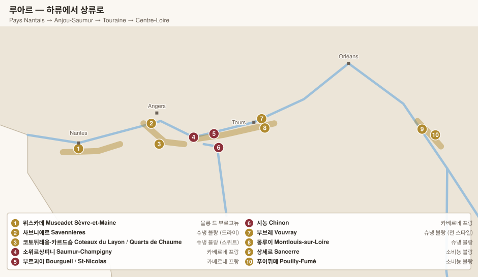

# 루아르 Loire

> 프랑스에서 가장 긴 와인 산지(약 1,000 km). 하나의 강을 따라 **품종·기후·스타일이 완전히 달라진다.**

| 지구 | 위치 | 주품종 | 기후 |
|---|---|---|---|
| **페이낭테 Pays Nantais** | 대서양 하구 | 믈롱 드 부르고뉴 | 해양성 |
| **앙주소뮈르 Anjou-Saumur** | 앙제~소뮈르 | 슈냉 블랑 · 카베르네 프랑 | 해양성 (온화) |
| **투렌 Touraine** | 투르 일대 | 슈냉 블랑 · 카베르네 프랑 | 전이 지대 |
| **상트르루아르 Centre-Loire** | 상류 (부르고뉴 근접) | 소비뇽 블랑 · 피노 누아 | 대륙성 |

<!-- toc -->
## 목차

- [품종 Cépages 세파주](#품종-cépages-세파주)
  - [강을 따라가는 품종 지도](#강을-따라가는-품종-지도)
  - [화이트 품종](#화이트-품종)
  - [레드 품종](#레드-품종)
  - [AOC별 품종 규정](#aoc별-품종-규정)
- [1. 페이낭테 Pays Nantais](#1-페이낭테-pays-nantais)
  - [뮈스카데 Muscadet](#뮈스카데-muscadet)
- [2. 앙주소뮈르 Anjou-Saumur](#2-앙주소뮈르-anjou-saumur)
  - [2-1. 사브니에르 Savennières — 드라이 슈냉의 정점](#2-1-사브니에르-savennières--드라이-슈냉의-정점)
  - [2-2. 스위트 슈냉 (레용 계곡)](#2-2-스위트-슈냉-레용-계곡)
  - [2-3. 소뮈르 & 소뮈르샹피니 — 카베르네 프랑](#2-3-소뮈르--소뮈르샹피니--카베르네-프랑)
- [3. 투렌 Touraine](#3-투렌-touraine)
  - [3-1. 부브레 Vouvray & 몽루이 Montlouis — 슈냉 블랑의 전 스타일](#3-1-부브레-vouvray--몽루이-montlouis--슈냉-블랑의-전-스타일)
  - [3-2. 시농 Chinon · 부르괴이 Bourgueil — 카베르네 프랑](#3-2-시농-chinon--부르괴이-bourgueil--카베르네-프랑)
  - [3-3. 그 외 투렌](#3-3-그-외-투렌)
- [4. 상트르루아르 Centre-Loire — 소비뇽 블랑](#4-상트르루아르-centre-loire--소비뇽-블랑)
  - [4-1. 상세르 Sancerre](#4-1-상세르-sancerre)
  - [4-2. 푸이퓌메 Pouilly-Fumé](#4-2-푸이퓌메-pouilly-fumé)
  - [4-3. 위성 산지](#4-3-위성-산지)
- [5. 크레망 드 루아르 Crémant de Loire](#5-크레망-드-루아르-crémant-de-loire)

<!-- /toc -->

---

# 품종 Cépages 세파주

> 루아르는 **하나의 강을 따라 품종이 릴레이하듯 바뀐다.** 하구의 믈롱에서 시작해 슈냉과 카베르네 프랑을 거쳐 상류의 소비뇽 블랑으로 끝난다. 프랑스에서 품종 지도가 가장 명확하게 강을 따라가는 산지다.

## 강을 따라가는 품종 지도

| 위치 | 지구 | 화이트 | 레드 |
|---|---|---|---|
| 하구 (대서양) | **Pays Nantais 페이낭테** | **Melon de Bourgogne 믈롱 드 부르고뉴** | – |
| 중하류 | **Anjou-Saumur 앙주소뮈르** | **Chenin Blanc 슈냉 블랑** | **Cabernet Franc 카베르네 프랑** |
| 중류 | **Touraine 투렌** | **Chenin Blanc** | **Cabernet Franc** |
| 상류 (내륙) | **Centre-Loire 상트르루아르** | **Sauvignon Blanc 소비뇽 블랑** | **Pinot Noir 피노 누아** |

---

## 화이트 품종

### Chenin Blanc 슈냉 블랑 — 루아르의 심장

세계에서 **가장 스타일 폭이 넓은 백포도**다. 같은 품종으로 극드라이·세미스위트·귀부 스위트·스파클링을 모두 만든다.

| 항목 | 내용 |
|---|---|
| 향 | **모과·마르멜로·사과**, 카모마일, 밀랍, 젖은 짚. 숙성하면 **꿀·건살구·생강** |
| 구조 | **산도가 극단적으로 높다** — 잘 익어도 산이 남는다. 이것이 스위트 와인이 늘어지지 않는 이유 |
| 재배 | **불균일하게 익는다.** 한 송이 안에서도 익은 알과 덜 익은 알이 섞여, **여러 차례 나눠 손 수확(tries 트리)**해야 한다 |
| 귀부 | 껍질이 얇아 **귀부균(botrytis 보트리티스)이 잘 붙는다** → 카르 드 숌·보느조 |
| 숙성 | 드라이도 20~50년 간다. 어릴 때 닫혀 있고 중간에 침묵기가 있다 |

> **한 품종으로 전 스타일을 만드는 이유** — 슈냉은 산도가 워낙 높아서, 당이 남아도 균형이 무너지지 않는다. 그래서 그해 날씨에 따라 **드라이로 갈지 스위트로 갈지 수확 시점에 결정**할 수 있다. Vouvray 부브레의 라벨에 Sec·Demi-Sec·Moelleux가 해마다 달라지는 이유다.

| 표기 | 잔당 | 예 |
|---|---|---|
| **Sec 섹** | ~8 g/L | Savennières 사브니에르, Vouvray Sec |
| **Demi-Sec 드미섹** | 8~25 g/L | Vouvray, Montlouis |
| **Moelleux 무알뢰** | 25~45 g/L | Vouvray Moelleux |
| **Doux / 귀부** | 45 g/L~ | Quarts de Chaume 카르 드 숌, Bonnezeaux 보느조, Coteaux du Layon |
| **Pétillant / Mousseux** | – | Vouvray·Montlouis·Crémant de Loire |

### Sauvignon Blanc 소비뇽 블랑 — 상트르루아르의 얼굴

| 항목 | 내용 |
|---|---|
| 향 | 자몽·라임, **회양목(buis 뷔이)**, 쐐기풀, **부싯돌·화약(pierre à fusil 피에르 아 퓌지)** |
| 구조 | 산도 높고 알코올 중간. 향이 강해 오크를 거의 쓰지 않는다 |
| 토양 반응 | **소비뇽 블랑은 토양을 잘 드러낸다** — 상세르의 세 토양이 세 가지 다른 와인을 만든다 (아래 참조) |
| 뉴질랜드와 차이 | 말버러가 열대과일·패션프루트라면, 루아르는 **광물성·연기·회양목**이 앞선다 |

| 상세르의 토양 | 성격 |
|---|---|
| **Terres Blanches 테르 블랑슈** (키메리지안 이회토) | 묵직·구조적, 숙성형. 샤블리와 같은 지층 |
| **Caillottes 카요트** (석회암 자갈) | 화사·아로마틱, 조기 음용 |
| **Silex 실렉스** (부싯돌) | **연기·화약 냄새**, 긴장감 |

### Melon de Bourgogne 믈롱 드 부르고뉴 — 뮈스카데

원래 부르고뉴 품종이었으나 1709년 대혹한 이후 **추위에 강한 품종**으로 낭트 일대에 대량 식재되었다.

| 항목 | 내용 |
|---|---|
| 향 | **향이 옅다** — 감귤·풋사과·바다내음 정도 |
| 구조 | **알코올 낮고(11~12%) 산도 높다.** 짠맛이 돈다 |
| **Sur lie 쉬르 리** | 겨우내 죽은 효모 앙금 위에서 숙성 후 걸러내지 않고 병입. **질감과 미세한 탄산**을 얻는다. 이것이 뮈스카데의 정체성 |
| 재평가 | **Crus Communaux 크뤼 코뮈노**(클리송·고르주·르 팔레 등)는 앙금 숙성 **17~24개월 이상**을 의무화해, 10년 이상 숙성하는 와인을 만든다 |

### 그 밖의 화이트

| 품종 | 위치 | 성격 |
|---|---|---|
| **Chardonnay 샤르도네** | 투렌·크레망 | 블렌딩용 |
| **Romorantin 로모랑탱** | **Cour-Cheverny 쿠르 슈베르니** | 세계에서 이 AOC에만 남은 품종. 산도 극단적, 숙성형 |
| **Folle Blanche 폴 블랑슈** (Gros Plant) | 페이낭테 | 산도 매우 높은 일상주 |
| **Chasselas 샤슬라** | **Pouilly-sur-Loire 푸이 쉬르 루아르** | 푸이퓌메와 같은 마을의 다른 AOC |

---

## 레드 품종

### Cabernet Franc 카베르네 프랑 — 루아르 레드의 전부

보르도에서는 조연이지만 루아르에서는 주역이다. 서늘한 기후에서 **완숙하는 유일한 보르도계 흑포도**이기 때문이다.

| 항목 | 내용 |
|---|---|
| 향 | **제비꽃·라즈베리**, **연필심·흑연**, 마른 허브. 덜 익으면 피망 |
| 구조 | 색 중간, 탄닌 부드럽고 **산도 높다**. 알코올 12~13%로 낮은 편 |
| 서빙 | **살짝 차게(14~16℃)** 마시는 것이 전통 |
| 토양 반응 | 자갈이냐 석회암이냐에 따라 성격이 크게 갈린다 (아래) |

| 토양 | 위치 | 스타일 |
|---|---|---|
| **자갈 단구(graviers 그라비에)** | 강가 평지 | 가볍고 과실 중심, **조기 음용** |
| **튀포 석회암 사면(tuffeau 튀포)** | 언덕 사면 | **구조적·미네랄, 20~40년 숙성** |

> **튀포(tuffeau)**는 백악질 사암으로, 이 지역 성(城)들의 건축 석재이기도 하다. 채석한 굴이 그대로 와인 셀러가 되었다.

### 그 밖의 레드

| 품종 | 위치 | 성격 |
|---|---|---|
| **Gamay 가메** | 투렌 | 가볍고 신선. 앙주 가메 |
| **Grolleau 그롤로** | 앙주 | **Rosé d'Anjou 로제 당주**의 주력. 색이 옅고 산도가 좋다 |
| **Pineau d'Aunis 피노 도니** | 투렌·코토 뒤 루아르 | **후추 향이 극단적으로 강한** 희귀 품종. 재평가 중 |
| **Côt 코 (= Malbec 말벡)** | 투렌 | 색이 진하고 자두 향 |
| **Pinot Noir 피노 누아** | 상세르·므네투살롱 | 상세르 생산량의 약 20%. 온난화로 품질 급상승 |
| **Cabernet Sauvignon 카베르네 소비뇽** | 앙주 | 보조. 익지 않는 해가 많다 |

---

## AOC별 품종 규정

| AOC | 품종 |
|---|---|
| **Muscadet 뮈스카데** (4개) | **믈롱 드 부르고뉴 100%** |
| **Savennières 사브니에르 · Coulée de Serrant** | **슈냉 블랑 100%** (드라이) |
| **Quarts de Chaume 카르 드 숌 · Bonnezeaux · Coteaux du Layon** | **슈냉 블랑 100%** (귀부 스위트) |
| **Vouvray 부브레 · Montlouis 몽루이** | **슈냉 블랑 100%** (전 스타일) |
| **Saumur-Champigny 소뮈르샹피니** | **카베르네 프랑** (카베르네 소비뇽 15%까지) |
| **Chinon 시농 · Bourgueil 부르괴이 · St-Nicolas** | **카베르네 프랑** (카베르네 소비뇽 10%까지) |
| **Sancerre 상세르 · Pouilly-Fumé 푸이퓌메** | **소비뇽 블랑 100%** / 상세르 레드·로제는 **피노 누아 100%** |
| **Menetou-Salon · Quincy · Reuilly** | 소비뇽 블랑 / 뢰이는 **피노 그리 로제**도 |
| **Cour-Cheverny 쿠르 슈베르니** | **로모랑탱 100%** |
| **Crémant de Loire 크레망 드 루아르** | 슈냉 블랑 중심 + 샤르도네·카베르네 프랑 |

---

# 1. 페이낭테 Pays Nantais

## 뮈스카데 Muscadet

| 항목 | 내용 |
|---|---|
| 품종 | **믈롱 드 부르고뉴 (Melon de Bourgogne 믈롱 드 부르고뉴)** |
| 스타일 | 가볍고 짠맛, 알코올 낮음. 굴과의 페어링이 고전 |
| **Sur lie 쉬르 리** | 겨우내 효모 앙금 위에서 숙성 후 바로 병입. 질감과 미세한 탄산 |

### 하위 AOC와 크뤼 코뮈노(Crus Communaux 크뤼 코뮈노)

| AOC | 내용 |
|---|---|
| **Muscadet Sèvre et Maine 뮈스카데 세브르 에 멘** | 전체의 약 80%, 최고 품질 구역 |
| Muscadet Côtes de Grandlieu / Coteaux de la Loire 뮈스카데 코트 드 그랑리외 / 코토 드 라 루아르 | 소규모 |
| Muscadet 뮈스카데 | 광역 |

**크뤼 코뮈노** — 장기 숙성(최소 17~24개월 이상 앙금 숙성)을 의무화한 마을 단위 최상위 등급:

**Clisson 클리송**(화강암, 24개월) · **Gorges 고르주**(편암, 24개월) · **Le Pallet 르 팔레**(17개월) · Goulaine 굴렌 · Monnières-Saint Fiacre 모니에르 생 피아크르 · Mouzillon-Tillières 무지용 티이에르 · Château-Thébaud 샤토 테보 · La Haye-Fouassière 라 에 푸아시에르 · Vallet 발레 · Champtoceaux 샹토소

**핵심 생산자**: **Domaine de la Pépière 도멘 드 라 페피에르**(Marc Ollivier 마르크 올리비에) · **Luneau-Papin 뤼노 파팽** · **Jo Landron 조 랑드롱** · Domaine de l'Ecu 도멘 드 레퀴 · Vincent Caillé 뱅상 카이예

---

# 2. 앙주소뮈르 Anjou-Saumur

## 2-1. 사브니에르 Savennières — 드라이 슈냉의 정점

편암·화산암 급경사 남향 사면. 약 150 ha.

| AOC / 밭 | 면적 | 생산자 |
|---|---|---|
| **Coulée de Serrant 쿨레 드 세랑** | 7 ha, **단독 소유 AOC** | **Nicolas Joly 니콜라 졸리** (비오디나미의 상징적 인물) |
| **Savennières-Roche aux Moines 사브니에르 로슈 오 무안** | 33 ha, 별도 AOC | Château de Chamboureau 샤토 드 샹부로, Domaine aux Moines 도멘 오 무안 |
| **Clos du Papillon 클로 뒤 파피용** | | **Domaine des Baumard 도멘 데 보마르**, Château d'Epiré 샤토 데피레 |
| Savennières 사브니에르 | 광역 | **Eric Morgat 에리크 모르가**, Damien Laureau 다미앵 로로, Thibaud Boudignon 티보 부디뇽 |

## 2-2. 스위트 슈냉 (레용 계곡)

가을 안개로 **귀부(botrytis 보트리티스)**가 생기는 레용 강 유역.

| AOC | 등급 | 생산자 |
|---|---|---|
| **Quarts de Chaume Grand Cru 카르 드 숌 그랑 크뤼** | **루아르 유일의 그랑크뤼**(약 30 ha) | **Domaine des Baumard 도멘 데 보마르**, Château Pierre-Bise 샤토 피에르 비즈, Domaine du Petit Metris 도멘 뒤 프티 메트리 |
| **Chaume Premier Cru 숌 프리미에 크뤼** | 1er 등급 | Château Pierre-Bise 샤토 피에르 비즈 |
| **Bonnezeaux 보느조** | 상위 하위 명칭 | **Château de Fesles 샤토 드 페슬**, Domaine des Petits Quarts 도멘 데 프티 카르 |
| **Coteaux du Layon 코토 뒤 레용** | 6개 마을명 표기 가능 (Beaulieu 볼리외, Faye 페, Rablay 라블레, Rochefort 로슈포르, St-Aubin-de-Luigné 생토뱅 드 뤼녜, St-Lambert-du-Lattay 생랑베르 뒤 라테) | Domaine Ogereau 도멘 오제로, Patrick Baudouin 파트리크 보두앵 |
| **Coteaux de l'Aubance 코토 드 로방스** | 소규모 | Domaine Richou 도멘 리슈, Château de Bois-Brinçon 샤토 드 부아 브랭송 |

## 2-3. 소뮈르 & 소뮈르샹피니 — 카베르네 프랑

**튀포(tuffeau 튀포)** 백색 석회암 위에서 자란 카베르네 프랑. 연필심·제비꽃·붉은 과실.

| AOC | 생산자 |
|---|---|
| **Saumur-Champigny 소뮈르샹피니** | **Clos Rougeard 클로 루자르**(전설적 — Les Poyeux 레 푸아외, Le Bourg 르 부르) · **Thierry Germain (Roches Neuves) 티에리 제르맹 (로슈 뇌브)** · Château Yvonne 샤토 이본 · Domaine Filliatreau 도멘 필리아트로 · Antoine Sanzay 앙투안 상제 |
| **Saumur Blanc / Rouge 소뮈르 블랑 / 루주** | Château de Villeneuve 샤토 드 빌뇌브, Domaine Guiberteau 도멘 기베르토 |
| **Saumur Brut / Crémant de Loire 소뮈르 브뤼 / 크레망 드 루아르** | Bouvet-Ladubay 부베 라뒤베, Langlois-Château 랑글루아 샤토 |
| **Anjou-Villages / Anjou-Villages Brissac 앙주 빌라주 / 앙주 빌라주 브리삭** | Domaine de Bablut 도멘 드 바블뤼, Château Soucherie 샤토 수슈리 |

---

# 3. 투렌 Touraine

## 3-1. 부브레 Vouvray & 몽루이 Montlouis — 슈냉 블랑의 전 스타일

같은 품종으로 **드라이부터 스위트, 스파클링까지** 모두 만든다. 빈티지 조건에 따라 그해 스타일을 결정.

| 표기 | 잔당 |
|---|---|
| **Sec 섹** | 드라이 |
| **Demi-Sec 드미섹** | 세미스위트 |
| **Moelleux 무알뢰** | 스위트 |
| **Pétillant / Mousseux 페티양 / 무쇠** | 약발포 / 발포 |

| AOC | 주요 밭 | 생산자 |
|---|---|---|
| **Vouvray 부브레** | **Le Haut-Lieu 르 오리외**, **Le Mont 르 몽**, **Clos du Bourg 클로 뒤 부르** (Huet 위에의 3대 밭) | **Domaine Huet 도멘 위에** · **Domaine du Clos Naudin (Philippe Foreau) 도멘 뒤 클로 노댕 (필리프 포로)** · Vincent Carême 뱅상 카렘 · François Chidaine 프랑수아 시덴 |
| **Montlouis-sur-Loire 몽루이 쉬르 루아르** | Les Choisilles 레 슈아지유, Clos Habert 클로 아베르 | **François Chidaine 프랑수아 시덴** · **Jacky Blot (Domaine de la Taille aux Loups) 자키 블로 (도멘 드 라 타유 오 루)** · Stéphane Cossais 스테판 코세 |
| **Jasnières / Coteaux du Loir 자니에르 / 코토 뒤 루아르** | 북쪽 극한지, 희소 | Domaine de Bellivière 도멘 드 벨리비에르 |

## 3-2. 시농 Chinon · 부르괴이 Bourgueil — 카베르네 프랑

| 토양 | 스타일 |
|---|---|
| **자갈 단구(graviers 그라비에)** — 강가 평지 | 가볍고 과실 중심, 조기 음용 |
| **튀포 석회암 사면(coteaux 코토)** | 구조적·장기 숙성 |

| AOC | 생산자 |
|---|---|
| **Chinon 시농** | **Charles Joguet 샤를 조게**(Clos de la Dioterie 클로 드 라 디오트리) · **Bernard Baudry 베르나르 보드리**(Le Clos Guillot 르 클로 기요, La Croix Boissée 라 크루아 부아세) · **Philippe Alliet 필리프 알리에** · Olga Raffault 올가 라포 |
| **Bourgueil 부르괴이** | **Yannick Amirault 야니크 아미로** · **Catherine et Pierre Breton 카트린 에 피에르 브르통** · **Domaine de la Butte 도멘 드 라 뷔트**(Jacky Blot 자키 블로) |
| **Saint-Nicolas-de-Bourgueil 생니콜라 드 부르괴이** | 모래 많음, 더 가벼움 — Yannick Amirault 야니크 아미로, Frédéric Mabileau 프레데리크 마빌로 |

## 3-3. 그 외 투렌

| AOC | 내용 |
|---|---|
| **Touraine 투렌** | 소비뇽 블랑 중심 광역. 상세르의 저렴한 대안 |
| **Touraine-Amboise / Touraine-Mesland 투렌 앙부아즈 / 투렌 멜랑** | 코 드 부르고뉴(말벡) 등 토착품종 |
| **Cheverny / Cour-Cheverny 슈베르니 / 쿠르 슈베르니** | Cour-Cheverny 쿠르 슈베르니는 희귀 품종 **로모랑탱** 단일 |

---

# 4. 상트르루아르 Centre-Loire — 소비뇽 블랑

## 4-1. 상세르 Sancerre

토양에 따라 스타일이 뚜렷이 갈린다.

| 토양 | 특징 | 위치 |
|---|---|---|
| **Terres Blanches 테르 블랑슈** (키메리지안 이회토) | 묵직·구조적, 숙성형 | 서쪽 (Chavignol 샤비뇰) |
| **Caillottes 카요트** (석회암 자갈) | 화사·아로마틱, 조기 음용 | 중앙 (Bué 뷔에) |
| **Silex 실렉스** (부싯돌) | 연기·화약 냄새, 미네랄 | 동쪽 (강 인접) |

| 주요 밭 (리외디) | 생산자 |
|---|---|
| **Les Monts Damnés 레 몽 담네** (Chavignol 샤비뇰) | **François Cotat 프랑수아 코타**, **Pascal Cotat 파스칼 코타**, Gérard Boulay 제라르 불레 |
| **Clos la Néore 클로 라 네오르** | **Edmond Vatan 에드몽 바탕** (컬트) |
| **Le Cul de Beaujeu 르 퀼 드 보죄** | François Cotat 프랑수아 코타, Boulay 불레 |
| **Clos du Chêne Marchand 클로 뒤 셴 마르샹** (Bué 뷔에) | Vincent Pinard 뱅상 피나르, Lucien Crochet 뤼시앵 크로셰 |
| **La Grande Côte 라 그랑드 코트** | Cotat 코타, Alphonse Mellot 알퐁스 멜로 |

**핵심 생산자**: **Edmond Vatan 에드몽 바탕** · **François & Pascal Cotat 파스칼 코타** · **Alphonse Mellot 알퐁스 멜로**(La Moussière 라 무시에르, Génération XIX 제네라시옹 디즈뇌프) · Vincent Pinard 뱅상 피나르 · Gérard Boulay 제라르 불레 · Claude Riffault 클로드 리포 · Henri Bourgeois 앙리 부르주아

> 상세르는 **피노 누아 레드·로제**도 생산하며(약 20%), 온난화로 품질이 크게 향상되었다.

## 4-2. 푸이퓌메 Pouilly-Fumé

강 건너편. 부싯돌(silex 실렉스) 비율이 높아 **훈연향(fumé 퓌메)**이 이름의 유래.

| 생산자 | 대표 와인 |
|---|---|
| **Didier Dagueneau 디디에 다그노** | **Silex 실렉스**, **Pur Sang 퓌르 상**, Buisson Renard 뷔송 르나르 — 소비뇽 블랑의 한계를 바꾼 인물 |
| Serge Dagueneau et Filles 세르주 다그노 에 피유 | |
| Jonathan Pabiot 조나탕 파비오, Château de Tracy 샤토 드 트라시, Alexandre Bain 알렉상드르 뱅 | |

> **Pouilly-sur-Loire 푸이 쉬르 루아르**는 같은 마을에서 **샤슬라** 품종으로 만든 별개의 AOC.

## 4-3. 위성 산지

| AOC | 내용 | 생산자 |
|---|---|---|
| **Menetou-Salon 므네투 살롱** | 상세르 서쪽, 같은 토양에 절반 가격 | Henry Pellé 앙리 펠레, Domaine de Chatenoy 도멘 드 샤트누아 |
| **Quincy 캥시** | 모래·자갈, 가볍고 향기로움 | Domaine Mardon 도멘 마르동 |
| **Reuilly 뢰이** | 소비뇽 + 피노 그리 로제 | Claude Lafond 클로드 라퐁 |
| **Coteaux du Giennois 코토 뒤 지에누아** | 최북단 | |

---

# 5. 크레망 드 루아르 Crémant de Loire

슈냉 블랑 중심의 전통방식 스파클링. 앙주·소뮈르·투렌 전역에서 생산되며 가성비가 높다.

---

[← 론](04-rhone.md) · [목차로](../README.md) · [다음: 알자스 →](06-alsace.md)
