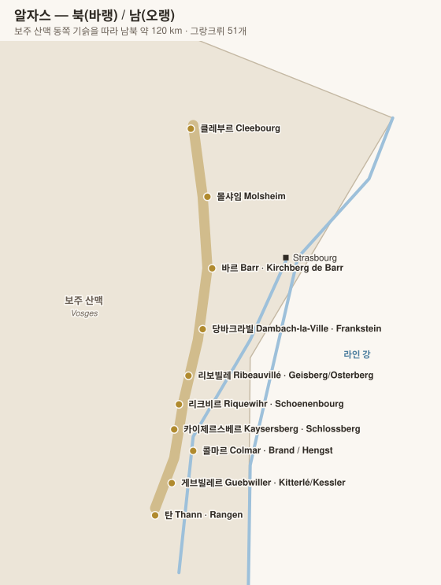

# 알자스 Alsace

> 보주 산맥이 서풍을 막아 **프랑스에서 가장 건조한 산지**. 프랑스에서 유일하게 **품종명을 라벨 전면에 쓰는** 지역.

## 1. 기본 구조

| 항목 | 내용 |
|---|---|
| 지형 | 보주 산맥 동쪽 기슭, 남북 약 120 km의 좁은 띠 |
| 기후 | 반건조 대륙성. 콜마르는 프랑스 최저 강수 지역 중 하나 |
| 토양 | 지질 단층대라 **13종 이상의 토양**이 좁은 구간에 혼재 (화강암·편암·석회암·화산암·사암·이회토) |
| 병 모양 | 길고 가는 플뤼트 달자스(flûte d'Alsace) |
| 행정 구분 | 북 **바랭 Bas-Rhin** / 남 **오랭 Haut-Rhin**(그랑크뤼 대부분) |

## 2. 등급 체계

| 등급 | 내용 |
|---|---|
| **Alsace Grand Cru 알자스 그랑 크뤼** | **51개 밭(lieu-dit 리외디)**. 각각이 독립 AOC. 원칙적으로 **고귀품종 4종만** 허용 |
| **Alsace** (+ Communale 코뮈날) | 광역. 최근 13개 마을명(Bergheim 베르크하임, Ottrott 오트로트 등) 표기 허용 |
| **Crémant d'Alsace 크레망 달자스** | 전통방식 스파클링. 프랑스 크레망 생산량 1위 |

### 고귀품종 (Cépages Nobles 세파주 노블)

| 품종 | 성격 |
|---|---|
| **리슬링 Riesling** | 드라이·산도 높음·미네랄. 알자스의 왕 |
| **게뷔르츠트라미너 Gewurztraminer** | 리치·장미·향신료, 낮은 산도, 풍만 |
| **피노 그리 Pinot Gris** | 훈연·버섯·꿀, 묵직한 질감 |
| **뮈스카 Muscat** | 신선한 포도 향, 드라이하게 양조 |

그 외: 실바네르(Sylvaner) · 피노 블랑/오세루아 · **피노 누아**(유일한 레드) · 샤슬라

> **예외**: Zotzenberg 초첸베르크 그랑크뤼는 **실바네르**를, Hengst 헹스트·Kirchberg de Barr 키르히베르크 드 바르·Vorbourg 포르부르는 **피노 누아**를 허용한다(2022년~).

## 3. 주요 그랑 크뤼 (51개 중 핵심)

| 그랑크뤼 | 마을 | 토양 | 최적 품종 | 주요 생산자 |
|---|---|---|---|---|
| **Rangen 랑겐** | Thann 탄 | **화산암** | 리슬링·피노 그리 | **Zind-Humbrecht 진트 훔브레히트**(Clos Saint Urbain 클로 생 위르뱅), **Schoffit 쇼피트**(Clos Saint-Théobald 클로 생테오발) |
| **Schlossberg 슐로스베르크** | Kientzheim 키엔츠하임 | 화강암 | 리슬링 | **Domaine Weinbach 도멘 바인바크**(Cuvée Sainte Catherine 퀴베 생트 카트린), Albert Mann 알베르 만 |
| **Brand 브란트** | Turckheim 튀르크하임 | 화강암 | 리슬링·피노 그리 | **Zind-Humbrecht 진트 훔브레히트**, Josmeyer 조스메이어 |
| **Hengst 헹스트** | Wintzenheim 빈첸하임 | 이회토·석회 | 게뷔르츠·피노 그리 | **Zind-Humbrecht 진트 훔브레히트**, **Josmeyer 조스메이어**, Albert Mann 알베르 만, Barmès-Buecher 바르메스 뷔셰 |
| **Rosacker 로자커** | Hunawihr 위나비르 | 백운암·석회 | 리슬링 | **Trimbach 트림바크 — Clos Sainte Hune 클로 생트 윈** (알자스 최고 리슬링) |
| **Geisberg · Osterberg 가이스베르크 · 오스터베르크** | Ribeauvillé 리보빌레 | 이회토·석회 | 리슬링 | **Trimbach 트림바크 — Cuvée Frédéric Emile 퀴베 프레데리크 에밀** |
| **Kirchberg de Ribeauvillé 키르히베르크 드 리보빌레** | Ribeauvillé 리보빌레 | 석회·이회토 | 리슬링 | Trimbach 트림바크, André Kientzler 앙드레 키엔츨러 |
| **Schoenenbourg 쇠넨부르** | Riquewihr 리크비르 | 이회토·석고 | 리슬링 | **Hugel 위겔**(Schoelhammer 쇨하머), Dopff au Moulin 도프 오 물랭, Marcel Deiss 마르셀 다이스 |
| **Sporen 슈포렌** | Riquewihr 리크비르 | 점토·이회토 | 게뷔르츠 | **Marcel Deiss 마르셀 다이스** (혼식 필드블렌드) |
| **Altenberg de Bergheim 알텐베르크 드 베르크하임** | Bergheim 베르크하임 | 석회·이회토 | 혼식 | **Marcel Deiss 마르셀 다이스**, Gustave Lorentz 귀스타브 로렌츠 |
| **Furstentum 퓌르스텐툼** | Kientzheim·Sigolsheim 키엔츠하임·지골스하임 | 석회 | 게뷔르츠 | Weinbach 바인바크, Albert Mann 알베르 만, Bott-Geyl 보트 가일 |
| **Mambourg 망부르** | Sigolsheim 지골스하임 | 석회·이회토 | 게뷔르츠 | **Marcel Deiss 마르셀 다이스** |
| **Kitterlé · Kessler · Saering · Spiegel 키테를레 · 케슬러 · 제링 · 슈피겔** | Guebwiller 게브빌레 | 사암·화산 퇴적 | 리슬링·게뷔르츠 | **Domaines Schlumberger 도멘 슐룅베르제** (4개 GC 대량 보유) |
| **Goldert 골데르트** | Gueberschwihr 게베르슈비르 | 석회 | 뮈스카·게뷔르츠 | Zind-Humbrecht 진트 훔브레히트 |
| **Sommerberg 좀머베르크** | Niedermorschwihr 니데르모르슈비르 | 화강암 | 리슬링 | **Albert Boxler 알베르 복슬러** |
| **Muenchberg 뮌히베르크** | Nothalten 노탈텐 | 사암·화산 | 리슬링·피노 그리 | **Domaine Ostertag 도멘 오스테르타크** |
| **Wineck-Schlossberg 비네크 슐로스베르크** | Katzenthal 카첸탈 | 화강암 | 리슬링 | Meyer-Fonné 메이에 포네 |
| **Zinnkoepflé 친쾨플레** | Westhalten 베스트할텐 | 석회·사암 | 게뷔르츠 | Seppi Landmann 제피 란트만, Rieflé 리플레 |
| **Pfersigberg · Eichberg 페르지크베르크 · 아이히베르크** | Eguisheim 에기스하임 | 석회 | 게뷔르츠·리슬링 | Paul Ginglinger 폴 갱글랭제, Bruno Hertz 브뤼노 에르츠 |
| **Vorbourg 포르부르** | Rouffach 루파크 | 석회·사암 | 리슬링·피노 누아 | **Muré 뮈레 — Clos Saint Landelin 클로 생 랑들랭** |
| **Zotzenberg 초첸베르크** | Mittelbergheim 미텔베르크하임 | 이회토 | **실바네르** | Boeckel 뵈켈, Rietsch 리치 |
| **Frankstein 프랑크슈타인** | Dambach-la-Ville 담바크 라 빌 | 화강암 | 리슬링 | Domaine Beck-Hartweg 도멘 베크 하르트베크 |
| **Kirchberg de Barr 키르히베르크 드 바르** | Barr 바르 | 석회 | 피노 그리·피노 누아 | Domaine Klipfel 도멘 클립펠 |

## 4. 그랑크뤼가 아닌 명품 밭 (Clos)

알자스에서는 그랑크뤼 체계에 참여하지 않으면서도 최고 평가를 받는 **개인 소유 클로**가 많다.

| 클로 | 생산자 | 비고 |
|---|---|---|
| **Clos Sainte Hune 클로 생트 윈** | Trimbach 트림바크 | Rosacker 로자커 GC 안의 1.67 ha 구획. GC 표기를 쓰지 않음 |
| **Clos Windsbuhl 클로 빈츠뷜** | Zind-Humbrecht 진트 훔브레히트 | Hunawihr 위나비르, GC 아님 |
| **Clos Häuserer / Clos Jebsal 클로 호이제러 / 클로 제브살** | Zind-Humbrecht 진트 훔브레히트 | |
| **Clos des Capucins 클로 데 카퓌생** | Domaine Weinbach 도멘 바인바크 | 도멘 본거지 |
| **Clos Saint Landelin 클로 생 랑들랭** | Muré 뮈레 | Vorbourg 포르부르 GC 내부 |

> **주의**: 일부 명문(Trimbach 트림바크, Hugel 위겔, Léon Beyer 레옹 베예르)은 51개 그랑크뤼 지정이 지나치게 관대했다고 보고 **의도적으로 GC 표기를 쓰지 않는다.** 따라서 "그랑크뤼가 없다 = 낮은 등급"이 성립하지 않는다.

## 5. 늦수확 스위트 와인

| 등급 | 내용 |
|---|---|
| **Vendanges Tardives 방당주 타르디브 (VT)** | 늦수확. 최소 당도 기준 충족. 드라이하게 마감되기도 함 |
| **Sélection de Grains Nobles 셀렉시옹 드 그랭 노블 (SGN)** | 귀부 포도알 선별. 훨씬 높은 당도, 극소량 |

> 두 등급 모두 **고귀품종 4종만** 가능하며 샤프탈리자시옹(가당)이 금지된다.

## 6. 핵심 생산자

| 생산자 | 근거지 | 특징 |
|---|---|---|
| **Trimbach 트림바크** | Ribeauvillé 리보빌레 | 극도의 드라이 스타일. Clos Sainte Hune 클로 생트 윈, Cuvée Frédéric Emile 퀴베 프레데리크 에밀 |
| **Hugel & Fils 위겔 에 피스** | Riquewihr 리크비르 | 1639년 창립. Grossi Laüe 그로시 라위, Schoelhammer 쇨하머 |
| **Domaine Zind-Humbrecht 진트 훔브레히트** | Turckheim 튀르크하임 | 비오디나미, 농축된 스타일. 올리비에 훔브레히트 MW |
| **Domaine Weinbach 도멘 바인바크** | Kientzheim 키엔츠하임 | 우아·정밀. Clos des Capucins 클로 데 카퓌생 |
| **Domaine Marcel Deiss 마르셀 다이스** | Bergheim 베르크하임 | **품종 혼식(complantation 콩플랑타시옹)** 을 부활시켜 테루아 중심 표기 주장 |
| **Domaine Albert Mann 알베르 만** | Wettolsheim 베톨스하임 | 비오디나미, 안정적 고품질 |
| **Josmeyer 조스메이어** | Wintzenheim 빈첸하임 | 식탁용 드라이 스타일 |
| **Domaine Ostertag 도멘 오스테르타크** | Epfig 에프피크 | 부르고뉴식 접근, 오크 사용 |
| **Albert Boxler 알베르 복슬러** | Niedermorschwihr 니데르모르슈비르 | Sommerberg 좀머베르크 리슬링 |
| **Domaines Schlumberger 도멘 슐룅베르제** | Guebwiller 게브빌레 | 알자스 최대 그랑크뤼 소유 |
| **René Muré 르네 뮈레** | Rouffach 루파크 | Clos Saint Landelin 클로 생 랑들랭 |
| 그 외 | Léon Beyer 레옹 베예르 · Bott-Geyl 보트 가일 · Meyer-Fonné 메이에 포네 · Barmès-Buecher 바르메스 뷔셰 · Kreydenweiss 크레이덴바이스 · Dirler-Cadé 디를레 카데 | |

## 7. 라벨 읽기 팁

- 알자스 와인은 **드라이가 기본**이지만, 최근 피노 그리·게뷔르츠는 잔당이 있는 경우가 많다. 라벨의 당도 표기(Sec 섹 / Moelleux 무알뢰) 또는 생산자별 인디케이터를 확인.
- **Zind-Humbrecht 진트 훔브레히트**는 자체 당도 지수(Indice 앵디스 1~5)를 라벨에 표기한다.
- **Édelzwicker / Gentil 에델츠비커 / 장티**: 여러 품종을 블렌딩한 일상 와인. Gentil 장티은 고귀품종 50% 이상.

---

[← 루아르](05-loire.md) · [목차로](../README.md) · [다음: 남부 및 기타 →](07-sud-et-autres.md)
