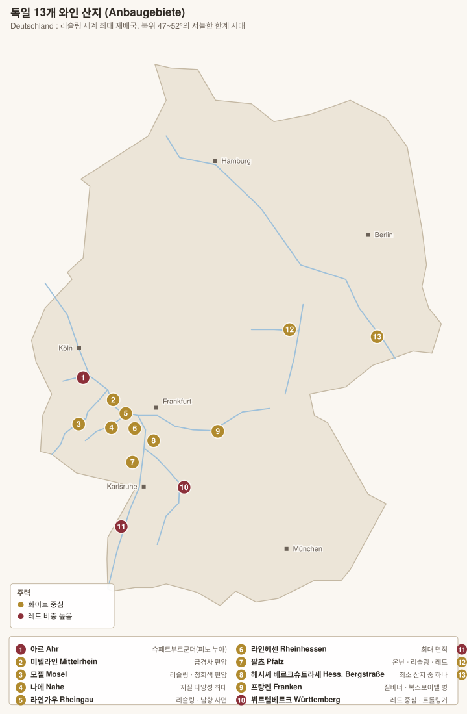

# 독일 와인 개요



> **북위 47~52°.** 상업적 포도 재배가 가능한 북쪽 한계선에 걸쳐 있다. 이 서늘함이 독일 와인의 모든 것을 결정한다 — 낮은 알코올, 높은 산도, 그리고 **당도를 남기는 전통**.

<!-- toc -->
## 목차

- [1. 두 개의 등급 체계가 공존한다](#1-두-개의-등급-체계가-공존한다)
- [2. 법정 등급 — Prädikatswein 프레디카츠바인](#2-법정-등급--prädikatswein-프레디카츠바인)
- [3. VDP 등급 — 부르고뉴식 밭 피라미드](#3-vdp-등급--부르고뉴식-밭-피라미드)
- [4. 당도 표기 — 라벨에서 가장 중요한 정보](#4-당도-표기--라벨에서-가장-중요한-정보)
- [5. 품종](#5-품종)
- [6. 독일어 라벨 읽기 규칙](#6-독일어-라벨-읽기-규칙)
- [7. 밭 이름 읽는 법](#7-밭-이름-읽는-법)
- [8. 13개 산지 한눈에](#8-13개-산지-한눈에)
- [9. 역사 — 세 번의 전환](#9-역사--세-번의-전환)
- [10. 빈티지](#10-빈티지)

<!-- /toc -->

## 1. 두 개의 등급 체계가 공존한다

독일 라벨이 어려운 이유는 **법정 등급(Prädikat)**과 **민간 등급(VDP)**이 동시에 쓰이기 때문이다. 둘은 기준이 완전히 다르다.

| | **법정 등급 (1971년 와인법)** | **VDP 등급 (민간, 2012년 완성)** |
|---|---|---|
| 기준 | **수확 시 포도의 당도(Öchsle 왹슬레)** | **밭의 품질** (부르고뉴식) |
| 논리 | 익을수록 높은 등급 | 좋은 밭일수록 높은 등급 |
| 문제 | **당도 ≠ 품질.** 밭의 차이를 담지 못한다 | 회원(약 200곳)만 쓸 수 있다 |
| 표시 | 라벨의 Kabinett·Spätlese 등 | **독수리 로고 + 포도송이** |

---

## 2. 법정 등급 — Prädikatswein 프레디카츠바인

수확 시 포도즙의 당도를 **왹슬레(Öchsle)** 단위로 재서 매긴다. **당도 등급이지 단맛 등급이 아니다** — 발효를 끝까지 시키면 드라이가 된다.

| 등급 | 원어 | 최소 왹슬레(모젤 리슬링 기준) | 성격 |
|---|---|---|---|
| **카비네트** | Kabinett 카비네트 | 67~82° | 가장 가볍다. 알코올 7~9%. 드라이~오프드라이 |
| **슈페트레제** | Spätlese 슈페트레제 ("늦수확") | 76~90° | 몸통이 있다. 드라이~세미스위트 |
| **아우스레제** | Auslese 아우스레제 ("선별 수확") | 83~100° | 잘 익은 송이 선별. 대개 스위트, 귀부 일부 |
| **베렌아우스레제 (BA)** | Beerenauslese 베렌아우스레제 | 110~128° | **포도알 단위 선별**, 귀부. 스위트 |
| **아이스바인** | Eiswein 아이스바인 | BA와 동일 | **나무에 언 채로(-7℃ 이하) 수확·압착.** 귀부 없이 순수한 산도 |
| **트로켄베렌아우스레제 (TBA)** | Trockenbeerenauslese 트로켄베렌아우스레제 | 150~154° | **말라붙은 귀부 포도알만.** 세계 최고가 스위트 |

### 그 아래 등급

| 등급 | 내용 |
|---|---|
| **Qualitätswein (QbA) 크발리테츠바인** | 13개 산지 중 하나. **가당(Chaptalisation) 허용** |
| **Landwein 란트바인** | = IGP |
| **Deutscher Wein 도이처 바인** | 산지 표기 없음 |

> **결정적 오해** — 슈페트레제·아우스레제는 **단맛 등급이 아니라 수확 시 당도 등급**이다. `Spätlese trocken`은 그 당도를 전부 발효시킨 **완전 드라이 와인**이며, 알코올이 13%까지 올라간다.

---

## 3. VDP 등급 — 부르고뉴식 밭 피라미드

**VDP(Verband Deutscher Prädikatsweingüter 페어반트 도이처 프레디카츠바인귀터)**는 1910년 결성된 최상위 생산자 협회다. 법정 체계가 밭을 무시한다는 문제의식에서 자체 등급을 만들었다.

| 등급 | 원어 | 부르고뉴 대응 | 규정 |
|---|---|---|---|
| **그로세 라게** | **GROSSE LAGE 그로세 라게** | 그랑 크뤼 | 최상급 단일 밭. 수확량 50 hl/ha 이하, 손 수확 |
| — 드라이 버전 | **GROSSES GEWÄCHS (GG) 그로세스 게베크스** | – | **그로세 라게의 드라이 와인**. 라벨에 `GG` 로고 |
| **에르스테 라게** | ERSTE LAGE 에르스테 라게 | 프리미에 크뤼 | 우수 단일 밭. 60 hl/ha 이하 |
| **오르츠바인** | Ortswein 오르츠바인 | 빌라주 | 마을 단위. 75 hl/ha 이하 |
| **구츠바인** | Gutswein 구츠바인 | 레지오날 | 생산자 광역 |

> **GG를 어떻게 알아보는가** — 병에 **GG 양각**이 있고, VDP 로고(독수리 + 포도송이)가 캡슐에 있다. **그로세 라게의 드라이는 GG, 스위트는 Prädikat 표기**(Auslese 등)를 쓴다. 즉 두 체계가 용도를 나눠 쓴다.

> **주의** — VDP는 회원제라 **비회원 최상급 생산자**(예: Egon Müller는 회원, Keller도 회원이지만 일부 스타 생산자는 비회원)도 있다. VDP가 아니라고 낮은 것이 아니다.

---

## 4. 당도 표기 — 라벨에서 가장 중요한 정보

| 표기 | 원어 | 잔당 |
|---|---|---|
| **트로켄** | Trocken 트로켄 | **~9 g/L** (드라이) |
| **할프트로켄** | Halbtrocken 할프트로켄 | 9~18 g/L |
| **파인헤르프** | Feinherb 파인헤르프 | 법적 정의 없음. 대체로 오프드라이 |
| (표기 없음) | – | 대개 잔당이 있다 |
| **에델쥐스** | Edelsüß 에델쥐스 | 귀부 스위트 |

> **잔당만으로 단맛을 판단할 수 없다.** 모젤 리슬링은 산도가 8~10 g/L에 이르러, 잔당 40 g/L라도 드라이하게 느껴진다. **당/산 비율**이 실제 인상을 결정한다.

---

## 5. 품종

| 품종 | 재배 비중 | 성격 |
|---|---|---|
| **Riesling 리슬링** | **약 24%** (세계 최대) | 라임·백도·**부싯돌·석유향(petrol)**. 산도 최고, 알코올 낮다. **50년 이상 숙성** |
| **Müller-Thurgau 뮐러투르가우** | 약 11% | 리슬링 × 마들렌 로얄 교배(1882). 일찍 익고 향이 옅다. 대량생산용 |
| **Spätburgunder 슈페트부르군더** | **약 11%** | = **피노 누아**. 독일은 **세계 3위 피노 누아 생산국**. 온난화로 품질 급상승 |
| **Grauburgunder 그라우부르군더 / Ruländer 룰렌더** | 약 7% | = 피노 그리 |
| **Weissburgunder 바이스부르군더** | 약 6% | = 피노 블랑 |
| **Silvaner 질바너** | 약 4% | **프랑켄의 얼굴.** 흙내·허브, 향이 절제 |
| **Dornfelder 도른펠더** | 약 7% | 1955년 교배. 색이 매우 진한 레드 |
| **Trollinger 트롤링거** | 약 2% | = 알토아디제의 **스키아바**. 뷔르템베르크의 가벼운 일상 레드 |
| **Lemberger 렘베르거** | 약 2% | = 오스트리아의 **블라우프렌키슈**. 뷔르템베르크 |
| **Scheurebe 쇼이레베 · Kerner 케르너 · Rieslaner 리슬라너** | 소량 | 리슬링 계열 교배종 |
| **Portugieser · Schwarzriesling(Pinot Meunier)** | 소량 | |

> **독일 = 화이트라는 인식은 이미 낡았다.** 레드가 재배 면적의 **약 33%**를 차지하며, 슈페트부르군더(피노 누아)는 부르고뉴와 비교되는 수준에 이르렀다. 1980년대 이후 온난화가 결정적이었다.

---

## 6. 독일어 라벨 읽기 규칙

| 철자 | 소리 | 예 |
|---|---|---|
| **ei** | **아이** | Eiswein 아이스바인 / Weingut 바인구트 |
| **ie** | **이-** | Riesling 리슬링 / Kiedrich 키드리히 |
| **eu, äu** | **오이** | Scheurebe 쇼이레베 / Häuser 호이저 |
| **au** | 아우 | Auslese 아우스레제 |
| **w** | **ㅂ** | Wehlen 벨렌 / Wein 바인 |
| **v** | **ㅍ** | Vollrads 폴라츠 |
| **z** | **ㅊ** | Zeltingen 첼팅겐 / Spitz 슈피츠 |
| **s** + 자음(어두) | **슈** | Spätlese **슈**페트레제 / Stein **슈**타인 |
| **sch** | 슈 | Schloss 슐로스 |
| **ch** (a·o·u 뒤) | ㅎ | Bach 바흐 / Doctor 독토어 |
| **ch** (e·i 뒤) | ㅎ(약하게) | Kiedrich 키드리히 |
| **ä** | 에 | Spätlese 슈페트레제 |
| **ö** | 외 | Öchsle 왹슬레 |
| **ü** | 위 | Ürzig 위르치히 / Würzburg 뷔르츠부르크 |
| **ß** | ㅅ | Grosse / Große 그로세 |
| **-er** (어말) | 어 | Müller 뮐러 |

### 라벨에 자주 나오는 단어

| 독일어 | 발음 | 뜻 |
|---|---|---|
| Weingut | 바인구트 | 와이너리(자가 재배) |
| Weinkellerei | 바인켈러라이 | 네고시앙 |
| Schloss | 슐로스 | 성(城) |
| Lage | 라게 | 밭 |
| Einzellage | 아인첼라게 | **단일 밭** |
| Grosslage | 그로슬라게 | **여러 밭의 집합** — 라벨에서 단일 밭처럼 보여 혼동을 준다 |
| Weinberg / Berg | 바인베르크 / 베르크 | 포도밭 / 산·언덕 |
| Erzeugerabfüllung | 에어초이거아프퓔룽 | 생산자 병입 |
| Gutsabfüllung | 구츠아프퓔룽 | 자가 병입(더 엄격) |
| Alte Reben | 알테 레벤 | 노목 |
| Sekt | 젝트 | 스파클링 |
| Winzersekt | 빈처젝트 | 자가 재배 포도로 만든 전통방식 젝트 |

> **Grosslage 그로슬라게의 함정** — 1971년 와인법이 만든 개념으로, **넓은 구역을 하나의 밭 이름처럼 쓸 수 있게** 했다. `Piesporter Michelsberg`(그로슬라게)는 피스포르트의 명품 밭 `Piesporter Goldtröpfchen`(아인첼라게)과 이름이 비슷하지만 완전히 다른 것이다. **라벨만으로는 구분이 어렵다**는 것이 이 법의 최대 문제로 지적된다.

---

## 7. 밭 이름 읽는 법

독일 밭 이름은 **`마을명 + er` + `밭 이름`** 구조다.

```
Wehlener Sonnenuhr
└ Wehlen 벨렌 마을의 └ Sonnenuhr("해시계") 밭
```

| 예 | 마을 | 밭 |
|---|---|---|
| **Wehlener Sonnenuhr 벨레너 조넨우어** | Wehlen 벨렌 | Sonnenuhr("해시계") |
| **Bernkasteler Doctor 베른카스텔러 독토어** | Bernkastel 베른카스텔 | Doctor |
| **Erdener Prälat 에르데너 프렐라트** | Erden 에르덴 | Prälat("고위 성직자") |
| **Rüdesheimer Berg Schlossberg 뤼데스하이머 베르크 슐로스베르크** | Rüdesheim 뤼데스하임 | Berg Schlossberg |
| **Niersteiner Pettenthal 니어슈타이너 페텐탈** | Nierstein 니어슈타인 | Pettenthal |

> **VDP는 최근 마을명을 빼고 밭 이름만 쓰는 방식**으로 옮겨가고 있다(부르고뉴 그랑크뤼처럼). `Sonnenuhr GG`처럼.

---

## 8. 13개 산지 한눈에

| 산지 | 면적 | 주력 | 성격 | 문서 |
|---|---|---|---|---|
| **Mosel 모젤** | 약 8,800 ha | **리슬링 60%** | 청회색 편암, 급경사. 알코올 최저·산도 최고 | [→](01-mosel.md) |
| **Rheingau 라인가우** | 약 3,200 ha | **리슬링 78%** | 라인 강 남향 사면. 독일 리슬링의 역사적 중심 | [→](02-rheingau.md) |
| **Rheinhessen 라인헤센** | **약 27,000 ha (최대)** | 다양 | 평범한 대량생산 → 최근 극적 재평가 | [→](03-nahe-rheinhessen-pfalz.md) |
| **Pfalz 팔츠** | 약 23,700 ha | 리슬링·레드 | 독일에서 가장 따뜻·건조. 알자스의 연장 | [→](03-nahe-rheinhessen-pfalz.md) |
| **Nahe 나에** | 약 4,200 ha | 리슬링 | **지질 다양성 최대**. 모젤과 라인가우의 중간 | [→](03-nahe-rheinhessen-pfalz.md) |
| **Baden 바덴** | 약 15,800 ha | **부르군더 계열** | 독일 최남단·최온난. 유일한 EU 존 B | [→](04-baden-wurttemberg-franken.md) |
| **Württemberg 뷔르템베르크** | 약 11,300 ha | **레드 70%** | 트롤링거·렘베르거. 내수 소비 대부분 | [→](04-baden-wurttemberg-franken.md) |
| **Franken 프랑켄** | 약 6,100 ha | **질바너** | 복스보이텔(둥근 병). 드라이 전통 | [→](04-baden-wurttemberg-franken.md) |
| **Ahr 아르** | 약 560 ha | **슈페트부르군더 65%** | 최북단 레드 산지 | [→](05-ahr-mittelrhein-ost.md) |
| **Mittelrhein 미텔라인** | 약 460 ha | 리슬링 | 로렐라이 협곡. 극한 급경사 | [→](05-ahr-mittelrhein-ost.md) |
| **Hessische Bergstraße** | 약 460 ha | 리슬링 | 최소 산지 | [→](05-ahr-mittelrhein-ost.md) |
| **Saale-Unstrut 잘레운스트루트** | 약 800 ha | 질바너·바이스부르군더 | **북위 51°, 세계 최북단급** | [→](05-ahr-mittelrhein-ost.md) |
| **Sachsen 작센** | 약 500 ha | 뮐러투르가우·리슬링 | 최동단, 엘베 강 | [→](05-ahr-mittelrhein-ost.md) |

---

## 9. 역사 — 세 번의 전환

| 시기 | 사건 |
|---|---|
| **8세기~** | 샤를마뉴가 라인가우에 포도를 심게 했다는 전승. 수도원(에버바흐·요하니스베르크)이 밭을 개간 |
| **1775** | **Schloss Johannisberg 슐로스 요하니스베르크**에서 수확 허가 전령이 늦어 포도가 귀부에 걸렸고, 그 결과가 뜻밖에 훌륭했다 → **슈페트레제(늦수확)의 발견** |
| **19세기** | 라인가우 리슬링이 **보르도 1등급보다 비쌌다.** 영국에서 "Hock"이라 불리며 최고급 대접 |
| **1971 와인법** | 당도 중심 등급 + **그로슬라게 도입.** 대량생산 리프프라우밀히(Liebfraumilch)가 시장을 장악하며 이미지 붕괴 |
| **1980~90년대** | 저가 스위트 이미지의 늪. 독일 와인의 암흑기 |
| **2000년대~** | **VDP 밭 등급 정비 + 드라이 전환 + 온난화.** 리슬링 GG와 슈페트부르군더가 국제 무대로 복귀 |

> **Liebfraumilch 리프프라우밀히의 후과** — 1970~80년대 영미권에 대량 수출된 저가 세미스위트 블렌드다. 상업적으로는 성공했지만 **"독일 와인 = 싸고 달다"**는 인식을 굳혔고, 최고급 리슬링까지 그 그늘에 갇혔다. 지금도 독일 와인 마케팅의 가장 큰 부채다.

---

## 10. 빈티지

> 연도별 상세 차트는 **[독일 빈티지 차트](../vintages/05-germany.md)** 참조.

---

[목차로](../README.md) · [다음: 모젤 →](01-mosel.md)
