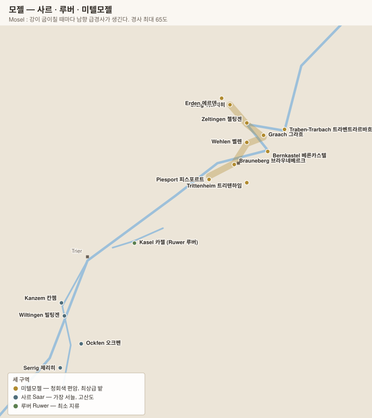

# 모젤 Mosel

> 세계에서 **알코올이 가장 낮고 산도가 가장 높은** 리슬링. 강이 굽이칠 때마다 생기는 **남향 급경사**(최대 65도)와 **청회색 편암**이 이 산지의 전부다.

## 1. 기본 구조

| 항목 | 내용 |
|---|---|
| 정식 명칭 | **Mosel 모젤** (2007년까지 Mosel-Saar-Ruwer 모젤자르루버) |
| 면적 | 약 8,800 ha |
| 위도 | **북위 49.5~50.5°** |
| 품종 | **리슬링 약 60%** + 뮐러투르가우 · 엘블링 · 슈페트부르군더 |
| 알코올 | **7~9%** (카비네트 기준) — 세계 최저 수준 |
| 산도 | 8~10 g/L |
| 경사 | 최대 **65도**. **Calmont 칼몬트**는 유럽 최급경사 포도밭(68도) |

### 왜 강이 굽이쳐야 하는가

모젤은 북위 50°로 포도가 익기 어려운 위도다. **강이 사행(蛇行)하며 만드는 남향 사면만이** 충분한 일조를 받는다.

| 조건 | 작용 |
|---|---|
| **남향 급경사** | 태양광이 지면에 수직에 가깝게 들어온다 → 단위 면적당 일사량 최대 |
| **강물의 반사** | 아래에서 빛을 한 번 더 준다 |
| **강물의 열 저장** | 밤 기온을 완충, 가을 서리를 늦춘다 |
| **청회색 편암(Schiefer 시퍼)** | 검은 돌이 낮에 열을 저장했다 밤에 방출. 배수가 극단적 |

> **북향 사면에는 포도를 심지 않는다.** 같은 마을 안에서도 강 어느 쪽 굽이에 있는가가 등급을 가른다.

---

## 2. 세 구역

| 구역 | 위치 | 성격 |
|---|---|---|
| **Mittelmosel 미텔모젤** | Trittenheim 트리텐하임 ~ Erden 에르덴 | **최상급이 모두 여기.** 청회색 편암, 남향 급경사 |
| **Saar 자르** | 모젤 지류, 남서쪽 | **가장 서늘.** 산도가 극단적이고 익지 않는 해가 있다. 좋은 해에는 최고 |
| **Ruwer 루버** | 모젤 지류, 트리어 인근 | 가장 작다. 섬세하고 향기롭다 |
| **Obermosel 오버모젤** (상류) | 룩셈부르크 접경 | 석회암. **Elbling 엘블링** 품종, 대개 젝트용 |
| **Terrassenmosel 테라센모젤** (하류) | Winningen 비닝겐 일대 | 계단밭. 최근 재평가 |

---

## 3. 마을과 명품 밭

### Mittelmosel 미텔모젤 — 최상급 구간

| 마을 | 대표 밭 (Einzellage) | 성격 | 생산자 |
|---|---|---|---|
| **Piesport 피스포르트** | **Goldtröpfchen 골트트뢰프헨** | 원형 극장 모양 남향 사면. 향기롭고 이국적 | **Reinhold Haart 라인홀트 하르트**, Julian Haart |
| **Brauneberg 브라우네베르크** | **Juffer 유퍼 · Juffer Sonnenuhr 유퍼 조넨우어** | 나폴레옹이 극찬. 풍만하고 둥글다 | **Fritz Haag 프리츠 하크**, Willi Schaefer |
| **Bernkastel 베른카스텔** | **Doctor 독토어** (3.2 ha) | **독일에서 가장 비싼 밭 중 하나.** 마을 바로 위 급경사 | **Wwe. Dr. H. Thanisch 타니슈**, Markus Molitor |
| **Graach 그라흐** | **Domprobst 돔프롭스트 · Himmelreich 히멜라이히** | 구조적·미네랄 | **Willi Schaefer 빌리 셰퍼**, Markus Molitor |
| **Wehlen 벨렌** | **Sonnenuhr 조넨우어**("해시계") | **모젤 우아함의 정점.** 1842년 세운 해시계에서 이름 | **Joh. Jos. Prüm 요한 요제프 프륌**, S.A. Prüm, Markus Molitor |
| **Zeltingen 첼팅겐** | **Sonnenuhr 조넨우어 · Schlossberg 슐로스베르크** | 벨렌과 이어진 사면 | **Markus Molitor 마르쿠스 몰리토어**, Selbach-Oster |
| **Ürzig 위르치히** | **Würzgarten 뷔르츠가르텐**("향신료 정원") | **붉은 사암·화산암이 섞인 예외적 토양.** 향신료 향 | **Dr. Loosen 닥터 로젠**, J.J. Christoffel |
| **Erden 에르덴** | **Prälat 프렐라트 · Treppchen 트렙헨** | 프렐라트는 1.4 ha 극소. 절벽 아래 열이 갇힌다 | **Dr. Loosen**, Markus Molitor |
| **Trittenheim 트리텐하임** | **Apotheke 아포테케** | 상류, 서늘 | Grans-Fassian, Clemens Busch(하류) |

> **Wehlener Sonnenuhr 벨레너 조넨우어의 해시계** — 1842년 프륌 가문의 선조가 밭 한가운데 세운 것으로, 급경사에서 일하는 인부들이 시간을 알 수 있게 하기 위해서였다. 지금은 밭 이름이자 상표가 되었다.

### Saar 자르

| 마을 | 대표 밭 | 생산자 |
|---|---|---|
| **Wiltingen 빌팅겐** | **Scharzhofberg 샤르츠호프베르크** | **Egon Müller 에곤 뮐러**(세계 최고가 리슬링), Van Volxem |
| **Ockfen 오크펜** | Bockstein 보크슈타인 | Dr. Heinz Wagner, Zilliken |
| **Saarburg 자르부르크** | Rausch 라우슈 | **Forstmeister Geltz Zilliken 칠리켄** |
| **Serrig 제리히** | Schloss Saarstein | Schloss Saarstein |
| **Kanzem 칸쳄** | Altenberg 알텐베르크 | Van Volxem |

> **Egon Müller Scharzhofberger TBA**는 정기적으로 **세계에서 가장 비싼 화이트 와인**에 오른다. 좋은 해에만, 극소량 만든다.

### Ruwer 루버

| 마을 | 대표 밭 | 생산자 |
|---|---|---|
| **Kasel 카젤** | Nies'chen 니스헨 | **Karthäuserhof 카르토이저호프** |
| **Eitelsbach 아이텔스바흐** | **Karthäuserhofberg 카르토이저호프베르크** | Karthäuserhof |
| **Mertesdorf 메르테스도르프** | Abtsberg 압츠베르크 | **Maximin Grünhaus 막시민 그륀하우스** |

---

## 4. 품종

### Riesling 리슬링 — 모젤에서의 얼굴

| 항목 | 내용 |
|---|---|
| 향 | **라임·초록 사과·백도**, 흰꽃. **편암에서 오는 부싯돌·연기** |
| 숙성 향 | 8~15년 뒤 **석유향(petrol, TDN)**·꿀·생강 |
| 구조 | **산도 8~10 g/L, 알코올 7~11%.** 극단적 조합 |
| 잔당 | 카비네트 20~40 g/L, 슈페트레제 40~80 g/L도 흔하다. **높은 산도가 단맛을 상쇄** |
| 숙성력 | **20~50년.** 카비네트조차 20년을 간다 |

> **왜 잔당을 남기는가** — 모젤 리슬링의 산도는 다른 산지 기준으로 공격적이다. 잔당이 그 산도를 감싸 균형을 만든다. **완전 드라이로 만들면 신맛만 남는 해가 많다.** 다만 온난화로 완숙이 쉬워지면서 드라이(GG) 비중이 계속 늘고 있다.

### 그 밖의 품종

| 품종 | 위치 | 비고 |
|---|---|---|
| **Elbling 엘블링** | Obermosel 오버모젤 | 로마 시대부터 재배된 고대 품종. 산도가 매우 높아 젝트용 |
| **Müller-Thurgau 뮐러투르가우** | 전역 | 평지·완경사. 일상주 |
| **Spätburgunder 슈페트부르군더** | 소량 | 온난화로 증가 |
| **Weissburgunder 바이스부르군더** | 소량 | |

---

## 5. 핵심 생산자

| 생산자 | 마을 | 특징 |
|---|---|---|
| **Egon Müller 에곤 뮐러** | Wiltingen (자르) | Scharzhofberg. 세계 최고가 리슬링 |
| **Joh. Jos. Prüm (J.J. Prüm) 요한 요제프 프륌** | Wehlen | **모젤 클래식의 상징.** 어릴 때 환원취가 나며 10년 뒤 열린다 |
| **Dr. Loosen 닥터 로젠** | Bernkastel | Ürziger Würzgarten·Erdener Prälat. 국제적 인지도 |
| **Willi Schaefer 빌리 셰퍼** | Graach | 극소 규모, 정밀함의 정점 |
| **Fritz Haag 프리츠 하크** | Brauneberg | Juffer Sonnenuhr |
| **Markus Molitor 마르쿠스 몰리토어** | Zeltingen | **캡슐 색으로 당도 표시**(흰색=드라이, 초록=오프드라이, 금색=스위트) |
| **Zilliken 칠리켄** | Saarburg (자르) | 깊은 지하 셀러 |
| **Maximin Grünhaus 막시민 그륀하우스** | Ruwer | 단일 소유 밭 3개 |
| **Karthäuserhof 카르토이저호프** | Ruwer | 목에만 라벨이 붙는 병 |
| **Van Volxem 판 폴셈** | Saar | 자르 부흥의 주역. 드라이 중심 |
| **Clemens Busch 클레멘스 부슈** | Pünderich (하류) | 비오디나미, 편암 색깔별 병입 |
| **Selbach-Oster · Reinhold Haart · Grans-Fassian · Schloss Lieser** | | |

---

## 6. 모젤을 읽는 실전 요령

- **라벨에서 먼저 볼 것** — 마을명 + 밭 이름(Einzellage)인지, **그로슬라게**인지. `Piesporter Michelsberg`(그로슬라게)와 `Piesporter Goldtröpfchen`(아인첼라게)은 전혀 다르다.
- **카비네트를 무시하지 말 것.** 알코올 8%대에 20년 가는 와인이 최고급의 절반 이하 가격이다.
- **당도 표기가 없으면 잔당이 있다.** 드라이를 원하면 `trocken` 또는 `GG`를 확인한다.
- **J.J. Prüm은 어릴 때 마시지 않는다** — 병입 직후 환원취(성냥·유황)가 뚜렷하며, 5~10년 뒤에 열린다.
- **약한 해의 자르**는 익지 않아 날카롭다. 반대로 **더운 해의 자르**가 최고가 된다(2015·2018·2019).

---

[← 독일 개요](00-overview.md) · [목차로](../README.md) · [다음: 라인가우 →](02-rheingau.md)
