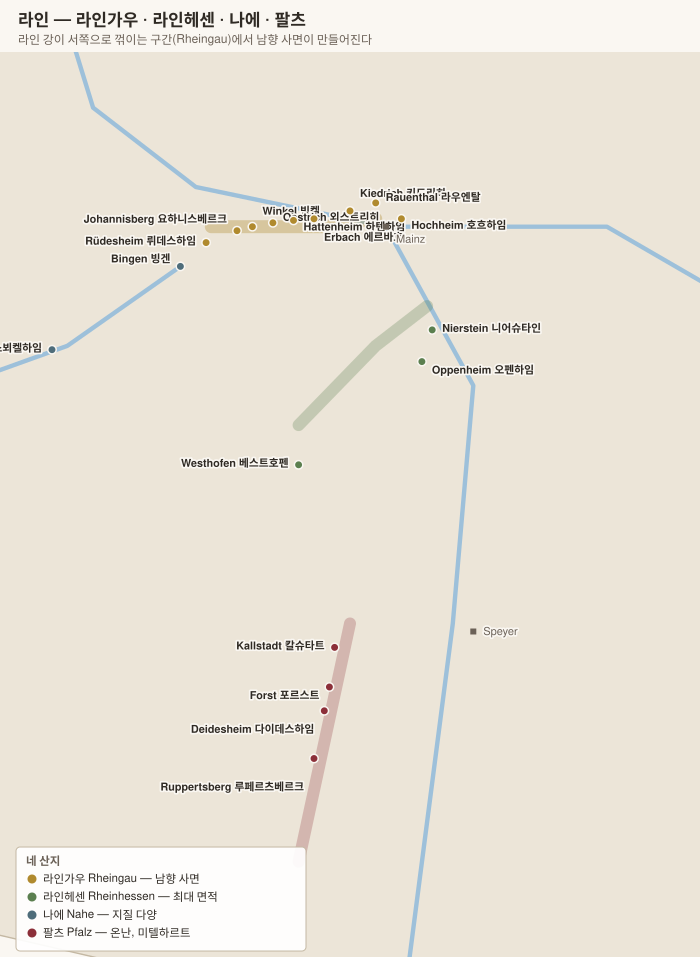

# 라인가우 Rheingau

> 라인 강이 **동에서 서로 30 km 꺾이는** 구간. 그 결과 강 북안 전체가 **완벽한 남향 사면**이 된다. 19세기에 보르도 1등급보다 비쌌던 독일 리슬링의 역사적 중심.

## 1. 기본 구조

| 항목 | 내용 |
|---|---|
| 면적 | 약 3,200 ha (모젤의 1/3) |
| 품종 | **리슬링 약 78%** + **슈페트부르군더 약 12%** |
| 지형 | **타우누스(Taunus 타우누스) 산맥이 북풍을 막고**, 남쪽 라인 강이 빛과 열을 반사 |
| 토양 | 서쪽 뤼데스하임은 **규암·편암**, 중부는 **뢰스·이회토**, 동쪽 호흐하임은 **점토·석회** |
| 스타일 | 모젤보다 **몸통이 있고 알코올이 높다**(11~13%). 드라이(GG) 비중이 높다 |

### 왜 라인가우인가

라인 강은 대체로 남에서 북으로 흐르는데, **빙겐(Bingen)에서 마인츠(Mainz)까지 약 30 km 구간만 동서로 흐른다.** 타우누스 산맥에 막혀 방향을 튼 것이다. 그 결과 강 북안이 통째로 남향 사면이 되었다.

---

## 2. 마을과 명품 밭

| 마을 | 대표 밭 (Einzellage) | 성격 | 생산자 |
|---|---|---|---|
| **Rüdesheim 뤼데스하임** | **Berg Schlossberg 베르크 슐로스베르크 · Berg Rottland · Berg Roseneck** | 서쪽 끝, **규암 급경사**. 가장 응축 | **Georg Breuer 게오르크 브로이어**, Leitz, Künstler |
| **Geisenheim 가이젠하임** | Rothenberg 로텐베르크 | 포도재배 연구소 소재지 | Johannishof |
| **Johannisberg 요하니스베르크** | **Schloss Johannisberg 슐로스 요하니스베르크** | **슈페트레제 발견지(1775).** 단일 소유 | **Schloss Johannisberg** |
| **Winkel 빙켈** | **Schloss Vollrads 슐로스 폴라츠** · Jesuitengarten | 폴라츠는 800년 이어진 단일 소유 | **Schloss Vollrads** |
| **Oestrich 외스트리히** | Lenchen 렌헨 · Doosberg 도스베르크 | | **Peter Jakob Kühn 페터 야코프 퀸**, Spreitzer |
| **Hattenheim 하텐하임** | **Marcobrunn 마르코브룬** · Nussbrunnen · **Steinberg 슈타인베르크** | **슈타인베르크는 12세기 시토회가 담을 두른 클로.** 부르고뉴 클로 부조와 같은 구조 | **Kloster Eberbach 클로스터 에버바흐**, Robert Weil |
| **Erbach 에르바흐** | **Marcobrunn 마르코브룬** · Siegelsberg | 마르코브룬은 하텐하임과 경계 | **Schloss Reinhartshausen**, Knyphausen |
| **Kiedrich 키드리히** | **Gräfenberg 그레펜베르크** · Turmberg | 고도가 높아 서늘, 산도 우수 | **Robert Weil 로베르트 바일** |
| **Rauenthal 라우엔탈** | **Baiken 바이켄** · Gehrn · Nonnenberg | 가장 높은 구역(200 m+). 구조적 | Georg Breuer, Künstler |
| **Hochheim 호흐하임** | **Domdechaney 돔데하나이 · Kirchenstück 키르헨슈튀크 · Hölle 횔레** | **마인 강가**, 라인가우 동쪽 끝. 점토질로 풍만 | **Künstler 퀸스틀러**, Domdechant Werner |
| **Assmannshausen 아스만스하우젠** | **Höllenberg 횔렌베르크** | **라인가우 유일의 레드 전문 마을.** 편암, 슈페트부르군더 | **August Kesseler 아우구스트 케슬러**, Chat Sauvage |

> **"Hock"의 어원** — 영국에서 독일 리슬링 전반을 **Hock**이라 불렀는데, **Hochheim 호흐하임**에서 온 말이다. 빅토리아 여왕이 이 마을을 방문한 뒤 붙은 별명이 나라 전체의 대명사가 되었다.

> **Kloster Eberbach 클로스터 에버바흐** — 1136년 세워진 시토회 수도원으로, **부르고뉴 클로 부조를 만든 것과 같은 수도회**다. 담으로 두른 **Steinberg 슈타인베르크**(32 ha)를 개간했고, 지금은 헤센 주립 와이너리가 운영한다. 영화 「장미의 이름」 촬영지이기도 하다.

---

## 3. 품종

| 품종 | 비중 | 라인가우에서의 성격 |
|---|---|---|
| **Riesling 리슬링** | 약 78% | 모젤보다 **몸통과 알코올이 있고 산도는 조금 낮다.** 사과·복숭아·감귤에 **광물성과 향신료**. 드라이(GG)가 잘 맞는다 |
| **Spätburgunder 슈페트부르군더** | 약 12% | **Assmannshausen 아스만스하우젠**의 편암 사면. 독일 피노 누아의 오래된 중심지 |
| Weissburgunder · Chardonnay | 소량 | |

> **라인가우는 드라이 노선을 먼저 택했다.** 1980년대에 이미 **Charta 카르타** 운동으로 드라이 리슬링 기준을 만들었고, 이것이 뒤에 VDP의 **Erstes Gewächs → Grosses Gewächs** 체계로 이어졌다. 지금도 GG 비중이 독일에서 가장 높은 산지 중 하나다.

---

## 4. 핵심 생산자

| 생산자 | 마을 | 특징 |
|---|---|---|
| **Robert Weil 로베르트 바일** | Kiedrich | 라인가우의 국제적 얼굴. Gräfenberg GG와 TBA |
| **Georg Breuer 게오르크 브로이어** | Rüdesheim | **VDP를 탈퇴**하고 자체 밭 등급을 쓴다. Berg Schlossberg |
| **Künstler 퀸스틀러** | Hochheim | 호흐하임 + 라우엔탈 |
| **Peter Jakob Kühn 페터 야코프 퀸** | Oestrich | 비오디나미 |
| **Schloss Johannisberg 슐로스 요하니스베르크** | Johannisberg | 슈페트레제 발견지. **캡슐 색으로 등급 표시** |
| **Schloss Vollrads 슐로스 폴라츠** | Winkel | 800년 단일 소유 |
| **Kloster Eberbach 클로스터 에버바흐** | Hattenheim | 헤센 주립. Steinberg |
| **August Kesseler 아우구스트 케슬러** | Assmannshausen | 슈페트부르군더 |
| **Leitz 라이츠 · Spreitzer · Josef Leitz · Domdechant Werner · Knyphausen** | | |

---

## 5. 라인가우를 읽는 요령

- **드라이를 기대해도 되는 산지**다. 모젤과 달리 GG·trocken 비중이 높다.
- **Rüdesheim 서쪽(Berg 3형제)과 Hochheim 동쪽은 성격이 다르다.** 서쪽은 규암·급경사로 광물적, 동쪽은 점토로 풍만하다.
- **Assmannshausen 레드**는 화이트 산지 안의 예외다. 독일 피노 누아의 역사적 중심으로, 최근 재평가되고 있다.
- **Georg Breuer는 VDP 비회원**이라 GG 표기를 쓰지 않는다. 대신 자체 밭 등급을 쓴다 — 라벨이 다르다고 등급이 낮은 것이 아니다.

---

[← 모젤](01-mosel.md) · [목차로](../README.md) · [다음: 나에·라인헤센·팔츠 →](03-nahe-rheinhessen-pfalz.md)
