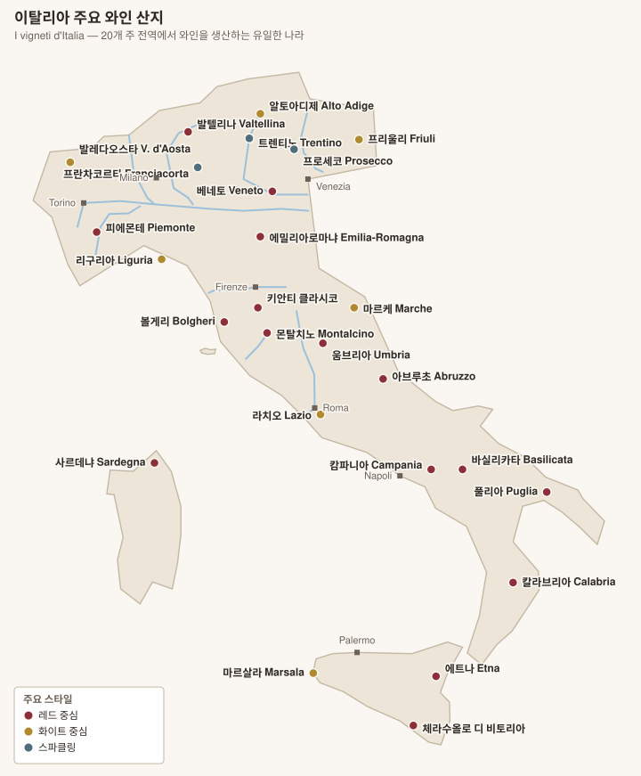

# 이탈리아 와인 개요

<!-- toc -->
## 목차

- [1. 프랑스와 무엇이 다른가](#1-프랑스와-무엇이-다른가)
- [2. 등급 체계](#2-등급-체계)
- [3. 라벨 읽기](#3-라벨-읽기)
- [4. 핵심 품종](#4-핵심-품종)
- [5. 이탈리아어 라벨 읽기 규칙](#5-이탈리아어-라벨-읽기-규칙)
- [6. 지역별 문서](#6-지역별-문서)
- [7. 이탈리아의 "밭 등급" 3대 체계](#7-이탈리아의-밭-등급-3대-체계)
- [8. 빈티지 개괄 (최근 위주)](#8-빈티지-개괄-최근-위주)

<!-- /toc -->

## 1. 프랑스와 무엇이 다른가

| 항목 | 프랑스 | 이탈리아 |
|---|---|---|
| 산지 분포 | 특정 지역에 집중 | **20개 주 전역**에서 생산 (세계 유일) |
| 품종 | 국제품종 중심, 약 200종 | **토착품종 500종 이상** 등록, 실제 2,000종 추정 |
| 등급 대상 | 밭·생산자·마을 (지역별로 다름) | 기본은 **산지(DOC/DOCG)** 단위 |
| 밭 단위 표기 | 부르고뉴 클리마 등 제도화 | **최근에야 제도화** — 바롤로 MGA(2010), 키안티 UGA(2021), 에트나 콘트라다 |
| 등급의 신뢰도 | 대체로 품질과 일치 | **DOCG가 항상 최고는 아니다** (아래 참조) |

## 2. 등급 체계

| 등급 | 개수 | 내용 |
|---|---|---|
| **DOCG** (Denominazione di Origine Controllata e Garantita 데노미나치오네 디 오리지네 콘트롤라타 에 가란티타) | 약 77 | 최상위. 정부 보증 목띠(fascetta 파세타) 부착, 병입 전 관능검사 |
| **DOC** (Denominazione di Origine Controllata 데노미나치오네 디 오리지네 콘트롤라타) | 약 330 | 산지·품종·수확량 규정 |
| **IGT** (Indicazione Geografica Tipica 인디카치오네 제오그라피카 티피카) | 약 120 | 넓은 지역 단위, 품종 자유 |
| **Vino** | – | 산지 규정 없음 |

> EU 표기로는 DOCG·DOC = **DOP**, IGT = **IGP**. 라벨에 병기되는 경우가 많다.

### ⚠️ 등급이 품질 순서가 아니다

이탈리아 와인 이해의 핵심이다.

- **DOCG 승격은 정치·행정의 산물**인 경우가 많다. 규정이 느슨한 DOCG도 있고, 반대로 최고급 와인이 IGT인 경우도 흔하다.
- **수퍼 투스칸**이 대표 사례: 1970년대 키안티 규정이 화이트 품종 의무 혼합을 요구하자, Sassicaia 사시카이아·Tignanello 티냐넬로 같은 최고급 와인들이 규정을 버리고 최하위 등급(당시 Vino da Tavola 비노 다 타볼라)으로 출시됐다. 지금도 **Toscana IGT**(토스카나 이제티)로 나오는 와인 중에 이탈리아 최고가가 여럿 있다.
- 같은 구조가 **Montevertine 몬테베르티네**(키안티 클라시코 지역이지만 IGT), **Soldera 솔데라**(브루넬로 탈퇴 후 IGT)에서도 반복된다.

## 3. 라벨 읽기

| 표기 | 의미 |
|---|---|
| **Classico 클라시코** | 해당 DOC의 **역사적 원조 핵심 구역**. 대개 품질이 더 높다 (Chianti Classico 키안티 클라시코, Soave Classico 소아베 클라시코, Valpolicella Classico 발폴리첼라 클라시코) |
| **Superiore 수페리오레** | 알코올 도수·숙성 기간 기준이 더 엄격 |
| **Riserva 리제르바** | 규정된 최소 숙성 기간을 더 채운 것 (DOC마다 다름) |
| **Vigna / Vigneto 비냐 / 비녜토** | 단일 밭 |
| **Cru / MGA / UGA / Contrada 콘트라다** | 추가 지리 표기 (지역별 명칭이 다름) |
| **Annata 안나타** | 빈티지 |
| **Imbottigliato all'origine 임보틸리아토 알로리지네** | 원산지 병입 |
| **Passito 파시토** | 포도를 말려 농축한 와인 |
| **Metodo Classico 메토도 클라시코** | 병내 2차 발효 스파클링 (= 샴페인 방식) |

## 4. 핵심 품종

> 각 품종의 향·구조·토양 대응·DOC 규정은 **지역 문서의 「품종」 절**에서 상세히 다룬다.

### 레드

| 품종 | 주 산지 | 성격 |
|---|---|---|
| **네비올로 Nebbiolo** | 피에몬테 (바롤로·바르바레스코) | 색은 옅으나 탄닌·산도 최강. 타르·장미 |
| **산조베제 Sangiovese** | 토스카나 (키안티·브루넬로) | 체리·흙·허브, 높은 산도 |
| **몬테풀차노 Montepulciano** | 아브루초 | 진한 색, 부드러운 탄닌 |
| **코르비나 Corvina** | 베네토 (발폴리첼라) | 신 체리, 건조 시 응축 |
| **알리아니코 Aglianico** | 캄파니아·바실리카타 | "남부의 네비올로", 강건·장수 |
| **네렐로 마스칼레제 Nerello Mascalese** | 시칠리아 (에트나) | 화산토, 피노 누아를 닮은 우아함 |
| **프리미티보 Primitivo** | 풀리아 | = 진판델. 진하고 달콤한 과실 |
| **네로 다볼라 Nero d'Avola** | 시칠리아 | 자두·향신료 |
| **바르베라 Barbera** | 피에몬테 | 산도 높고 탄닌 낮음 |
| **돌체토 Dolcetto** | 피에몬테 | 부드럽고 조기 음용 |
| **칸노나우 Cannonau** | 사르데냐 | = 그르나슈 |
| **라그레인 Lagrein** | 알토아디제 | 짙은 색, 서늘한 구조 |

### 화이트

| 품종 | 주 산지 | 성격 |
|---|---|---|
| **가르가네가 Garganega** | 베네토 (소아베) | 아몬드·흰꽃 |
| **베르디키오 Verdicchio** | 마르케 | 산도·미네랄, 숙성력 우수 |
| **피아노 Fiano** | 캄파니아 | 헤이즐넛·꿀, 장기 숙성 |
| **그레코 Greco** | 캄파니아 | 구조적, 광물성 |
| **베르멘티노 Vermentino** | 사르데냐·리구리아·토스카나 | 짠맛·감귤 |
| **글레라 Glera** | 베네토 (프로세코) | 사과·배, 탱크 발포 |
| **코르테제 Cortese** | 피에몬테 (가비) | 가볍고 산뜻 |
| **아르네이스 Arneis** | 피에몬테 (로에로) | 배·아몬드 |
| **리볼라 지알라 Ribolla Gialla** | 프리울리 | 오렌지 와인의 주역 |
| **팔랑기나 Falanghina** | 캄파니아 | 감귤·꽃 |
| **카리칸테 Carricante** | 시칠리아 (에트나) | 강한 산도, 화산 미네랄 |
| **피노 그리조 Pinot Grigio** | 북동부 | 대중적, 산지별 편차 큼 |

## 5. 이탈리아어 라벨 읽기 규칙

이탈리아어는 **쓰인 대로 읽는다**. 규칙 몇 개만 알면 대부분의 이름을 읽을 수 있다. 이 문서들에서는 이탈리아어 뒤에 한글 발음을 병기한다.

| 철자 | 소리 | 예 |
|---|---|---|
| **c** + a, o, u | ㅋ | Cannubi 칸누비 / Corvina 코르비나 |
| **c** + e, i | **ㅊ** | Cerequio 체레퀴오 / Cinque 친퀘 / Vercelli 베르첼리 |
| **ch** | **ㅋ** (e·i 앞에서도) | Chianti 키안티 / Chiavennasca 키아벤나스카 |
| **g** + a, o, u | ㄱ | Gattinara 가티나라 |
| **g** + e, i | **ㅈ** | Gaiole 가이올레 / Regione 레조네 |
| **gh** | **ㄱ** | Ghemme 겜메 / Borgo 보르고 |
| **gl** + i | **ㄹ리** | Aglianico 알리아니코 / Foglia 폴리아 |
| **gn** | **뉴 / 니** | Sangiovese 산조베제·Vigna 비냐 / Pignolo 피뇰로 |
| **sc** + e, i | **슈** | Sciacchetrà 샤케트라 / Scavino는 예외(스카비노) |
| **z, zz** | **ㅊ / ㅈ** | Nizza 니차 / Abruzzo 아브루초 / Lazio 라치오 |
| **h** | **항상 묵음** | Hofstätter는 독일어라 예외 |
| **qu** | 콰·퀘·퀴 | Quintarelli 퀸타렐리 |
| **s** (모음 사이) | **ㅈ** | Sangiovese 산조베제 / Casa 카사 |
| 겹자음 (ll, tt, ss…) | 앞 음절을 짧게 끊는다 | Falletto 팔레토 / Cannubi 칸누비 |
| 끝의 **-e** | 반드시 발음한다 | Barbaresco 바르바레스코 / Ravera 라베라 / Ovello 오벨로 |
| **강세** | 대개 뒤에서 두 번째 음절. 부호가 있으면 그 음절 | Barolo 바**로**로 / Prapò 프라**포** |

> **c와 g가 핵심이다.** `ci·ce`는 "치·체", `chi·che`는 "키·케". `gi·ge`는 "지·제", `ghi·ghe`는 "기·게". 그래서 **Chianti는 "치안티"가 아니라 키안티**이고, **Cerasuolo는 "케라수올로"가 아니라 체라수올로**다.

> **북동부는 다르다.** 알토아디제는 독일어(Südtirol 쥐트티롤, Weissburgunder 바이스부르군더), 발레다오스타는 프랑스어(Vallée d'Aoste 발레 다오스트)를 쓴다. 프리울리의 일부 이름은 슬로베니아어 계열이다(Gravner 그라브네르, Radikon 라디콘).

### 라벨에 자주 나오는 단어

| 이탈리아어 | 발음 | 뜻 |
|---|---|---|
| Azienda Agricola | 아치엔다 아그리콜라 | 자가 재배 농장 |
| Cantina | 칸티나 | 저장고 · 협동조합 |
| Tenuta / Podere / Fattoria | 테누타 / 포데레 / 파토리아 | 농장·에스타테 |
| Castello / Villa / Ca' | 카스텔로 / 빌라 / 카 | 성 / 저택 / 집 |
| Vigna / Vigneto | 비냐 / 비녜토 | 포도밭 |
| Rosso / Bianco / Rosato | 로소 / 비안코 / 로사토 | 레드 / 화이트 / 로제 |
| Secco / Amabile / Dolce | 세코 / 아마빌레 / 돌체 | 드라이 / 세미스위트 / 스위트 |
| Spumante / Frizzante | 스푸만테 / 프리찬테 | 발포 / 약발포 |
| Vendemmia | 벤뎀미아 | 수확·빈티지 |
| Vecchie Viti / Vigne Vecchie | 베키에 비티 / 비녜 베키에 | 노목 |
| Botte / Barrique | 보테 / 바리크 | 대형 오크통 / 225 L 배럴 |
| Sorì | 소리 | (피에몬테 방언) 남향 사면 |
| Bricco / Bric | 브리코 / 브리크 | (피에몬테 방언) 언덕 마루 |

---

## 6. 지역별 문서

| # | 문서 | 핵심 |
|---|---|---|
| 01 | [피에몬테](01-piemonte.md) | **바롤로·바르바레스코 코무네별 MGA(크뤼)** |
| 02 | [토스카나](02-toscana.md) | 키안티 클라시코 UGA, 브루넬로, 수퍼 투스칸 |
| 03 | [베네토](03-veneto.md) | 아마로네, 소아베, 프로세코 |
| 04 | [트렌티노알토아디제·프리울리](04-nordest.md) | 알토아디제, 콜리오, 오렌지 와인 |
| 05 | [롬바르디아·에밀리아로마냐·리구리아·발레다오스타](05-nord-altri.md) | 프란차코르타, 발텔리나, 람브루스코 |
| 06 | [중부 (마르케·아브루초·움브리아·라치오)](06-centro.md) | 베르디키오, 몬테풀차노, 사그란티노 |
| 07 | [남부 및 도서](07-sud-isole.md) | 타우라시, 프리미티보, **에트나 콘트라다** |

## 7. 이탈리아의 "밭 등급" 3대 체계

프랑스의 그랑크뤼에 해당하는 제도가 이탈리아에는 최근에야 생겼다. 세 곳이 대표적이다.

| 지역 | 명칭 | 도입 | 개수 |
|---|---|---|---|
| **바롤로·바르바레스코** | **MGA** (Menzione Geografica Aggiuntiva 멘치오네 제오그라피카 아준티바) | 2010 | 바롤로 181 · 바르바레스코 66 |
| **키안티 클라시코** | **UGA** (Unità Geografica Aggiuntiva 우니타 제오그라피카 아준티바) | 2021 | 11 |
| **에트나** | **Contrada 콘트라다** | 2011 | 133 |

> 셋 다 **품질 등급이 아니라 지리 표기**다. 부르고뉴처럼 밭에 서열을 매기지 않고, 어느 구획인지만 밝힌다. 서열은 시장이 정한다.

## 8. 빈티지 개괄 (최근 위주)

> 아래는 최근 빈티지 요약이다. **전체 연도별 상세 차트(성숙 상태·지역별 세분)**는 **[이탈리아 빈티지 차트 (1958~2025)](../vintages/02-italy.md)** 참조.

| 빈티지 | 피에몬테 | 토스카나 | 비고 |
|---|---|---|---|
| 2010 | ★★★★★ | ★★★★☆ | 바롤로의 전설적 해 |
| 2013 | ★★★★★ | ★★★★☆ | 클래식·장기 숙성형 |
| 2015 | ★★★★☆ | ★★★★★ | 풍만하고 접근성 좋음 |
| 2016 | ★★★★★ | ★★★★★ | 남북 모두 최고 수준 |
| 2019 | ★★★★★ | ★★★★☆ | 균형 우수 |
| 2020 | ★★★★☆ | ★★★★☆ | 조기 음용형 |
| 2021 | ★★★★★ | ★★★★☆ | 서늘하고 구조적 |
| 2022 | ★★★☆☆ | ★★★☆☆ | 폭염·가뭄, 생산자 편차 큼 |
| 2023 | ★★★★☆ | ★★★☆☆ | 토스카나는 곰팡이병 피해 |

> 지역·생산자별 편차가 크므로 참고용이다.

---

[목차로](../README.md) · [다음: 피에몬테 →](01-piemonte.md)
