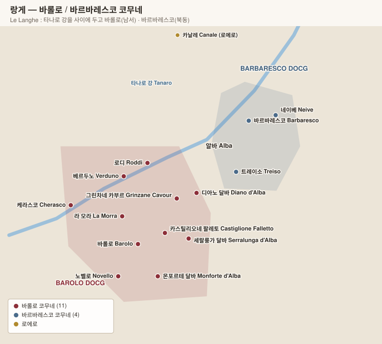
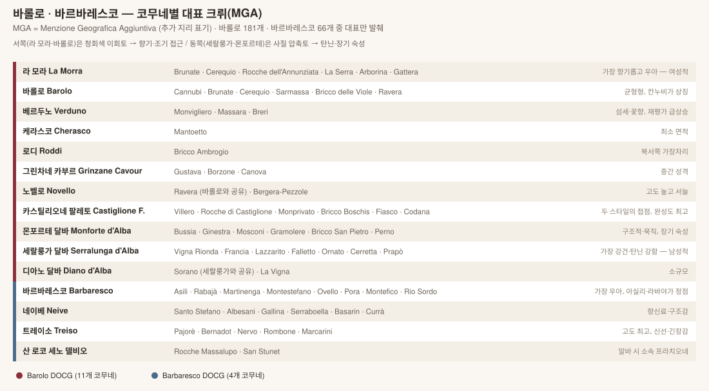

# 피에몬테 Piemonte

> "이탈리아의 부르고뉴". 소규모 가족 도멘, 단일 품종, 밭 단위 표기 — 구조가 부르고뉴와 가장 닮았다. **DOCG 19개로 전국 최다.**

## 1. 기본 구조

| 항목 | 내용 |
|---|---|
| 위치 | 이탈리아 북서부. 알프스와 아펜니노에 둘러싸인 분지 |
| 기후 | 대륙성. 가을 안개(nebbia)에서 **네비올로** 이름이 유래 |
| 특징 | **국제품종 거의 없음** — 토착품종 비중이 전국 최고 |
| 밭 표기 | **MGA** (Menzione Geografica Aggiuntiva), 2010년 제도화 |

### 3대 품종의 역할 분담

| 품종 | 비중 | 위치 | 성격 |
|---|---|---|---|
| **바르베라 Barbera** | 최다 | 좋은 밭의 차선 구역 | 산도 높고 탄닌 낮음. 일상주 |
| **돌체토 Dolcetto** | 중간 | 서늘한 구역 | 부드럽고 과실 중심, 조기 음용 |
| **네비올로 Nebbiolo** | 소수 | **최고 사면(남향)만** | 탄닌·산도 최강, 장기 숙성 |

> 피에몬테 농가의 전통: 가장 좋은 밭에는 네비올로, 나머지에 바르베라와 돌체토를 심는다. "돌체토는 오늘, 바르베라는 내일, 네비올로는 아들을 위해 마신다."

---

# 2. 바롤로 Barolo DOCG

| 항목 | 내용 |
|---|---|
| 품종 | **네비올로 100%** |
| 면적 | 약 2,200 ha (부르고뉴 코트도르보다 작다) |
| 코무네 | **11개** |
| 최소 숙성 | **38개월** (오크 18개월 이상) / **Riserva 62개월** |
| 밭 표기 | **MGA 181개** |

## 2-1. 토양이 스타일을 가른다

바롤로는 **두 가지 지질층**이 마을을 가로지른다. 이것이 서쪽·동쪽 스타일 차이의 원인이다.

| 지질 | 위치 | 토양 | 와인 |
|---|---|---|---|
| **토르토니안 Tortonian** | **서쪽** — 라 모라, 바롤로 | 청회색 이회토, 부드럽고 비옥 | 향기롭고 우아, 비교적 조기 접근 |
| **세라발리안 Serravallian(엘베치안)** | **동쪽** — 세랄룽가, 몬포르테 | 사질·압축된 석회이회토 | 탄닌 강건, 장기 숙성 필수 |
| 혼합 | **중앙** — 카스틸리오네 팔레토 | 양쪽 특성 | 두 스타일의 균형 |

## 2-2. 코무네별 대표 MGA와 생산자

### 라 모라 La Morra — 가장 넓고 가장 향기로움

| MGA | 비고 | 생산자 |
|---|---|---|
| **Brunate** | 바롤로 코무네와 공유. 최상급 | **Giuseppe Rinaldi**, Roberto Voerzio, Marcarini, Vietti |
| **Cerequio** | 바롤로와 공유 | Roberto Voerzio, Michele Chiarlo |
| **Rocche dell'Annunziata** | 실크 같은 질감 | **Paolo Scavino**, Trediberri, Renato Ratti, Aurelio Settimo |
| **La Serra** | | Roberto Voerzio, Marcarini |
| Arborina · Gattera · Bricco Rocca | | **Elio Altare**, Mauro Veglio |

**핵심 생산자**: Elio Altare · Roberto Voerzio · Renato Ratti · Trediberri · Mauro Veglio · Marcarini · Aurelio Settimo

### 바롤로 Barolo — 균형형, 칸누비가 상징

| MGA | 비고 | 생산자 |
|---|---|---|
| **Cannubi** | 바롤로의 얼굴. 두 지질층이 만나는 능선 | **Paolo Scavino**, Damilano, Marchesi di Barolo, E. Pira/Chiara Boschis, Brezza |
| **Brunate / Cerequio** | 라 모라와 공유 | Giuseppe Rinaldi, Voerzio |
| **Sarmassa** | 구조감 좋음 | Brezza, Marchesi di Barolo |
| **Bricco delle Viole** | 최고 고도(약 400 m), 서늘 | **G.D. Vajra** |
| **Ravera** | 노벨로와 공유 | Vietti, Elvio Cogno |

**핵심 생산자**: **Bartolo Mascarello**(전통주의의 상징, 단일 블렌드 고수) · **Giuseppe Rinaldi** · G.D. Vajra · Brezza · Damilano · E. Pira – Chiara Boschis

### 카스틸리오네 팔레토 Castiglione Falletto — 두 스타일의 접점

| MGA | 비고 | 생산자 |
|---|---|---|
| **Villero** | 파워와 우아함의 균형 | **Vietti**(Riserva Villero), Giuseppe Mascarello, Brovia, Oddero |
| **Rocche di Castiglione** | 급경사, 향기로움 | **Vietti**, Brovia, Oddero, Roagna |
| **Monprivato** | 사실상 단독 소유 | **Giuseppe Mascarello**(Ca' d'Morissio) |
| **Bricco Boschis** | 단독 소유 | **Cavallotto** |
| Fiasco · Codana · Vignolo | | Paolo Scavino, Brovia |

**핵심 생산자**: **Vietti** · **Cavallotto** · **Giuseppe Mascarello** · **Brovia** · Paolo Scavino · Oddero

### 세랄룽가 달바 Serralunga d'Alba — 가장 강건

| MGA | 비고 | 생산자 |
|---|---|---|
| **Vigna Rionda** | 전설적 밭. 극도의 장수 | **Massolino**(Riserva), Ettore Germano, Giovanni Rosso, Luigi Pira |
| **Francia** | **Giacomo Conterno의 Monfortino가 여기서 나온다** | **Giacomo Conterno**(Cascina Francia · Monfortino) |
| **Falletto** | | **Bruno Giacosa**(Le Rocche del Falletto — 붉은 라벨 Riserva) |
| **Lazzarito** | | Vietti, Ettore Germano, Fontanafredda |
| **Ornato** | | **Pio Cesare** |
| Cerretta · Prapò · Margheria · Parafada · Arione | | Ettore Germano, Massolino, Giovanni Rosso, Roberto Voerzio |

**핵심 생산자**: **Giacomo Conterno** · **Bruno Giacosa** · **Massolino** · Ettore Germano · Giovanni Rosso · Luigi Pira · Guido Porro

### 몬포르테 달바 Monforte d'Alba — 구조적·묵직

| MGA | 비고 | 생산자 |
|---|---|---|
| **Bussia** | 매우 넓어 품질 편차 큼 | **Aldo Conterno**(Granbussia), Giacomo Fenocchio, Poderi Colla, Prunotto |
| **Ginestra** | | **Elio Grasso**(Casa Matè), Domenico Clerico, Conterno Fantino |
| **Mosconi** | | Conterno Fantino, Pio Cesare |
| **Gramolere** | | Giacomo Fenocchio |
| Bricco San Pietro · Perno · Castelletto | | Domenico Clerico, Diego Conterno |

**핵심 생산자**: **Aldo Conterno** · **Elio Grasso** · Giacomo Fenocchio · Domenico Clerico · Conterno Fantino · Poderi Colla

### 그 밖의 코무네

| 코무네 | 대표 MGA | 생산자 |
|---|---|---|
| **베르두노 Verduno** | **Monvigliero**(재평가 급상승), Massara | **Burlotto**(Monvigliero), Castello di Verduno, Fratelli Alessandria |
| **노벨로 Novello** | **Ravera** | **Elvio Cogno**(Ravera, Bricco Pernice), Vietti |
| **그린차네 카부르 Grinzane Cavour** | Gustava, Borzone | Castello di Grinzane |
| **디아노 달바 Diano d'Alba** | Sorano (세랄룽가와 공유) | Claudio Alario |
| **케라스코 Cherasco** | Mantoetto | 극소 면적 |
| **로디 Roddi** | Bricco Ambrogio | Paolo Scavino |

## 2-3. 전통주의 vs 현대주의 (Barolo Wars)

1980~90년대 바롤로를 둘로 갈랐던 논쟁. 현재는 상당히 수렴했다.

| | 전통파 Tradizionalisti | 현대파 Modernisti |
|---|---|---|
| 침용 | 장기 (30~60일) | 단기 (7~15일), 로토퍼멘터 |
| 숙성 | **대형 슬라보니아 오크통(Botte)** | **프랑스산 바리크(225 L)** |
| 스타일 | 탄닌 견고, 색 옅음, 장기 숙성 필요 | 색 진하고 부드러움, 조기 접근 |
| 대표 | Bartolo Mascarello, Giuseppe Rinaldi, Giacomo Conterno, Cavallotto, Brovia | Elio Altare, Domenico Clerico, Roberto Voerzio, Paolo Scavino |

---

# 3. 바르바레스코 Barbaresco DOCG

| 항목 | 내용 |
|---|---|
| 품종 | **네비올로 100%** |
| 면적 | 약 750 ha (바롤로의 1/3) |
| 코무네 | **4개** — 바르바레스코, 네이베, 트레이소, 산 로코 세노 델비오 |
| 최소 숙성 | **26개월** (오크 9개월 이상) / **Riserva 50개월** |
| 밭 표기 | **MGA 66개** |

바롤로보다 **고도가 낮고 타나로 강에 가까워 따뜻하다** → 조금 더 빨리 익고 탄닌이 부드럽다. 그래서 "바롤로의 여성형"이라 불리지만, 최상급은 바롤로 못지않게 장수한다.

## 코무네별 대표 MGA

### 바르바레스코 Barbaresco

| MGA | 비고 | 생산자 |
|---|---|---|
| **Asili** | 우아함의 정점 | **Bruno Giacosa**, Ceretto(Bricco Asili), Produttori del Barbaresco, Roagna |
| **Rabajà** | 파워와 구조 | **Bruno Rocca**, Giuseppe Cortese, Produttori del Barbaresco |
| **Martinenga** | **모노폴** | **Marchesi di Grésy** |
| **Montestefano** | 가장 남성적 | Produttori del Barbaresco |
| **Ovello · Pora · Montefico · Rio Sordo · Pajè** | | Produttori del Barbaresco, Roagna(Pajè) |
| **Secondine** | 여기에 Gaja의 **Sorì San Lorenzo** | **Gaja** |

### 네이베 Neive

| MGA | 비고 | 생산자 |
|---|---|---|
| **Santo Stefano** | 브루노 자코사의 상징 | **Bruno Giacosa**, Castello di Neive |
| **Albesani** | Santo Stefano를 포함하는 상위 MGA | Castello di Neive |
| **Gallina** | | **Sottimano**, La Spinetta |
| **Serraboella** | | **Paitin**, Cigliuti |
| **Currà · Basarin · Bricco di Neive** | | Sottimano, Piero Busso, Cantina del Pino |

### 트레이소 Treiso

| MGA | 비고 | 생산자 |
|---|---|---|
| **Pajorè** | 고도 최고, 긴장감 | **Sottimano**, Rizzi |
| **Rombone** | | **Fiorenzo Nada** |
| **Bernadot · Nervo · Marcarini** | | Ca' del Baio, Pertinace, Rizzi |

## 가야 Gaja — 별도 취급

바르바레스코를 세계 무대에 올린 생산자. 단일 밭 3종이 특히 유명하다.

| 와인 | 밭 | 비고 |
|---|---|---|
| **Sorì San Lorenzo** | Secondine (바르바레스코) | |
| **Sorì Tildìn** | Roncagliette (바르바레스코) | |
| **Costa Russi** | Roncagliette (바르바레스코) | |
| Barbaresco | 여러 밭 블렌드 | |
| **Sperss · Conteisa** | 세랄룽가 / 라 모라 (바롤로 지역) | 가야가 바롤로에서 만드는 와인 |

> 1996~2011 빈티지는 소량의 바르베라를 섞어 **Langhe Nebbiolo**로 출시했다가, 2013 빈티지부터 다시 **Barbaresco DOCG**로 복귀했다.

> **Produttori del Barbaresco**는 협동조합이지만 품질이 매우 높다. 좋은 해에만 9개 MGA 리제르바를 개별 병입하며, 가격 대비 가치가 뛰어나다.

---

# 4. 그 밖의 피에몬테

## 4-1. 바르베라 Barbera

| DOC(G) | 내용 | 생산자 |
|---|---|---|
| **Barbera d'Asti DOCG** | 바르베라의 본거지 | Braida(Bricco dell'Uccellone), Vietti |
| **Nizza DOCG** | 2014년 독립. 바르베라 최상위 등급 | Michele Chiarlo, Olim Bauda |
| **Barbera d'Alba DOC** | 랑게의 바르베라. 더 진함 | Giacomo Conterno(Cascina Francia), Vietti |
| **Barbera del Monferrato Superiore DOCG** | | |

## 4-2. 돌체토 Dolcetto

| DOC(G) | 내용 | 생산자 |
|---|---|---|
| **Dogliani DOCG** | 돌체토 최상위 산지 | **Chionetti**, San Fereolo |
| **Dolcetto d'Alba DOC** | | G.D. Vajra, Marcarini |
| **Dolcetto di Diano d'Alba DOCG** · **Dolcetto di Ovada DOCG** | | |

## 4-3. 로에로 Roero — 타나로 강 건너편

| DOCG | 품종 | 특징 | 생산자 |
|---|---|---|---|
| **Roero DOCG** | 네비올로 | 모래질 토양 → 랑게보다 가볍고 향기로움 | **Matteo Correggia**, Malvirà, Val del Prete |
| **Roero Arneis DOCG** | **아르네이스** | 배·아몬드·흰꽃. 피에몬테 대표 화이트 | Bruno Giacosa, Vietti, Malvirà |

## 4-4. 북부 피에몬테 네비올로 (Alto Piemonte)

알프스에 가까운 서늘한 산지. **가볍고 산도가 높으며 저평가**되어 있다. 현지에서는 네비올로를 **스판나(Spanna)**라 부른다.

| DOC(G) | 특징 | 생산자 |
|---|---|---|
| **Gattinara DOCG** | 북부 최고. 화산암·빙퇴석 | **Antoniolo**, Travaglini, Nervi-Conterno |
| **Ghemme DOCG** | 가티나라 건너편 | Antichi Vigneti di Cantalupo |
| **Carema DOC** | 알프스 계단밭, 극도로 섬세 | **Ferrando**, Produttori di Carema |
| **Lessona DOC** | 해양 모래 토양 | **Proprietà Sperino**, Tenute Sella |
| **Boca DOC** | 화산토 | **Le Piane** |
| Bramaterra · Sizzano · Fara | | |

## 4-5. 화이트와 스파클링

| DOC(G) | 품종 | 내용 | 생산자 |
|---|---|---|---|
| **Gavi / Cortese di Gavi DOCG** | 코르테제 | 가볍고 산뜻. 해산물용 | La Scolca, Villa Sparina |
| **Alta Langa DOCG** | 피노 네로·샤르도네 | **메토도 클라시코** 스파클링, 최소 30개월 | Contratto, Enrico Serafino |
| **Moscato d'Asti DOCG** | 모스카토 비앙코 | 저알코올(5%대) 세미스파클링 | Vietti(Cascinetta), Saracco |
| **Asti DOCG** | 모스카토 | 완전 발포 | |
| **Brachetto d'Acqui DOCG** | 브라케토 | 붉은 스위트 스파클링 | Braida |
| **Erbaluce di Caluso DOCG** | 에르발루체 | 스틸·스파클링·파시토 | Orsolani, Ferrando |

## 4-6. 기타 토착 레드

| DOC(G) | 품종 | 특징 |
|---|---|---|
| **Ruchè di Castagnole Monferrato DOCG** | 루케 | 장미·향신료 향, 희귀 |
| **Grignolino d'Asti DOC** | 그리뇰리노 | 색 매우 옅고 탄닌 높음 |
| **Freisa d'Asti DOC** | 프레이자 | 네비올로의 친척, 때로 약발포 |
| **Langhe Nebbiolo DOC** | 네비올로 | 바롤로·바르바레스코의 저렴한 입문 |
| **Nebbiolo d'Alba DOC** | 네비올로 | 랑게 외곽 |

---

[← 개요](00-overview.md) · [목차로](../README.md) · [다음: 토스카나 →](02-toscana.md)
