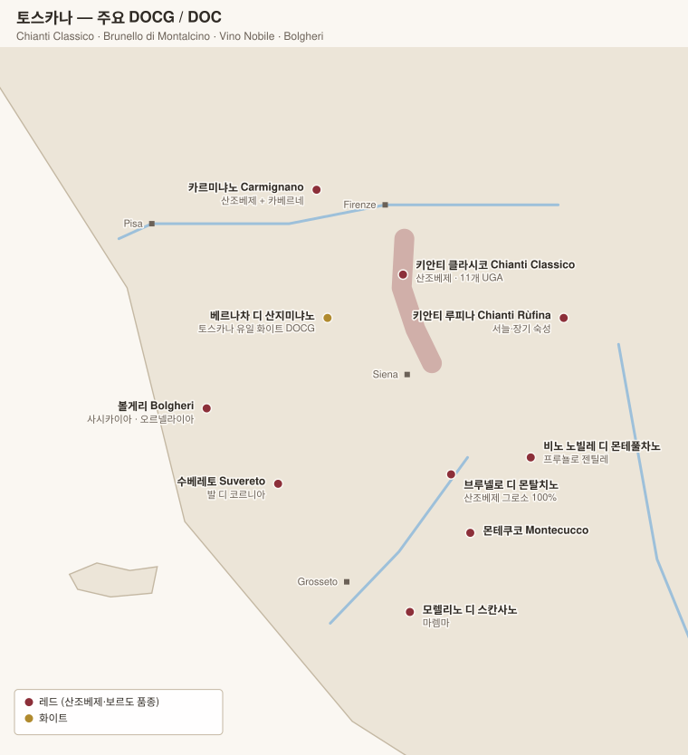

# 토스카나 Toscana

> **산조베제**의 고향이자, 규정을 버리고 최고급 와인을 만든 **수퍼 투스칸**의 발상지.

## 1. 기본 구조

| 항목 | 내용 |
|---|---|
| 주품종 | **산조베제 Sangiovese** (지역별 별칭이 있다) |
| 별칭 | 몬탈치노 = **Brunello / Sangiovese Grosso** · 몬테풀차노 = **Prugnolo Gentile** · 스칸사노 = **Morellino** |
| 보조 품종 | 카나이올로, 콜로리노 (전통) / 카베르네 소비뇽, 메를로 (현대) |
| 토양 | **갈레스트로(galestro)** 편암 · **알베레제(alberese)** 석회암 |
| DOCG | 11개 |

---

# 2. 키안티 클라시코 Chianti Classico DOCG

**"Chianti"와 "Chianti Classico"는 다른 와인이다.** 클라시코는 피렌체~시에나 사이의 역사적 원조 구역이며, 별도의 DOCG다. 라벨의 **검은 수탉(Gallo Nero)** 마크로 구분한다.

| 항목 | 내용 |
|---|---|
| 품종 | **산조베제 80% 이상** (100%도 가능). 화이트 품종 혼합은 2006년부터 **금지** |
| 면적 | 약 7,200 ha |
| 고도 | 250~600 m |

## 2-1. 등급 3단계

| 등급 | 최소 숙성 | 조건 |
|---|---|---|
| **Annata** (기본) | 12개월 | |
| **Riserva** | 24개월 | |
| **Gran Selezione** | **30개월** | **자기 밭 포도만** 사용. 2023년부터 **산조베제 90% 이상**, 국제품종 사용 금지 |

> **Gran Selezione(2013 신설)**은 2023년 규정 개정으로 UGA 표기가 허용되면서 사실상 "키안티 클라시코의 그랑크뤼" 역할을 하게 됐다.

## 2-2. UGA 11개 (2021년 도입)

**UGA (Unità Geografiche Aggiuntive)** — 부르고뉴식 마을 단위 표기. **Gran Selezione에만** 라벨 표기가 허용된다.

| UGA | 위치 | 성격 | 대표 생산자 |
|---|---|---|---|
| **San Casciano** | 최북단 | 부드럽고 조기 접근 | Castello di Gabbiano, Le Corti |
| **Montefioralle** | 그레베 서쪽 | 소규모, 고도 높음 | Castello di Montefioralle |
| **Panzano** | 중앙, 콘카 도로 원형분지 | **가장 응축·유명**. 비오디나미 밀집 | **Fontodi**, Il Molino di Grace, Vecchie Terre di Montefili |
| **Greve** | 중앙 | 균형형 | Castello di Verrazzano, Querciabella |
| **Lamole** | 고도 최고(600 m) | 향기롭고 섬세 | Lamole di Lamole, I Fabbri |
| **Radda** | 고지대 | 서늘·긴장감·높은 산도 | **Castello di Volpaia**, Montevertine(IGT), Val delle Corti |
| **Gaiole** | 동부 | 구조적·장기 숙성 | **Castello di Ama**, Badia a Coltibuono, Riecine, San Giusto a Rentennano |
| **Castellina** | 서부 | 우아·향기 | Castellare, Rocca delle Macìe |
| **Vagliagli** | 남부 | | Dievole |
| **San Donato in Poggio** | 서부 | | **Isole e Olena**, Monsanto |
| **Castelnuovo Berardenga** | 최남단, 가장 따뜻 | 풍만·힘 | **Fèlsina**(Rancia), Castello di Bossi |

## 2-3. 핵심 생산자

| 생산자 | UGA | 대표 와인 |
|---|---|---|
| **Fontodi** | Panzano | Vigna del Sorbo (Gran Selezione), **Flaccianello**(IGT) |
| **Castello di Ama** | Gaiole | Vigneto Bellavista, La Casuccia |
| **Fèlsina** | Castelnuovo B. | **Rancia** (Riserva) |
| **Isole e Olena** | San Donato | **Cepparello**(IGT, 산조베제 100%) |
| **Castello di Volpaia** | Radda | Coltassala |
| **Montevertine** | Radda | **Le Pergole Torte** (IGT — 키안티 클라시코 등급을 거부) |
| **San Giusto a Rentennano** | Gaiole | **Percarlo**(IGT) |
| **Querciabella** · **Badia a Coltibuono** · **Riecine** · **Monsanto** · **Barone Ricasoli**(Castello di Brolio) | | |

## 2-4. 그 밖의 키안티

| DOCG | 내용 |
|---|---|
| **Chianti Rùfina** | 피렌체 동쪽 고지대. 서늘하고 장기 숙성력 뛰어남 — **Selvapiana**, Frescobaldi(Nipozzano) |
| **Chianti Colli Senesi / Colli Fiorentini / Montalbano 등** | 클라시코 외곽 7개 하위 구역 |
| **Chianti** | 광역. 품질 편차가 매우 크다 |

---

# 3. 브루넬로 디 몬탈치노 Brunello di Montalcino DOCG

| 항목 | 내용 |
|---|---|
| 품종 | **산조베제 그로소 100%** (혼합 불가) |
| 최소 숙성 | **5년** (오크 2년 이상) — 수확 5년째 1월 1일 출시 |
| Riserva | **6년** (오크 2년 이상) |
| 면적 | 약 2,100 ha |

키안티보다 따뜻하고 건조해 **더 진하고 알코올이 높으며 장수**한다. 1888년 비온디산티가 첫 브루넬로를 만들었다.

## 3-1. 구역별 성격

몬탈치노는 공식 하위 구역이 없지만 실무적으로 이렇게 나눈다.

| 구역 | 위치 | 성격 | 생산자 |
|---|---|---|---|
| **북부** | 몬탈치노 마을 북·북동 | 고도 높고 서늘. 우아·산도·향기 | **Biondi-Santi**, **Cerbaiona**, Il Marroneto, Le Ragnaie, Canalicchio di Sopra |
| **남부** (Sant'Angelo in Colle · Castelnuovo dell'Abate) | 남쪽, 아미아타 산 기슭 | 따뜻하고 파워풀·응축 | **Poggio di Sotto**, **Salvioni**, Lisini, Ciacci Piccolomini, Stella di Campalto |
| **동부** (Torrenieri) | 점토질 | 묵직하고 견고 | |
| **서부** | 해양 영향 | 부드럽고 조기 접근 | Casanova di Neri, Col d'Orcia |

## 3-2. 핵심 생산자

| 생산자 | 비고 |
|---|---|
| **Biondi-Santi** | 브루넬로의 창시자. Riserva는 전설 |
| **Case Basse di Gianfranco Soldera** | 2013년 브루넬로 조합 탈퇴 → 현재 **Toscana IGT**. 여전히 최고가 |
| **Poggio di Sotto** | 남부 최상급, 전통적 접근 |
| **Cerbaiona** | 극소량, 컬트 |
| **Salvioni (La Cerbaiola)** | |
| **Il Marroneto** | Madonna delle Grazie |
| **Valdicava** | Madonna del Piano Riserva |
| **Stella di Campalto** | 비오디나미, 극소량 |
| Conti Costanti · Fuligni · Lisini · Le Ragnaie · Canalicchio di Sopra · Casanova di Neri | |

> **Rosso di Montalcino DOC** — 같은 포도밭의 어린 와인(숙성 1년). 브루넬로의 절반 가격에 스타일을 맛볼 수 있다. 좋은 해에는 브루넬로용 포도가 로소로 내려오기도 한다.

---

# 4. 비노 노빌레 디 몬테풀차노 Vino Nobile di Montepulciano DOCG

> **주의**: 아브루초의 **몬테풀차노 다브루초**와 완전히 다르다. 이쪽은 **지명**, 저쪽은 **품종명**이다.

| 항목 | 내용 |
|---|---|
| 품종 | **프루뇰로 젠틸레(산조베제) 70% 이상** + 카나이올로 등 |
| 최소 숙성 | 24개월 / Riserva 36개월 |
| 성격 | 브루넬로보다 부드럽고 키안티보다 묵직. 가성비 우수 |
| 신설 | **Vino Nobile Riserva "Pieve"** (2024~) — 교구(pieve) 단위 지리 표기 12개 |

**생산자**: **Avignonesi**, **Boscarelli**, **Poliziano**, Gracciano della Seta, Salcheto, Il Macchione

> **Rosso di Montepulciano DOC** — 어린 버전.

---

# 5. 볼게리 Bolgheri & 수퍼 투스칸

## 5-1. 볼게리 Bolgheri DOC

토스카나 해안(마렘마 북부). **산조베제가 아니라 보르도 품종**의 땅이다.

| 항목 | 내용 |
|---|---|
| 품종 | 카베르네 소비뇽, 메를로, 카베르네 프랑, 시라, 프티 베르도 |
| 특징 | 해양성 기후, 자갈 토양. 보르도보다 따뜻하고 무르익음 |
| 특례 | **Bolgheri Sassicaia** — 1994년 볼게리 DOC의 하위 구역으로 인정되었다가 **2013년 독립 DOC**가 되었다. 단일 와인만을 위한 DOC는 이탈리아에서 유일 |

| 와인 | 생산자 | 비고 |
|---|---|---|
| **Sassicaia** | Tenuta San Guido | 이탈리아 최초의 수퍼 투스칸(1968 첫 출시). 카베르네 소비뇽 중심 |
| **Ornellaia** | Tenuta dell'Ornellaia | 보르도 블렌드 |
| **Masseto** | Ornellaia (별도 이름) | **메를로 100%**, 점토 구획. 이탈리아 최고가급 (Toscana IGT) |
| **Guado al Tasso** | Antinori | |
| **Paleo Rosso · Messorio** | **Le Macchiole** | Messorio는 메를로 100% |
| **Grattamacco** | Grattamacco | |

## 5-2. 대표 수퍼 투스칸 (대부분 Toscana IGT)

| 와인 | 생산자 | 구성 |
|---|---|---|
| **Tignanello** | Antinori | 산조베제 + 카베르네. 수퍼 투스칸의 원형 |
| **Solaia** | Antinori | 카베르네 중심 |
| **Flaccianello della Pieve** | Fontodi | 산조베제 100% |
| **Cepparello** | Isole e Olena | 산조베제 100% |
| **Le Pergole Torte** | Montevertine | 산조베제 100% |
| **Percarlo** | San Giusto a Rentennano | 산조베제 100% |
| **Redigaffi** | Tua Rita | 메를로 100% |
| **Saffredi** | Le Pupille | 마렘마, 보르도 블렌드 |
| **Sammarco** | Castello dei Rampolla | |

> 핵심: 수퍼 투스칸은 "카베르네를 쓴 와인"이 아니다. **산조베제 100%인데 규정을 벗어나 IGT가 된 와인**도 많다(플라차넬로, 체파렐로, 페르골레 토르테). 규정 회피의 이유는 품종만이 아니라 **화이트 혼합 의무·숙성 규정** 등 다양했다.

---

# 6. 그 밖의 토스카나

| DOC(G) | 내용 | 생산자 |
|---|---|---|
| **Carmignano DOCG** | 피렌체 서쪽. **16세기부터 카베르네를 합법적으로 사용**한 유일한 전통 산지 | **Capezzana**, Piaggia |
| **Vernaccia di San Gimignano DOCG** | 토스카나 **유일의 화이트 DOCG**. 베르나차 품종 | Montenidoli, Panizzi |
| **Morellino di Scansano DOCG** | 마렘마 남부. 산조베제, 부드럽고 과실 중심 | Le Pupille, Poggio Argentiera |
| **Montecucco Sangiovese DOCG** | 몬탈치노 남서쪽. 저평가 | ColleMassari |
| **Suvereto DOCG / Val di Cornia** | 해안, 보르도 품종 | Tua Rita, Petra |
| **Maremma Toscana DOC** | 광역 | |
| **Bolgheri Rosato · Vin Santo del Chianti Classico DOC** | 빈 산토는 말린 포도로 만든 스위트. 카라텔리 통에서 수년 숙성 | Isole e Olena, Avignonesi(Occhio di Pernice) |

---

[← 피에몬테](01-piemonte.md) · [목차로](../README.md) · [다음: 베네토 →](03-veneto.md)
