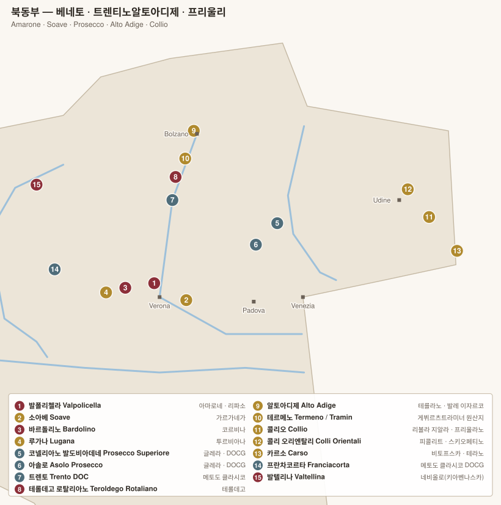

# 트렌티노알토아디제 · 프리울리베네치아줄리아

> 알프스와 슬로베니아 국경에 걸친 산지. **이탈리아 화이트 와인의 최고 수준**이 여기 있다.

---

# 1. 알토아디제 Alto Adige (쥐트티롤 Südtirol)

1919년까지 오스트리아 영토. 지금도 **독일어가 공용어**이고 와인 이름도 이탈리아어·독일어를 병기한다.

| 항목 | 내용 |
|---|---|
| 위치 | 이탈리아 최북단. 아디제 강 계곡 |
| 면적 | 약 5,600 ha (매우 작다) |
| 특징 | 이탈리아에서 **DOC 비율이 가장 높다(98%)** |
| 기후 | 알프스 한랭 + 지중해 남풍(Ora)의 교차 → 큰 일교차 |
| 고도 | 200~1,000 m |

## 1-1. 품종

| 색 | 품종 |
|---|---|
| **화이트 (65%)** | **피노 비앙코(Weissburgunder 바이스부르군더)**, **게뷔르츠트라미너**, 소비뇽, 샤르도네, 피노 그리조, **케르너**, 실바너, 리슬링, 뮐러 투르가우 |
| **레드 (35%)** | **스키아바(Vernatsch 페르나치)** — 가볍고 일상적 / **라그레인 Lagrein** — 짙고 구조적 / **피노 네로** |

> **게뷔르츠트라미너의 원산지**로 여겨지는 마을 **트라민(Tramin / Termeno 트라민 / 테르메노)**이 여기 있다.

## 1-2. 하위 구역 (Sottozone)

| 구역 | 특징 | 대표 |
|---|---|---|
| **Terlano / Terlaner 테를라노 / 테를라너** | 화산 반암(porphyry 포르피리)·석영. **장기 숙성 화이트의 성지** | **Cantina Terlano 칸티나 테를라노** |
| **Valle Isarco / Eisacktaler 발레 이사르코 / 아이자크탈러** | 최북·최고지대. 케르너·실바너·리슬링 | **Abbazia di Novacella 아바치아 디 노바첼라**, Kuenhof 퀸호프, Köfererhof 쾨페러호프 |
| **Santa Maddalena / St. Magdalener 산타 마달레나 / 장크트 마그달레너** | 볼차노 언덕. 스키아바 | Cantina Bolzano 칸티나 볼차노 |
| **Lago di Caldaro / Kalterersee 라고 디 칼다로 / 칼테러제** | 호수 주변, 스키아바 | |
| **Val Venosta / Vinschgau 발 베노스타 / 빈슈가우** | 극서부, 극소량 | Falkenstein 팔켄슈타인 |
| **Meranese 메라네제** | Merano 메라노 주변 | |

## 1-3. 핵심 생산자

| 생산자 | 대표 와인 |
|---|---|
| **Cantina Terlano 칸티나 테를라노** | **Vorberg 포어베르크**(피노 비앙코 리제르바), Nova Domus 노바 도무스, **Rarità 라리타**(10년 이상 숙성 후 출시) |
| **Cantina Tramin 칸티나 트라민** | **Nussbaumer 누스바우머**(게뷔르츠트라미너), Epokale 에포칼레 |
| **Hofstätter 호프슈테터** | **Barthenau Vigna S. Urbano 바르테나우 비냐 산 우르바노** (이탈리아 최고 피노 네로 중 하나) |
| **Alois Lageder 알로이스 라게더** | 비오디나미, Löwengang 뢰벤강 |
| **Elena Walch 엘레나 발크** | Castel Ringberg 카스텔 링베르크, Kastelaz 카스텔라츠 |
| **Manincor 마닌코르** | 비오디나미 |
| **Franz Haas 프란츠 하스** | 피노 네로 |
| **Abbazia di Novacella 아바치아 디 노바첼라** | 수도원 와이너리, 케르너·실바너 |
| Kuenhof 퀸호프 · Köfererhof 쾨페러호프 · Cantina Girlan 칸티나 지를란 · Cantina San Michele Appiano 칸티나 산 미켈레 아피아노 | |

> 알토아디제는 **협동조합(Cantina)의 품질이 매우 높은** 드문 지역이다. 조합원이 소규모 밭을 정성껏 관리하는 구조가 정착했다.

---

# 2. 트렌티노 Trentino

알토아디제 남쪽. 더 따뜻하고 생산량이 많으며, **스파클링**이 강점.

| DOC(G) | 내용 | 생산자 |
|---|---|---|
| **Trento DOC 트렌토 도크** | **메토도 클라시코 스파클링**. 샤르도네·피노 네로. 프란차코르타와 함께 이탈리아 양대 스파클링 | **Ferrari 페라리**(Giulio Ferrari Riserva del Fondatore 줄리오 페라리 리제르바 델 폰다토레), Rotari 로타리, Cesarini Sforza 체사리니 스포르차, Letrari 레트라리 |
| **Teroldego Rotaliano 테롤데고 로탈리아노 DOC** | **테롤데고** 품종. 로탈리아나 평야의 자갈밭. 짙고 신선 | **Elisabetta Foradori 엘리사베타 포라도리**(Granato 그라나토, Morei 모레이) |
| **Trentino DOC 트렌티노** | 광역. Marzemino 마르체미노, Nosiola 노시올라, 샤르도네 | |
| **Vino Santo Trentino 비노 산토 트렌티노** | 노시올라 품종 건조 스위트 | |

> **Elisabetta Foradori 엘리사베타 포라도리**는 테롤데고를 무명 품종에서 세계적 품종으로 끌어올린 인물. 암포라 숙성·비오디나미로 유명하다.

---

# 3. 프리울리베네치아줄리아 Friuli-Venezia Giulia

이탈리아 화이트의 정점이자 **오렌지 와인(스킨 콘택트)의 발상지**.

| 항목 | 내용 |
|---|---|
| 위치 | 슬로베니아 국경. 알프스가 북풍을 막고 아드리아해가 온기를 준다 |
| 토양 | **폰카(ponca 폰카)** — 이회토와 사암이 층층이 쌓인 이 지역 고유 토양 |
| 특징 | 1970년대 **"화이트 와인 혁명"**(저온 발효·환원적 양조)의 진원지 |

## 3-1. 품종

| 품종 | 성격 |
|---|---|
| **프리울라노 Friulano** | 이 지역의 얼굴. 아몬드·풀향. (2007년까지 "Tocai Friulano 토카이 프리울라노") |
| **리볼라 지알라 Ribolla Gialla** | 산도 높고 껍질이 두꺼워 오렌지 와인에 적합 |
| **말바지아 이스트리아나** | |
| **피콜리트 Picolit** | 희귀 스위트 품종 |
| **베르두초 Verduzzo** | 스위트(라만돌로) |
| **레포스코 달 페둔콜로 로소 Refosco** | 레드. 자두·허브 |
| **스키오페티노 Schioppettino** | 레드. 후추향 |
| **피뇰로 Pignolo · 타첼렌게 Tazzelenghe** | 희귀 레드, 탄닌 강함 |
| 소비뇽, 피노 그리조, 샤르도네 | 국제품종도 높은 수준 |

## 3-2. 주요 DOC

| DOC(G) | 내용 | 생산자 |
|---|---|---|
| **Collio 콜리오 DOC** (Collio Goriziano 콜리오 고리치아노) | 슬로베니아 국경의 언덕. 프리울리 최고 구역 | **Josko Gravner 요스코 그라브네르**, **Radikon 라디콘**, **Damijan Podversic 다미얀 포드베르시치**, **La Castellada 라 카스텔라다**, Schiopetto 스키오페토, Borgo del Tiglio 보르고 델 틸리오, Venica & Venica 베니카 에 베니카 |
| **Friuli Colli Orientali 프리울리 콜리 오리엔탈리 DOC** | 콜리오 북쪽 | **Miani 미아니**(Enzo Pontoni 엔초 폰토니), Ronco del Gnemiz 롱코 델 녜미츠, Le Due Terre 레 두에 테레, Vignai da Duline 비냐이 다 둘리네 |
| **Ramandolo 라만돌로 DOCG** | 베르두초 스위트 | Dario Coos 다리오 코스 |
| **Rosazzo 로사초 DOCG** | 프리울라노 중심 블렌드 | Livio Felluga 리비오 펠루가(Terre Alte 테레 알테) |
| **Colli Orientali Picolit 피콜리트 DOCG** | 피콜리트 스위트 | |
| **Friuli Isonzo 프리울리 이손초 DOC** | 평야, 자갈 | Vie di Romans 비에 디 로만스, Ronco del Gelso 롱코 델 젤소 |
| **Carso 카르소 DOC** | 트리에스테 인근 석회암 카르스트 지형. **Vitovska 비토프스카**, Terrano 테라노 | **Vodopivec 보도피베츠**, **Zidarich 지다리치**, Skerk 스케르크 |
| **Friuli Grave 프리울리 그라베 DOC** | 최대 면적, 대량생산 | |

## 3-3. 오렌지 와인 (Vino Macerato 비노 마체라토)

화이트 품종을 **껍질과 함께 오래 침용**해 만드는 와인. 색이 호박빛이고 탄닌이 있다.

| 생산자 | 방식 |
|---|---|
| **Josko Gravner 요스코 그라브네르** | **조지아식 크베브리(암포라)**를 땅에 묻어 6개월 침용, 6년 숙성. 오렌지 와인 운동의 상징 |
| **Stanko / Saša Radikon 사샤 라디콘** | 대형 오크통에서 3개월 침용, 무아황산 |
| **Damijan Podversic 다미얀 포드베르시치 · La Castellada 라 카스텔라다 · Dario Prinčič 다리오 프린치치** | |
| **Paraschos 파라스코스 · Franco Terpin 프랑코 테르핀** | |

> 국경 너머 슬로베니아의 **브르다(Brda)**·**비파바(Vipava)** 지역과 사실상 같은 테루아이며, 두 나라 생산자들이 함께 이 운동을 만들었다.

---

[← 베네토](03-veneto.md) · [목차로](../README.md) · [다음: 북부 기타 →](05-nord-altri.md)
