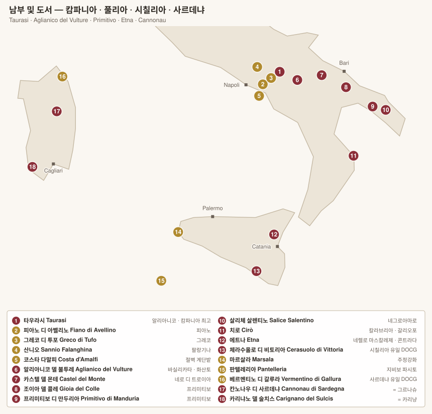
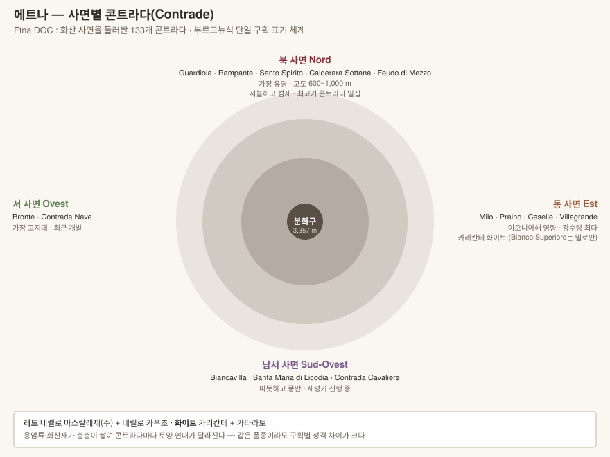

# 남부 및 도서 — 캄파니아 · 풀리아 · 바실리카타 · 칼라브리아 · 시칠리아 · 사르데냐

> 고대 그리스인이 이탈리아 남부를 **"오이노트리아(Oenotria, 포도나무의 땅)"**라 불렀다. 가장 오래된 산지이면서 가장 최근에 재발견된 산지다.

---

# 1. 캄파니아 Campania

나폴리 주변. **화산토**와 **고지대**가 만드는 서늘한 산지로, 남부라는 인상과 달리 산도가 높다.

## 1-1. 이르피니아 3대 DOCG

아벨리노 내륙 고지대(400~700 m)에 세 개의 DOCG가 몰려 있다.

| DOCG | 품종 | 성격 | 생산자 |
|---|---|---|---|
| **Taurasi DOCG** | **알리아니코 100%** | **"남부의 바롤로"**. 최소 3년(리제르바 4년) 숙성. 탄닌·산도 강해 10~20년 발전 | **Mastroberardino**(Radici), **Luigi Tecce**, Contrade di Taurasi(Cantina Lonardo), Feudi di San Gregorio, Quintodecimo |
| **Fiano di Avellino DOCG** | **피아노** | 헤이즐넛·꿀·연기. 화이트인데 10년 이상 숙성 | **Pietracupa**, **Guido Marsella**, Ciro Picariello, Villa Diamante |
| **Greco di Tufo DOCG** | **그레코** | 유황 토양. 구조적·광물성 | **Benito Ferrara**(Vigna Cicogna), Pietracupa, Cantine dell'Angelo |

> **Mastroberardino**는 20세기 중반 남부 토착품종이 사라질 위기에서 알리아니코·피아노·그레코를 지켜낸 가문이다. 폼페이 유적의 고대 포도밭 복원 프로젝트도 진행했다.

## 1-2. 그 밖의 캄파니아

| DOC(G) | 내용 | 생산자 |
|---|---|---|
| **Aglianico del Taburno DOCG** | 베네벤토. 타우라시보다 부드러움 | Cantina del Taburno |
| **Falanghina del Sannio DOC** | **팔랑기나**. 감귤·흰꽃, 가성비 우수 | Mustilli, La Guardiense |
| **Costa d'Amalfi DOC** | 아말피 절벽 계단밭. 극한 농업 | **Marisa Cuomo**(Fiorduva) |
| **Campi Flegrei DOC** | 화산 분화구 지대. **피에디로소**, 팔랑기나. **자근(自根) 포도나무** | **La Sibilla**, Cantine Astroni |
| **Ischia / Capri DOC** | 섬 산지 | |
| **Vesuvio DOC (Lacryma Christi)** | 베수비오 화산 | Sorrentino |

---

# 2. 바실리카타 Basilicata

| DOC(G) | 내용 | 생산자 |
|---|---|---|
| **Aglianico del Vulture DOC** / **Superiore DOCG** | 사화산 **불투레 산** 사면(450~600 m). 화산재 토양. 타우라시보다 더 야성적·미네랄 | **Elena Fucci**(Titolo), Paternoster, **Grifalco**, Cantine del Notaio, Musto Carmelitano |

> 남부의 알리아니코 2대 산지 — **타우라시(캄파니아)** vs **불투레(바실리카타)**. 타우라시가 더 구조적·귀족적이라면, 불투레는 더 화산적이고 짜다.

---

# 3. 풀리아 Puglia

이탈리아의 "발뒤꿈치". 생산량 최상위권이며, 오랫동안 북부로 보내는 **블렌딩용 벌크 와인** 산지였다가 최근 자기 이름을 되찾았다.

| DOC(G) | 품종 | 내용 | 생산자 |
|---|---|---|---|
| **Primitivo di Manduria DOC** | **프리미티보** | **진판델과 동일 품종**. 원종은 크로아티아의 트리비드라그(츨리에나크 카슈텔란스키). 진하고 잼 같은 과실 | **Gianfranco Fino**(Es), **Morella**, Felline |
| **Primitivo di Manduria Dolce Naturale DOCG** | 동일 | 자연 잔당 스위트 | |
| **Gioia del Colle Primitivo DOC** | 프리미티보 | 고도 높아 더 신선·구조적 | **Polvanera**, Pietraventosa |
| **Salice Salentino DOC** | **네그로아마로** + 말바지아 네라 | 살렌토 반도. 부드럽고 향신료 | Taurino, Candido |
| **Castel del Monte DOCG** (Rosso/Nero di Troia/Bombino Nero) | **네로 디 트로이아** | 북부 무르자 고원 | **Rivera**(Il Falcone), Torrevento |
| **Copertino · Brindisi · Squinzano DOC** | 네그로아마로 | | |

> 풀리아의 전통 수형은 **알베렐로(alberello, 부시 바인)** — 낮게 자라 뜨거운 바람과 강한 햇빛을 견딘다. 폴바네라·피노 같은 생산자들이 이 고목 밭을 지키고 있다.

---

# 4. 칼라브리아 Calabria

| DOC | 품종 | 내용 | 생산자 |
|---|---|---|---|
| **Cirò DOC** | **갈리오포 Gaglioppo** | 고대 그리스 시대부터 이어진 산지. 색이 옅고 탄닌·산도 높아 네비올로와 비교된다 | **'A Vita**, **Librandi**, Cataldo Calabretta, Sergio Arcuri |
| **Greco di Bianco DOC** | 그레코 | 극소량 파시토 스위트 | |

> 칼라브리아는 최근 자연파 소규모 생산자들이 등장하며 급격히 재평가받는 중이다.

---

# 5. 시칠리아 Sicilia

## 5-1. 에트나 Etna DOC — 이탈리아의 부르고뉴

유럽 최대 활화산 사면. 2000년대 이후 이탈리아에서 가장 극적으로 재평가된 산지다.

| 항목 | 내용 |
|---|---|
| 품종 (레드) | **네렐로 마스칼레제** (주) + **네렐로 카푸초** |
| 품종 (화이트) | **카리칸테** + 카타라토 |
| 고도 | 400~1,000 m (일부 1,100 m) |
| 토양 | 용암류·화산재가 시대별로 층층이 쌓임 |
| 밭 표기 | **콘트라다 Contrada** — 133개 (2011년 제도화) |
| 특징 | **자근 고목** 다수. 필록세라가 화산 모래에서 살지 못함 |

### 사면별 성격

| 사면 | 주요 콘트라다 | 성격 |
|---|---|---|
| **북 Nord** | **Guardiola, Rampante, Santo Spirito, Calderara Sottana, Feudo di Mezzo, Barbabecchi** | 가장 유명. 서늘하고 섬세, 최고가 밀집 |
| **동 Est** | **Milo**, Praino, Caselle, Villagrande | 이오니아해 영향, 강수량 최다. **Etna Bianco Superiore는 밀로에서만** 생산 가능 |
| **남서 Sud-Ovest** | Biancavilla, Santa Maria di Licodia | 따뜻하고 풍만. 재평가 진행 중 |
| **서 Ovest** | Bronte, Contrada Nave | 최고지대, 최근 개발 |

**핵심 생산자**

| 생산자 | 비고 |
|---|---|
| **Benanti** | 에트나 부흥의 출발점(1988~) |
| **Passopisciaro (Andrea Franchetti)** | 콘트라다별 단일 병입 체계를 확립 |
| **Tenuta delle Terre Nere (Marc de Grazia)** | 여러 콘트라다 단일 밭, 자근 고목 |
| **Frank Cornelissen** | 극단적 자연주의, 무개입 |
| **Graci · Girolamo Russo · Pietradolce · Tenuta di Fessina** | |
| **I Vigneri (Salvo Foti)** | 전통 알베렐로 수형 보존 운동 |

## 5-2. 그 밖의 시칠리아

| DOC(G) | 품종 | 내용 | 생산자 |
|---|---|---|---|
| **Cerasuolo di Vittoria DOCG** | **네로 다볼라 + 프라파토** | **시칠리아 유일의 DOCG**. 밝고 향기로움 | **COS**, **Arianna Occhipinti**, Valle dell'Acate, Planeta |
| **Marsala DOC** | 그릴로, 카타라토, 인촐리아 | 주정강화. 등급: Fine < Superiore < Vergine/Soleras | **Marco De Bartoli**(Vecchio Samperi, Vigna La Miccia) |
| **Passito di Pantelleria DOC** | **지비보(모스카토 달레산드리아)** | 화산섬. 알베렐로 수형이 **유네스코 무형문화유산** | **Donnafugata**(Ben Ryé), De Bartoli(Bukkuram) |
| **Sicilia DOC** | 네로 다볼라, 그릴로, 프라파토, 카리칸테 | 광역 | Planeta, Feudo Montoni, Occhipinti |
| **Faro DOC** | 네렐로 | 메시나. 극소량 | Palari |

---

# 6. 사르데냐 Sardegna

지리적으로는 이탈리아지만 품종은 **스페인계**가 많다. 400년 넘게 아라곤 왕국의 지배를 받았다.

| DOC(G) | 품종 | 내용 | 생산자 |
|---|---|---|---|
| **Vermentino di Gallura DOCG** | **베르멘티노** | **사르데냐 유일의 DOCG**. 북동부 화강암. 짠맛·감귤 | **Capichera**, Siddùra, Cantina Gallura |
| **Cannonau di Sardegna DOC** | **칸노나우** | = **그르나슈/가르나차**. 허브·붉은 과실. 하위 구역 Nepente di Oliena, Jerzu, Capo Ferrato | **Giuseppe Gabbas**, **Giovanni Montisci**, **Tenute Dettori**, Argiolas |
| **Carignano del Sulcis DOC** | **카리냐노** | = **카리냥**. 남서부 모래 토양, **자근 고목**. 진하고 부드러움 | **Santadi**(Terre Brune, Rocca Rubia), Cantina Mesa |
| **Vernaccia di Oristano DOC** | 베르나차 디 오리스타노 | **효모막(flor) 아래 산화 숙성** — 셰리 피노와 유사 | **Contini**(Antico Gregori) |
| **Vermentino di Sardegna DOC** | 베르멘티노 | 광역 | Argiolas |
| **Monica / Nuragus / Malvasia di Bosa** | 토착품종 | | |

> 사르데냐의 **모래 토양**과 고립된 섬 환경 덕분에 필록세라 피해가 적었고, **접목하지 않은 100년 이상 고목**이 다수 남아 있다.

---

[← 중부](06-centro.md) · [목차로](../README.md)
