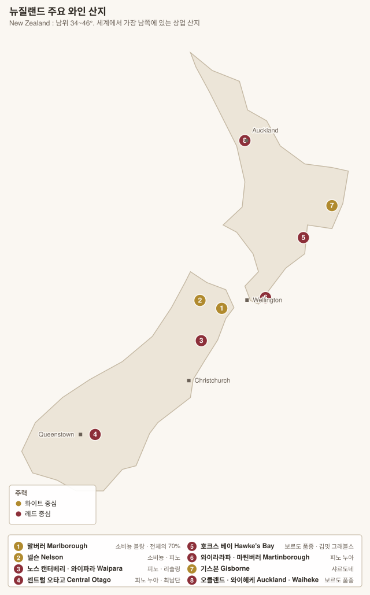

# 북섬 North Island — 호크스 베이 · 마틴버러 · 기스본 · 오클랜드

> 남섬이 소비뇽 블랑과 피노 누아의 땅이라면, **북섬은 보르도 품종과 시라의 땅**이다. 더 따뜻하고, 그래서 뉴질랜드에서 유일하게 카베르네 소비뇽이 완숙한다.

| 산지 | 재배 비중 | 주력 | 한 줄 |
|---|---|---|---|
| **Hawke's Bay 호크스 베이** | 약 9% | 보르도 품종 · 시라 · 샤르도네 | 뉴질랜드 最古 산지(1851), 김밋 그래블스 |
| **Gisborne 기스본** | 약 3% | **샤르도네** | "뉴질랜드의 샤르도네 수도" |
| **Wairarapa / Martinborough** | 약 2% | **피노 누아** | 극소량·고품질 |
| **Auckland / Waiheke** | 약 1% | 보르도 품종 · 시라 | 섬 미기후 |

<!-- toc -->
## 목차

- [1. 호크스 베이 Hawke's Bay](#1-호크스-베이-hawkes-bay)
  - [Gimblett Gravels 김밋 그래블스 — 밭이 스스로 경계를 만든 사례](#gimblett-gravels-김밋-그래블스--밭이-스스로-경계를-만든-사례)
  - [호크스 베이 시라](#호크스-베이-시라)
- [2. 기스본 Gisborne](#2-기스본-gisborne)
- [3. 와이라라파 · 마틴버러 Wairarapa · Martinborough](#3-와이라라파--마틴버러-wairarapa--martinborough)
- [4. 오클랜드 · 와이헤케 Auckland · Waiheke Island](#4-오클랜드--와이헤케-auckland--waiheke-island)
- [5. 품종 — 북섬에서의 성격](#5-품종--북섬에서의-성격)

<!-- /toc -->

---

# 1. 호크스 베이 Hawke's Bay

| 항목 | 내용 |
|---|---|
| 역사 | **1851년 마리아회 선교사**가 식재. 뉴질랜드 最古의 상업 산지 |
| 위치 | 북섬 동안. **산맥이 서풍을 막아** 뉴질랜드에서 가장 따뜻하고 건조한 축 |
| 품종 | **Merlot 메를로 · Cabernet Sauvignon · Cabernet Franc · Malbec** · **Syrah 시라** · **Chardonnay 샤르도네** |
| 특징 | **토양 다양성이 극단적** — 과거 강줄기가 여러 번 바뀌며 자갈·모래·점토가 뒤섞였다 |

## Gimblett Gravels 김밋 그래블스 — 밭이 스스로 경계를 만든 사례

| 항목 | 내용 |
|---|---|
| 기원 | **1867년 대홍수**로 응아루로로(Ngaruroro 응아루로로) 강의 물길이 바뀌면서 드러난 **깊은 자갈층** |
| 면적 | 약 800 ha |
| 경계 | **1990년대 생산자들이 스스로 토양 지도를 만들어** 자갈층이 있는 곳만 포함시켰다. GI가 아니라 **민간 상표(Gimblett Gravels Winegrowing District)** |
| 작용 | 자갈이 낮의 열을 저장했다 밤에 방출 → **주변보다 2~3℃ 높다.** 뉴질랜드에서 카베르네 소비뇽이 완숙하는 거의 유일한 곳 |

> **Bridge Pa Triangle 브리지 파 트라이앵글** — 김밋 그래블스 남쪽의 인접 구역으로, 자갈 위에 **붉은 양토가 덮여 있다.** 보수력이 더 좋아 메를로·시라에 유리하다는 평가다.

## 호크스 베이 시라

호주 시라즈와 전혀 다르다. **알코올 13% 내외, 후추·제비꽃·올리브**로 **북부 론(코트로티)에 가장 가까운 신세계 시라**라는 평가가 굳어졌다.

**핵심 생산자**: **Te Mata 테 마타**(Coleraine — 뉴질랜드 아이콘 보르도 블렌드) · **Craggy Range 크래기 레인지**(Le Sol 시라 · Sophia) · **Trinity Hill 트리니티 힐**(Homage 시라) · **Elephant Hill** · **Bilancia**(La Collina 시라) · **Sacred Hill**(Riflemans Chardonnay) · Villa Maria

---

# 2. 기스본 Gisborne

| 항목 | 내용 |
|---|---|
| 위치 | 북섬 동단. **세계에서 해가 가장 먼저 뜨는 와인 산지** 중 하나 |
| 기후 | 따뜻하고 습하다. 강우가 많아 곰팡이 압박이 있다 |
| 토양 | 비옥한 충적토 |
| 품종 | **Chardonnay 샤르도네**(약 40%) · Pinot Gris · Gewürztraminer · Albariño |
| 성격 | 풍만하고 열대과일 쪽. **"뉴질랜드의 샤르도네 수도"**를 자칭 |

**핵심 생산자**: **Millton 밀턴**(뉴질랜드 최초의 비오디나미 인증, Clos de Ste Anne) · Matawhero · Bushmere

---

# 3. 와이라라파 · 마틴버러 Wairarapa · Martinborough

> 웰링턴 북동쪽 80 km. **뉴질랜드 전체 생산의 2%도 안 되지만** 피노 누아의 명성은 센트럴 오타고와 나란하다.

| 항목 | 내용 |
|---|---|
| 지형 | **Martinborough Terrace 마틴버러 테라스** — 옛 강바닥이 남긴 자갈 단구 |
| 기후 | 산맥 그늘에 들어 **뉴질랜드에서 가장 건조한 축.** 강한 바람이 알을 작게 만든다 |
| 품종 | **Pinot Noir 피노 누아** · Sauvignon Blanc · Chardonnay · Riesling |
| 성격 | 센트럴 오타고보다 **더 구조적이고 향신료·흙내**가 있다. 부르고뉴 코트드뉘에 비유된다 |

| 하위 구역 | 비고 |
|---|---|
| **Martinborough 마틴버러** | 중심. 자갈 단구 |
| **Gladstone 글래드스톤** | 북쪽 |
| **Masterton 매스터턴** | 북쪽 |

**핵심 생산자**: **Ata Rangi 아타 랑이**(뉴질랜드 피노의 상징) · **Dry River 드라이 리버** · **Escarpment 에스카프먼트** · **Kusuda 쿠스다**(일본인 양조가 쿠스다 히로유키) · **Palliser Estate** · Craggy Range(Te Muna Road)

---

# 4. 오클랜드 · 와이헤케 Auckland · Waiheke Island

| 항목 | 내용 |
|---|---|
| 기후 | 아열대성. **습하고 비가 많다** — 곰팡이 압박이 크다 |
| 완화 | **Waiheke Island 와이헤케 섬**은 바다에 둘러싸여 더 건조하고 따뜻하다 |
| 품종 | **Bordeaux blend 보르도 블렌드** · **Syrah 시라** · Chardonnay |
| 하위 구역 | **Waiheke Island 와이헤케** · **Kumeu 쿠뮤** · Matakana · Clevedon |

**핵심 생산자**: **Kumeu River 쿠뮤 리버**(Maté's Vineyard — 뉴질랜드 최고 샤르도네로 자주 꼽힌다) · **Stonyridge 스토니리지**(Larose — 와이헤케 보르도 블렌드) · **Man O' War** · Destiny Bay · Puriri Hills

> **Kumeu River 쿠뮤 리버**는 크로아티아계 브라이코비치(Brajkovich) 가문이 운영하며, **부르고뉴식 통 발효·전량 젖산발효**로 만든다. 블라인드에서 코트드본과 나란히 놓이는 일이 잦다.

---

# 5. 품종 — 북섬에서의 성격

| 품종 | 어디서 | 성격 |
|---|---|---|
| **Merlot 메를로** | **호크스 베이** | 뉴질랜드 최대 재배 레드. 자두·초콜릿, 부드럽다 |
| **Cabernet Sauvignon** | **김밋 그래블스** | 뉴질랜드에서 **완숙하는 거의 유일한 곳.** 카시스·삼나무, 절제된 알코올 |
| **Cabernet Franc 카베르네 프랑** | 호크스 베이 · 와이헤케 | 서늘한 기후에 잘 맞아 비중이 늘고 있다 |
| **Syrah 시라** | **호크스 베이 · 와이헤케** | **후추·제비꽃·올리브.** 알코올 13% 내외. 북부 론 스타일 |
| **Chardonnay 샤르도네** | **쿠뮤 · 기스본 · 호크스 베이** | 쿠뮤는 부르고뉴식 정밀, 기스본은 풍만·열대 |
| **Pinot Noir 피노 누아** | **마틴버러** | 구조적·향신료·흙내. 남섬보다 굵다 |
| **Pinot Gris · Gewürztraminer · Albariño** | 기스본 · 오클랜드 | 아로마틱 화이트 |

> **뉴질랜드 시라의 위치** — 호주 시라즈(잼·알코올 15%)와 정반대로, **알코올 12.5~13.5%에 후추와 꽃**이 앞선다. 위도(남위 39°)와 해양성 기후가 북부 론과 비슷한 조건을 만든 결과다.

---

[← 남섬](01-south-island.md) · [목차로](../README.md)
