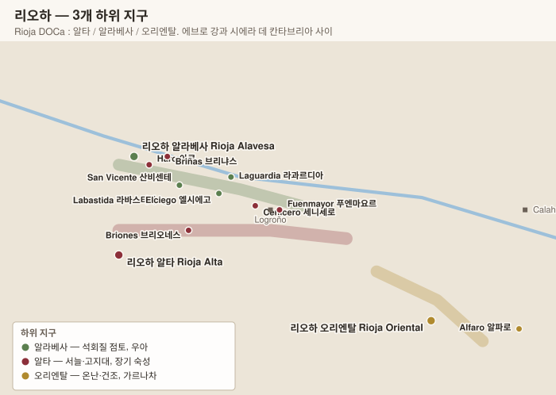

# 리오하 Rioja

> 스페인 최초의 **DOCa**(1991). 등급의 축이 밭이 아니라 **오크통 숙성 기간**이라는 점이 스페인 와인의 성격을 결정했다. 2017년부터 밭 등급이 도입되면서 지금 가장 크게 변하고 있는 산지이기도 하다.

## 1. 기본 구조

| 항목 | 내용 |
|---|---|
| 위치 | 에브로 강(Ebro 에브로) 상류, 남북으로 **시에라 데 칸타브리아 Sierra de Cantabria** 산맥이 대서양 바람을 막는다 |
| 면적 | 약 66,000 ha — 스페인 최대 고급 산지 |
| 고도 | 300~700 m (서쪽이 높고 동쪽이 낮다) |
| 기후 | **대서양 · 지중해 · 대륙성이 만나는 지점**. 서쪽은 서늘·습윤, 동쪽은 덥고 건조 |
| 행정 | 라리오하 주 + 알라바 주(바스크) + 나바라 주 일부에 걸친다 |

## 2. 3개 하위 지구

2018년 **Rioja Baja 리오하 바하**("아래 리오하")가 **Rioja Oriental 리오하 오리엔탈**("동부 리오하")로 개명되었다. "아래"라는 어감이 열등하게 들린다는 이유였다.

| 지구 | 면적 | 고도·기후 | 토양 | 성격 |
|---|---|---|---|---|
| **Rioja Alta 리오하 알타** | 약 27,000 ha | 가장 높고 서늘 | 석회질 점토 · 충적토 | **장기 숙성형의 중심**. 산도 좋고 우아. 클래식 보데가 대부분이 여기 |
| **Rioja Alavesa 리오하 알라베사** | 약 13,500 ha | 산 바로 아래, 남향 | **석회질 점토 계단밭** | 가장 향기롭고 부드럽다. 소규모 밭 중심 |
| **Rioja Oriental 리오하 오리엔탈** | 약 25,000 ha | 낮고 덥고 건조 | 충적토 · 철분 점토 | **가르나차의 땅**. 알코올 높고 풍만. 과거 저평가 → 재평가 중 |

> **알타와 알라베사는 에브로 강을 사이에 두고 마주 본다.** 알라베사는 북안(강 왼쪽, 산 아래), 알타는 남안이 중심이다. 두 지구는 사실 이어진 하나의 사면이라 경계는 행정적인 것에 가깝다.

### 핵심 마을

| 마을 | 지구 | 특징 |
|---|---|---|
| **Haro 아로** | 알타 | 리오하의 수도. **Barrio de la Estación 바리오 데 라 에스타시온**(기차역 구역)에 100년 넘은 보데가 7곳이 도보 거리에 모여 있다 |
| **Briones 브리오네스** | 알타 | 고지대, 산도 좋은 밭 |
| **Cenicero 세니세로** · **Fuenmayor 푸엔마요르** | 알타 | 대형 보데가 밀집 |
| **San Vicente de la Sonsierra 산비센테 데 라 손시에라** | 알타(강 북안) | 알라베사와 같은 사면. 노목 밀집 |
| **Labastida 라바스티다** | 알라베사 | 가장 서쪽·서늘 |
| **Laguardia 라과르디아** | 알라베사 | 성벽 마을. 지하 셀러 |
| **Elciego 엘시에고** | 알라베사 | 마르케스 데 리스칼의 게리 건물로 유명 |
| **Alfaro 알파로** · **Calahorra 칼라오라** | 오리엔탈 | 동쪽 끝, 가장 덥다 |

## 3. 품종 Variedades 바리에다데스

> 리오하는 **블렌딩 산지**다. 부르고뉴처럼 단일 품종이 아니라, 네 개의 레드가 각각 다른 결점을 메우며 하나의 와인을 만든다. 다만 최근에는 템프라니요 단일 비율이 계속 올라가고 있다.

| 품종 | 색 | 레드 재배 비중 | 역할 |
|---|---|---|---|
| **Tempranillo 템프라니요** | 레드 | 약 88% | 몸통·구조·오크와의 궁합 |
| **Garnacha 가르나차** | 레드 | 약 8% | 알코올·과실·풍만함 |
| **Graciano 그라시아노** | 레드 | 약 2% | **향·산도·탄닌** |
| **Mazuelo 마수엘로** | 레드 | 약 2% | 색·산도·수명 |
| **Maturana Tinta 마투라나 틴타** | 레드 | 극소량 | 2007년 부활한 토착종 |

---

### Tempranillo 템프라니요 — 스페인의 얼굴

이름은 "이른(temprano 템프라노)"에서 왔다. 가르나차보다 **2주쯤 일찍 익는다**는 뜻이다.

| 항목 | 내용 |
|---|---|
| 향 | **체리·자두·말린 무화과**, **담뱃잎·가죽·삼나무**. 숙성하면 발사믹·향신료 |
| 구조 | 색 중간~진함 · **탄닌 중간 · 산도 중간** · 알코올 중간 |
| 약점 | **산도가 넉넉하지 않다** — 더운 해에는 늘어지기 쉽다. 그래서 그라시아노·마수엘로로 보강한다 |
| 강점 | **오크와의 궁합이 세계 최고 수준.** 바닐라·코코넛·토스트를 자연스럽게 흡수한다 |
| 재배 | 껍질이 두껍고 색소가 많다. 서늘한 고지대에서 향이 좋아진다 |

> **왜 리오하가 오크의 산지가 되었나** — 1863년 프랑스 필록세라로 보르도 상인들이 리오하로 넘어오면서 **225 L 바리카 숙성**을 들여왔다. 그런데 20세기에 값이 싼 **미국산 오크**가 표준이 되었고, 미국산 특유의 **코코넛·바닐라·딜** 향이 "리오하의 맛"으로 굳어졌다. 템프라니요가 이 향을 잘 받아들이는 품종이었다는 점이 결정적이었다.

### Garnacha 가르나차

| 항목 | 내용 |
|---|---|
| 향 | 딸기·라즈베리·말린 자두, 허브 |
| 구조 | **알코올 높고 탄닌·산도 낮으며 색이 옅다** |
| 위치 | **Rioja Oriental 리오하 오리엔탈**(과거 리오하 바하) — 덥고 건조한 동쪽 |
| 역사 | 20세기 후반 템프라니요에 밀려 대량으로 뽑혀 나갔다 |
| 재평가 | **Palacios Remondo 팔라시오스 레몬도**의 알바로 팔라시오스가 오리엔탈 가르나차 노목의 가치를 다시 보여주었다 (La Montesa 라 몬테사) |

### Graciano 그라시아노 — 사라질 뻔한 조미료

| 항목 | 내용 |
|---|---|
| 향 | **제비꽃·후추·감초**, 검은 과실 |
| 구조 | **산도와 탄닌이 매우 높고 색이 진하다** |
| 역할 | 블렌드에 **2~5%**만 넣어도 향과 수명이 달라진다 |
| 문제 | **재배가 극단적으로 까다롭다** — 수확량이 적고 늦게 익으며 병에 약하다. 1980년대에 거의 사라졌다 |
| 지금 | 온난화로 산도가 무기가 되면서 재식재가 늘고 있다. **Contino 콘티노**는 그라시아노 단일 와인을 만든다 |

### Mazuelo 마수엘로

= **Cariñena 카리녜나** = 프랑스의 **Carignan 카리냥**. 산도와 색을 보강하며, 그란 레세르바의 장기 숙성을 지탱한다. 늦게 익어 오리엔탈에서 주로 심는다.

### Maturana Tinta 마투라나 틴타

1622년 문헌에 등장하는 리오하 토착종으로, 20세기에 사라진 것으로 여겨졌다가 발견되어 **2007년 공식 품종으로 복원**되었다. 색이 진하고 후추 향이 강하다.

---

### 화이트 품종

리오하 화이트는 **세계적으로 저평가된 카테고리**다. 특히 숙성형 비우라는 유례를 찾기 어렵다.

| 품종 | 성격 |
|---|---|
| **Viura 비우라** (= Macabeo 마카베오) | 주력. 어릴 때는 중립적이지만 **오크와 장기 숙성을 거치면 견과·꿀·밀랍**으로 변한다 |
| **Malvasía de Rioja 말바시아 데 리오하** | 향과 질감. 비우라와 블렌딩 |
| **Garnacha Blanca 가르나차 블랑카** | 몸통 |
| **Tempranillo Blanco 템프라니요 블랑코** | **1988년 한 밭에서 발견된 템프라니요의 백포도 돌연변이.** 세계 어디에도 없는 리오하 고유 품종. 2007년 승인 |
| **Maturana Blanca 마투라나 블랑카 · Turruntés 투룬테스** | 복원된 토착 백포도 |
| **Chardonnay · Sauvignon Blanc · Verdejo** | 2007년 추가. **단독 표기는 불가**하며 블렌드에서 최대 49% |

> **López de Heredia 로페스 데 에레디아 Viña Gravonia 비냐 그라보니아**나 **Marqués de Murrieta 마르케스 데 무리에타 Capellanía 카페야니아**는 비우라를 **10~20년 오크와 병에서 숙성**시켜 출시한다. 산화적 뉘앙스가 있는 이 스타일은 세계에서 리오하에만 남아 있다.

---

### 블렌딩의 논리

| 품종 | 넣는 이유 | 없으면 |
|---|---|---|
| **Tempranillo** | 몸통·구조·오크 친화 = **중심** | 와인의 정체성이 없어진다 |
| **Garnacha** | 알코올·과실·둥근 질감 | 마르고 각진다 |
| **Graciano** | 향·산도·탄닌 = **긴장감과 수명** | 향이 단조롭고 일찍 늘어진다 |
| **Mazuelo** | 색·산도 | 색이 옅고 오래 못 간다 |

> **최근의 변화** — 클래식 보데가는 여전히 4품종을 섞지만, 밭 중심 신세대(Artadi 아르타디, Benjamín Romeo 벤하민 로메오)는 **템프라니요 100% 단일 밭**으로 간다. "블렌딩은 여러 밭의 약점을 상쇄하는 기술인데, 좋은 밭 하나면 상쇄할 것이 없다"는 논리다.

### 품종 규정

| 등급 | 레드 | 화이트 |
|---|---|---|
| **Rioja DOCa** | 템프라니요 · 가르나차 · 그라시아노 · 마수엘로 · 마투라나 틴타 | 비우라 · 말바시아 · 가르나차 블랑카 · 템프라니요 블랑코 · 마투라나 블랑카 · 투룬테스 + 국제 3종(최대 49%) |
| **Viñedo Singular 비녜도 싱굴라르** | 위와 동일. **수령 35년 이상, 손 수확, 수확량 5,000 kg/ha 이하** | 화이트는 6,922 kg/ha 이하 |
| **Espumoso de Calidad 에스푸모소** | 전통방식. 비우라·말바시아·샤르도네 중심 | |

---

## 4. 숙성 등급 — 리오하 기준

리오하는 스페인 일반 기준보다 **엄격하다.**

| 등급 | 레드 | 화이트·로제 |
|---|---|---|
| **Genérico 헤네리코 / Joven 호벤** | 규정 없음 | 규정 없음 |
| **Crianza 크리안사** | 총 **24개월** 중 **오크 12개월 이상** | 총 18개월 중 오크 6개월 |
| **Reserva 레세르바** | 총 **36개월** 중 오크 12개월 + **병 6개월 이상** | 총 24개월 중 오크 6개월 |
| **Gran Reserva 그란 레세르바** | 총 **60개월** 중 **오크 24개월 + 병 24개월** | 총 48개월 중 오크 6개월 |

> **미국산 오크 vs 프랑스산 오크** — 필록세라 이후 보르도 상인들이 들여온 것은 프랑스식 바리카였지만, 20세기 들어 값이 싼 **미국산 오크**가 표준이 되었다. 미국산 오크는 **코코넛·바닐라·딜** 향을 강하게 주는데, 이것이 오랫동안 "리오하의 맛"으로 인식되었다. 현대 생산자들은 프랑스산 오크나 큰 통(foudre)으로 옮겨가고 있다.

## 5. 새 밭 등급 (2017년 도입)

숙성 기간이 아니라 **포도가 어디서 왔는가**로 등급을 매기는 체계가 추가되었다.

| 등급 | 요건 |
|---|---|
| **Vino de Zona 비노 데 소나** | 3개 하위 지구 중 하나에서 **85% 이상** (예: `Rioja Alta`) |
| **Vino de Municipio 비노 데 무니시피오** | 해당 마을에서 **85% 이상**(나머지는 인접 마을). 145개 마을이 대상 |
| **Viñedo Singular 비녜도 싱굴라르** | **단일 밭.** 수령 **35년 이상**, 손 수확, 낮은 수확량(레드 5,000 kg/ha 이하), 최소 10년간 그 밭을 경작·소유, 심사 통과, 병입까지 전 과정 자체 시설. **"우수" 이상 등급을 두 번 연속 받아야 유지** |

> **Espumoso de Calidad de Rioja 에스푸모소 데 칼리다드 데 리오하** — 2017년 신설된 리오하 전통방식 스파클링. Crianza(15개월) / Reserva(24개월) / Gran Añada 그란 아냐다(36개월, 빈티지) 3단계.

## 6. 세 갈래 스타일

리오하를 이해하는 두 번째 열쇠는 **같은 산지 안에 철학이 완전히 다른 세 진영이 공존한다**는 점이다.

| | **전통(클라시코)** | **현대(모데르노)** | **신전통 / 밭 중심** |
|---|---|---|---|
| 시기 | 19세기~ | 1990년대~ | 2000년대 후반~ |
| 오크 | **미국산, 오래 쓴 통, 장기 숙성** | 프랑스산 새 오크, 단기·강한 추출 | 큰 통·중고 통, 개입 최소 |
| 포도 | 여러 지구를 **블렌딩** | 저수확·완숙 | **단일 밭·단일 마을** |
| 색·질감 | 옅은 벽돌색, 섬세, 산화적 뉘앙스 | 짙은 자주색, 진하고 두껍다 | 중간, 투명도와 긴장감 |
| 등급 표기 | 그란 레세르바 중시 | 등급 대신 브랜드명 | **비녜도 싱굴라르·마을명** |
| 대표 | López de Heredia 로페스 데 에레디아 · La Rioja Alta 라 리오하 알타 · CVNE 쿠네 · Muga 무가 | Roda 로다 · Artadi 아르타디 · Remírez de Ganuza 레미레스 데 가누사 · Finca Allende 핑카 아옌데 | Telmo Rodríguez 텔모 로드리게스 · Olivier Rivière 올리비에 리비에르 · Bodegas Exopto 보데가스 엑솝토 · Abel Mendoza 아벨 멘도사 |

> **Artadi 아르타디의 탈퇴(2015)** — 라과르디아의 정상급 보데가 아르타디는 **"리오하는 밭이 아니라 브랜드와 숙성 기간만 인정한다"**며 DOCa를 탈퇴하고 자기 와인을 Vino de Mesa/VT로 출시했다. 리오하 밭 등급 논쟁의 상징적 사건이다.

## 7. 주요 보데가

### 클래식 (아로 기차역 구역 중심)

| 보데가 | 대표 와인 | 특징 |
|---|---|---|
| **R. López de Heredia 에레 로페스 데 에레디아** | **Viña Tondonia 비냐 톤도니아** · Viña Bosconia 비냐 보스코니아 · **Viña Gravonia 비냐 그라보니아**(화이트) | 1877년 창립. **아무것도 바꾸지 않는다** — 손으로 깎은 통, 거미줄 낀 셀러, 10년 이상 병 숙성 후 출시. 화이트 그란 레세르바는 세계 유일급 |
| **CVNE 쿠네** (Compañía Vinícola del Norte de España 콤파니아 비니콜라 델 노르테 데 에스파냐) | **Imperial 임페리알**(알타) · **Viña Real 비냐 레알**(알라베사) · Contino 콘티노 | 1879년. 두 스타일을 한 그룹에서 병행 |
| **La Rioja Alta S.A. 라 리오하 알타** | **Gran Reserva 890** · **904** · **Viña Ardanza 비냐 아르단사** | 숫자는 창립 연도가 아니라 **와이너리 설립 연도(890=1890)**. 통갈이(racking)를 손으로 여러 번 반복 |
| **Marqués de Murrieta 마르케스 데 무리에타** | **Castillo Ygay 카스티요 이가이** · Dalmau 달마우 | 1852년, 리오하 최초의 상업 보데가. 이가이는 10년 이상 묵혀 출시 |
| **Marqués de Riscal 마르케스 데 리스칼** | Barón de Chirel 바론 데 치렐 | 1858년. 프랭크 게리가 설계한 호텔로 유명 |
| **Bodegas Muga 무가** | **Prado Enea 프라도 에네아** · Torre Muga 토레 무가 · Aro | 전 공정을 나무로 — 발효조·통·정제(달걀흰자)까지 |
| **Bodegas Riojanas 보데가스 리오하나스 · Federico Paternina 페데리코 파테르니나 · Bilbaínas 빌바이나스 (Viña Pomal 비냐 포말)** | | 아로 구역의 나머지 클래식 |

### 현대 · 밭 중심

| 보데가 | 대표 와인 | 특징 |
|---|---|---|
| **Bodegas Roda 보데가스 로다** | Roda I · **Cirsion 시르시온** | 1987년. 노목 구획 연구로 현대 리오하를 열었다 |
| **Artadi 아르타디** | **Viña El Pisón 비냐 엘 피손** · Valdeginés 발데히네스 · La Poza de Ballesteros 라 포사 데 바예스테로스 | 단일 밭주의. 2015년 DOCa 탈퇴 |
| **Remírez de Ganuza 레미레스 데 가누사** | Reserva · Trasnocho 트라스노초 | 포도알 단위 선별로 유명 |
| **Contino 콘티노** | Viña del Olivo 비냐 델 올리보 · **Graciano 그라시아노** | 리오하 최초의 **단일 에스타테(finca)** 개념 도입(1973) |
| **Benjamín Romeo (Contador) 벤하민 로메오** | **Contador 콘타도르** · La Cueva del Contador 라 쿠에바 델 콘타도르 | 산비센테의 밭 중심 컬트 |
| **Finca Allende 핑카 아옌데** | Aurus 아우루스 · Calvario 칼바리오 | 브리오네스 |
| **Telmo Rodríguez 텔모 로드리게스** | **Lanzaga 란사가** · Las Beatas 라스 베아타스 · Altos de Lanzaga 알토스 데 란사가 | 스페인 전역의 잊힌 밭을 되살리는 인물. 리오하에서는 라바스티다 |
| **Sierra Cantabria 시에라 칸타브리아 / Viñedos de Páganos 비녜도스 데 파가노스 / Señorío de San Vicente 세뇨리오 데 산 비센테** | La Nieta 라 니에타 · El Puntido 엘 푼티도 | 에게렌 가문 |
| **Bodegas Palacios Remondo 팔라시오스 레몬도** | **La Montesa 라 몬테사** · Propiedad 프로피에다드 | 알바로 팔라시오스가 오리엔탈의 가르나차를 재평가 |
| **Olivier Rivière 올리비에 리비에르** · **Abel Mendoza 아벨 멘도사** · **Exopto 엑솝토** | | 소규모 신세대 |

## 8. 실전 요약

- **라벨에서 먼저 볼 것 두 가지** — 숙성 등급(크리안사/레세르바/그란 레세르바)과, 최근이라면 **마을명 또는 비녜도 싱굴라르** 표기.
- **그란 레세르바는 좋은 해에만 만든다.** 평범한 해에는 아예 생산하지 않는 보데가가 많아, 그란 레세르바가 있다는 것 자체가 빈티지 정보다.
- **리오하 화이트를 놓치지 말 것.** 비우라 기반의 숙성형 화이트(López de Heredia 로페스 데 에레디아 Viña Gravonia 비냐 그라보니아, Marqués de Murrieta Capellanía 카페야니아)는 세계적으로 유례가 드문 카테고리인데 가격이 낮다.
- 가성비 진입점: **크리안사** 등급, **Rioja Oriental 가르나차**, 그리고 클래식 보데가의 **레세르바**(그란 레세르바 대비 절반 이하).

---

[← 스페인 개요](00-overview.md) · [목차로](../README.md) · [다음: 카스티야 이 레온 →](02-castilla-leon.md)
