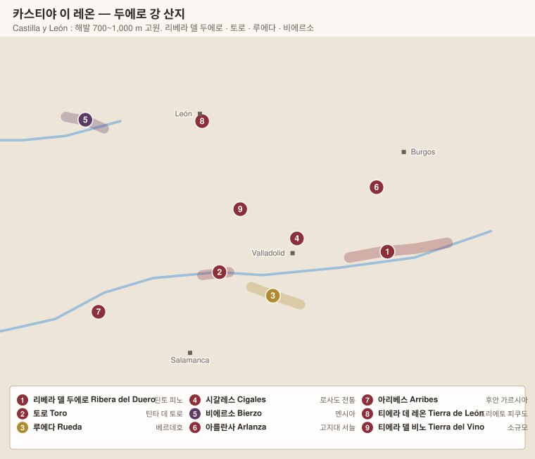

# 카스티야 이 레온 Castilla y León

> 해발 **700~1,000 m**의 메세타 고원. 여름 낮 40℃ · 밤 12℃라는 극단적 일교차가 두꺼운 껍질과 높은 산도를 만든다. 스페인 최고가 레드가 모두 이 두에로 강가에 있다.

| DO | 색 | 주품종 | 성격 |
|---|---|---|---|
| **Ribera del Duero 리베라 델 두에로** | 레드 | Tinto Fino 틴토 피노 | 스페인 최고가 레드의 산지 |
| **Toro 토로** | 레드 | Tinta de Toro 틴타 데 토로 | 가장 진하고 알코올 높음 |
| **Rueda 루에다** | 화이트 | Verdejo 베르데호 | 스페인 대표 드라이 화이트 |
| **Bierzo 비에르소** | 레드 | Mencía 멘시아 | 대서양 영향, 편암, 신선 |
| **Cigales 시갈레스** | 로제·레드 | 템프라니요 + 가르나차 | 로제 전통 산지 |
| **Arlanza · Arribes · Tierra de León · Tierra del Vino · Sierra de Salamanca · Valles de Benavente 바예스 데 베나벤테** | | 토착 품종 | 소규모 신흥 |

---

# 1. 품종 Variedades 바리에다데스

> 카스티야 이 레온은 **같은 품종이 이름을 바꿔 가며** 전혀 다른 와인이 되는 구간이다. 템프라니요가 리베라에서는 틴토 피노, 토로에서는 틴타 데 토로가 되고, 두 와인은 서로 닮지 않았다.

| DO | 주품종 | 별칭 | 성격 |
|---|---|---|---|
| **Ribera del Duero 리베라 델 두에로** | 템프라니요 | **Tinto Fino 틴토 피노 / Tinta del País 틴타 델 파이스** | 고지대·서리, 구조적 |
| **Toro 토로** | 템프라니요 | **Tinta de Toro 틴타 데 토로** | 저지대·더움, 알코올 높고 굵다 |
| **Rueda 루에다** | **Verdejo 베르데호** | – | 산도·회향·아몬드 |
| **Bierzo 비에르소** | **Mencía 멘시아** | – | 대서양 영향, 신선 |
| **Cigales 시갈레스** | 템프라니요 + 가르나차 | Tinta del País | 로제(clarete) |

---

## 1. 템프라니요의 두 얼굴 — 틴토 피노 vs 틴타 데 토로

두 곳 모두 템프라니요이지만, 수백 년 격리 재배로 **형태가 다른 지역 계통(clonal population)**이 되었다.

| | **Tinto Fino 틴토 피노** (리베라) | **Tinta de Toro 틴타 데 토로** (토로) |
|---|---|---|
| 알갱이 | 작다 | **더 작고 껍질이 더 두껍다** |
| 고도 | **750~1,000 m** | 600~750 m |
| 일교차 | **20℃ 이상** | 큼 |
| 색 | 진함 | **매우 진함** |
| 산도 | **높다** (고도 덕분) | 중간 |
| 알코올 | 13.5~14.5% | **14.5~15%** |
| 탄닌 | 굵고 정밀 | **매우 굵고 거칠 수 있다** |
| 스타일 | 구조적·장기 숙성 | 압도적·응축 |

> **고도가 산도를 지킨다** — 리베라 델 두에로는 스페인 주요 산지 중 **가장 높다.** 여름 낮 40℃, 밤 12℃라는 일교차가 낮에 당을 쌓고 밤에 산을 지킨다. 그 대신 **4월 말~5월과 9월 초에도 서리**가 내려, 2017년에는 수확량이 절반 이하로 떨어졌다.

> **토로의 모래 토양** — 충적 모래가 많아 **필록세라가 번지지 못했다.** 그래서 **접목하지 않은 자근 노목**이 다수 남아 있고, 이것이 토로 재발견의 자산이 되었다.

| 리베라의 보조 품종 | 역할 |
|---|---|
| **Cabernet Sauvignon 카베르네 소비뇽 · Merlot 메를로 · Malbec 말벡** | **Vega Sicilia 베가 시실리아**가 19세기부터 써 온 전통. 지금도 우니코에 소량 |
| **Garnacha 가르나차** | 로제·블렌드 |
| **Albillo Mayor 알비요 마요르** | 화이트. **2019년부터 DO로 인정.** 고지대 토착 백포도로 재평가 중 |

---

## 2. Verdejo 베르데호 — 산화에 가장 약한 품종

| 항목 | 내용 |
|---|---|
| 향 | **회향(fennel)·풀·감귤**, **아몬드의 쌉쌀한 뒷맛**, 흰꽃 |
| 구조 | 산도 좋고 몸통이 있다. 알코올 13% 내외 |
| 약점 | **산화에 극도로 취약하다.** 껍질에 페놀이 많아 공기와 닿으면 금세 갈변한다 |
| 대응 | **야간 수확(밤 12시~새벽 6시)**이 표준. 저온 압착·불활성 가스·저온 발효 |
| 역사 | 11세기 무어인 지배기에 들어온 것으로 추정. 원래는 **산화 숙성 셰리 스타일(Rueda Pálido / Dorado)**을 만들던 품종이었다 |
| 전환 | 1970년대 **Marqués de Riscal 마르케스 데 리스칼**이 보르도 컨설턴트 에밀 페이노를 불러 현대적 드라이 화이트로 방향을 바꿨다 |

> **역설** — 산화에 가장 약한 품종으로 수백 년간 산화 와인을 만들다가, 20세기에 정반대 방향으로 돌아섰다.

| 표기 | 규정 |
|---|---|
| `Rueda Verdejo` | **베르데호 85% 이상** |
| `Rueda` | 베르데호 50% 이상 |
| `Rueda Sauvignon` | 소비뇽 블랑 85% 이상 |
| **Gran Vino de Rueda** | 2019 신설. **수령 30년 이상**, 수확량 제한 |

> **Ossian 오시안**은 루에다 **바깥**(세고비아 니에바)의 **필록세라 이전 자근 노목** 베르데호로 만들어 **VT Castilla y León**으로 출시한다. DO 규정 밖에서 이 품종의 상한을 보여준 사례.

---

## 3. Mencía 멘시아 — 대서양의 품종

한때 카베르네 프랑의 친척으로 여겨졌으나, DNA 분석에서 **포르투갈의 Jaen do Dão 자엔 두 당**과 동일한 별개 품종으로 밝혀졌다.

| 항목 | 내용 |
|---|---|
| 향 | **제비꽃·후추·붉은 과실**, 편암에서 오는 광물성·흑연 |
| 구조 | **색 중간, 탄닌 곱고 산도 높다.** 알코올 13% 내외 |
| 토양 | **편암(pizarra 피사라) 사면에서 최상.** 평지 점토에서는 묽고 밋밋해진다 |
| 비교 | 캐릭터가 **카베르네 프랑·시라·피노 누아** 사이에 있다는 평이 흔하다 |
| 재발견 | 2000년 **Álvaro Palacios 알바로 팔라시오스**와 조카 리카르도 페레스가 코룔론의 편암 노목 밭에 들어오면서 세계에 알려졌다 |

| 함께 나오는 품종 | 성격 |
|---|---|
| **Godello 고데요** | 화이트. 비에르소에서도 재배. 배·미네랄·두툼한 질감 |
| **Doña Blanca · Palomino** | 화이트 보조 |
| **Alicante Bouschet 알리칸테 부셰** | 레드. 옛 밭에 섞여 있다 |

> **비에르소 밭 등급(2019)이 멘시아 때문에 생긴 이유** — 편암 사면과 평지 점토에서 나오는 와인의 격차가 워낙 커서, **어느 구획인가**를 표시하지 않으면 품질을 설명할 수 없었다. Vino de Villa → Paraje → Viña Clasificada 체계가 그래서 도입되었다.

---

## 4. 그 밖의 토착 품종

| 품종 | DO | 성격 |
|---|---|---|
| **Prieto Picudo 프리에토 피쿠도** | Tierra de León 티에라 데 레온 | **색이 매우 진하고 산도가 높다.** 이름은 "촘촘하고 뾰족한"(송이 모양). 전통적으로 로제 |
| **Juan García 후안 가르시아** | Arribes 아리베스 | 두에로 협곡. 가볍고 향기롭다 |
| **Rufete 루페테** | Sierra de Salamanca | 산악 계단밭. 색이 옅고 섬세 |
| **Bruñal · Tinta Madrid** | Arribes | 극희귀, 복원 중 |

---

## DO별 품종 규정

| DO | 품종 |
|---|---|
| **Ribera del Duero** | **틴토 피노(템프라니요) 75% 이상** + 카베르네 소비뇽·메를로·말벡·가르나차 / 화이트는 **알비요 마요르 75% 이상** |
| **Toro** | **틴타 데 토로 75% 이상** (Toro Tinto는 사실상 100%) |
| **Rueda** | 위 표 참조 |
| **Bierzo** | **멘시아 75% 이상** / 화이트는 **고데요 · 도냐 블랑카 · 팔로미노** |
| **Cigales** | 템프라니요 + 가르나차. 로제(clarete)는 레드·화이트 혼합 발효 |
| **Tierra de León** | **프리에토 피쿠도 60% 이상** |
| **Arribes** | **후안 가르시아 60% 이상** |

---

# 2. 리베라 델 두에로 Ribera del Duero

1982년 DO 승격. 그 전까지 **Vega Sicilia 베가 시실리아 한 곳만이 유명한** 무명 지역이었다.

| 항목 | 내용 |
|---|---|
| 고도 | **750~1,000 m** — 스페인 주요 산지 중 가장 높다 |
| 일교차 | 여름 20℃ 이상. 낮에 익히고 밤에 산도를 지킨다 |
| 위험 | **서리**. 4월 말~5월, 9월 초에도 내린다. 2017년 서리로 수확량이 절반 이하로 떨어졌다 |
| 토양 | 석회암 · 백악 · 이회토 위에 모래·자갈. 구획별 편차가 크다 |
| 길이 | 두에로 강을 따라 동서 약 115 km, 남북 35 km |

## 품종

> **§1 품종**에서 상세히 다룬다. 요약 — **Tinto Fino 틴토 피노 / Tinta del País 틴타 델 파이스**(= 템프라니요의 지역 계통, 껍질이 두껍고 알이 작다), 보조로 카베르네 소비뇽·메를로·말벡·가르나차, 화이트는 **Albillo Mayor 알비요 마요르**(2019~).

## 하위 구역

| 구역 | 위치 | 성격 |
|---|---|---|
| **Soria 소리아 (동쪽)** | 가장 높고 서늘 | 늦게 익고 산도가 높다. Dominio de Atauta 도미니오 데 아타우타, Bodegas Antídoto 보데가스 안티도토 |
| **Burgos 부르고스 (중앙) — "Milla de Oro 미야 데 오로(황금 마일)"** | Peñafiel 페냐피엘 ~ Pesquera 페스케라 | **최상급 밀집 구간.** 베가 시실리아·핑구스·페스케라가 모두 여기 |
| **Valladolid 바야돌리드 (서쪽)** | 낮고 따뜻 | 풍만하고 조기 접근 |

## 주요 보데가

| 보데가 | 대표 와인 | 특징 |
|---|---|---|
| **Vega Sicilia 베가 시실리아** | **Único 우니코** · Valbuena 발부에나 5º · Reserva Especial 레세르바 에스페시알 | 1864년 창립, 스페인의 상징. **우니코는 최소 10년(오크 6~7년 포함) 숙성 후 출시**하며 좋은 해에만 만든다. 템프라니요 + 카베르네 소비뇽 |
| **Dominio de Pingus 도미니오 데 핑구스** | **Pingus 핑구스** · Flor de Pingus 플로르 데 핑구스 · PSI | 덴마크 출신 **Peter Sisseck 페테르 시세크**가 1995년 시작. 첫 빈티지가 실린 배가 대서양에서 침몰해 남은 물량 값이 폭등한 일화로 유명. 비오디나미 |
| **Bodegas Alejandro Fernández 보데가스 알레한드로 페르난데스 (Pesquera 페스케라)** | Pesquera 페스케라 · **Janus 하누스** | 1972년. 로버트 파커가 "스페인의 페트뤼스"라 부르며 지역을 세계에 알렸다 |
| **Aalto 알토** | Aalto 알토 · **Aalto 알토 PS** | 베가 시실리아 전 양조가 마리아노 가르시아가 설립 |
| **Dominio de Atauta 도미니오 데 아타우타** | La Mala 라 말라 · Llanos del Almendro 야노스 델 알멘드로 | 소리아 고지대의 **필록세라 이전 자근 노목** 구획 |
| **Bodegas Emilio Moro 에밀리오 모로** | Malleolus de Valderramiro 마예올루스 데 발데라미로 | |
| **Hacienda Monasterio 아시엔다 모나스테리오** | | 페테르 시세크가 컨설팅 |
| **Pago de Carraovejas 파고 데 카라오베하스** | | 페냐피엘, 보르도 스타일 |
| **Bodegas y Viñedos Alión 알리온** | | 베가 시실리아의 현대적 자매 브랜드 |
| **Viña Sastre 비냐 사스트레 · Astrales 아스트랄레스 · Pérez Pascuas 페레스 파스쿠아스 (Viña Pedrosa 비냐 페드로사) · Arzuaga 아르수아가 · Protos 프로토스 · Goyo García Viadero 고요 가르시아 비아데로** | | |

---

# 3. 토로 Toro

두에로 강 하류, 리베라보다 낮고(600~750 m) 더 덥고 건조하다.

| 항목 | 내용 |
|---|---|
| 품종 | **Tinta de Toro 틴타 데 토로** — 템프라니요의 지역 계통. 알갱이가 더 작고 껍질이 두껍다 |
| 성격 | 색이 매우 진하고 **알코올 14.5~15%**, 탄닌 굵음. 잘못 만들면 거칠고, 잘 만들면 압도적이다 |
| 토양 | 모래가 많은 충적토 — **필록세라가 번지지 못해 자근 노목이 다수 남아 있다** |
| 재발견 | 1990년대 후반 외부 자본이 들어오며 급부상 |

**주요 보데가**: **Numanthia 누만시아**(Termanthia 테르만시아 — LVMH 소유) · **Pintia 핀티아**(베가 시실리아) · **Bodegas San Román 산 로만**(마리아노 가르시아) · **Teso La Monja 테소 라 몬하**(에게렌 가문, Alabaster 알라바스테르) · Elías Mora 엘리아스 모라 · Bodega Maurodos 보데가 마우로도스 · Quinta de la Quietud 킨타 데 라 키에투드

---

# 4. 루에다 Rueda

스페인을 대표하는 드라이 화이트 산지. 1980년 DO(카스티야 이 레온 최초).

| 항목 | 내용 |
|---|---|
| 품종 | **Verdejo 베르데호** — 회향·풀·감귤, 아몬드의 쌉쌀한 뒷맛, 좋은 산도. 산화에 매우 취약해 **야간 수확 + 저온 양조**가 표준 |
| 표기 규칙 | `Rueda Verdejo 베르데호` = 베르데호 **85% 이상** / 그냥 `Rueda` = 베르데호 50% 이상 |
| 보조 품종 | Sauvignon Blanc(단독 표기 가능) · Viura 비우라 · Palomino |
| 역사 | 원래 **산화 숙성 셰리 스타일(Rueda Pálido 루에다 팔리도 / Dorado 도라도)** 산지였다. 1970년대 마르케스 데 리스칼이 프랑스 컨설턴트를 데려와 현대적 드라이 화이트로 전환시켰다 |
| 최근 | 2019년부터 **Gran Vino de Rueda 그란 비노 데 루에다**(수령 30년 이상, 수확량 제한) 등급 신설, 레드·스파클링도 인정 |

**주요 생산자**: **Belondrade y Lurton 벨론드라데 이 뤼르통**(오크 발효 베르데호의 기준) · **José Pariente 호세 파리엔테** · Naia 나이아 · Palacio de Bornos 팔라시오 데 보르노스 · Menade 메나데 · Marqués de Riscal 마르케스 데 리스칼

> **Ossian 오시안**은 루에다 **바깥**(세고비아 니에바 일대)의 자근 노목 베르데호로 만들어 **VT Castilla y León**으로 출시한다. 루에다 DO의 상한을 보여주는 반례.

---

# 5. 비에르소 Bierzo

카스티야이지만 **대서양 쪽으로 열린 분지**라 갈리시아에 가깝다. 1989년 DO.

| 항목 | 내용 |
|---|---|
| 품종 | **Mencía 멘시아** — 제비꽃·후추·붉은 과실, 신선한 산도. 화이트는 **Godello 고데요** |
| 토양 | 사면의 **편암(pizarra 피사라)** vs 평지의 점토. 편암 노목이 최상 |
| 재발견 | 2000년 **Álvaro Palacios 알바로 팔라시오스**와 조카 Ricardo Pérez가 코룔론에 들어오면서 세계에 알려졌다 |

## 밭 등급 (2019년 도입)

| 등급 | 요건 |
|---|---|
| **Vino de Villa 비노 데 비야** | 한 마을(municipio)의 포도 100% |
| **Vino de Paraje 비노 데 파라헤** | 인정된 파라헤(구획) 100% |
| **Vino de Viña Clasificada 비냐 클라시피카다 비노 데 비냐 클라시피카다** | 단일 밭 또는 인접 필지 100%. **파라헤 등급으로 5년 이상 인정받은 뒤** 심사 통과 |
| **Gran Vino de Viña Clasificada 비냐 클라시피카다** | 위의 최상위 |

**주요 생산자**: **Descendientes de J. Palacios 데센디엔테스 데 헤이 팔라시오스**(Pétalos 페탈로스 · **Villa de Corullón 비야 데 코루욘** · **La Faraona 라 파라오나**) · **Raúl Pérez 라울 페레스**(Ultreia 울트레이아 · **El Rapolao 엘 라폴라오**) · Losada Vinos de Finca 로사다 비노스 데 핑카 · Dominio de Tares 도미니오 데 타레스 · Castro Ventosa 카스트로 벤토사 · Verónica Ortega 베로니카 오르테가 · Mengoba 멩고바

---

# 6. 시갈레스 Cigales · 기타 소규모 DO

| DO | 내용 | 생산자 |
|---|---|---|
| **Cigales 시갈레스** | 바야돌리드 북쪽. **로제(clarete 클라레테) 전통** — 레드와 화이트 포도를 함께 발효한 옅은 로제. 최근 레드도 강화 | Museum 무세움, Traslanzas 트라스란사스, Frutos Villar 프루토스 비야르 |
| **Arlanza 아를란사** | 부르고스 남쪽 고지대, 서늘하고 산도 좋다 | Lerma 레르마, Buezo 부에소 |
| **Arribes 아리베스** | 포르투갈 국경 두에로 협곡. 토착 **Juan García 후안 가르시아** | Charlotte Allen 샤를로트 알렌, Ambroz 암브로스 |
| **Tierra de León 티에라 데 레온** | 토착 **Prieto Picudo 프리에토 피쿠도** — 산도 높고 색 진함 | Pardevalles 파르데바예스, Margón 마르곤 |
| **Tierra del Vino de Zamora** | 사모라 일대 소규모 | |
| **Sierra de Salamanca** | **Rufete 루페테** 품종, 산악 계단밭 | Viñas del Cámbrico 비냐스 델 캄브리코 |
| **Valtiendas 발티엔다스 · Valles de Benavente 바예스 데 베나벤테** | VC 단계 | |

> 이 소규모 DO들과 **VT Castilla y León**은 카스티야에서 지금 가장 흥미로운 구역이다. 큰 DO의 규정 밖에서 잊힌 토착 품종과 노목을 되살리는 생산자들이 몰려 있다.

---

[← 리오하](01-rioja.md) · [목차로](../README.md) · [다음: 카탈루냐 →](03-cataluna.md)
