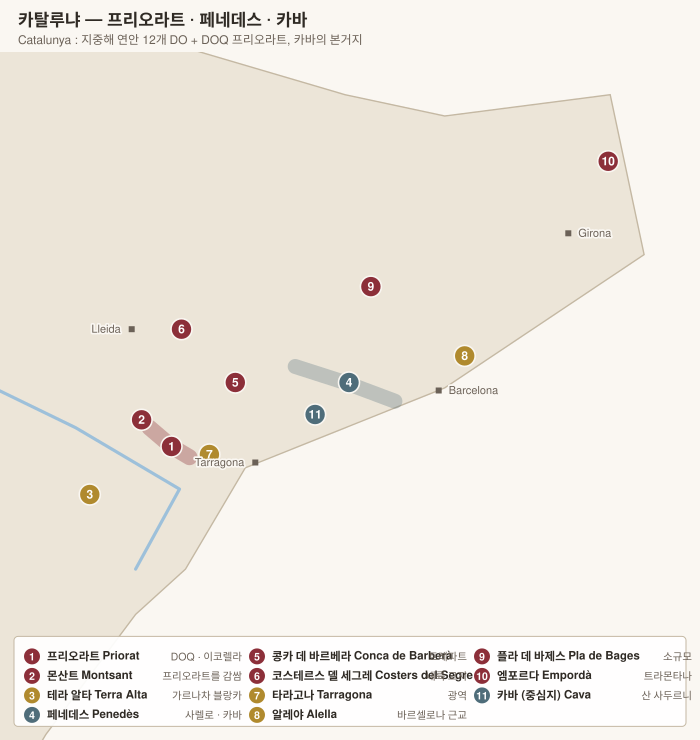

# 카탈루냐 Catalunya

> 라벨이 스페인어가 아니라 **카탈루냐어**인 경우가 많다. `Celler` = 보데가, `Vinya` = 포도밭, `Vi` = 와인, `Vi de Vila 비 데 빌라` = 마을 와인.

| DO | 색 | 주품종 | 성격 |
|---|---|---|---|
| **Priorat 프리오라트 (DOQ)** | 레드 | 가르나차 · 카리녜나 | 스페인 2개뿐인 최상위 등급 |
| **Montsant 몬산트** | 레드 | 가르나차 · 카리녜나 | 프리오라트를 감싸는 링, 가성비 |
| **Penedès 페네데스** | 3색 | 사렐로 · 마카베오 · 파레야다 | 카바의 본거지 |
| **Cava 카바** | 스파클링 | 위 3종 + 샤르도네 | **지역이 아니라 방식에 주는 DO** |
| **Terra Alta 테라 알타** | 화이트 | 가르나차 블랑카 | 세계 최대 가르나차 블랑카 산지 |
| **Costers del Segre · Conca de Barberà · Empordà · Alella · Pla de Bages · Tarragona · Catalunya** | | | |

<!-- toc -->
## 목차

- [1. 품종 Varietats 바리에타츠](#1-품종-varietats-바리에타츠)
- [2. 프리오라트의 두 품종](#2-프리오라트의-두-품종)
- [2. 카바의 3종](#2-카바의-3종)
- [3. 그 밖의 카탈루냐 품종](#3-그-밖의-카탈루냐-품종)
  - [DO별 품종 규정](#do별-품종-규정)
- [2. 프리오라트 Priorat (DOQ)](#2-프리오라트-priorat-doq)
  - [부활의 서사 (1989~)](#부활의-서사-1989)
  - [밭 등급 (2019년 도입)](#밭-등급-2019년-도입)
- [3. 몬산트 Montsant](#3-몬산트-montsant)
- [4. 카바 Cava](#4-카바-cava)
  - [2022년 등급 개편](#2022년-등급-개편)
  - [카바를 떠난 생산자들](#카바를-떠난-생산자들)
- [5. 페네데스 Penedès](#5-페네데스-penedès)
- [6. 그 밖의 카탈루냐 DO](#6-그-밖의-카탈루냐-do)

<!-- /toc -->

---

# 1. 품종 Varietats 바리에타츠

> 카탈루냐는 **지중해 토착종(가르나차·카리녜나)**과 **카바 3종(사렐로·마카베우·파레야다)**이라는 두 축으로 이루어져 있다. 라벨이 카탈루냐어인 경우가 많아 품종명도 표기가 달라진다.

| 스페인어 | 카탈루냐어 | 비고 |
|---|---|---|
| Garnacha Tinta | **Garnatxa Negra 가르나차 네그라** | |
| Garnacha Blanca | **Garnatxa Blanca 가르나차 블랑카** | |
| Cariñena | **Samsó 삼소** / Carinyena | 프랑스의 Carignan |
| Macabeo | **Macabeu 마카베우** | 리오하의 Viura |
| Tempranillo | **Ull de Llebre 울 데 예브레** | "토끼 눈" |
| Monastrell | **Monastrell** | 프랑스의 Mourvèdre |

---

## 2. 프리오라트의 두 품종

프리오라트를 만드는 것은 품종이 아니라 **이코렐라(llicorella 이코렐라)**라는 토양이지만, 그 토양을 견디는 품종은 둘뿐이다.

| 품종 | 성격 | 이코렐라에서 |
|---|---|---|
| **Garnacha Negra 가르나차 네그라** | 딸기·가리그·말린 자두. 알코올 높고 탄닌 낮음 | 노목에서 **극단적으로 낮은 수확량** → 응축도와 광물성 |
| **Cariñena / Samsó 카리녜나 / 삼소** | **산도·탄닌 높고 색 진함.** 젊을 때 거칠다 | **노목이라야 진가.** 가르나차의 낮은 산도를 메운다 |
| **Syrah 시라 · Cabernet Sauvignon · Merlot** | 1990년대 부활기에 도입 | 최근에는 토착 2종으로 회귀하는 추세 |

> **이코렐라가 하는 일** — 붉은 점판암(편암)에 석영이 섞인 토양으로, **물을 거의 머금지 못한다.** 뿌리가 수십 미터를 수직으로 파고들어야 물을 찾는다. 그 결과 **ha당 5~8 hl**이라는 세계 최저 수준의 수확량이 나오고, 알코올 14.5~15%인데도 뜨겁게 느껴지지 않는 광물적 긴장감이 생긴다.

> **노목 카리녜나의 재평가** — 1980~90년대 부활기에는 프랑스 품종을 심는 것이 현대적이라 여겨졌다. 지금은 반대로 **100년 넘은 카리녜나 노목**이 프리오라트의 가장 큰 자산으로 평가된다. 몬산트의 **Espectacle 에스펙타클레**가 대표적.

## 2. 카바의 3종

| 품종 | 역할 | 비고 |
|---|---|---|
| **Macabeu 마카베우** (= Macabeo 마카베오, Viura 비우라) | **과실과 몸통.** 사과·감귤 | 늦게 싹 터 봄 서리를 피한다 |
| **Xarel·lo 사렐로** | **산도·구조·숙성력.** 회향·허브·페놀 | 카바에 **수명**을 준다. 최근 스틸 와인으로 재평가 |
| **Parellada 파레야다** | **꽃향·섬세함·낮은 알코올** | 고도가 높은 구획에 심는다 |
| **Chardonnay · Pinot Noir** | 1980년대 이후 허용 | 국제적 스타일 |
| **Trepat 트레팟** | **로제 전용** 토착종 | 색이 옅고 향기롭다 |

> **왜 이 셋을 섞는가** — 마카베우는 향이 있지만 산도가 부족하고, 파레야다는 섬세하지만 몸통이 없으며, 사렐로는 구조가 있지만 그것만으로는 거칠다. 셋을 합쳐야 균형이 나온다. 샹파뉴의 3품종 논리와 같은 구조다.

> **Xarel·lo 사렐로의 재발견** — 페놀 함량이 높아 산화 방지력과 숙성력이 뛰어나다. 오랫동안 카바 블렌드의 조연이었으나, 2010년대에 **스틸 화이트로 만들면 놀랍다**는 것이 알려지며 독립 카테고리가 되었다. 이름의 가운뎃점(`·`)은 카탈루냐어의 겹쳐진 L 표기다.

## 3. 그 밖의 카탈루냐 품종

| 품종 | 산지 | 성격 |
|---|---|---|
| **Garnatxa Blanca 가르나차 블랑카** | **Terra Alta 테라 알타** | **세계 재배 면적의 약 1/3이 여기** 있다. 풍만하고 회향·아니스 향 |
| **Trepat 트레팟** | **Conca de Barberà 콩카 데 바르베라** | 색이 옅고 향기로운 레드·로제. 이 지역에만 |
| **Pansa Blanca 판사 블랑카** | **Alella 알레야** | = 사렐로. 화강암 모래(sauló 사울로)에서 |
| **Sumoll 수몰** | 페네데스 | 산도 높은 토착 레드, 복원 중 |
| **Picapoll 피카폴** | Pla de Bages | = 랑그독의 Picpoul |
| **Malvasia de Sitges** | 시체스 | 거의 사라진 스위트 품종 |

---

## DO별 품종 규정

| DO | 품종 |
|---|---|
| **Priorat DOQ 프리오라트** | **가르나차 · 카리녜나 중심** + 시라·카베르네 소비뇽·메를로·피노 누아. 화이트는 가르나차 블랑카·마카베우·페드로 히메네스 |
| **Montsant 몬산트** | 동일 구성. 규정이 더 유연 |
| **Cava 카바** | **마카베우 · 사렐로 · 파레야다** + 샤르도네 · 피노 누아 · 수비라트 파렌트 / 로제는 **가르나차 · 모나스트렐 · 트레팟 · 피노 누아** |
| — **Cava de Paraje Calificado** | 단일 밭, **수령 10년 이상**, 수확량 8,000 kg/ha 이하, 36개월 이상 |
| **Penedès 페네데스** | 위 3종 + 국제품종 다수 |
| **Terra Alta 테라 알타** | **가르나차 블랑카 중심** |
| **Conca de Barberà** | **트레팟**(로제·레드) · 마카베우 · 파레야다 |
| **Empordà 엠포르다** | 가르나차 · 카리녜나 |
| **Costers del Segre 코스테르스 델 세그레** | 토착 + 국제품종 폭넓게 |
| **Alella 알레야** | **판사 블랑카(사렐로) 중심** |

---

# 2. 프리오라트 Priorat (DOQ)

리오하와 함께 스페인 단 **2개뿐인 최상위 등급**(카탈루냐어로 **DOQ** — Denominació d'Origen Qualificada 데노미나시오 도리젠 콸리피카다).

| 항목 | 내용 |
|---|---|
| 토양 | **Llicorella 이코렐라** — 붉은 점판암(편암)에 석영이 섞인 토양. 물을 거의 머금지 못해 뿌리가 수직으로 수십 미터를 파고든다 |
| 지형 | 경사 최대 60도의 계단밭(costers 코스테르스). 기계가 못 들어간다 |
| 수확량 | **ha당 5~8 hl** — 세계 최저 수준. 부르고뉴 그랑크뤼의 4분의 1 |
| 품종 | **Garnacha 가르나차 / Garnatxa 가르나차**(카탈루냐어 표기) + **Cariñena 카리녜나 / Samsó 삼소**(카탈루냐어) + 시라·카베르네 소비뇽·메를로 |
| 성격 | 색이 검고 알코올 14.5~15%, 광물적 긴장감. **잘 만든 것은 알코올이 느껴지지 않는다** |

## 부활의 서사 (1989~)

1970년대 프리오라트는 인구가 빠져나가 버려진 산지였다. 1989년 다섯 명이 그라타요프스 마을에 모여 각자 밭을 사고 공동 셀러에서 첫 빈티지를 만들었다.

| 인물 | 와인 |
|---|---|
| **René Barbier 르네 바르비에** | **Clos Mogador 클로스 모가도르** |
| **Álvaro Palacios 알바로 팔라시오스** | **Clos Dofí 클로스 도피**(→ Finca Dofí 핑카 도피) · **L'Ermita 레르미타** |
| **Carles Pastrana 파스트라나 카를레스 파스트라나** | **Clos de l'Obac 클로스 데 로박** |
| **Josep Lluís Pérez 조제프 유이스 페레스** | **Clos Martinet 클로스 마르티네트** |
| **Daphne Glorian 다프네 글로리안** | **Clos Erasmus 클로스 에라스무스** |

> **L'Ermita 레르미타**는 그라타요프스의 1.8 ha 급경사 밭으로, 100년 넘은 가르나차 노목에서 나온다. 스페인 최고가 와인 중 하나.

## 밭 등급 (2019년 도입)

부르고뉴식 피라미드를 스페인에서 가장 먼저·가장 촘촘하게 도입했다.

| 등급 | 요건 |
|---|---|
| **DOQ Priorat** | 광역 |
| **Vi de Vila 비 데 빌라** | **12개 마을** 중 하나에서 100% (Gratallops 그라타요프스, Porrera 포레라, Torroja 토로하, Bellmunt 베이문트, Poboleda 포볼레다, Vilella Alta/Baixa, Lloar, Escaladei 에스칼라데이, Morera, Masos de Falset, La Vilella) |
| **Vi de Paratge 비 데 파라체** | 인정된 구획(약 460개) |
| **Vinya Classificada 비냐 클라시피카다** | 단일 밭, 심사 통과 |
| **Gran Vinya Classificada 비냐 클라시피카다** | 최상위 단일 밭 |

**주요 생산자**: Clos Mogador 클로스 모가도르 · Álvaro Palacios · Clos Erasmus 클로스 에라스무스 · Clos i Terrasses 클로스 이 테라세스 · **Mas Doix 마스 도이스** · **Terroir al Límit 테루아 알 리미트**(도미니크 후버 — 추출을 극도로 줄인 스타일) · Vall Llach 바이 야크 · Ferrer Bobet 페레르 보베트 · Scala Dei 스칼라 데이(1194년 카르투시오 수도원 유래, 지역 最古) · Cims de Porrera 심스 데 포레라 · Trossos del Priorat 트로소스 델 프리오라트

---

# 3. 몬산트 Montsant

프리오라트를 **도넛처럼 감싸는** DO(2001년 독립). 토양은 편암·석회암·모래가 섞여 프리오라트보다 다양하고, 가격은 절반 이하다.

**주요 생산자**: **Celler de Capçanes 세예르 데 캅사네스**(Peraj Ha'Abib 페라 하아비브 — 코셔 와인으로 유명) · Venus la Universal 베누스 라 우니베르살(사라 페레스 & 르네 바르비에 주니어) · Acústic Celler 아쿠스틱 세예르 · Joan d'Anguera 조안 당게라 · Espectacle 에스펙타클레(맘모스 노목 가르나차)

---

# 4. 카바 Cava

**지리적 산지가 아니라 "전통방식으로 만든 스페인 스파클링"에 주는 DO.** 카탈루냐 페네데스가 생산량의 약 95%를 차지하지만, 법적으로는 리오하·발렌시아·엑스트레마두라 등에도 인정 구역이 있다.

| 항목 | 내용 |
|---|---|
| 양조 | **전통방식**(병내 2차 발효) |
| 품종 | **Macabeo 마카베오**(= 비우라, 과실·몸통) · **Xarel 사렐·lo 사렐로**(산도·구조·숙성력) · **Parellada 파레야다**(꽃향·섬세) + 샤르도네 · 피노 누아 · Trepat 트레팟(로제 전용) |
| 기원 | 1872년 **Josep Raventós 조제프 라벤토스**(Codorníu 코도르니우)가 샹파뉴 방식을 도입 |

## 2022년 등급 개편

카바는 오랫동안 "싼 스파클링"이라는 이미지에 시달렸다. 2022년 1월부터 **숙성 기간 + 원산지 구역**을 라벨에 명시하는 체계로 바꿨다.

| 등급 | 병 숙성 | 비고 |
|---|---|---|
| **Cava de Guarda 카바 데 구아르다** | **9개월 이상** | 기본 등급 |
| **Cava de Guarda 카바 데 구아르다 Superior — Reserva** | **18개월 이상** | 이 등급부터 **유기농 인증 의무**(2025년 이후 수확분) |
| **— Gran Reserva** | **30개월 이상** | 빈티지 표기 |
| **— Cava de Paraje Calificado 파라헤 칼리피카도** | **36개월 이상** | **단일 밭.** 수령 10년 이상, 수확량 ha당 8,000 kg 이하, 손 수확, 자체 압착. 인정된 파라헤는 20곳 미만 |

**5개 생산 구역**: **Comtats de Barcelona 콤타츠 데 바르셀로나**(페네데스 중심, 최대 — 5개 하위 구역) · **Valle del Ebro 바예 델 에브로** · **Viñedos de Almendralejo 알멘드랄레호 비녜도스 데 알멘드랄레호** · **Zona de Levante 레반테 소나 데 레반테** · **Requena 레케나**

## 카바를 떠난 생산자들

| 그룹 | 내용 |
|---|---|
| **Corpinnat 코르피냐트** | 2019년 카바 DO를 탈퇴한 최상위 생산자 연합. **유기농 100% · 손 수확 · 자체 압착 · 최소 18개월 · 포도값 하한 보장**을 규약으로 삼는다. **Gramona 그라모나 · Recaredo 레카레도 · Torelló 토레요 · Llopart 요파르트 · Nadal 나달 · Sabaté i Coca 사바테 이 코카 · Can Feixes 칸 페이셰스 · Júlia Bernet 훌리아 베르네트 · Mas Candí 마스 칸디** |
| **Raventós i Blanc 라벤토스 이 블랑** | 2012년 독자 탈퇴. **Conca del Riu Anoia 콩카 델 리우 아노이아**라는 자체 명칭을 쓴다. 카바를 만든 가문이 카바를 떠났다는 상징성 |
| **Clàssic Penedès 클라시크 페네데스** | 페네데스 DO 안의 스파클링 카테고리. 유기농 + 최소 15개월 |

**카바 대형 하우스**: Codorníu 코도르니우 · Freixenet 프레이셰네트 · Juvé & Camps 후베 이 캄프스 · Vilarnau 빌라르나우

---

# 5. 페네데스 Penedès

바르셀로나 남서쪽. 해안(Baix Penedès 바이시 페네데스)에서 내륙 고지(Penedès Superior 페네데스 수페리오르, 800 m)까지 고도차가 커서 품종 폭이 넓다.

| 생산자 | 내용 |
|---|---|
| **Familia Torres 파밀리아 토레스** | 스페인 최대 가족 와이너리. **Mas La Plana 마스 라 플라나**(카베르네, 1970년 파리 블라인드에서 우승) · Grans Muralles 그란스 무라예스(토착 품종 부활 프로젝트) · Waltraud 발트라우트 |
| **Jean Leon 진 레온** | 1963년 스페인에 카베르네·샤르도네를 처음 들여온 와이너리 |
| **Can Ràfols dels Caus 칸 라폴스 델스 카우스** | 토착·국제 품종 실험 |

> **Xarel 사렐·lo 사렐로의 재평가** — 오랫동안 카바 블렌드의 조연이었으나, 산도와 페놀 구조가 좋아 **스틸 화이트로 숙성시키면 놀랍다**는 것이 2010년대에 알려졌다. Gramona 그라모나, Can Ràfols, Loxarel 록사렐 등이 선도.

---

# 6. 그 밖의 카탈루냐 DO

| DO | 내용 | 생산자 |
|---|---|---|
| **Terra Alta 테라 알타** | 에브로 강 상류 고지. **세계 가르나차 블랑카(Garnatxa Blanca 가르나차 블랑카)의 약 3분의 1**이 여기 있다. 풍만하고 회향 향 | Edetària 에데타리아, Bàrbara Forés 바르바라 포레스, Lafou 라포우 |
| **Costers del Segre 코스테르스 델 세그레** | 레리다 내륙, 대륙성. 5개 떨어진 하위 구역 | **Raimat 라이마트**(코도르니우) · **Castell d'Encús 카스텔 덴쿠스**(해발 1,000 m, 12세기 석조 수조에서 발효) |
| **Conca de Barberà 콩카 데 바르베라** | 토착 **Trepat 트레팟** — 옅고 향기로운 레드·로제 | Carles Andreu 카를레스 안드레우, Torres(Grans Muralles 그란스 무라예스) |
| **Empordà 엠포르다** | 프랑스 국경, **트라몬타나 북풍**이 매섭다. 가르나차·카리녜나 | Celler Martí Fabra 세예르 마르티 파브라, Vinyes dels Aspres 비녜스 델스 아스프레스 |
| **Alella 알레야** | 바르셀로나 바로 북쪽, 화강암 모래(sauló 사울로). **Pansa Blanca 판사 블랑카**(= 사렐로) | Alta Alella 알타 알레야 |
| **Pla de Bages · Tarragona · Catalunya** | 소규모 / 광역 | |

---

[← 카스티야 이 레온](02-castilla-leon.md) · [목차로](../README.md) · [다음: 갈리시아 →](04-galicia.md)
