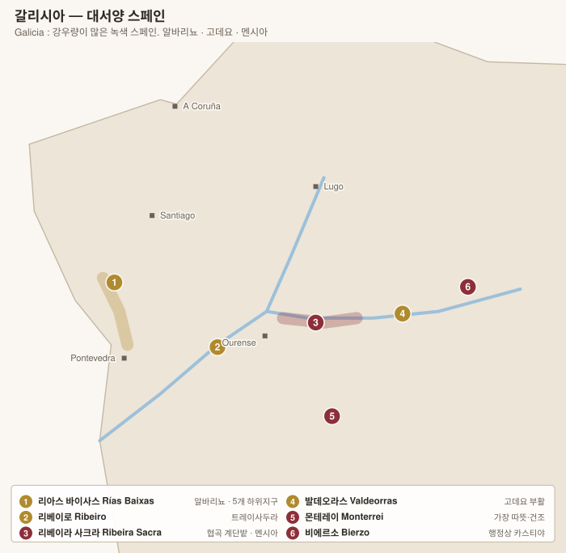

# 갈리시아 Galicia — 대서양 스페인

> **"녹색 스페인(España Verde 에스파냐 베르데)"**. 연 강우량 1,500 mm 이상으로 스페인 이미지와 정반대다. 알코올이 낮고 산도가 높으며 짠맛이 도는 화이트, 그리고 부르고뉴에 비교되는 가벼운 레드가 나온다.

| DO | 색 | 주품종 | 성격 |
|---|---|---|---|
| **Rías Baixas 리아스 바이사스** | 화이트 | Albariño 알바리뇨 | 스페인 대표 화이트 |
| **Ribeiro 리베이로** | 화이트 | Treixadura 트레이사두라 | 갈리시아 最古 산지 |
| **Ribeira Sacra 리베이라 사크라** | 레드 | Mencía 멘시아 | 협곡 계단밭, 영웅적 재배 |
| **Valdeorras 발데오라스** | 화이트 | Godello 고데요 | 고데요 부활의 진원지 |
| **Monterrei 몬테레이** | 3색 | 고데요 · 멘시아 | 가장 따뜻하고 건조 |

<!-- toc -->
## 목차

- [1. 품종 Variedades 바리에다데스](#1-품종-variedades-바리에다데스)
  - [Albariño 알바리뇨 — 대서양의 얼굴](#albariño-알바리뇨--대서양의-얼굴)
  - [Godello 고데요 — 멸종 직전에서 돌아온 품종](#godello-고데요--멸종-직전에서-돌아온-품종)
  - [Mencía 멘시아 — 협곡의 레드](#mencía-멘시아--협곡의-레드)
  - [그 밖의 갈리시아 토착종](#그-밖의-갈리시아-토착종)
  - [차콜리의 품종](#차콜리의-품종)
  - [DO별 품종 규정](#do별-품종-규정)
- [2. 리아스 바이사스 Rías Baixas](#2-리아스-바이사스-rías-baixas)
  - [5개 하위 지구](#5개-하위-지구)
- [3. 리베이라 사크라 Ribeira Sacra](#3-리베이라-사크라-ribeira-sacra)
- [4. 발데오라스 Valdeorras — 고데요의 부활](#4-발데오라스-valdeorras--고데요의-부활)
- [5. 리베이로 Ribeiro · 몬테레이 Monterrei](#5-리베이로-ribeiro--몬테레이-monterrei)
- [6. 차콜리 Txakoli — 바스크의 대서양 화이트](#6-차콜리-txakoli--바스크의-대서양-화이트)

<!-- /toc -->

---

# 1. 품종 Variedades 바리에다데스

> 갈리시아는 **연 강우량 1,500 mm 이상**의 대서양 기후다. 스페인의 다른 어느 곳과도 다른 조건이라, 품종도 완전히 다르다. **알코올이 낮고 산도가 높은** 품종군이 여기 모여 있다.

| DO | 화이트 | 레드 |
|---|---|---|
| **Rías Baixas 리아스 바이사스** | **Albariño 알바리뇨** (96%) | Caíño · Espadeiro · Sousón (극소량) |
| **Ribeiro 리베이로** | **Treixadura 트레이사두라** + 고데요·로우레이라 | Caíño · Ferrón |
| **Ribeira Sacra 리베이라 사크라** | Godello · Albariño | **Mencía 멘시아** + Brancellao · Merenzao |
| **Valdeorras 발데오라스** | **Godello 고데요** | Mencía |
| **Monterrei 몬테레이** | Godello · Treixadura | Mencía |
| **Txakoli 차콜리** (바스크) | **Hondarrabi Zuri 온다라비 수리** | Hondarrabi Beltza |

---

## Albariño 알바리뇨 — 대서양의 얼굴

| 항목 | 내용 |
|---|---|
| 향 | **복숭아·백도·감귤**, 흰꽃, **바다 내음과 짠맛** |
| 구조 | **산도 매우 높음** · 알코올 12~13% · 껍질이 두껍고 향 성분이 많다 |
| 재배 | 껍질이 두꺼워 **다습한 기후의 곰팡이를 견딘다** — 이것이 이 품종이 여기 남은 이유 |
| 수형 | **Parra 파라 / Emparrado 엠파라도** — 화강암 기둥에 얹은 시렁. 지면에서 2 m 높이로 띄워 **습기를 피하고 아래에서 통풍**시킨다 |
| 토양 | 화강암 모래(**xabre 샤브레**) |
| 오해 | "가볍고 어릴 때 마시는 와인"으로 알려져 있으나, **앙금 숙성·오크·장기 병 숙성**을 거치면 10~20년 발전한다 |

| 하위 지구 | 알바리뇨의 표정 |
|---|---|
| **Val do Salnés 발 도 살네스** | 해안·가장 서늘. **산도 최고, 짠맛 뚜렷.** 알바리뇨의 발상지 |
| **O Rosal 오 로살** | 미뇨 강 하구. **Loureira 로우레이라와 블렌딩** → 더 향기롭고 부드럽다 |
| **Condado do Tea 콘다도 도 테아** | 내륙·가장 따뜻. 알코올과 몸통이 있다 |

> 포르투갈 **Vinho Verde 비뉴 베르드**의 **Alvarinho 알바리뉴**와 같은 품종이다. 미뇨 강 하나를 사이에 두고 두 나라가 공유한다.

## Godello 고데요 — 멸종 직전에서 돌아온 품종

| 항목 | 내용 |
|---|---|
| 향 | **배·모과·흰꽃**, 화강암·편암의 광물성. 숙성하면 견과·꿀 |
| 구조 | **질감이 두툼하고(글리세롤) 산도가 좋다.** 알바리뇨보다 몸통이 있다 |
| 위기 | 1970년대에 재배 면적이 **수십 ha까지** 줄어 사실상 멸종 직전이었다 |
| 복원 | 1974년 발데오라스의 지역 프로젝트(Horacio Fernández Presa 오라시오 페르난데스 프레사 등)가 남은 나무를 모아 되살렸다 |
| 지금 | **Rafael Palacios 라파엘 팔라시오스의 As Sortes 아스 소르테스**가 스페인 최고 화이트로 꼽히며, 부르고뉴 화이트와 비교된다 |

## Mencía 멘시아 — 협곡의 레드

| 항목 | 내용 |
|---|---|
| 향 | **제비꽃·후추·붉은 과실**, 편암의 광물성 |
| 구조 | 색 중간, **탄닌 곱고 산도 높다.** 알코올 12~13.5% |
| 유전 | 카베르네 프랑의 친척으로 오래 여겨졌으나, **포르투갈의 Jaen do Dão 자엔 두 당**과 동일한 별개 품종으로 확인 |
| 리베이라 사크라에서 | **경사 최대 85도**의 협곡 계단밭. 편암 위에서 극도로 신선하고 광물적. **"스페인의 부르고뉴"** 또는 북부 론에 비유된다 |

## 그 밖의 갈리시아 토착종

| 품종 | 색 | 성격 |
|---|---|---|
| **Treixadura 트레이사두라** | 화이트 | **Ribeiro 리베이로**의 주력. 사과·백도·허브. 블렌딩에 적합 |
| **Loureira 로우레이라** | 화이트 | 이름은 월계수(loureiro). 향이 강하다 |
| **Caíño Branco / Caíño Tinto 카이뇨** | 양쪽 | 산도가 극단적으로 높다. **Forjas del Salnés 포르하스 델 살네스**가 레드 카이뇨를 되살렸다 |
| **Brancellao 브란세야오** | 레드 | 색이 매우 옅고 향기롭다 |
| **Merenzao 메렌사오** | 레드 | = 쥐라의 **Trousseau 트루소** = 포르투갈의 Bastardo |
| **Sousón 소우손** | 레드 | 색과 산도가 진하다 |
| **Doña Blanca · Torrontés · Albilla** | 화이트 | 리베이로·몬테레이 블렌드 |

## 차콜리의 품종

| 품종 | 성격 |
|---|---|
| **Hondarrabi Zuri 온다라비 수리** | 화이트. 알코올 **10~11.5%**, 산도 날카롭고 미세한 탄산. 풋사과·감귤 |
| **Hondarrabi Beltza 온다라비 벨차** | 레드. 로제(**Rubentis 루벤티스**)와 소량의 레드 |

> 차콜리는 잔에 **높이 들어 따르는(escanciar 에스칸시아르)** 관습이 있다. 미세한 탄산을 살리고 향을 여는 방식이다. 최근에는 앙금·오크 숙성형 장기 숙성 차콜리도 늘고 있다.

---

## DO별 품종 규정

| DO | 품종 |
|---|---|
| **Rías Baixas 리아스 바이사스** | **알바리뇨 100%** 표기 가능 (하위 지구별로 로우레이라·트레이사두라 블렌딩 허용) |
| **Ribeiro 리베이로** | **트레이사두라 중심** + 고데요·로우레이라·알바리뇨 |
| **Ribeira Sacra 리베이라 사크라** | **멘시아 중심** + 브란세야오·메렌사오·카이뇨 / 화이트는 고데요·알바리뇨 |
| **Valdeorras 발데오라스** | **고데요**(화이트) · **멘시아**(레드) |
| **Monterrei 몬테레이** | 고데요·트레이사두라 · 멘시아 |
| **Getariako / Bizkaiko / Arabako Txakolina** | **온다라비 수리 · 온다라비 벨차** |

---

# 2. 리아스 바이사스 Rías Baixas

이름은 **"낮은 후미(rías)"** — 빙하기 이후 바닷물이 골짜기로 파고든 지형을 뜻한다. 1988년 DO.

| 항목 | 내용 |
|---|---|
| 품종 | **Albariño 알바리뇨** — 전체의 약 96%. 복숭아·감귤·백도, **높은 산도와 짠맛** |
| 토양 | 화강암 모래(xabre 샤브레) |
| 재배 | **Parra 파라 / Emparrado 엠파라도** — 화강암 기둥에 얹은 시렁(퍼걸러). 지면에서 2 m 높이로 띄워 **습기와 곰팡이를 피하고 아래에서 통풍**시킨다. 갈리시아 풍경의 상징 |
| 양조 | 대개 오크 없이 스테인리스. 최근 **앙금 숙성(sur lie) · 오크 · 암포라 · 장기 숙성형**이 늘고 있다 |

## 5개 하위 지구

| 하위 지구 | 위치 | 성격 |
|---|---|---|
| **Val do Salnés 발 도 살네스** | 해안, 캄바도스 일대 | **알바리뇨의 발상지이자 심장.** 가장 서늘하고 산도가 높다. 짠맛이 뚜렷 |
| **O Rosal 오 로살** | 미뇨 강 하구, 포르투갈 접경 | 알바리뇨 + **Loureira 로우레이라** 블렌딩. 더 향기롭고 부드럽다 |
| **Condado do Tea 콘다도 도 테아** | 내륙, 강 상류 | 가장 따뜻. 알코올이 높고 몸통이 있다 |
| **Soutomaior 소우토마이오르** | 극소 구역 | |
| **Ribeira do Ulla 리베이라 도 우야** | 북쪽, 산티아고 인근 | 가장 최근 편입(2000) |

**주요 생산자**: **Pazo de Señorans 파소 데 세뇨란스**(Selección de Añada 셀렉시온 데 아냐다 — 알바리뇨의 숙성력을 증명한 와인) · **Do Ferreiro 도 페레이로**(Cepas Vellas 세파스 베야스 — 200년 넘은 자근 노목) · **Zárate 사라테** · **Forjas del Salnés 포르하스 델 살네스**(Rodrigo Méndez 로드리고 멘데스 — 레드 **Caíño 카이뇨**도 부활) · **Albamar 알바마르** · Terras Gauda 테라스 가우다 · Bodegas Fillaboa 보데가스 피야보아 · **Palacio de Fefiñanes 팔라시오 데 페피냐네스** · Nanclares y Prieto 난클라레스 이 프리에토

> **오해 주의** — 알바리뇨는 "가볍고 어릴 때 마시는 와인"으로 알려져 있지만, Pazo de Señorans 파소 데 세뇨란스 Selección de Añada 셀렉시온 데 아냐다나 Do Ferreiro 도 페레이로 Cepas Vellas 세파스 베야스는 **10~20년 숙성 후 진가**가 나온다.

---

# 3. 리베이라 사크라 Ribeira Sacra

**"신성한 강변"** — 로마 시대부터 포도를 심었고 중세 수도원들이 이어받았다.

| 항목 | 내용 |
|---|---|
| 지형 | **Sil 실 강 · Miño 미뇨 강의 협곡**, 경사 최대 **85도**. 강면에서 수백 미터 위까지 계단밭이 이어진다 |
| 재배 | **Viticultura heroica 비티쿨투라 에로이카(영웅적 재배)** — 모든 작업이 손. 포도를 배나 모노레일로 운반한다 |
| 품종 | **Mencía 멘시아**(주력) · Brancellao 브란세야오 · Merenzao 메렌사오(= 쥐라의 Trousseau) · Caíño 카이뇨 · 화이트는 Godello 고데요 · Albariño 알바리뇨 |
| 성격 | 색이 옅고 **제비꽃·후추·붉은 과실**, 산도가 높다. 흔히 **"스페인의 부르고뉴"** 또는 북부 론에 비유된다 |

**5개 하위 지구**: Amandi 아만디(최상급으로 평가) · Chantada 찬타다 · Quiroga-Bibei 키로가비베이 · Ribeiras do Miño 리베이라스 도 미뇨 · Ribeiras do Sil 리베이라스 도 실

**주요 생산자**: **Dominio do Bibei 도미니오 도 비베이**(Lalama 랄라마 · Lacima 라시마) · **Algueira 알게이라** · **Guímaro 기마로**(Pedro Rodríguez 페드로 로드리게스 — 단일 밭 시리즈) · **Fedellos do Couto 페데요스 도 코우토** · Envínate 엔비나테(Lousas 로우사스 시리즈) · Adega Vella 아데가 베야

---

# 4. 발데오라스 Valdeorras — 고데요의 부활

**Godello 고데요**는 1970년대에 재배 면적이 **수십 ha까지 줄어 사실상 멸종 직전**이었다. 1974년 지역 연구 프로젝트(Horacio Fernández Presa 오라시오 페르난데스 프레사 등)가 남은 나무를 모아 되살렸고, 지금은 스페인 최고급 화이트 품종 중 하나로 평가받는다.

| 항목 | 내용 |
|---|---|
| 토양 | 편암(pizarra 피사라) · 화강암 |
| 고데요의 성격 | 배·모과·미네랄, **질감이 두툼하고(글리세롤) 산도가 좋다**. 오크·앙금 숙성을 잘 받아 부르고뉴 화이트에 비유된다 |
| 레드 | 멘시아 |

**주요 생산자**: **Rafael Palacios 라파엘 팔라시오스**(**As Sortes 아스 소르테스** · Sorte O Soro 소르테 오 소로 — 알바로 팔라시오스의 동생. 스페인 최고 화이트로 꼽힌다) · **Telmo Rodríguez 텔모 로드리게스**(Gaba do Xil 가바 도 실) · Valdesil 발데실 · Godeval 고데발 · Guitián 기티안

---

# 5. 리베이로 Ribeiro · 몬테레이 Monterrei

| DO | 내용 | 생산자 |
|---|---|---|
| **Ribeiro 리베이로** | 갈리시아 最古의 상업 산지 — **16세기에 이미 영국·플랑드르로 수출**했다. 품종은 **Treixadura 트레이사두라**(주력) + Godello 고데요 · Loureira 로우레이라 · Albariño 알바리뇨 블렌딩. 사과·백도·허브 | **Coto de Gomariz 코토 데 고마리스** · Emilio Rojo 에밀리오 로호 · Luis Anxo Rodríguez 루이스 안소 로드리게스 · Viña Mein 비냐 메인 |
| **Monterrei 몬테레이** | 포르투갈 접경 남쪽 계곡. **갈리시아에서 가장 따뜻하고 건조**해 완숙도가 높다. 고데요 · 트레이사두라 · 멘시아 | Quinta da Muradella 킨타 다 무라데야(José Luis Mateo 호세 루이스 마테오 — 잊힌 토착 품종 복원), Gargalo 가르갈로 |

---

# 6. 차콜리 Txakoli — 바스크의 대서양 화이트

행정상 갈리시아가 아니지만, **대서양성 저알코올 고산도 화이트**라는 성격이 같아 함께 본다. 3개 DO가 있다.

| DO | 위치 | 특징 |
|---|---|---|
| **Getariako Txakolina 게타리아코 차콜리나** | 게타리아 해안 | 가장 유명. **바다를 향한 시렁 재배**. 잔에 높이 들어 따르는(escanciar 에스칸시아르) 관습으로 미세 탄산을 살린다 |
| **Bizkaiko Txakolina 비스카이코 차콜리나** | 빌바오 일대 | 가장 넓다. 오크·숙성형도 등장 |
| **Arabako Txakolina 아라바코 차콜리나** | 알라바 내륙 | 가장 작고 따뜻 |

| 항목 | 내용 |
|---|---|
| 품종 | **Hondarrabi Zuri 온다라비 수리**(화이트) · **Hondarrabi Beltza 온다라비 벨차**(레드) |
| 성격 | 알코올 **10~11.5%**, 날카로운 산도, 미세한 탄산, 풋사과·감귤. 핀초스와의 페어링이 고전 |
| 최근 | 저알코올 일상주에서 벗어나 **앙금·오크 숙성형 장기 숙성 화이트**를 만드는 생산자가 늘고 있다 |

**주요 생산자**: **Txomin Etxaniz 초민 에차니스** · **Ameztoi 아메스토이**(로제 Rubentis 루벤티스) · Gaintza 가인차 · Doniene Gorrondona 도니에네 고론도나 · Itsasmendi 이차스멘디

---

[← 카탈루냐](03-cataluna.md) · [목차로](../README.md) · [다음: 헤레스 →](05-jerez.md)
