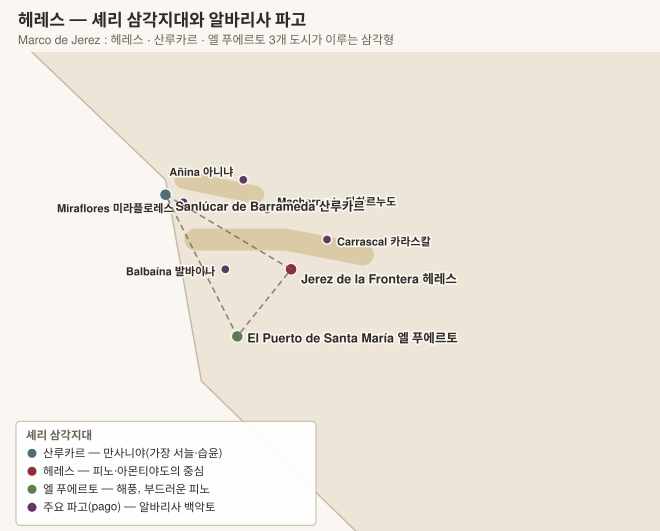

# 헤레스 Jerez — 셰리

> 세계 어디에도 없는 두 가지 장치, **플로르(flor)**와 **솔레라(solera)**가 만드는 와인. 빈티지가 없고, 품종은 거의 하나뿐이며, 그럼에도 스타일이 가장 다양하다.



> 이름이 셋인 와인 — 스페인어 **Jerez 헤레스**, 프랑스어 **Xérès 셰레스**, 영어 **Sherry 셰리**. 라벨에는 보통 `Jerez-Xérès-Sherry` 세 이름이 함께 찍힌다.

## 1. 기본 구조

| 항목 | 내용 |
|---|---|
| 위치 | 안달루시아 카디스 주. 대서양에 면한 삼각지대 |
| 기후 | 연 300일 이상 맑음. **Poniente 포니엔테**(대서양 습윤 서풍)와 **Levante 레반테**(사하라 건조 동풍)가 번갈아 분다 |
| 주정강화 | 발효를 마친 드라이 와인에 **중성 주정을 첨가**해 도수를 올린다 (포트와 달리 **발효를 중간에 끊지 않는다** → 셰리는 기본이 드라이) |
| 빈티지 | **없다.** 솔레라로 여러 해를 섞기 때문 |

## 2. 알바리사 Albariza — 흰 백악토

| 토양 | 비중 | 성격 |
|---|---|---|
| **Albariza 알바리사** | 최상급 구역 | **탄산칼슘 40% 이상의 흰 백악토.** 겨울비를 스펀지처럼 머금었다가 여름에 표면이 굳어 **수분 증발을 막는 뚜껑**이 된다. 햇빛을 반사해 포도를 아래에서도 익힌다 |
| Barros 바로스 | 저지대 | 점토질, 어둡고 무겁다 |
| Arenas 아레나스 | 해안 | 모래 |

### 주요 파고 (pago — 구획)

| 파고 | 위치 | 성격 |
|---|---|---|
| **Macharnudo 마차르누도** | 헤레스 북서 고지 | 가장 높고 유명. Valdespino 발데스피노 Inocente 이노센테의 밭 |
| **Carrascal 카라스칼** | 헤레스 동북 | 구조가 강하다 |
| **Balbaína 발바이나** | 헤레스 서쪽, 바다 가까움 | 섬세·염분 |
| **Añina 아니냐** | 헤레스 서북 | 순수한 알바리사 |
| **Miraflores 미라플로레스** | 산루카르 | 만사니야의 최상급 밭 |

## 3. 셰리 삼각지대 — 도시마다 맛이 다르다

| 도시 | 기후 | 셰리의 성격 |
|---|---|---|
| **Jerez de la Frontera 헤레스 데 라 프론테라** | 내륙, 가장 덥다 | 중심지. 피노·아몬티야도·올로로소 모두. 플로르가 여름에 얇아진다 |
| **Sanlúcar de Barrameda 산루카르 데 바라메다** | 과달키비르 강 하구, **가장 습하고 서늘** | **플로르가 1년 내내 두껍게 유지** → 여기서 만든 피노만 **Manzanilla 만사니야**라 부른다. 더 날카롭고 짠맛이 강하다 |
| **El Puerto de Santa María 엘 푸에르토 데 산타 마리아** | 해안, 해풍 | 둘의 중간. 부드럽고 둥근 피노 |

> **숙성 장소가 곧 스타일이다.** 같은 포도·같은 양조라도 산루카르 보데가에서 키우면 만사니야, 헤레스로 옮기면 피노가 된다. 실제로 산루카르 셰리를 헤레스로 옮겨 숙성하면 만사니야라는 이름을 쓸 수 없다.

## 4. 품종 Variedades 바리에다데스

> 셰리는 **품종이 거의 하나뿐인데 스타일이 가장 다양한** 와인이다. 팔로미노가 전체의 약 95%를 차지하는데, 같은 포도에서 피노·만사니야·아몬티야도·팔로 코르타도·올로로소가 모두 나온다. **차이를 만드는 것은 품종이 아니라 플로르와 솔레라다.**

| 품종 | 비중 | 역할 |
|---|---|---|
| **Palomino Fino 팔로미노 피노** | 약 95% | 드라이 셰리 전 스타일 |
| **Pedro Ximénez (PX) 페드로 히메네스** | 소량 | 극단적 스위트 |
| **Moscatel 모스카텔** (Alejandría) | 소량 | 스위트, 오렌지꽃 |

---

### Palomino Fino 팔로미노 피노 — 중립성이 장점인 품종

| 항목 | 내용 |
|---|---|
| 향 | **거의 없다.** 사과·풀 정도의 옅은 향 |
| 구조 | **산도 낮음 · 당도 낮음 · 알코올 잠재력 11~12.5%** · 페놀 적음 |
| 산화 | **산화에 매우 취약하다** — 껍질이 얇고 페놀이 적어 공기와 닿으면 금세 갈변한다 |
| 수확량 | 많다. ha당 70~80 hl |

> **왜 이 "밋밋한" 품종이 선택되었나** — 스틸 와인으로 만들면 팔로미노는 평범하다 못해 지루하다. 그런데 바로 그 **중립성** 때문에 **플로르와 솔레라가 만든 향을 가리지 않는다.** 만약 뮈스카처럼 향이 강한 품종이었다면 6~30년의 숙성이 남긴 흔적이 품종 향에 묻혔을 것이다.
>
> 또 하나 — **산도가 낮아 주정강화 후 미생물학적으로 안정**되고, **잠재 알코올이 11~12%**라 15%로 올리는 데 필요한 주정이 적다. 셰리 시스템에 최적화된 품종인 셈이다.

| 팔로미노의 세 갈래 | 결과 |
|---|---|
| 주정 **15~15.5%** + 통을 5/6만 채움 | **플로르 생성 → 생물학적 숙성** → 피노 · 만사니야 |
| 플로르가 죽은 뒤 산화 숙성 | **아몬티야도** |
| 주정 **17% 이상**으로 처음부터 플로르를 죽임 | **올로로소** |
| 플로르가 예기치 않게 죽은 통 | **팔로 코르타도** |

### Pedro Ximénez (PX) 페드로 히메네스

| 항목 | 내용 |
|---|---|
| 향 | **건포도·당밀·무화과·커피·감초** |
| 구조 | **잔당 400~500 g/L**, 색이 흑갈색, 점성이 시럽 같다 |
| 공정 | **솔레오(soleo 솔레오)** — 수확 후 포도를 **햇볕에 1~2주 널어 말린다.** 당도가 극단적으로 올라가면 압착 후 발효를 시작하자마자 주정으로 멈춘다 |
| 출처 | 헤레스에서도 재배하지만, 대부분은 **Montilla-Moriles 몬티야모릴레스**에서 들여온다. 그쪽이 더 덥고 건조해 PX에 맞다 |
| 유전 | 오랫동안 독일에서 왔다는 전설이 있었으나 근거가 없고, 안달루시아 토착으로 본다 |

### Moscatel 모스카텔

**Moscatel de Alejandría 모스카텔 데 알레한드리아**(= 이탈리아의 Zibibbo). 오렌지꽃·꿀 향의 스위트를 만들며, PX보다 가볍고 향이 더 화사하다. 주로 **Chipiona 치피오나**의 모래밭에서 재배한다.

---

### 2022년 개편 — 사라졌던 품종의 복원

수십 년 만의 규정 개정으로, 필록세라 이전에 쓰이던 토착 품종들이 다시 허용되었다.

| 품종 | 내용 |
|---|---|
| **Beba 베바 · Cañocazo 카뇨카소 · Mantúo Castellano 만투오 카스테야노 · Mantúo de Pilas · Perruno 페루노 · Vejeriego 베헤리에고** | 19세기까지 헤레스에서 재배되던 품종들. 소수 생산자가 복원 실험 중 |
| **Vino de Pasto 비노 데 파스토** | **주정강화하지 않은 팔로미노 식탁용 화이트**를 다시 Jerez DO로 인정. 19세기 이전의 방식으로 돌아간 것 |

> 팔로미노가 "밋밋하다"는 평가는 **평지의 다수확 포도**에 대한 것이다. 알바리사 최상급 파고의 저수확 팔로미노를 주정강화 없이 만들면 전혀 다른 결과가 나온다는 것이 비노 데 파스토 부활의 논거다.

---

### 토양 — 품종보다 중요한 변수

| 토양 | 성분 | 성격 |
|---|---|---|
| **Albariza 알바리사** | **탄산칼슘 40% 이상**의 흰 백악토 | 겨울비를 스펀지처럼 머금었다 여름에 표면이 굳어 **증발을 막는 뚜껑**이 된다. 흰색이라 빛을 반사해 포도를 아래에서도 익힌다. **최상급 파고는 전부 알바리사** |
| **Barros 바로스** | 점토 | 저지대, 어둡고 무겁다 |
| **Arenas 아레나스** | 모래 | 해안. 모스카텔에 쓴다 |

### 인근 산지의 품종

| DO | 주품종 | 비고 |
|---|---|---|
| **Montilla-Moriles 몬티야모릴레스** | **Pedro Ximénez** | 더 더워 포도가 **자연 알코올 15%**에 도달 → **주정강화 없이도** 피노·아몬티야도를 만든다 |
| **Málaga 말라가** | **Moscatel · Pedro Ximénez** | 스위트. 고지대 Ronda 론다는 스틸 레드 |
| **Condado de Huelva 콘다도 데 우엘바** | **Zalema 살레마** | 헤레스 서쪽. 같은 방식의 Pálido·Viejo |

---

## 5. 플로르 flor — 살아 있는 뚜껑

**플로르**는 와인 표면에 자연히 자라는 **효모 막**이다. 셰리를 이해하는 첫 번째 열쇠.

| 항목 | 내용 |
|---|---|
| 조건 | 알코올 **15~15.5%**, 통을 **약 5/6만 채워** 공기층을 남긴다. 16% 이상이면 플로르가 죽는다 |
| 작용 | 산소를 차단해 **산화를 막고**, 와인의 글리세롤·아세트알데히드를 대사해 **빵 반죽·생아몬드·짠맛**을 만든다 |
| 계절성 | 봄·가을에 두껍고 여름·겨울에 얇아진다. 산루카르는 서늘·습해 연중 두껍다 |
| 결과 | **생물학적 숙성(crianza biológica 크리안사 비올로히카)** = 색이 옅고 신선. 플로르가 없거나 죽은 뒤의 **산화적 숙성(crianza oxidativa 크리안사 옥시다티바)** = 색이 짙고 견과·캐러멜 |

## 6. 솔레라 solera y criaderas 솔레라 이 크리아데라스 — 분수식 숙성

여러 해의 와인을 계단식으로 섞어 **일정한 스타일을 영구히 유지**하는 체계. 셰리의 두 번째 열쇠.

```
크리아데라 3ª  (가장 어린 와인)  ← 새 빈티지 투입
      ↓ 일부를 아래로
크리아데라 2ª
      ↓
크리아데라 1ª
      ↓
   솔레라        (가장 오래된 층. 바닥 suelo 수엘로 에서 이름) → 여기서만 병입 출하
```

- 한 번에 각 층의 **최대 1/3까지만** 빼낸다(saca 사카). 아래 층에서 뺀 만큼 위 층에서 채운다(rocío 로시오).
- 그래서 병 안에는 **최근 몇 년과 수십 년 전 와인이 지수적으로 섞여** 있다. 오래된 솔레라에는 100년 전 와인의 분자가 극미량 남아 있다.
- **빈티지가 없는 이유**이자 **품질이 해마다 흔들리지 않는 이유**다.
- 예외적으로 단일 빈티지 셰리(**Añada 아냐다**)를 만드는 곳도 있다 — González Byass 곤살레스 비아스, Williams & Humbert 윌리엄스 앤 험버트.

## 7. 스타일

### 생물학적 숙성 (플로르 아래)

| 스타일 | 도수 | 성격 |
|---|---|---|
| **Fino 피노** | 15~17% | 옅은 밀짚색. 생아몬드·빵 반죽·짠맛, 완전 드라이. **차갑게, 개봉 후 며칠 안에** |
| **Manzanilla 만사니야** | 15~17% | 산루카르산 피노. 더 가볍고 날카로우며 **짠맛이 뚜렷** |
| **Manzanilla Pasada 만사니야 파사다** | | 플로르가 얇아지기 시작한 만사니야. 견과 뉘앙스가 더해진다 |
| **En Rama 엔 라마** | | **여과·청징을 최소화**해 통에서 바로 병입. 플로르의 질감이 그대로 남는다. 보통 계절 한정 출시 |

### 산화적 숙성

| 스타일 | 도수 | 성격 |
|---|---|---|
| **Amontillado 아몬티야도** | 16~22% | **피노로 시작해 플로르가 죽은 뒤 산화 숙성.** 두 단계를 모두 거친다 → 헤이즐넛·담배·짠맛. 드라이 |
| **Palo Cortado 팔로 코르타도** | 17~22% | **아몬티야도의 향 + 올로로소의 몸통.** 원래 "플로르가 예기치 않게 죽어버린 통"에서 우연히 생긴 것으로, 가장 희소하고 신비화되어 있다 |
| **Oloroso 올로로소** | 17~22% | 처음부터 주정을 **17% 이상**으로 올려 플로르를 죽이고 산화만으로 숙성. 호두·가죽·발사믹. **이름은 "향기로운"이지만 드라이하다** |

### 스위트

| 스타일 | 내용 |
|---|---|
| **Pedro Ximénez 페드로 히메네스 (PX)** | 말린 포도로 만든 **잔당 400 g/L 이상**의 흑갈색 시럽. 건포도·당밀·커피. 바닐라 아이스크림에 끼얹는 것이 고전 |
| **Moscatel 모스카텔** | 오렌지꽃·꿀. PX보다 가볍다 |
| **Cream 크림** | 올로로소에 PX를 섞은 **블렌디드 스위트**. 영국 시장용으로 개발 |
| **Pale Cream 페일 크림** | 피노에 정제 농축즙을 더한 것 |
| **Medium 미디엄** | 드라이와 스위트의 중간 |

> **드라이인가 스위트인가** — 셰리는 **기본이 드라이**다. 피노·만사니야·아몬티야도·팔로 코르타도·올로로소는 모두 잔당이 거의 없다. 단 것은 PX·모스카텔·크림 계열뿐인데, 오랫동안 크림이 수출의 주력이어서 "셰리 = 달다"는 오해가 굳어졌다.

## 8. 숙성 연수 표기

| 표기 | 평균 숙성 | 비고 |
|---|---|---|
| **VOS** (Very Old Sherry / *Vinum Optimum Signatum*) | **20년 이상** | 아몬티야도·팔로 코르타도·올로로소·PX만 |
| **VORS** (Very Old Rare Sherry / *Vinum Optimum Rare Signatum*) | **30년 이상** | 탄소 연대 측정 등으로 검증 |
| **12 Años · 15 Años 도세·킨세 아뇨스** | 12년 · 15년 | |

## 9. 2022년 규정 개편

수십 년 만의 큰 개정으로, 셰리를 **"주정강화 와인"이라는 틀 밖으로** 넓혔다.

- **Vino de Pasto 비노 데 파스토** 부활 — 주정강화하지 않은(또는 최소한만 한) **식탁용 팔로미노 화이트**를 다시 Jerez DO로 인정. 19세기 이전의 방식으로 돌아간 것
- 생산 구역에 **Trebujena 트레부헤나** 등 추가, 산루카르의 만사니야 구역 명확화
- **파고(pago) 표기**와 **단일 밭·빈티지 표기**를 제도적으로 뒷받침
- 숙성 보데가 위치 요건 완화

## 10. 주요 보데가

| 보데가 | 대표 와인 | 특징 |
|---|---|---|
| **González Byass 곤살레스 비아스** | **Tío Pepe 티오 페페**(세계 최다 판매 피노) · Palmas 팔마스 시리즈 · Noé 노에(PX VORS) | 헤레스 최대. **Palmas 팔마스**는 같은 솔레라를 숙성 단계별로 나눠 병입한 시리즈 |
| **Bodegas Lustau 보데가스 루스타우** | Almacenista 알마세니스타 시리즈 · Los Arcos 로스 아르코스 | **알마세니스타(almacenista)** — 소규모 숙성 전문가의 통을 사서 이름을 밝히고 출시하는 제도를 대중화 |
| **Bodegas Barbadillo 보데가스 바르바디요** | **Solear 솔레아르**(만사니야) · Reliquia 렐리키아 VORS | 산루카르 최대 |
| **Valdespino 발데스피노** | **Inocente 이노센테**(단일 밭 마차르누도 피노) · Tío Diego 티오 디에고 · Coliseo 콜리세오 VORS | **단일 밭 + 나무통 발효**를 지킨 전통주의 |
| **Bodegas Hidalgo-La Gitana 이달고 라 히타나** | La Gitana 라 히타나(만사니야) · **Pastrana 파스트라나**(만사니야 파사다, 단일 밭) | |
| **Equipo Navazos 에키포 나바소스** | **La Bota de 라 보타 데... 라 보타 데** 시리즈 | 두 애호가가 시작한 셀렉션 프로젝트. **셰리 재평가 운동을 촉발**했다 |
| **Bodegas Tradición 보데가스 트라디시온** | VORS 4종 | 극노후 솔레라 전문 |
| **Fernando de Castilla 페르난도 데 카스티야** | Antique 안티케 시리즈 | |
| **Osborne 오스보르네** · **Williams & Humbert 윌리엄스 앤 험버트** · **El Maestro Sierra 엘 마에스트로 시에라** · **Delgado Zuleta 델가도 술레타** · **Emilio Hidalgo 에밀리오 이달고** | | |

## 11. 인근 주정강화 산지

| DO | 내용 | 생산자 |
|---|---|---|
| **Montilla-Moriles 몬티야모릴레스** | 코르도바 남쪽. **PX의 진짜 본고장** — 헤레스가 쓰는 PX 대부분이 여기서 온다. 더 더워서 포도가 자연 도수 15%에 도달해 **주정강화 없이도** 피노·아몬티야도를 만든다 | **Toro Albalá 토로 알발라**(Don PX Convento Selección 돈 페엑스 콘벤토 셀렉시온) · Alvear 알베아르 · Pérez Barquero 페레스 바르케로 |
| **Málaga · Sierras de Málaga 시에라스 데 말라가** | 모스카텔·PX 기반 스위트. **Vino de Málaga 비노 데 말라가**(주정강화) / **Sierras de Málaga 시에라스 데 말라가**(스틸). 고지대 Ronda 론다의 스틸 레드가 최근 부상 | Jorge Ordóñez 호르헤 오르도녜스(Nº 1 Selección Especial 셀렉시온 에스페시알) · Telmo Rodríguez 텔모 로드리게스(Molino Real 몰리노 레알) · F. Schatz 에페 샤츠 |
| **Condado de Huelva 콘다도 데 우엘바** | 헤레스 서쪽. 셰리와 같은 방식의 Condado Pálido 콘다도 팔리도(생물학적)·Viejo(산화적) | Bodegas Sauci 보데가스 사우시 |

## 12. 실전 요약

- **피노·만사니야는 신선식품이다.** 병입 날짜를 보고 1년 이내 것을 사서, 냉장 보관하고 **개봉 후 3~5일 안에** 마신다. 아몬티야도·올로로소·PX는 산화 숙성이라 몇 주~몇 달 간다.
- **가격 대비 품질이 세계에서 가장 좋은 카테고리 중 하나다.** 30년 숙성 VORS 올로로소가 같은 연식의 어떤 와인보다 싸다.
- 페어링: 피노·만사니야 ↔ 하몬·올리브·튀긴 생선 / 아몬티야도 ↔ 콩소메·버섯·경성 치즈 / 올로로소 ↔ 붉은 고기·수렵육 / PX ↔ 블루 치즈·아이스크림.

---

[← 갈리시아](04-galicia.md) · [목차로](../README.md) · [다음: 중부·레반테 →](06-centro-levante.md)
