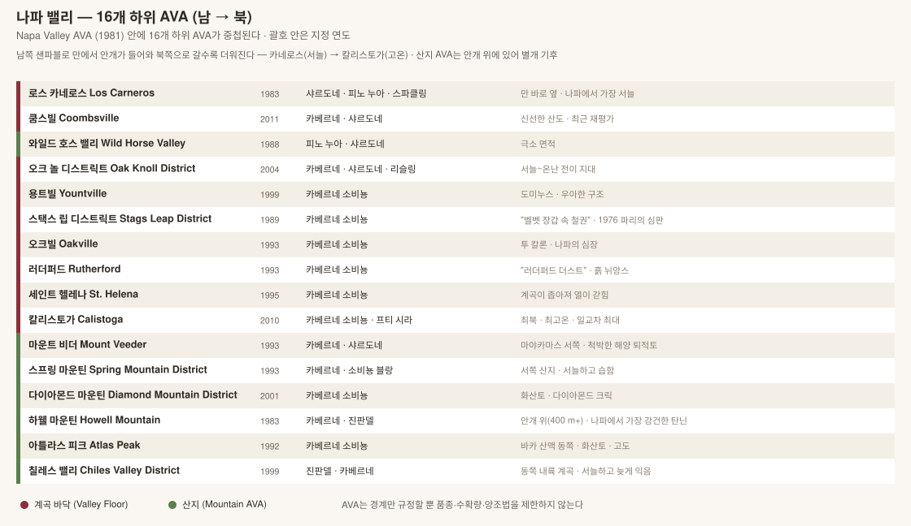

# 나파 밸리 Napa Valley

> 길이 약 50 km, 폭 최대 8 km. **캘리포니아 전체 포도밭의 4%에 불과**하지만 미국 프리미엄 와인의 상징이 된 곳.


<!-- toc -->
## 목차

- [1. 기본 구조](#1-기본-구조)
- [2. 품종](#2-품종)
- [3. 16개 하위 AVA](#3-16개-하위-ava)
- [4. 명품 밭 (Named Vineyards)](#4-명품-밭-named-vineyards)
- [5. 생산자 지도](#5-생산자-지도)
- [6. 나파를 읽는 실전 요령](#6-나파를-읽는-실전-요령)

<!-- /toc -->

## 1. 기본 구조

| 항목 | 내용 |
|---|---|
| AVA 지정 | **1981년** (캘리포니아 최초) |
| 면적 | 약 18,000 ha (보르도의 약 1/8) |
| 주품종 | **카베르네 소비뇽** (재배 면적의 약 40%) + 메를로, 카베르네 프랑, 샤르도네, 소비뇽 블랑 |
| 하위 AVA | **16개** |
| 기후 결정 요인 | 남쪽 **샌파블로 만**에서 들어오는 안개 + 두 산맥(서쪽 마야카마스 / 동쪽 바카) |

### 남 → 북 = 서늘 → 더움

나파 밸리를 이해하는 가장 중요한 축이다.

| 위치 | 기후 | 스타일 |
|---|---|---|
| 남쪽 (카네로스, 쿰스빌) | 만의 안개 직격 → **가장 서늘** | 피노 누아·샤르도네·스파클링 |
| 중부 (오크빌, 러더퍼드) | 균형 | 카베르네의 정점 |
| 북쪽 (칼리스토가) | 안개가 닿지 않음 → **가장 더움** | 진하고 강건한 카베르네 |
| 산지 (안개 위, 400 m+) | 일교차 작고 자외선 강함 | 탄닌 강하고 응축, 소출 극소 |

> **역설**: 계곡 바닥은 아침 안개로 서늘하고 낮에 덥다(일교차 大). 산지는 안개 **위**에 있어 아침부터 해가 들지만 고도 때문에 낮은 서늘하다(일교차 小). 그래서 산지 카베르네는 색·탄닌이 더 강하고 계곡 카베르네는 더 부드럽다.

---

## 2. 품종

> 나파는 **카베르네 소비뇽 단일 품종의 산지**라 해도 과언이 아니다. 재배 면적의 약 **40%**, 매출로는 **60% 이상**이 카베르네 계열이다. 나머지 품종은 사실상 보조이거나 서늘한 남쪽 구역에 몰려 있다.

| 품종 | 재배 비중 | 위치 |
|---|---|---|
| **Cabernet Sauvignon** 카베르네 소비뇽 | 약 40% | 중부 계곡 · 산지 전역 |
| **Chardonnay** 샤르도네 | 약 12% | 카네로스 · 오크놀 |
| **Merlot** 메를로 | 약 9% | 계곡 바닥, 블렌딩 |
| **Sauvignon Blanc** 소비뇽 블랑 | 약 5% | 러더퍼드 · 세인트헬레나 |
| **Pinot Noir** 피노 누아 | 약 5% | **카네로스 · 쿰스빌**(서늘한 남쪽만) |
| **Cabernet Franc · Petit Verdot · Malbec** | 각 1~2% | 블렌딩 |
| **Zinfandel** 진판델 | 소량 | 옛 밭에 남은 노목 |

---

### Cabernet Sauvignon 카베르네 소비뇽 — 왜 나파인가

| 항목 | 나파에서의 성격 |
|---|---|
| 향 | **잘 익은 카시스·블랙베리**, 코코아·삼나무·민트(유칼립투스). 보르도의 연필심보다 **과실이 훨씬 앞선다** |
| 구조 | 색 진함 · **탄닌 굵고 잘 익음** · 산도 중간 · **알코올 14.5~15.5%** |
| 보르도와 차이 | 보르도는 카베르네가 **덜 익는 해**가 있지만, 나파는 **매년 완숙한다.** 그래서 피망·풀 냄새가 거의 없고 빈티지 편차가 작다 |
| 결과 | 탄닌이 익어 부드럽고, 어릴 때부터 마시기 좋으며, 그러면서도 20~40년 간다 |

> **기후 조건이 맞아떨어진 이유** — 여름에 비가 거의 오지 않아 **곰팡이 위험이 없고**, 낮에 덥고 밤에 안개가 들어와 **일교차가 크다.** 늦게 익는 카베르네가 완숙하면서도 산도를 어느 정도 지킬 수 있는 드문 조합이다.

### 위치가 만드는 카베르네의 차이

| 구역 | 조건 | 카베르네의 표정 |
|---|---|---|
| **Stags Leap District** | 화산 자갈 + 오후 열, 저녁에 만 바람 | **"벨벳 장갑 속 철권"** — 탄닌이 곱고 향이 화사 |
| **Oakville 오크빌** | 자갈·충적토, 균형 잡힌 열 | **나파의 기준점.** To Kalon 밭 |
| **Rutherford 러더퍼드** | 먼지 같은 미사질 충적토 | **"러더퍼드 더스트"** — 흙·먼지 뉘앙스가 탄닌에 얹힌다 |
| **St. Helena 세인트헬레나** | 계곡이 좁아 열이 갇힌다 | 가장 풍만하고 진하다 |
| **Calistoga 칼리스토가** | 최북·최고온, 일교차 최대 | 색·탄닌이 강건 |
| **산지 (Howell Mtn, Mount Veeder, Spring Mtn)** | **안개 위 400 m+**, 척박, 소출 극소 | **탄닌이 가장 굵고 응축.** 오래 기다려야 열린다 |

> **계곡과 산지의 역설** — 계곡 바닥은 아침 안개로 서늘하고 낮에 덥다(**일교차 큼**). 산지는 안개 **위**에 있어 아침부터 해가 들지만 고도 때문에 낮이 서늘하다(**일교차 작음**). 그래서 산지 포도는 자외선을 오래 받아 껍질이 두꺼워지고, **탄닌과 색이 더 강하다.**

> **밭 이름이 브랜드가 되는 구조**(To Kalon, 벡스토퍼 모델)는 **§4 명품 밭**에서 다룬다.

### 그 밖의 품종

| 품종 | 내용 |
|---|---|
| **Chardonnay 샤르도네** | **Los Carneros 로스 카네로스**가 중심. 만의 안개로 서늘해 산도가 유지된다. 스파클링(Domaine Carneros)도 여기서 |
| **Sauvignon Blanc 소비뇽 블랑** | 러더퍼드·세인트헬레나. 로버트 몬다비가 **Fumé Blanc 퓌메 블랑**이라는 이름을 붙여 판매에 성공시켰다(오크 숙성 소비뇽 블랑) |
| **Merlot 메를로** | 1990년대에 급증했다가 영화 「사이드웨이」(2004) 이후 급감. 지금은 블렌딩 중심 |
| **Pinot Noir 피노 누아** | **카네로스·쿰스빌**에서만. 나파 대부분은 피노에 너무 덥다 |
| **Zinfandel 진판델** | 금주법 이전에 심긴 노목이 세인트헬레나·칼리스토가에 남아 있다 |
| **Petite Sirah 프티 시라** | = **Durif 뒤리프**. 색이 검고 탄닌이 굵다. 옛 필드블렌드의 흔적 |

### 나파 블렌드의 논리

| 유형 | 내용 |
|---|---|
| **Varietal 품종 표기** | 라벨에 `Cabernet Sauvignon`이라 쓰려면 **75% 이상**(연방 규정). 나머지 25%로 메를로·카베르네 프랑·프티 베르도를 섞는다 |
| **Meritage 메리티지** | 보르도 품종만으로 만든 블렌드에 붙이는 미국식 명칭. 품종 표기 75% 규정을 피하면서 블렌드임을 밝히는 장치 |
| **Proprietary Blend 고유명 블렌드** | 품종을 아예 표기하지 않고 브랜드명만 — **Opus One · Insignia · Dominus · Cain Five** |

> 유럽과 반대 방향이다. 보르도는 블렌드가 기본이고 품종을 라벨에 쓰지 않지만, 미국은 **품종 표기가 기본**이라 블렌드를 하려면 오히려 별도의 이름 장치가 필요했다.

---

## 3. 16개 하위 AVA



### 계곡 바닥 (Valley Floor)

| AVA | 지정 | 성격 | 대표 생산자 |
|---|---|---|---|
| **Los Carneros** | 1983 | 만 바로 옆, 나파에서 가장 서늘. 소노마와 공유 | Domaine Carneros, Cuvaison, Hyde Vineyards, Truchard |
| **Coombsville** | 2011 | 서늘하고 신선한 산도. 최근 급부상 | Favia, Ackerman, Meteor, Palmaz |
| **Oak Knoll District** | 2004 | 서늘~온난 전이 지대. 품종이 다양 | Trefethen, Materra |
| **Yountville** | 1999 | 우아한 구조 | **Dominus Estate**(Napanook 밭), Blankiet, Kapcsándy |
| **Stags Leap District** | 1989 | **"벨벳 장갑 속 철권"** — 부드러운 탄닌에 견고한 구조 | **Stag's Leap Wine Cellars**(SLV·Fay·Cask 23), **Shafer**(Hillside Select), Clos du Val, Pine Ridge, Chimney Rock |
| **Oakville** | 1993 | **나파의 심장.** To Kalon 밭 소재 | **Robert Mondavi**, **Opus One**, **Screaming Eagle**, **Harlan Estate**, **Dalla Valle**(Maya), Groth, Silver Oak, Far Niente, Plumpjack |
| **Rutherford** | 1993 | **"러더퍼드 더스트"** — 흙·먼지 뉘앙스 | **Beaulieu Vineyard**(Georges de Latour), **Inglenook**, **Caymus**, **Scarecrow**, Frog's Leap, Quintessa, Staglin |
| **St. Helena** | 1995 | 계곡이 좁아져 열이 갇힌다. 가장 따뜻한 계곡 바닥 | **Corison**, **Spottswoode**, **Heitz Cellar**, Duckhorn, Joseph Phelps(Insignia), Hall, Salvestrin |
| **Calistoga** | 2010 | 최북·최고온. 일교차 최대 | **Chateau Montelena**, **Eisele Vineyard**, Larkmead, Araujo, Von Strasser |

### 산지 (Mountain AVA)

| AVA | 지정 | 산맥 | 성격 | 대표 생산자 |
|---|---|---|---|---|
| **Mount Veeder** | 1993 | 마야카마스(서) | 척박한 해양 퇴적토, 소출 극소 | **Mayacamas**, Hess Collection, Mount Veeder Winery, Lokoya |
| **Spring Mountain District** | 1993 | 마야카마스(서) | 서늘하고 습함, 숲 속 | **Pride Mountain**, **Smith-Madrone**, Cain, Stony Hill, Barnett |
| **Diamond Mountain District** | 2001 | 마야카마스(서) | 화산토 | **Diamond Creek**, Von Strasser, Reverie |
| **Howell Mountain** | 1983 | 바카(동) | **안개 위(400 m+)**, 나파에서 가장 강건한 탄닌 | **Dunn Vineyards**, Cade, Ladera, O'Shaughnessy |
| **Atlas Peak** | 1992 | 바카(동) | 화산토, 고도 460~760 m | Antica(안티노리), Stagecoach 밭, Krupp Brothers |
| **Chiles Valley District** | 1999 | 바카(동) | 동쪽 내륙 계곡, 서늘하고 늦게 익음 | Volker Eisele, Green & Red |
| **Wild Horse Valley** | 1988 | 남동 | 극소 면적, 서늘 | Heron Lake |

> **Pritchard Hill**은 AVA가 아니다. 바카 산맥 서사면의 비공식 명칭이지만 최고급 카베르네가 나온다 — **Colgin**, **Bryant Family**, **Chappellet**, Continuum, Ovid.

---

## 4. 명품 밭 (Named Vineyards)

나파는 보르도처럼 생산자 브랜드가 중심이지만, **특정 밭 이름이 브랜드가 된** 사례가 늘고 있다.

| 밭 | AVA | 내용 |
|---|---|---|
| **To Kalon** | Oakville | 나파 최고의 밭. 1868년 개간. **소유가 나뉘어 있다** — Robert Mondavi(Constellation), **Beckstoffer To Kalon**, Opus One, MacDonald, Detert |
| **Martha's Vineyard** | Oakville | **Heitz Cellar** — 유칼립투스 뉘앙스로 유명. 미국 최초의 단일 밭 카베르네(1966) |
| **Eisele Vineyard** | Calistoga | 구 Araujo. 현재 **아르테미스(피노 그룹)** 소유 |
| **Napanook** | Yountville | **Dominus Estate** (크리스티앙 무엑스 — 페트뤼스 가문) |
| **Fay Vineyard / S.L.V.** | Stags Leap | Stag's Leap Wine Cellars. **S.L.V.가 1976 파리의 심판 우승작** |
| **Stagecoach** | Atlas Peak | 240 ha 대형 산지 밭. 현재 갤로 소유 |
| **Beckstoffer 계열** | 여러 곳 | To Kalon, **Dr. Crane**(St. Helena), **Georges III**(Rutherford), Las Piedras, Missouri Hopper — 재배자 앤디 벡스토퍼가 소유하고 여러 와이너리에 판매 |
| **Volcanic Hill / Red Rock Terrace / Gravelly Meadow** | Diamond Mountain | **Diamond Creek** — 미국 최초로 구획별 병입을 한 곳(1972) |

> **벡스토퍼 모델**: 밭 이름을 라벨에 쓰려면 로열티를 내야 하고, 병당 가격 하한도 계약으로 정해져 있다. 그 결과 "Beckstoffer To Kalon"이 붙은 와인은 여러 와이너리에서 나오면서도 모두 고가다 — 부르고뉴 그랑크뤼와 비슷한 구조.

---

## 5. 생산자 지도

### 5-1. 역사적 명가 (Classic)

| 생산자 | 비고 |
|---|---|
| **Beaulieu Vineyard (BV)** | **앙드레 첼리스체프**가 만든 Georges de Latour Private Reserve — 전후 나파 카베르네의 원형 |
| **Inglenook** | 1879년 설립. 프랜시스 포드 코폴라가 복원, 대표작 **Rubicon** |
| **Robert Mondavi** | 1966년. To Kalon Reserve, 나파 현대화의 주역 |
| **Chateau Montelena** | 1976 파리의 심판 화이트 1위 |
| **Stag's Leap Wine Cellars** | 1976 파리의 심판 레드 1위. S.L.V. · Cask 23 |
| **Heitz Cellar** | Martha's Vineyard — 미국 최초의 단일 밭 카베르네(1966) |
| **Mayacamas** · **Diamond Creek** · **Stony Hill** · **Smith-Madrone** | 1960~70년대 세대 |
| **Joseph Phelps** | **Insignia**(1974) — 미국 최초의 프로프라이어터리 블렌드 |
| **Ridge Vineyards**(산타크루즈) | Monte Bello. 파리의 심판 5위 → **2006년 30주년 재대결 1위** |

---

### 5-2. 컬트 와인 — 무엇이 "컬트"인가

> **컬트 와인은 품질 등급이 아니라 유통 방식의 이름이다.** 극소량을 만들어 **메일링 리스트로만** 팔기 때문에, 값이 시장이 아니라 **대기자 명단의 길이**로 정해진다.

| 조건 | 전형적 수치 |
|---|---|
| **생산량** | **연 200~2,500 케이스** (보르도 1등급은 1만 5천~2만) |
| **판매 경로** | **메일링 리스트 직판.** 소매점에는 거의 나오지 않는다 |
| **가격** | **출고가 $300~1,000+.** 재판매 시장에서 다시 **2~5배** |
| **평점** | 파커 100점 또는 그에 준하는 점수를 반복해서 받는다 |
| **스타일** | 대체로 **완숙·고추출·새 오크 100%**. 최근 세대는 이 공식에서 벗어나는 중 |

#### 어떻게 생겨났나

| 시기 | 사건 |
|---|---|
| **1976** | **파리의 심판** — 나파가 보르도를 이길 수 있다는 사실이 공인된다 |
| **1978** | 로버트 파커 *Wine Advocate* 창간. **100점 체계**가 시장 언어가 된다 |
| 1980년대 | **Grace Family**(1976 식재) 등 소규모 고가 카베르네 등장 |
| **1990** | **Harlan Estate** 첫 빈티지(1996년 출시) |
| **1992** | **Screaming Eagle** 첫 빈티지. 진 필립스, 양조 **하이디 배럿** |
| **1990년대 후반** | 1994·1997 빈티지에 100점이 쏟아지며 **가격이 폭발한다** |
| 2000년대 | "Cult Cabernet"이 고유 범주로 굳는다. 나파 와인 옥션이 화제를 키운다 |
| **2010년대~** | **대기업이 사들이기 시작한다** — LVMH가 콜긴 지분 60%(2017), 컨스텔레이션이 슈레이더(2017). "컬트"의 의미가 흐려진다 |
| **2020년대** | 파커 은퇴 이후 점수의 영향력이 줄고, **절제된 스타일**로 무게중심이 옮겨가는 중 |

#### 메일링 리스트라는 구조

```
대기자 명단(waiting list)  →  배정(allocation)  →  매년 사야 유지된다
      3~10년 대기                병 수가 정해져 있다        한 해 거르면 뒤로 밀린다
```

| 알아둘 것 | 내용 |
|---|---|
| **소매점 물량이 거의 없다** | 국내 정식 수입이 있어도 극소량이다 |
| **재판매 시장 가격이 진짜 시세다** | 출고가는 참고치일 뿐 |
| **재판매 병은 보관 이력을 알 수 없다** | 고가일수록 **온도 이력**이 중요하다. → [보관](../basics/02-serving.md#6-보관) |
| **세컨드 라벨이 현실적 접근로** | Harlan의 The Maiden, Screaming Eagle의 The Flight, Colgin에는 없다 |

---

### 5-3. 컬트 카베르네 — 1세대 (1990년대)

| 생산자 | AVA · 밭 | 대표 와인 | 비고 |
|---|---|---|---|
| **Screaming Eagle 스크리밍 이글** | Oakville | Screaming Eagle · **The Flight**(구 Second Flight) | 1992년 첫 빈티지. 2006년 스탠 크렌키에게 매각(2009년 단독 소유). 양조 **닉 기슬라슨**, 컨설팅 **미셸 롤랑** |
| **Harlan Estate 할란 이스테이트** | Oakville 서쪽 구릉 | Harlan Estate · **The Maiden** | 빌 할란. 자매 브랜드 **Bond**(단일 밭 5종 — Melbury · St. Eden · Vecina · Pluribus · Quella)와 **Promontory** |
| **Colgin Cellars 콜긴** | Pritchard Hill 등 | **IX Estate** · Tychson Hill · Cariad · IX Estate Syrah | 앤 콜긴, 1992년. **2017년 LVMH가 지분 60% 인수** |
| **Bryant Family 브라이언트 패밀리** | Pritchard Hill | Bryant Family Cabernet · DB4 | 프리처드 힐, 헤네시 호수를 내려다보는 밭 |
| **Dalla Valle 달라 발레** | Oakville 동쪽 구릉 | **Maya** · Collina | **카베르네 프랑 비중이 높다.** 마야 달라 발레 |
| **Grace Family 그레이스 패밀리** | St. Helena | Grace Family Cabernet | 1976년 식재. **최초의 컬트**로 자주 꼽힌다. 극소량 |
| **Araujo → Eisele Vineyard** | Calistoga | Eisele Vineyard Cabernet | **2013년 아르테미스(프랑수아 피노)** 인수 — 샤토 라투르와 한 지붕 |
| **Abreu Vineyards 아브레우** | 여러 밭 | Madrona Ranch · Thorevilos · Las Posadas · Cappella | **데이비드 아브레우** — 나파 최고의 밭 조성가이자 자기 이름의 와인 |
| **Bond 본드** | 여러 산지 | 위 5종 | **밭마다 별도 브랜드**를 세우는 부르고뉴식 접근 |

### 5-4. 2세대 이후 (2000년대~)

| 생산자 | AVA · 밭 | 대표 와인 | 비고 |
|---|---|---|---|
| **Scarecrow 스케어크로우** | Rutherford | Scarecrow · M. Étain | 구 잉글눅 밭의 **1945년 식재 고목** |
| **Schrader Cellars 슈레이더** | Oakville | **Beckstoffer To Kalon** 구획별(CCS · RBS · T6 · LPV) | 프레드 슈레이더. 양조 **토머스 리버스 브라운**. **2017년 컨스텔레이션 인수** |
| **Continuum 콘티누움** | Pritchard Hill | Continuum | **팀 몬다비**(로버트 몬다비의 아들)의 독립 프로젝트 |
| **Promontory 프로몬토리** | Oakville 서쪽 산지 | Promontory | 할란 가문. 거친 산지 땅을 그대로 드러내는 방향 |
| **Ovid 오비드** | Pritchard Hill | Ovid · Experiment 시리즈 | |
| **Hundred Acre 헌드레드 에이커** | Howell Mtn 등 | Kayli Morgan · Ark | 제이슨 우드브리지. 극단적 완숙 |
| **Realm Cellars 렐름** | 여러 밭 | The Bard · Moonracer · Beckstoffer Dr. Crane | 2세대의 대표 |
| **Kapcsandy 캅찬디** | Yountville | State Lane Vineyard Grand Vin | 메를로 비중이 높다 |
| **Futo · Maybach · Memento Mori · Vice Versa · Carter Cellars · Blankiet · Bevan Cellars · Myriad** | | | 3세대 소규모 |
| **Lokoya 로코야** | 4개 산지 AVA | Mt. Veeder · Spring Mtn · Howell Mtn · Diamond Mtn | 잭슨 패밀리. **같은 양조로 산지만 다르게** 만들어 비교가 된다 |
| **Verité 베리테**(소노마) | Sonoma | La Muse · La Joie · Le Désir | 제스 잭슨 + **피에르 세이양**. 보르도식 블렌딩 |

### 5-5. 컬트 화이트 — 나파의 샤르도네

| 생산자 | 대표 와인 | 비고 |
|---|---|---|
| **Kongsgaard 콩스가르드** | **The Judge** · Napa Valley Chardonnay | 존 콩스가르드. **아주 느린 자연 효모 발효**로 유명. 시라·비오니에도 |
| **Aubert 오베르** | Lauren · CIX · UV-SL · Ritchie · Larry Hyde & Sons | **마크 오베르** — 피터 마이클과 콜긴을 거쳐 1999년 독립. 샤르도네·피노 단일 밭 |
| **Hyde de Villaine (HdV)** | Californie Chardonnay | **하이드 가문 + 오베르 드 빌렌**(DRC) 합작 |
| **Stony Hill 스토니 힐** | Chardonnay | 1952년. **오크와 MLF를 쓰지 않는** 나파 화이트의 원형 |
| **Chateau Montelena** | Chardonnay | 파리의 심판 우승작의 후예 |

> 소노마 쪽의 컬트 샤르도네(**Marcassin 마르카생 · Peter Michael 피터 마이클 · Kistler 키슬러**)는 → [소노마 §6](02-sonoma.md)

### 5-6. 컨설턴트 양조가 — 이름 뒤의 이름

> 나파 컬트 와인의 상당수는 **소유주와 양조가가 다르다.** 같은 컨설턴트가 여러 브랜드를 맡기 때문에, 양조가 이름이 스타일의 예고편이 된다.

| 이름 | 관여 | 스타일 |
|---|---|---|
| **Helen Turley 헬렌 털리** | Marcassin(본인) · Bryant · Colgin · Peter Michael · Pahlmeyer | **컬트 스타일의 설계자.** 완숙·무여과·고밀도 |
| **Michel Rolland 미셸 롤랑** | Screaming Eagle · Harlan · Sloan | 보르도 출신. 국제적 완숙 스타일 |
| **Heidi Barrett 하이디 배럿** | Screaming Eagle(초기) · Dalla Valle · Grace Family · Paradigm | "첫 여성 컬트 양조가" |
| **Thomas Rivers Brown** | Schrader · Maybach · Rivers-Marie(본인) | 2000년대 이후 최다 100점 |
| **Andy Erickson** | Screaming Eagle(2010~) · Ovid · Dalla Valle · Favia(본인) | |
| **Philippe Melka 필리프 멜카** | Dana · Hundred Acre · Vineyard 29 · Melka(본인) | 보르도 출신 지질학자 |
| **David Abreu 데이비드 아브레우** | **재배**(밭 조성) — Harlan · Screaming Eagle · Colgin | **양조가가 아니라 재배가**인데 영향이 가장 크다 |
| **Celia Welch · Mark Aubert · Bob Levy** | Scarecrow · Aubert(본인) · Harlan | |

---

### 5-7. 구할 수 있는 최고급 — 컬트 바로 아래

> 컬트는 대개 살 수 없다. **실제로 사서 마실 수 있는 나파의 정점**은 이쪽이다. 가격은 **미국 소매 기준 USD**다 → [가격 표기에 대하여](../basics/05-buying.md#가격-표기에-대하여)

| 생산자 | 대표 와인 | 대략 |
|---|---|---|
| **Shafer 셰이퍼** | **Hillside Select**(Stags Leap District) | $300~450 |
| **Dominus Estate 도미누스** | Dominus · Napanook | $250~400 / $60~90 |
| **Ridge Vineyards** | **Monte Bello** | $200~300 |
| **Opus One 오퍼스 원** | Opus One · Overture | $300~450 |
| **Dunn Vineyards 던** | Howell Mountain Cabernet | **산악 카베르네의 기준.** $100~170 |
| **Diamond Creek** | Volcanic Hill · Red Rock Terrace · Gravelly Meadow | $200~300 |
| **Joseph Phelps** | Insignia | $200~280 |
| **Chappellet 샤펠레** | Pritchard Hill Cabernet | $150~250 |
| **Caymus 케이머스** | Special Selection | $150~200 |
| **Beaulieu Vineyard** | Georges de Latour Private Reserve | $130~180 |
| **Spottswoode 스팟츠우드** | Estate Cabernet | $200~250 |
| **Corison 코리슨** | Kronos Vineyard · Napa Cabernet | **$95~180.** 알코올이 낮고 오래 간다 |

### 5-8. 균형파 · 전통파

> 과숙·고알코올 흐름에 반대하며 **낮은 알코올과 산도**를 지키는 생산자들. 2010년대 이후 재평가가 뚜렷하다.

**Corison**(캐시 코리슨) · **Mayacamas** · **Smith-Madrone** · **Chateau Montelena** · **Spottswoode** · **Togni** · **Dunn** · Frog's Leap · Matthiasson · Forlorn Hope · Arnot-Roberts · Massican(화이트)

| 무엇이 다른가 | 컬트 스타일 | 균형파 |
|---|---|---|
| 알코올 | 14.5~15.5% | **13~14%** |
| 새 오크 | 100% | 20~50% |
| 수확 시기 | 늦게 | 이르게 |
| 마시는 시기 | 출시 직후에도 열려 있다 | **10년은 기다린다** |

---

## 6. 나파를 읽는 실전 요령

- **AVA보다 생산자가 먼저다.** AVA는 품질을 보증하지 않는다. 같은 오크빌 안에서도 편차가 크다.
- **"Napa Valley"만 적힌 와인**은 계곡 전역의 포도를 섞은 것. 하위 AVA 표기가 있으면 더 좁은 곳에서 왔다는 뜻.
- **산지 vs 계곡**: 강한 탄닌과 응축을 원하면 산지(하웰 마운틴, 마운트 비더), 부드러움과 우아함을 원하면 계곡(용트빌, 스택스 립).
- **가성비 구간**: 쿰스빌, 오크 놀, 칠레스 밸리, 그리고 유명 와이너리의 세컨드 라벨.
- **2020 빈티지 주의** — 산불 연기 오염으로 다수 생산자가 레드를 만들지 않았다.

---

[← 개요](00-overview.md) · [목차로](../README.md) · [다음: 소노마 →](02-sonoma.md)
