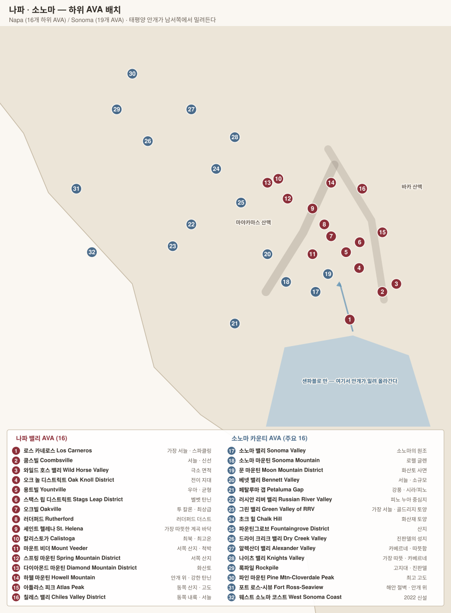

# 소노마 카운티 Sonoma County

> 나파의 **4배 면적**에 기후 편차가 훨씬 크다. 서늘한 해안 피노 누아부터 뜨거운 내륙 카베르네까지 한 카운티 안에 공존한다.

## 1. 기본 구조

| 항목 | 내용 |
|---|---|
| 면적 | 약 24,000 ha (나파의 약 1.4배, 카운티 전체는 4배) |
| AVA | **19개** |
| 주품종 | **피노 누아 · 샤르도네** (서부) / **진판델 · 카베르네** (내륙) |
| 기후 축 | 태평양 안개가 **강 계곡과 산맥의 틈**을 통해 얼마나 깊이 들어오는가 |

### 안개가 들어오는 세 통로

| 통로 | 영향 지역 |
|---|---|
| **러시안 리버 협곡** | Russian River Valley, Green Valley |
| **페탈루마 갭** | Petaluma Gap, 소노마 코스트 남부 (바람이 특히 강하다) |
| **샌파블로 만** | Los Carneros, Sonoma Valley 남부 |

---

## 2. 품종

> 나파가 카베르네 단일 산지라면, 소노마는 **품종 다양성이 훨씬 크다.** 태평양에서 내륙까지 기후 폭이 넓어, 서늘한 피노 누아부터 더운 진판델까지 한 카운티 안에 다 있다.

| 품종 | 재배 비중 | 주 위치 |
|---|---|---|
| **Chardonnay** 샤르도네 | 약 25% | Russian River · Sonoma Coast · Carneros |
| **Pinot Noir** 피노 누아 | 약 20% | **Russian River Valley · Sonoma Coast** |
| **Cabernet Sauvignon** 카베르네 소비뇽 | 약 20% | **Alexander Valley · Knights Valley** |
| **Zinfandel** 진판델 | 약 10% | **Dry Creek Valley** · Rockpile |
| **Merlot · Sauvignon Blanc · Syrah · Petite Sirah** | 나머지 | 여러 구역 |

---

### 안개가 품종을 정한다

소노마의 품종 지도는 **태평양 안개가 어디까지 들어오는가**로 결정된다.

| 구역 | 안개 | 품종 |
|---|---|---|
| **Sonoma Coast · West Sonoma Coast** | 직격, 연중 서늘 | **피노 누아 · 샤르도네** (극단적으로 서늘) |
| **Russian River Valley** | **페탈루마 갭**을 통해 강 계곡으로 밀려든다 | **피노 누아 · 샤르도네** |
| **Green Valley** (RRV 내부) | 가장 짙고 오래 머문다 | 피노 누아 · **스파클링** |
| **Los Carneros** | 샌파블로 만에서 | 피노 누아 · 샤르도네 · 스파클링 |
| **Dry Creek Valley** | 부분적 | **진판델** · 소비뇽 블랑 |
| **Alexander Valley** | 거의 닿지 않음, 따뜻 | **카베르네 소비뇽** |
| **Knights Valley** | 가장 덥다 | 카베르네 소비뇽 |

> **페탈루마 갭(Petaluma Gap)** — 해안 산맥이 끊긴 폭 25 km의 통로다. 여기로 태평양의 찬 공기와 안개가 밀려들어 러시안 리버까지 도달한다. 2017년 별도 AVA로 지정될 만큼 이 지역 기후의 결정 요인이다.

### Pinot Noir 피노 누아

| 항목 | 소노마에서의 성격 |
|---|---|
| 향 | **붉은 체리·라즈베리·크랜베리**, 향신료·콜라. 부르고뉴보다 **과실이 앞서고 흙내는 덜하다** |
| 구조 | 색이 부르고뉴보다 진하고 알코올이 높다(13.5~14.5%) |
| **Russian River Valley** | 안개로 서늘하고 아침이 길다. **향신료·붉은 과실·부드러운 질감** |
| **Sonoma Coast (극서부)** | 바다에 더 가깝고 척박. **산도가 높고 짜며 구조적** |
| **Green Valley** | 골드리지 사질토, 가장 서늘. 섬세·긴장감 |

### Chardonnay 샤르도네

| 항목 | 내용 |
|---|---|
| 스타일 변화 | 1980~90년대에는 **새 오크 + 젖산발효 + 바토나주**로 버터·바닐라가 강한 스타일이 표준이었다 |
| 지금 | **오크 절제·중고 배럴·부분 젖산발효**로 산도와 미네랄을 살리는 방향. "ABC(Anything But Chardonnay)" 반발 이후의 조정 |
| 최상급 | Russian River·Sonoma Coast의 서늘한 구획. Kistler 키슬러, Aubert 오베르, Ramey 레이미, Peter Michael 피터 마이클 |

### Zinfandel 진판델 — 미국의 정체성

| 항목 | 내용 |
|---|---|
| 정체 | **이탈리아 풀리아의 Primitivo 프리미티보와 동일 품종.** 원종은 크로아티아의 **Tribidrag 트리비드라그**(= Crljenak Kaštelanski). 2001년 DNA로 확인 |
| 향 | **잼 같은 검은 과실·건포도**, 후추·계피, 브램블(가시덤불) |
| 구조 | **알코올 매우 높음(14.5~16%)**, 탄닌 중간, 산도 낮은 편 |
| 재배 난점 | **송이 안에서 불균일하게 익는다** — 한 송이에 덜 익은 알과 건포도가 섞인다. 그래서 완숙을 기다리면 알코올이 치솟는다 |
| **Dry Creek Valley** | 소노마 진판델의 중심. 붉은 자갈 토양 |
| **Rockpile** | 해발 250 m 이상, 안개 위. 더 구조적 |

> **Old Vine 올드 바인** — 미국에는 법적 정의가 없지만, 통상 **50년 이상**을 뜻한다. 소노마·로다이에는 **금주법 이전(1920년 이전)에 심긴 진판델 노목**이 남아 있다. 당시 밭은 대개 **필드 블렌드(field blend)** — 진판델에 프티 시라·카리냥·알리칸테 부셰·무르베드르가 섞여 심겨 있어 함께 수확·발효한다.

> **White Zinfandel 화이트 진판델의 역설** — 1975년 서터 홈에서 발효가 멈춰 당이 남은 로제가 우연히 만들어졌고, 이것이 대박이 나면서 **진판델 노목이 뽑히지 않고 살아남았다.** 값싼 로제 수요가 결과적으로 미국의 노목 유산을 지킨 셈이다.

### 그 밖의 품종

| 품종 | 위치 | 성격 |
|---|---|---|
| **Cabernet Sauvignon** | **Alexander Valley 알렉산더 밸리** | 나파보다 부드럽고 과실이 앞선다. 가격은 낮다 |
| **Sauvignon Blanc** | Dry Creek Valley | 감귤·허브 |
| **Syrah 시라** | Sonoma Coast · Bennett Valley | 서늘한 구획에서 북부 론 스타일 |
| **Petite Sirah 프티 시라** (= Durif) | Dry Creek | 옛 필드 블렌드의 구성원 |
| **Carignane · Alicante Bouschet · Mourvèdre** | 노목 밭 | 필드 블렌드 |

### 스파클링

**Green Valley 그린 밸리**와 **Carneros 카네로스**의 서늘한 구획에서 샤르도네·피노 누아로 만든다. 샹파뉴 하우스들이 직접 진출했다 — **Iron Horse 아이언 호스** · **J Vineyards** · Gloria Ferrer(프레이셰네트) · Domaine Carneros(테탱제).

---

## 3. 서부 — 서늘한 피노 누아 지대

### Russian River Valley (1983)

소노마 피노 누아의 심장. 아침 안개가 오래 머물러 **긴 생육기간**을 준다.

| 항목 | 내용 |
|---|---|
| 토양 | **골드리지(Goldridge)** — 화석화된 해양 모래 |
| 스타일 | 붉은 과실 + 향신료, 산도 유지, 부드러운 질감 |
| 비공식 구역 | Middle Reach · Laguna Ridge · Santa Rosa Plain · Sebastopol Hills · Green Valley |

**생산자**: **Williams Selyem** · **Rochioli** · **Kistler** · **Dehlinger** · Kosta Browne · Merry Edwards · DuMOL · Occidental(Steve Kistler) · Failla · Gary Farrell

> **Green Valley of Russian River Valley (1983)** — RRV 안의 하위 AVA. 가장 서늘하고 골드리지 토양이 순수하다. **Iron Horse**(스파클링), Marimar Estate, Dutton-Goldfield.

### Sonoma Coast & West Sonoma Coast

| AVA | 내용 |
|---|---|
| **Sonoma Coast** (1987) | 이름과 달리 **매우 넓다.** 실제 해안이 아닌 내륙 지역도 포함되어 오랫동안 혼란의 원인이었다 |
| **West Sonoma Coast** (2022) | 위 문제를 해결하려 신설된 **진짜 해안** AVA |
| **Fort Ross-Seaview** (2011) | 해발 280 m 이상, **안개 위 절벽**. 극단적으로 서늘하고 소출이 적다 |

**생산자**: **Hirsch Vineyards** · **Peay** · **Flowers** · **Littorai** · **Marcassin** · Ceritas · Rivers-Marie · Failla · Wayfarer

### Petaluma Gap (2017)

태평양에서 샌파블로 만으로 이어지는 **바람길**. 안개보다 **바람**이 결정 요인이다.

> 강풍이 포도알을 작게 만들고 껍질을 두껍게 해 **색과 탄닌이 진해진다.** 피노 누아와 시라 모두 우수.

**생산자**: Keller Estate, Sangiacomo, Pfendler

---

## 4. 북부 내륙 — 진판델과 카베르네

### Dry Creek Valley (1983)

**진판델의 성지.** 붉은 자갈 점토, 고목이 많다.

**생산자**: **Ridge Vineyards**(Lytton Springs) · **A. Rafanelli** · **Bedrock Wine Co.** · Nalle · Quivira · Preston · Mauritson

### Alexander Valley (1984)

소노마에서 카베르네가 가장 잘 되는 곳. RRV보다 따뜻하고 넓다.

**생산자**: **Silver Oak**(Alexander Valley) · **Jordan** · **Ridge**(Geyserville — 진판델 필드블렌드) · Stonestreet · Robert Young

### Knights Valley (1983)

소노마에서 **가장 따뜻하다.** 나파 칼리스토가와 산 하나 사이.

**생산자**: **Peter Michael** · Beringer(Knights Valley Cabernet)

### 그 밖의 북부 AVA

| AVA | 내용 | 생산자 |
|---|---|---|
| **Rockpile** (2002) | 해발 240 m 이상, 안개 위. 진판델·카베르네 | Rockpile Vineyards, Carlisle |
| **Chalk Hill** (1983) | 화산재 백색 토양. 샤르도네 | Chalk Hill Estate |
| **Fountaingrove District** (2015) | 산지, 화산토 | Paradise Ridge |
| **Pine Mountain-Cloverdale Peak** (2011) | 소노마 최고 고도(490~900 m) | |

---

## 5. 남부 — 소노마 밸리 권역

### Sonoma Valley (1981)

소노마 카운티 **최초의 AVA**이자 캘리포니아 와인의 역사적 발원지(부에나 비스타, 1857).

**생산자**: **Hanzell**(캘리포니아 샤르도네·피노의 선구) · Kamen · Ravenswood · Kunde

| 하위 AVA | 내용 | 생산자 |
|---|---|---|
| **Moon Mountain District** (2013) | 마야카마스 서사면 화산토. 나파 마운트 비더의 반대편 | Monte Rosso 밭(Louis M. Martini), Kamen |
| **Bennett Valley** (2003) | 서늘한 통로, 소규모 | Matanzas Creek |
| **Sonoma Mountain** (1985) | 안개 위 서사면 | **Laurel Glen** |

### Los Carneros (1983)

**나파와 소노마에 걸친 유일한 AVA.** 만의 안개와 바람으로 두 카운티에서 가장 서늘하다.

- 피노 누아·샤르도네, 그리고 **스파클링**의 근거지
- **생산자**: Gloria Ferrer(코도르니우), Domaine Carneros(테탱저), Hyde Vineyards, Ramey, Bouchaine

---

## 6. 소노마 vs 나파

| | 나파 | 소노마 |
|---|---|---|
| 면적 | 좁고 단일 계곡 | 넓고 지형이 복잡 |
| 주품종 | **카베르네 소비뇽** 집중 | 피노·샤르도네·진판델·카베르네 분산 |
| 기후 편차 | 남북 축 하나 | **해안~내륙 축 + 남북 축** — 훨씬 다양 |
| 가격대 | 전반적으로 높음 | 상대적으로 넓은 가격대 |
| 분위기 | 관광화·고급화 | 농업 지역 성격이 더 남아 있음 |

## 7. 실전 요령

- **"Sonoma Coast"만 보고 서늘하다고 단정하지 말 것.** 이 AVA는 내륙까지 걸쳐 있다. 진짜 해안은 **West Sonoma Coast**나 **Fort Ross-Seaview** 표기를 확인.
- 진판델은 **드라이 크리크 밸리**, 피노는 **러시안 리버·소노마 코스트**, 카베르네는 **알렉산더·나이츠 밸리**가 기본값.
- **Ridge Geyserville**은 진판델이 주지만 카리냥·프티 시라가 섞인 **필드블렌드 고목** 와인이다. 라벨에 "Zinfandel"이라 쓰지 않는 이유.

---

[← 나파](01-napa.md) · [목차로](../README.md) · [다음: 캘리포니아 기타 →](03-california-other.md)
