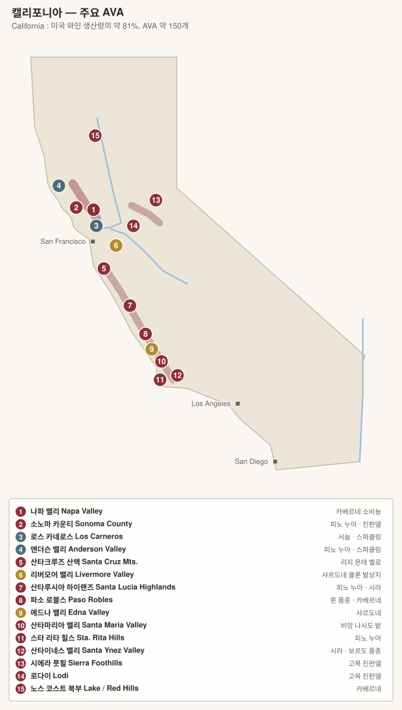

# 캘리포니아 기타 — 센트럴 코스트 · 시에라 풋힐 · 노스 코스트

---

# 1. 산타크루즈 산맥 Santa Cruz Mountains (1981)

샌프란시스코 남쪽. **고도로 정의된 AVA**(해안 쪽 120 m, 만 쪽 240 m 이상)로 매우 이례적이다.

| 항목 | 내용 |
|---|---|
| 특징 | 필록세라를 피한 고목이 남아 있고, 소출이 극도로 적다 |
| 품종 | 카베르네 소비뇽, 샤르도네, 피노 누아 |

| 생산자 | 대표 와인 |
|---|---|
| **Ridge Vineyards** | **Monte Bello** — 1976 파리의 심판 참가작이자 2006년 재대결 **1위**. 미국 최고의 장기 숙성 카베르네 중 하나 |
| **Mount Eden Vineyards** | 마틴 레이 계보의 샤르도네·피노 |
| **Rhys Vineyards** | 부르고뉴식 접근, 구획별 병입 |
| Varner · Ceritas · Big Basin | |

---

# 2. 몬터레이 & 살리나스 밸리

살리나스 밸리는 만에서 내륙으로 뚫린 통로라 **캘리포니아에서 가장 바람이 강한 산지** 중 하나다.

| AVA | 내용 | 생산자 |
|---|---|---|
| **Santa Lucia Highlands** (1991) | 계곡 동쪽 사면 고지대. 피노 누아·샤르도네·시라 | **Pisoni**, **Roar**, Kosta Browne, Siduri, Talbott, Morgan, Lucia |
| **Chalone** (1982) | 석회암 노두. 파리의 심판 참가 | Chalone Vineyard |
| **Arroyo Seco** · **Carmel Valley** | | Bernardus (Carmel Valley) |

> **명품 밭**: **Pisoni Vineyard**, **Garys' Vineyard**, **Rosella's Vineyard** — 여러 와이너리가 이 밭 이름을 라벨에 표기한다.

---

# 3. 파소 로블스 Paso Robles (1983)

센트럴 코스트 최대 산지. 2014년 **11개 하위 AVA**로 세분화되었다.

| 항목 | 내용 |
|---|---|
| 기후 | **미국 본토에서 일교차가 가장 큰 축**(주야 20°C 이상) |
| 서부 (Willow Creek, Adelaida, Templeton Gap) | 석회암, 해양 영향 → **론 품종**·서늘한 스타일 |
| 동부 (Estrella, Geneseo, San Juan Creek) | 더 덥고 건조 → 카베르네·진판델 |

| 생산자 | 스타일 |
|---|---|
| **Tablas Creek** | 샤토뇌프뒤파프 **보카스텔 가문**과의 합작. 프랑스에서 직접 들여온 론 품종 클론 |
| **Saxum** | 론 블렌드, 컬트 |
| **L'Aventure** | 시라 + 카베르네 블렌드 |
| **Denner · Booker · Law · Linne Calodo** | 론 품종 |
| **Justin** | Isosceles (보르도 블렌드) |
| **Turley** | 고목 진판델 |
| Halter Ranch · Daou | |

---

# 4. 산타바버라 카운티

캘리포니아 해안 산맥이 **동서로 누운 유일한 구간(transverse range)**. 그래서 계곡이 태평양을 향해 열려 있고, **바다에서 내륙으로 갈수록 급격히 더워진다.**

| AVA | 지정 | 성격 | 생산자 |
|---|---|---|---|
| **Sta. Rita Hills** | 2001 | 가장 서늘. **피노 누아**의 정점 | **Sea Smoke**, **Domaine de la Côte**(Rajat Parr/Sashi Moorman), Brewer-Clifton, Melville, Sanford, Sandhi |
| **Santa Maria Valley** | 1981 | 서늘, 긴 생육기간 | **Au Bon Climat**(짐 클렌데넌), **Qupé**, Foxen, Cambria |
| **Ballard Canyon** | 2013 | **시라 특화** | **Stolpman**, Beckmen, Jonata |
| **Los Olivos District** | 2016 | 중간 | Andrew Murray |
| **Happy Canyon of Santa Barbara** | 2009 | 가장 동쪽·가장 더움 → **보르도 품종** | Star Lane, Grimm's Bluff |
| **Alisos Canyon** | 2020 | 신설 | |
| **Santa Ynez Valley** | 1983 | 위 하위 AVA들을 포괄 | |

> **명품 밭**: **Bien Nacido Vineyard**(Santa Maria) — 여러 와이너리가 표기하는 캘리포니아의 대표적 계약 재배 밭. **Sanford & Benedict Vineyard**(Sta. Rita Hills) — 산타바버라 피노 누아의 원점(1971).

> 영화 「사이드웨이」(2004)의 무대. 개봉 후 피노 누아 판매가 급증하고 메를로가 급감한 "사이드웨이 효과"가 실제로 관측되었다.

---

# 5. 산루이스오비스포 — 에드나 밸리 · 아로요 그란데

| AVA | 내용 | 생산자 |
|---|---|---|
| **Edna Valley** (1982) | 바다에서 8 km, 캘리포니아에서 **생육기간이 가장 긴** 축. 샤르도네 | Chamisal, Center of Effort |
| **Arroyo Grande Valley** (1990) | 피노 누아·샤르도네 | **Talley Vineyards** |

---

# 6. 시에라 풋힐 Sierra Foothills

골드러시 시대(1850년대)에 조성된 산지. **19세기 고목 진판델**이 남아 있다.

| AVA | 내용 | 생산자 |
|---|---|---|
| **Amador County / Shenandoah Valley** | 진판델 중심 | **Turley**, Sobon Estate, Terre Rouge |
| **El Dorado** | 고도 높음(600~1,000 m), 서늘 | Holly's Hill, Skinner |
| **Fiddletown** | | |

> **Grandpère Vineyard**(Amador) — **1869년 식재**로 알려진 미국 최고령 진판델 밭.

---

# 7. 로다이 Lodi (1986)

센트럴 밸리 북부. 오랫동안 벌크 와인 산지였으나 **고목 진판델**로 재평가되고 있다.

| 항목 | 내용 |
|---|---|
| 기후 | 델타에서 들어오는 서늘한 바람이 밤 기온을 낮춘다 |
| 특징 | 모래 토양이라 **필록세라를 피한 자근 고목** 다수 |

| 명품 밭 | 내용 |
|---|---|
| **Bechthold Vineyard** | **1886년 식재 생소(Cinsault)** — 세계 최고령 생소 밭 |
| Marian's Vineyard · Royal Tee | 1900년대 초 진판델 |

**생산자**: **Bedrock Wine Co.**(Morgan Twain-Peterson MW) · **Turley** · Michael David · Klinker Brick

---

# 8. 멘도시노 & 레이크 카운티 (노스 코스트 북부)

| AVA | 내용 | 생산자 |
|---|---|---|
| **Anderson Valley** (1983) | 태평양 안개가 계곡 깊숙이 들어온다. **피노 누아 + 전통방식 스파클링** | **Roederer Estate**(루이 로더레), Scharffenberger, Navarro, **Littorai**, Copain, Drew |
| **Mendocino Ridge** (1997) | **미국 유일의 비연속 AVA** — 해발 350 m 이상 능선만 지정("islands in the sky") | |
| **Potter Valley** · **McDowell Valley** | | |
| **Red Hills Lake County** (2004) | 화산토, 고도 높음. 카베르네 | Obsidian Ridge |
| **Guenoc Valley** (1981) | | |

> 멘도시노는 **유기농·비오디나미 비율이 미국에서 가장 높은** 지역 중 하나다.

---

# 9. 그 밖의 캘리포니아

| AVA | 내용 |
|---|---|
| **Livermore Valley** (1982) | 샌프란시스코 동쪽. **미국 샤르도네 클론(Wente clone)의 발상지** — 오늘날 캘리포니아 샤르도네의 상당수가 이 계보다. Wente, Concannon(카베르네 클론 7·8·11) |
| **Central Valley (Lodi 제외)** | 캘리포니아 물량의 대부분. 대형 브랜드(Gallo 등) |
| **Temecula Valley** (1984) | 남부 캘리포니아, 로스앤젤레스 인근 |
| **Suisun Valley** (1982) | 나파 동쪽, 저평가 |

---

[← 소노마](02-sonoma.md) · [목차로](../README.md) · [다음: 오리건 →](04-oregon.md)
