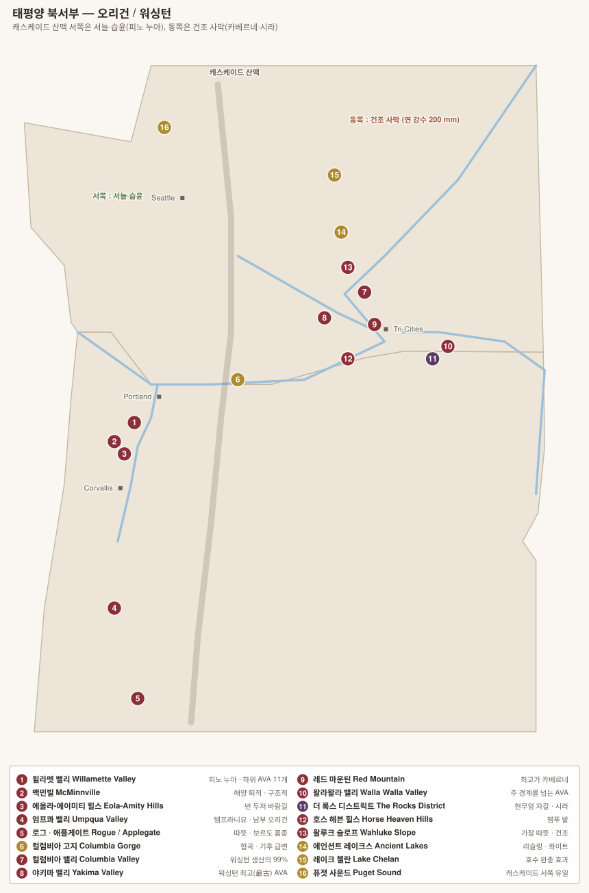

# 오리건 Oregon

> 미국에서 **부르고뉴에 가장 가까운** 산지. 소규모 도멘 중심, 피노 누아 단일 품종에 집중, 밭·토양별 구분이 세밀하다.

## 1. 기본 구조

| 항목 | 내용 |
|---|---|
| 위도 | **북위 45도** — 부르고뉴(47도)와 유사 |
| 기후 | 서늘한 해양성. 캐스케이드 산맥 서쪽은 비가 많고 여름은 건조 |
| 주품종 | **피노 누아**(약 58%) · 피노 그리 · 샤르도네 |
| 규모 | 미국 생산량의 약 2%, 그러나 **와이너리 수는 1,000개 이상**(대부분 초소형) |
| 시작 | **1965년 David Lett**이 The Eyrie Vineyards에 피노 누아 식재 — "당시엔 미친 짓이라 했다" |

### 오리건의 라벨 규정은 미국에서 가장 엄격하다

| 항목 | 연방 기준 | **오리건 주법** |
|---|---|---|
| 품종 표기 | 75% | **90%** (카베르네 소비뇽 등 18개 품종은 75% 허용) |
| 주 표기 | 75% | **100%** |
| AVA 표기 | 85% | **95%** |

> 이 규정은 오리건 생산자들이 자발적으로 만들었다. "우리는 블렌딩으로 가리지 않는다"는 선언에 가깝다.

---

## 2. 품종

> 오리건은 **피노 누아 하나에 건 산지**다. 재배 면적의 약 **58%**가 피노 누아이고, 나머지도 대부분 서늘한 기후 품종이다. 캘리포니아와 달리 **부르고뉴를 모델로 삼았다**는 점이 출발부터 달랐다.

| 품종 | 재배 비중 | 비고 |
|---|---|---|
| **Pinot Noir** 피노 누아 | 약 58% | 윌라멧 밸리 |
| **Pinot Gris** 피노 그리 | 약 12% | 오리건 대표 화이트 |
| **Chardonnay** 샤르도네 | 약 8% | 최근 급상승 |
| **Riesling · Gewürztraminer · Pinot Blanc · Grüner Veltliner** | 소량 | 알자스·독일계 |
| **Syrah · Tempranillo · Cabernet Sauvignon** | 소량 | **남부 오리건**(더운 구역) |

---

### 왜 피노 누아였나

1965년 **David Lett 데이비드 레트**(The Eyrie Vineyards 디 아이리 비녀즈)가 캘리포니아 대학에서 "오리건은 너무 춥다"는 말을 듣고도 윌라멧 밸리에 피노 누아를 심었다. 근거는 **위도(45°N)가 부르고뉴와 거의 같다**는 것이었다.

| 항목 | 부르고뉴 | 윌라멧 밸리 |
|---|---|---|
| 위도 | 47°N | **45°N** |
| 기후 | 대륙성, 서리 위험 | **해양성**, 서리 적고 강우 많음 |
| 수확기 강우 | 위험 | **가장 큰 위험** |
| 여름 | 짧고 덥다 | **길고 서늘하다** — 성숙 기간이 길다 |

> 1979년 파리 시음회에서 **The Eyrie 1975 피노 누아**가 부르고뉴 명가들과 겨뤄 상위에 오르면서 오리건이 세계에 알려졌다. 조제프 드루앵 가문이 이후 오리건에 **Domaine Drouhin Oregon 도멘 드루앵 오리건**을 세웠다.

### Pinot Noir 피노 누아 — 오리건의 표정

| 항목 | 내용 |
|---|---|
| 향 | **붉은 체리·크랜베리·라즈베리**, 흙·버섯·차잎. 캘리포니아보다 **과실이 덜 앞서고 흙내가 있다** |
| 구조 | 색 옅음 · 산도 높음 · 알코올 13~14% — **부르고뉴와 캘리포니아 사이** |
| 위험 | **수확기(9~10월) 강우.** 익기를 기다리다 비를 맞으면 희석되고 부패한다. 오리건 빈티지 편차의 거의 유일한 원인 |
| 클론 | 초기에는 **Pommard 포마르 클론**과 **Wädenswil 베덴스빌 클론**(스위스 경유). 1990년대 이후 **Dijon clones 디종 클론**(113·114·115·667·777)이 대량 도입되어 향이 더 화사해졌다 |

### 세 가지 토양이 스타일을 가른다

윌라멧 밸리 이해의 핵심이다. 11개 하위 AVA는 사실상 **토양 지도**다.

| 토양 | 원어 | 기원 | 피노의 표정 | 대표 AVA |
|---|---|---|---|---|
| **화산토** | **Jory 조리** | 1,500만 년 전 현무암 풍화 | **붉은 과실·향신료·부드러운 질감** | Dundee Hills 던디 힐스 |
| **해양 퇴적토** | **Willakenzie 윌라켄지** | 고대 해저 사암·이암 | **검은 과실·흙·구조적 탄닌** | Yamhill-Carlton · Ribbon Ridge |
| **뢰스(빙하 실트)** | **Laurelwood 로렐우드** | 미줄라 홍수 퇴적 실트 | **꽃향·섬세·산도** | Chehalem Mountains · Laurelwood District |

> **미줄라 홍수(Missoula Floods)** — 약 1.5만 년 전 빙하호가 터져 컬럼비아 강 유역을 수십 차례 휩쓸었다. 이때 실려 온 실트가 윌라멧 밸리 북부에 쌓였고, 같은 홍수가 워싱턴 컬럼비아 밸리의 토양도 만들었다.

### Pinot Gris 피노 그리 · Chardonnay 샤르도네

| 품종 | 내용 |
|---|---|
| **Pinot Gris 피노 그리** | 데이비드 레트가 1966년 미국 최초로 심었다. 이탈리아 피노 그리조보다 **몸통이 있고 배·멜론 향**, 알자스보다는 가볍다. 오리건의 대표 화이트가 되었다 |
| **Chardonnay 샤르도네** | 초기에는 캘리포니아용 클론을 써서 오리건에서 익지 않았다. **1990년대 디종 클론(76·95·96) 도입 후 완전히 달라졌고**, 지금은 오리건에서 가장 빠르게 평가가 오르는 품종이다 |
| **Riesling 리슬링 · Gewürztraminer** | 초기에 많이 심었다가 피노에 밀렸으나 재평가 중 |
| **Grüner Veltliner 그뤼너 벨트리너 · Chenin Blanc** | 소수 생산자의 실험 |

### 남부 오리건 — 다른 세계

| AVA | 조건 | 품종 |
|---|---|---|
| **Umpqua Valley 엄프쿠아 밸리** | 전이 지대 | 템프라니요 · 피노 누아 |
| **Rogue Valley 로그 밸리 · Applegate** | 훨씬 덥고 건조 | **시라 · 카베르네 소비뇽 · 템프라니요** |
| **The Rocks District of Milton-Freewater 더 록스 디스트릭트** | **오리건에 있지만 워싱턴 왈라왈라에 속한다** | **시라** — 현무암 자갈, 육향·훈연 |

> **The Rocks District**는 미국에서 유일하게 **단일 토양(현무암 강자갈)만으로 경계가 정해진 AVA**다. 여기서 나온 시라는 북부 론의 육향·철분 뉘앙스가 뚜렷해 미국 시라의 정점으로 꼽힌다.

### 라벨 규정 — 오리건이 더 엄격하다

| 항목 | 연방 기준 | **오리건** |
|---|---|---|
| 품종 표기 | 75% | **90%** (카베르네 소비뇽 등 18개 품종은 75%) |
| AVA 표기 | 85% | **95%** |

> 오리건은 1977년 스스로 연방보다 엄격한 규정을 만들었다. 신생 산지가 신뢰를 얻기 위해 택한 전략이며, 지금도 미국에서 가장 엄격하다.

---

## 3. 윌라멧 밸리 Willamette Valley (1983)

오리건 와인의 중심. 포틀랜드 남쪽으로 약 240 km 이어진다.

| 항목 | 내용 |
|---|---|
| 하위 AVA | **11개** |
| 강수 | 겨울에 집중, **수확기는 건조** |
| 핵심 변수 | **토양** — 세 가지 계열이 스타일을 가른다 |

### 세 가지 토양

| 토양 | 기원 | 성격 | 대표 AVA |
|---|---|---|---|
| **조리 Jory** (화산토) | 현무암 풍화 붉은 흙 | 부드럽고 향기로움, 붉은 과실 | **Dundee Hills** |
| **윌라켄지 Willakenzie** (해양 퇴적) | 고대 해저 퇴적층 | 구조적·탄닌 강함, 검은 과실 | **Yamhill-Carlton**, **Ribbon Ridge** |
| **로렐우드 Laurelwood** (풍성 뢰스) | 빙하기 바람이 실어온 흙 | 그 중간, 섬세함 | **Chehalem Mountains**, **Laurelwood District** |

### 하위 AVA 11개

| AVA | 지정 | 토양 | 성격 | 생산자 |
|---|---|---|---|---|
| **Dundee Hills** | 2005 | 조리(화산) | 가장 유명. 향기롭고 실키 | **Domaine Drouhin Oregon**, **The Eyrie Vineyards**, Domaine Serene, Archery Summit, Winderlea |
| **Yamhill-Carlton** | 2005 | 윌라켄지(해양) | 구조적·묵직 | **Beaux Frères**, Ken Wright, Soter, Penner-Ash |
| **Ribbon Ridge** | 2005 | 윌라켄지 | 최소 면적(1,300 ha), 균질한 토양 | **Beaux Frères**, Brick House, Patricia Green |
| **Chehalem Mountains** | 2006 | 세 토양이 모두 존재 | 가장 다양 | Ponzi, Adelsheim, Bergström |
| **Laurelwood District** | 2020 | 로렐우드 | Chehalem 내부에서 분리 | Ponzi, Dion |
| **Eola-Amity Hills** | 2006 | 현무암 + 해양 | **반 두저 바람길**의 찬 바람 → 산도·향신료 | **Cristom**, **Evening Land**(Seven Springs), **Walter Scott**, Bethel Heights, Lingua Franca |
| **McMinnville** | 2005 | 해양 퇴적·현무암 | 바람이 강해 껍질이 두껍다. 탄닌 견고 | **Brittan**, Coeur de Terre |
| **Van Duzer Corridor** | 2019 | | 바람길 자체를 AVA로 지정 | Van Duzer, Johan |
| **Tualatin Hills** | 2020 | 로렐우드 | 최북, 서늘 | Montinore, David Hill |
| **Lower Long Tom** | 2021 | | 남부, 신설 | Brigadoon |
| **Mount Pisgah, Polk County** | 2022 | | 소규모 | Illahe |

### 핵심 생산자

| 생산자 | 비고 |
|---|---|
| **The Eyrie Vineyards** | 데이비드 렛의 1965년 개척. 1979년 파리 시음회에서 부르고뉴 명가들과 대등하게 평가받아 오리건을 알림 |
| **Domaine Drouhin Oregon** | **조제프 드루앵**(부르고뉴)이 1987년 진출. 유럽 명가의 첫 오리건 투자 |
| **Beaux Frères** | 로버트 파커가 공동 창업. 현재 Maisons & Domaines Henriot 소유 |
| **Cristom** | 전체 줄기 발효(whole cluster)로 유명 |
| **Evening Land / Domaine de la Côte** | 라자트 파와 사시 무어먼 — 저알코올·고산도 |
| **Walter Scott · Antica Terra · Big Table Farm** | 현대 소규모 최상급 |
| **Ken Wright Cellars** | 단일 밭 병입 12종 이상 |
| **Résonance**(루이 자도) · **Nicolas-Jay** · **Lingua Franca**(래리 스톤) | 부르고뉴·나파 자본 유입 |
| Adelsheim · Ponzi · Bergström · Brick House · Cameron · Belle Pente | |

---

## 4. 남부 오리건

윌라멧보다 **따뜻하고 건조**해 품종 구성이 전혀 다르다.

| AVA | 내용 | 생산자 |
|---|---|---|
| **Umpqua Valley** (1984) | 전이 지대. **템프라니요**의 미국 개척지 | **Abacela** |
| **Elkton Oregon** (2013) | Umpqua 북부, 서늘 | Brandborg |
| **Red Hill Douglas County** (2005) | 단일 소유 AVA에 가까움 | |
| **Rogue Valley** (1991) | 가장 따뜻. 보르도 품종·시라 | Quady North, Cowhorn |
| **Applegate Valley** (2000) | Rogue 하위 | Troon |

---

## 5. 주 경계를 넘는 AVA

| AVA | 공유 | 내용 |
|---|---|---|
| **Columbia Gorge** (2004) | 오리건 + 워싱턴 | 협곡을 따라 **60 km 안에서 기후가 급변**한다. "a world of wine in 40 miles" |
| **Columbia Valley** | 오리건 + 워싱턴 | 대부분 워싱턴 |
| **Walla Walla Valley** | 오리건 + 워싱턴 | 아래 참조 |
| **The Rocks District of Milton-Freewater** (2015) | **오리건에만** 있음 | 왈라왈라 AVA 안에 있지만 지리적으로 오리건 쪽. 현무암 자갈이 깔린 고대 하상 — 샤토뇌프뒤파프의 갈레 룰레와 유사. **시라의 성지** |

> **The Rocks District**는 미국에서 **토양(지질) 하나만으로 정의된 유일한 AVA**다. 여기 시라는 훈연·베이컨·올리브 뉘앙스가 뚜렷해 블라인드에서 알아볼 수 있을 정도다. **Cayuse**(크리스토프 배런), **No Girls**, **Reynvaan**, Delmas.

---

## 6. 오리건을 읽는 요령

- **토양을 먼저 본다.** 조리(화산토)=부드럽고 향기롭다 / 윌라켄지(해양 퇴적)=구조적이다. 같은 생산자의 두 밭을 비교하면 차이가 뚜렷하다.
- 오리건 피노는 캘리포니아보다 **알코올이 1도 낮고 산도가 높다.** 부르고뉴와 캘리포니아의 중간이라기보다, 오리건 고유의 스타일로 봐야 한다.
- **가성비**: Willamette Valley 광역 표기 와인, 그리고 남부 오리건.
- 오리건 와이너리는 대부분 연 5,000케이스 이하의 초소형이다. 수입량이 적어 국내에서 만나기 어려운 이름이 많다.

---

[← 캘리포니아 기타](03-california-other.md) · [목차로](../README.md) · [다음: 워싱턴 →](05-washington.md)
